<style>
@media print {
  /* 1. 페이지 나눔 위치 제어 */
  h1, h2, h3, h4, h5, h6 {
    break-after: avoid;           /* 제목 바로 뒤에서 페이지 분할 방지 */
    page-break-after: avoid;
    break-inside: avoid;
  }

  /* 2. 코드 블록 및 표가 어색하게 밀려 빈 공간이 생기지 않도록 분할 허용 */
  pre, code, table, blockquote {
    break-inside: auto !important; /* 통째로 다음 장으로 넘어가지 않고 자연스럽게 쪼개지도록 설정 */
    page-break-inside: auto !important;
  }

  /* 3. 문단 분할 시 생기는 고아 줄/빈 줄 제어 */
  p {
    orphans: 2;                   /* 페이지 하단에 남길 최소 줄 수 */
    widows: 2;                    /* 페이지 상단으로 넘어갈 최소 줄 수 */
  }

  /* 4. 불필요하게 큰 여백 축소 */
  h1, h2, h3, p {
    margin-top: 0.6em;
    margin-bottom: 0.4em;
  }
}
</style>

# 임베디드 AI 모델 경량화 및 실시간 엣지 추론

## 개요

이 교재는 피지컬 인공지능의 기반 기술인 임베디드 비전 추론의 원리와 구현 방법을 다룬다. 피지컬 인공지능은 카메라나 센서로 주변 환경을 인식하고, 그 결과에 따라 실제 장치를 움직이는 인공지능이다. 임베디드 비전 추론은 기기 안에 들어가는 소형 컴퓨터인 임베디드 장비가 카메라 영상을 직접 받아 인공지능 모델로 분석하는 일이다. 여기서 추론은 학습을 마친 모델에 새 입력을 넣어 결과를 얻는 과정을 말한다.

실습은 Raspberry Pi 5(8GB)와 USB 카메라로 진행하며, 성능을 측정할 때도 이 장비를 기준으로 삼는다. 이 교재에서 다루는 원리와 검증 절차는 ARM Cortex-A 계열 CPU를 쓰는 다른 임베디드 장비에도 적용할 수 있다. 다만 CPU 기능, 메모리, 냉각 방식, 카메라 연결 방식, 지원하는 런타임이 장비마다 다르므로 다른 장비에서는 호환성과 성능을 다시 확인해야 한다.

인공지능 모델은 보통 고성능 PC나 서버에서 만든다. 이렇게 만든 모델을 임베디드 장비로 옮기면 계산 능력, 메모리 대역폭, 지연 시간의 제약을 함께 고려해야 한다. 이 교재에서는 PyTorch로 만든 모델을 ONNX(Open Neural Network Exchange) 형식으로 변환하고, 가지치기와 학습 후 정수 양자화(INT8)로 모델을 가볍게 만든 뒤 ONNX Runtime으로 실행한다. 이처럼 모델의 계산량과 크기를 줄이는 작업을 경량화라고 한다. PyTorch는 신경망 모델을 만들고 학습시키는 데 널리 쓰이는 파이썬 라이브러리이고, ONNX Runtime은 ONNX 형식의 모델을 읽어 추론을 실행하는 프로그램이다.

경량화의 효과는 모델 파일 크기만으로 판단하지 않는다. 입력 규격이 맞는지, 변환 전후의 출력이 일치하는지, 추론 지연 시간과 시스템 자원 사용량이 어떻게 달라지는지를 함께 검증한다. 파일 크기가 줄어도 실행 시간이 반드시 짧아지는 것은 아니기 때문이다.

이 교재에서는 모델을 처음부터 학습시키지 않는다. 이미 학습된 가중치나 공개된 모델 구조를 불러온 뒤, 입력을 만들어 추론하고, 모델을 변환하고, 성능을 측정하는 데 초점을 둔다. 실습 장비의 설치와 원격 접속 절차는 이어지는 '실습 환경 구성'에서 안내하고, 장비와 카메라의 상태 점검은 1장에서 다룬다. 본문에 제시하는 측정 수치는 별도 표기가 없으면 실습 장비에서 얻은 사례이며, 다른 장비의 성능을 보장하지 않는다.

실습 장비는 Raspberry Pi 5(8GB RAM)이며, 다음 구성품을 함께 사용한다.

- 액티브 쿨러(팬이 달린 방열판)
- USB UVC 호환 카메라(720p 이상 권장)
- 32GB 이상의 microSD 카드
- 5V/5A USB-PD 전원 어댑터

운영체제는 tOS-Lite AI를 사용한다. tOS-Lite AI는 데비안(Debian) 리눅스를 바탕으로 만든 가벼운 헤드리스(Headless) 운영체제로, 모니터를 연결하지 않고 네트워크로 접속해 사용한다. 여기에는 uv로 관리하는 파이썬 환경과 함께 OpenCV, PyTorch(torch, torchvision), ONNX, ONNX Runtime, Netron 등 실습에 필요한 도구가 미리 설치되어 있다.

### 교재의 구성

이 교재는 영상 입력에서 모델 경량화까지 다음 순서로 진행한다.

- 1장: 실습 장비의 하드웨어 구조와 물리적 제약을 이해하고, 카메라와 실행 환경을 점검한다. CPU 부하에 따라 온도와 처리 속도가 어떻게 달라지는지도 관찰한다.
- 2장: OpenCV로 카메라 영상을 지연이 쌓이지 않게 받아 모델 입력으로 바꾸는 전처리 방법을 익힌다.
- 3장: 신경망 모델의 기본 구성을 이해하고, PyTorch 모델의 구조를 분석한다. 이어서 모델을 ONNX 형식으로 변환한 뒤, 변환 전후의 출력이 일치하는지 검증한다.
- 4장: ONNX Runtime으로 실시간 추론을 실행하고 지연 시간과 자원 사용량을 측정한다. 분류 결과를 확률 기준으로 표시하거나 보류하는 실시간 서비스도 구성한다.
- 5장: 가지치기와 폭 배율 축소로 모델 구조를 가볍게 만들고, 실제 속도 변화를 측정한다.
- 6장: INT8 양자화로 숫자를 더 적은 비트로 표현하고, 그 결과 출력과 속도가 원래의 FP32 모델과 어떻게 다른지 비교한다.
- 부록: 파이썬 실행 환경과 가상 환경, 터미널 사용법, 그리고 파이썬, NumPy, PyTorch, ONNX Runtime의 핵심 문법을 정리한다. 본문의 코드에서 낯선 문법을 만나면 부록을 참고한다.

### 실습 환경 운영 원칙

모든 실습과 성능 측정은 실습 장비에서 진행한다. 모델 변환이나 파일 정리 같은 작업은 다른 컴퓨터에서 해도 된다. 다만 변환한 파일이 손상되지 않았는지, 입력 규격이 맞는지, 추론 결과가 올바른지는 실습 장비에서 확인한다. 실습에서 하는 주요 작업과 각 작업에서 얻는 산출물 또는 확인 항목은 다음과 같다.

| 작업 내용 | 산출물 또는 확인 항목 | 관련 장 |
|---|---|---|
| USB 카메라 연결과 V4L2 확인 | 카메라 장치, 픽셀 형식, 실제 FPS | 1장 |
| 상태 표시와 CPU 부하·온도 측정 | 상태 표시 화면(HUD), CPU 사용률, 발열 상태 | 1장 |
| 카메라 입력과 전처리 | 프레임 나이, 구간별 처리 시간, 모델 입력 텐서 | 2장 |
| PyTorch 모델 구조 분석 | 모델 구조와 파라미터 정보 | 3장 |
| ONNX 변환과 그래프 검증 | ONNX 모델, 무결성 검사 결과, 변환 전후 출력 비교 | 3장 |
| ONNX Runtime 실시간 추론 | 추론 지연 시간(P50, P95), CPU 사용률, RSS, 온도 | 4장 |
| 가지치기와 폭 배율 축소 | 모델 크기, 파라미터 수, 지연 시간 | 5장 |
| 양자화 | 모델 크기, 출력 차이, 지연 시간 | 6장 |

실습 장비에서 얻은 성능과 자원 사용량은 이 실습 환경에서 측정한 사례이다. 이 값을 다른 장비의 성능으로 여기지 않으며, 실제 제품의 성능은 그 제품에 쓸 장비에서 측정해 판단한다.

> **알아두기 - 교재의 핵심 용어**
> - 모델은 입력을 계산해 예측 결과를 내는 구조와, 학습으로 얻은 값의 묶음이다. 모델이 학습으로 얻은 값을 파라미터라고 하며, 그 대부분은 입력에 곱하는 값인 가중치이다. 텐서는 모델이 주고받는 여러 차원의 숫자 배열이다.
> - 추론은 학습을 마친 모델에 새 입력을 넣어 결과를 얻는 과정이다. 런타임은 모델 파일을 읽어 실제로 추론을 실행하는 프로그램이다.
> - ONNX는 모델을 만든 도구(PyTorch 등)와 추론에 쓰는 런타임 사이에서 모델 구조와 가중치를 주고받는 공개 모델 파일 형식이다.
> - 가지치기는 모델에서 중요도가 낮은 가중치나 채널을 없애는 방법이고, 양자화는 숫자를 더 적은 비트로 표현하는 방법이다. 두 방법이 속도와 결과 품질에 주는 영향은 실습 장비에서 각각 측정한다.
> - 지연 시간은 입력 하나를 처리하는 데 걸리는 시간이고, FPS(Frames Per Second)는 1초 동안 처리한 프레임 수이다. 두 지표는 서로 관련되지만 같은 지표는 아니다.
> - P50, P95, P99는 백분위 지표로, 전체 측정값의 50%, 95%, 99%가 그 값 이하라는 뜻이다. 예를 들어 P95 지연 시간이 40ms이면 측정한 지연 시간의 95%가 40ms 이하이다. RSS(Resident Set Size)는 프로세스가 실제 메모리(RAM)에서 차지하는 크기이다.
> - UVC(USB Video Class)는 USB 카메라의 표준 통신 규격이고, V4L2(Video4Linux2)는 리눅스가 카메라 같은 비디오 장치를 다루는 표준 인터페이스이다. FourCC는 영상의 픽셀 형식을 네 글자로 나타낸 코드이며, MJPEG는 프레임마다 JPEG로 압축하는 영상 형식이다.
> - 메모리 대역폭은 1초 동안 메모리와 주고받을 수 있는 데이터의 양이다. MT/s(Mega Transfers per Second)는 1초 동안 데이터를 전송하는 횟수를 백만 단위로 나타낸 값으로, 4267MT/s는 1초에 약 42억 6,700만 번 전송한다는 뜻이다.
> - NEON은 ARM CPU의 SIMD(Single Instruction, Multiple Data) 확장 기능으로, 명령어 하나로 여러 값을 한꺼번에 계산한다.
> - NMS(Non-Maximum Suppression)는 같은 물체를 가리키는 겹친 검출 상자 가운데 하나만 남기는 절차이고, IoU(Intersection over Union)는 두 상자가 겹치는 정도를 0~1 사이의 값으로 나타낸 것이다.
> - FLOPs와 MACs는 모델의 계산량을 비교하는 지표이다. FLOPs는 부동소수점 연산의 횟수이고, MACs는 곱셈 한 번과 덧셈 한 번을 묶은 곱셈-누적 연산의 횟수이다.

### 실습 환경 구성

> **풀고 싶은 문제**
> 모니터, 키보드, 마우스가 없는 실습 장비에서 코드를 편집하고 실행하며 카메라 영상까지 확인하려면 어떻게 해야 하는가? 화면이 달린 컴퓨터처럼 편리하게 개발하려면 PC와 실습 장비를 어떻게 연결해야 하는가?

tOS-Lite AI는 Raspberry Pi 5 전용 운영체제로, 모니터·키보드·마우스 없이 사용하는 헤드리스 환경을 기준으로 설계되었다. 따라서 PC와 실습 장비를 이더넷 케이블로 직접 연결하고, PC에서 원격으로 코드를 편집하며, 카메라 영상은 웹 브라우저로 확인한다. 이 교재에서 PC는 실습 장비와 연결해 원격으로 작업하는 Windows 컴퓨터를 말한다.

전체 구성 절차는 다음과 같다.

1. 운영체제 이미지를 microSD 카드에 기록한다.
2. 실습 장비를 부팅하고 PC와 이더넷 케이블로 연결한다.
3. PC의 IP 주소를 실습 장비와 같은 네트워크 대역으로 설정한다.
4. SSH 키를 만들어 실습 장비에 등록한다.
5. 실습 장비에 작업 디렉터리를 만든다.
6. 두 가지 방법 중 하나로 PC의 VS Code에서 실습 장비의 작업 공간을 연다.
7. 카메라 영상이 PC의 웹 브라우저에 표시되는지 확인한다.

#### 운영체제 이미지 내려받기와 microSD 카드 기록

다음 공식 배포 주소에서 tOS-Lite AI의 최신 이미지 파일을 내려받는다. 이미지 파일은 운영체제 전체를 파일 하나로 묶은 것이다.

- [https://github.com/PlanXLab/tOS/releases/latest/download/tOS-Lite-Ai.img.xz](https://github.com/PlanXLab/tOS/releases/latest/download/tOS-Lite-Ai.img.xz)

PC에 Raspberry Pi Imager나 balenaEtcher를 설치하고, 내려받은 이미지를 microSD 카드에 기록한다. 이렇게 이미지를 저장 장치에 기록하는 작업을 플래싱(Flashing)이라 한다.

#### 실습 장비 부팅과 이더넷 케이블 연결

이미지를 기록한 microSD 카드를 실습 장비의 카드 슬롯에 끼우고 전원을 연결한다. 처음에는 무선 네트워크(Wi-Fi) 연결이 설정되어 있지 않으므로, 부팅이 끝나면 이더넷(LAN) 케이블로 PC와 실습 장비를 1:1로 직접 연결한다.

#### PC의 IP 주소 수동 설정

PC와 실습 장비가 서로 통신하려면 두 장비의 IP 주소가 같은 네트워크 대역(서브넷)에 있어야 한다. 실습 장비의 이더넷 포트는 DHCP(네트워크에서 주소를 자동으로 받는 방식)로 주소를 받을 수 있으며, 이와 별도로 관리용 고정 IP 주소인 192.168.254.1을 항상 함께 사용한다. PC와 실습 장비를 케이블로 직접 연결하면 주소를 나누어 주는 장치가 없으므로, PC에도 같은 대역(192.168.254.x)의 고정 IP 주소를 직접 지정한다.

Windows에서 다음 순서로 PC의 IPv4 설정을 바꾼다.

- Win + R을 눌러 실행 창을 열고 ncpa.cpl을 입력해 네트워크 연결 창을 연다.
- 실습 장비와 연결된 이더넷 어댑터를 마우스 오른쪽 버튼으로 클릭하고 속성을 선택한다.
- 인터넷 프로토콜 버전 4(TCP/IPv4)를 더블클릭하고 '다음 IP 주소 사용'을 선택한 뒤, IP 주소와 서브넷 마스크를 다음과 같이 입력한다.
  - IP 주소: 192.168.254.2
  - 서브넷 마스크: 255.255.255.0

> **알아두기 - 유선 LAN 포트가 없는 노트북**
> 노트북에 유선 LAN 포트가 없으면 USB-이더넷 어댑터를 연결해 사용한다.

#### SSH 키 쌍 생성과 실습 장비 등록

SSH(Secure Shell)는 네트워크로 다른 컴퓨터에 안전하게 접속해 명령을 실행하는 방법이다. SSH 키 쌍은 서로 짝을 이루는 공개 키와 개인 키로 이루어진다. 공개 키를 실습 장비에 등록해 두면, 짝이 맞는 개인 키를 가진 PC는 비밀번호를 입력하지 않고 접속할 수 있다.

실습 장비는 전원을 연결하고 약 3초 뒤 리눅스 커널의 부팅을 마치지만, 이더넷 연결을 맺고 네트워크를 활성화하는 데 5~8초가 더 걸린다. 따라서 SSH로 접속할 수 있는 시점은 전원을 연결하고 8~11초가 지난 뒤이다. 다음 명령은 모두 PC의 Windows PowerShell에서 실행한다.

1. Windows PowerShell을 실행하고 ping 명령으로 실습 장비와 통신되는지 확인한다.
   ```powershell
   ping 192.168.254.1
   ```
2. ssh-keygen 명령으로 Ed25519 방식의 키 쌍을 만든다. 키 파일의 경로와 암호(passphrase)를 묻는 메시지가 나오면 아무것도 입력하지 않고 Enter 키를 눌러 기본값으로 진행한다. 암호를 비워 두면 접속할 때 키 암호를 묻지 않는다.
   ```powershell
   ssh-keygen -t ed25519
   ```
3. 만들어진 공개 키(id_ed25519.pub)를 실습 장비의 authorized_keys 파일에 등록한다. authorized_keys는 접속을 허락할 공개 키의 목록이다. 처음 접속하면 접속 대상을 신뢰할지 묻는 메시지가 나오는데, 이때 yes를 입력한다. 비밀번호를 물으면 기본 계정 비밀번호인 tos를 입력한다.
   ```powershell
   [System.IO.File]::ReadAllText("$HOME\.ssh\id_ed25519.pub").Trim() | ssh tos@192.168.254.1 "mkdir -p ~/.ssh && chmod 700 ~/.ssh && tr -d '\r' >> ~/.ssh/authorized_keys && sed -i -e '1s/^\xef\xbb\xbf//' -e '/^$/d' ~/.ssh/authorized_keys && chmod 600 ~/.ssh/authorized_keys"
   ```
   이 명령은 PC에 있는 공개 키 파일의 내용을 읽어 SSH로 실습 장비에 보낸다. 실습 장비에서는 ~/.ssh 디렉터리를 만들고, 받은 키를 authorized_keys 파일 끝에 덧붙인다. 이때 Windows의 줄바꿈 문자(\r), 파일 맨 앞에 붙을 수 있는 BOM 문자, 빈 줄을 지우고, SSH가 요구하는 접근 권한(디렉터리 700, 파일 600)을 설정한다.
4. 다시 SSH로 접속해 비밀번호를 묻지 않고 바로 셸 프롬프트가 나타나는지 확인한다. 셸 프롬프트는 명령을 입력할 수 있음을 알리는 표시이다.
   ```powershell
   ssh tos@192.168.254.1
   ```

#### 작업 공간 생성

실습 파일을 저장할 작업 디렉터리를 만든다. 이 교재에서는 /home/tos/Workspace를 기본 작업 공간으로 사용한다. 다음 명령은 SSH로 접속한 실습 장비의 터미널에서 실행한다. mkdir -p는 디렉터리를 만들되, 이미 있으면 오류 없이 넘어간다.

```sh
mkdir -p ~/Workspace  # tos 계정으로 로그인하면 ~는 /home/tos
```

PC의 VS Code에서 실습 장비의 파일을 편집하는 방법은 두 가지이다. 방법 1은 실습 장비의 작업 공간을 PC의 가상 드라이브로 연결하고, 방법 2는 VS Code의 'Remote - SSH' 확장을 사용한다. 둘 중 하나를 선택한다.

#### 방법 1: 실습 장비의 작업 공간을 PC의 가상 드라이브로 연결하기

실습 장비의 작업 공간을 PC의 가상 네트워크 드라이브로 연결(마운트)하면, VS Code에서 PC의 폴더를 다루듯이 실습 장비의 파일을 열고 편집할 수 있다. 이 방법은 실습 장비에서 SSH 서버의 파일 전송 기능(SFTP)만 사용한다. 반면 방법 2의 'Remote - SSH' 확장은 실습 장비에서 Node.js 기반의 vscode-server를 계속 실행하므로 메모리를 더 많이 쓴다. 따라서 방법 1을 쓰면 실습 장비의 메모리를 모델 실행과 추론에 더 많이 남겨 둘 수 있다.

가상 드라이브 연결에는 WinFsp와 rclone을 함께 사용한다. WinFsp는 Windows에서 가상 드라이브를 만들 수 있게 해 주는 오픈소스 드라이버이고, rclone은 원격 컴퓨터의 파일을 내 컴퓨터의 드라이브처럼 연결하거나 전송하는 도구이다.

- WinFsp 공식 배포 주소에서 설치 파일을 내려받아 PC에 설치한다.
  - https://github.com/winfsp/winfsp/releases/download/v2.1/winfsp-2.1.25156.msi
- 자동 마운트 스크립트가 들어 있는 압축 파일을 내려받아 PC의 원하는 폴더에 압축을 푼다. 7z 형식의 압축 파일은 7-Zip 같은 압축 프로그램으로 풀 수 있다.
  - https://raw.githubusercontent.com/PlanXLab/tOS/main/res/rclone-tos.7z
- rclone-tos 폴더의 Config.txt 파일을 열어 연결 설정을 확인한다.
  - REMOTE_PASS: rclone이 SFTP로 접속할 때 쓰는 계정 비밀번호이다(기본값: tos). 앞에서 등록한 SSH 공개 키 인증과는 별개로 동작한다.
  - REMOTE_WORKSPACE: PC에 연결할 실습 장비의 경로이다. 이 경로(~/Workspace)는 실습 장비에 미리 만들어 두어야 한다.
- Mount.bat 파일을 실행해 실습 장비의 작업 공간을 Z: 드라이브로 연결한다.
  - 보안 경고 창이 나타나면 '이 파일을 열기 전에 항상 확인' 항목의 체크를 해제하고 실행을 선택한다.
  - 실행이 끝나면 Mount.bat 파일이 있는 폴더에 tOS-Lite.code-workspace 파일이 만들어진다.
- VS Code 메뉴에서 File > Open Workspace from File...을 선택하고, 만들어진 tOS-Lite.code-workspace 파일을 열어 실습을 시작한다.

#### 방법 2: VS Code의 'Remote - SSH' 확장으로 원격 작업 공간 열기

VS Code의 'Remote - SSH' 확장을 사용해 실습 장비에서 vscode-server를 실행하는 방법이다. vscode-server가 백그라운드에서 계속 실행되므로 메모리를 약 800MB 더 사용한다. 대신 설정이 간단하고, 편집과 터미널, 디버깅을 VS Code 한 화면에서 모두 할 수 있다. 실습 장비의 메모리(8GB)에 여유가 있다면 쓸 만한 방법이다.

- PC의 VS Code에 'Remote - SSH' 확장을 설치한다.
- 원격 탐색기(Remote Explorer)에서 tos@192.168.254.1에 SSH로 연결한다.
- 처음 연결하면 VS Code가 실습 장비에 vscode-server를 자동으로 내려받아 설치한다.
- 설치가 끝나면 VS Code 창 왼쪽 아래에 원격 연결 상태가 표시된다. 이후 편집, 터미널, 디버깅 작업은 모두 실습 장비에서 이루어진다.
- 원격 연결 상태에서 File > Open Folder...를 선택하고 /home/tos/Workspace를 연다.
- 파이썬 코드 편집 기능을 쓰려면 원격 연결 상태에서 'Python' 확장을 실습 장비 쪽에 추가로 설치한다.

#### 카메라 영상 확인

실습 장비에는 모니터가 없다. 그래서 tOS-Lite AI에서는 OpenCV의 화면 출력 함수인 cv2.imshow()를 호출하면, 영상이 모니터 대신 가상 프레임 버퍼에 그려진 뒤 내장 스트리밍 서버를 거쳐 네트워크로 전송된다. 프레임 버퍼는 화면에 표시할 영상 한 장, 즉 프레임을 담아 두는 메모리 영역이다. PC에서는 웹 브라우저로 이 영상을 볼 수 있다.

다음은 카메라 영상을 화면에 출력하는 시험용 코드이다. 작업 공간에 camera_preview.py로 저장한다.

```python
# camera_preview.py
import cv2

# 0번(기본) 웹캠 연결
cap = cv2.VideoCapture(0)

if not cap.isOpened():
    print("카메라를 열 수 없습니다.")
    exit()

while True:
    # 한 프레임씩 읽기
    ret, frame = cap.read()

    if not ret:
        print("프레임을 읽을 수 없습니다.")
        break

    # 화면에 프레임 출력
    cv2.imshow('Camera Preview', frame)

    # 'q' 키를 누르면 반복문 탈출
    if cv2.waitKey(1) & 0xFF == ord('q'):
        break

# 자원 해제 및 창 닫기
cap.release()
cv2.destroyAllWindows()
```

cv2.VideoCapture(0)은 0번 카메라를 연다. 카메라를 열지 못하면 메시지를 출력하고 exit()로 프로그램을 끝낸다. while True: 아래의 들여쓴 블록은 반복해서 실행되며, 반복할 때마다 cap.read()로 프레임 한 장을 읽고 cv2.imshow()로 표시한다. cv2.waitKey(1)은 1밀리초 동안 키 입력을 기다렸다가 눌린 키의 코드를 돌려준다. & 0xFF는 그 값의 하위 8비트만 남기는 연산이고, ord('q')는 문자 q의 숫자 코드이다. 두 값이 같으면 break로 반복을 끝낸다. 마지막으로 cap.release()로 카메라를 닫고 cv2.destroyAllWindows()로 창을 닫는다.

다음 순서로 영상을 확인한다.

1. 실습 장비의 터미널에서 python camera_preview.py를 실행한다.
2. VS Code에서 Ctrl + Alt + /를 눌러 내장 브라우저(Simple Browser)를 연다. PC의 다른 웹 브라우저를 사용해도 된다.
3. 주소창에 [http://192.168.254.1:5000](http://192.168.254.1:5000)을 입력해 접속하고, 카메라 영상이 표시되는지 확인한다.
4. 브라우저의 영상 영역을 마우스로 한 번 클릭해 입력 초점(포커스)을 맞춘다. 이 상태에서 누른 키는 프로그램의 cv2.waitKey()로 전달되므로, q 키를 누르면 프로그램이 종료된다.

---

<div style="page-break-before: always;"></div>

## 1장. 임베디드 AI 플랫폼과 실행 환경

> **풀고 싶은 문제**
> 고성능 PC나 서버에서 검증한 딥러닝 모델을 임베디드 장비로 옮기면 왜 연산 병목, 프레임 누락, 지터, 발열에 따른 열 제한이 생기는가? 실습 장비의 하드웨어 구조와 물리적 제약을 어떻게 확인하고 최적화 기준으로 삼을 것인가?

인공지능 모델을 엣지 장비에서 안정적으로 실행하려면 모델 코드만 보아서는 부족하다. 같은 모델이라도 CPU 구조, 메모리 대역폭, 카메라 입력 방식, 전원과 냉각 조건에 따라 속도와 안정성이 달라진다. 이 장에서는 딥러닝 추론 파이프라인을 만들기 전에 실습 장비인 Raspberry Pi 5(BCM2712)의 Cortex-A76 CPU 코어, 128비트 NEON SIMD, 메모리, 전력, 냉각 특성을 살펴본다.

또한 영상 입력의 출발점인 V4L2(Video4Linux2)와 USB UVC(USB Video Class)의 데이터 흐름을 확인한다. 마지막으로 tOS-Lite AI에 준비된 uv 기반 파이썬 실행 환경과 주요 패키지가 실습에 맞게 동작하는지 점검한다. uv는 파이썬 패키지와 가상 환경을 빠르게 관리하는 도구이다.

### 임베디드 AI 방식과 물리적 제약 분석

원격 서버 기반 영상 추론은 엣지 장비가 캡처한 프레임을 네트워크로 보내고, 서버가 계산한 결과를 다시 받는 구조이다. 이 구조에서는 통신 지연 시간과 대역폭 비용이 생긴다. 원본 영상이 장비 밖으로 나가므로 개인정보 보호와 법규 준수 부담도 커진다. 네트워크가 끊기면 추론 서비스가 멈출 수 있다는 약점도 있다.

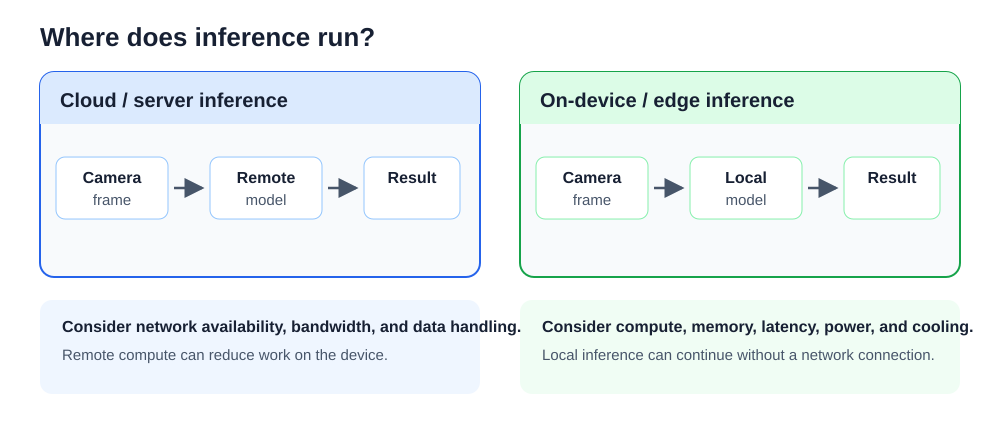

반면 온디바이스(On-Device) 엣지 추론은 입력 데이터를 장비 내부에서 바로 처리한다. 네트워크가 끊겨도 장비가 독립적으로 동작할 수 있고, 원본 영상이 외부로 나갈 가능성도 줄어든다. 그러나 임베디드 장비는 서버보다 연산 처리량, 메모리 용량, 냉각 능력이 작다. 따라서 목표 지연 시간과 장비의 물리적 한계를 함께 보아야 모델 구조와 런타임을 올바르게 고를 수 있다.

임베디드 비전 시스템을 설계할 때는 다음 다섯 가지 물리적 제약을 함께 검토한다.

- **연산 능력(Compute Capacity)**: 실행할 수 있는 모델의 복잡도와 처리량을 정한다. 실습 장비인 Raspberry Pi 5는 전용 신경망 가속기(NPU) 없이 4개의 Cortex-A76 CPU 코어로 추론을 실행한다. 실행 지연 시간은 모델 구조뿐 아니라 입력 텐서 형상, 런타임, 실행 스레드 수의 영향을 받으므로 실제로 측정해야 한다.
</p>

- **메모리 용량과 대역폭(Memory Capacity & Bandwidth)**: 시스템 메모리는 운영체제, 프레임 버퍼, 모델 파라미터, 계층 사이의 중간 결과 텐서인 활성화 텐서가 함께 사용한다. 모델 파일 크기뿐 아니라 추론 중에 동시에 필요한 작업 메모리와 DRAM·캐시 사이의 데이터 이동량도 확인해야 한다.
</p>

- **전력 소비와 열 제어(Thermal Dynamics)**: 장시간 연속으로 계산하면 칩 내부의 다이(Die) 온도가 올라간다. 온도가 한계에 가까워지면 장비는 코어를 보호하려고 동작 클록을 낮추는 열 제한(Thermal Throttling)에 들어갈 수 있다. 벤치마크에서는 액티브 쿨러 장착을 기준 조건으로 두고, 온도와 클록 변화를 함께 측정한다.
</p>

- **실시간성(Real-Time Determinism)**: 프레임 처리 성능은 평균 FPS만으로 판단할 수 없다. 지연 시간이 고르지 않고 흔들리는 정도인 지터와, 드물게 길어지는 지연 시간인 꼬리 지연도 확인해야 한다. 이때 P95와 P99 같은 백분위 지표를 함께 계산한다.
</p>

- **제품 원가(BOM, Bill of Materials)**: 전용 가속 칩이나 방열 부품을 추가하면 비용과 전력 소비가 늘 수 있다. 먼저 현재 장비에서 소프트웨어 최적화로 얻을 수 있는 성능 한계를 확인한 뒤 추가 하드웨어가 필요한지 판단한다.

### Raspberry Pi 5 하드웨어 구조와 연산 원리

실습 장비인 Raspberry Pi 5의 핵심 프로세서는 Broadcom BCM2712 시스템온칩(SoC)이다. SoC(System on Chip)는 CPU, 메모리 연결부, 입출력 제어 기능처럼 여러 구성 요소를 하나의 칩에 묶은 구조이다. BCM2712는 64비트 ARMv8.2-A 구조를 사용하며, 최대 2.4GHz 클록으로 동작하는 Cortex-A76 코어 4개로 구성된다. 코어는 명령어를 실제로 실행하는 CPU 내부의 계산 단위이고, 클록은 1초에 실행 기준 신호가 몇 번 반복되는지를 나타낸다.

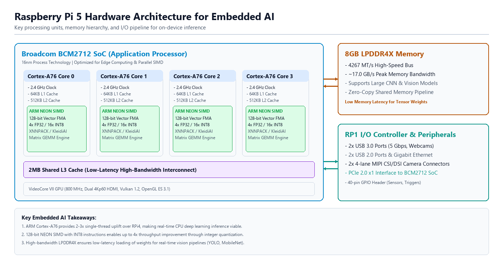

Cortex-A76 코어와 주변 하드웨어의 주요 특징은 다음과 같다.

- **비순차 실행 파이프라인(Out-of-Order Execution Pipeline)**: CPU가 서로 의존하지 않는 명령어의 실행 순서를 바꾸어 내부 계산 장치를 더 오래 사용하게 하는 방식이다. 분기 예측과 여러 명령어를 동시에 보내는 구조를 이용해 대기 시간을 줄인다.
</p>

- **128비트 NEON SIMD와 부동소수점 장치(VFPv4)**: NEON은 ARM CPU의 SIMD 확장 기능이다. SIMD는 명령어 하나로 여러 숫자를 동시에 계산하는 방식이다. 128비트 벡터 레지스터는 한 번에 다음과 같은 묶음 계산을 할 수 있다.
  - FP32(32비트 단정밀도 부동소수점): 4개 원소 병렬 처리 ($128 \div 32 = 4$)
  - INT8(8비트 정수): 16개 원소 병렬 처리 ($128 \div 8 = 16$)
  - FMA(Fused Multiply-Accumulate): 곱셈과 덧셈을 하나의 명령어로 묶어 $A \times B + C$ 형태를 계산한다. 실제 소요 사이클은 CPU와 명령어 흐름에 따라 달라질 수 있지만, 합성곱과 행렬 곱(GEMM)의 처리량을 높이는 데 쓰인다.
</p>

- **메모리 계층 구조(Memory Subsystem)**: 실습 장비는 4267MT/s로 동작하는 8GB LPDDR4X 메모리를 사용한다. 캐시는 CPU 가까이에 있는 작은 고속 메모리로, 자주 쓰는 데이터를 임시로 담아 DRAM 접근을 줄인다. L2 캐시와 공유 L3 캐시는 메모리 접근이 병목이 되는 연산자의 대기 시간을 줄이는 데 도움을 준다.
</p>

- **RP1 I/O 컨트롤러 기반 구조 분리**: RP1은 SoC와 분리된 입출력 컨트롤러이며 PCIe로 BCM2712와 연결된다. USB, 이더넷, GPIO 같은 주변 장치 입출력 처리를 맡는다. 이런 분리는 고속 영상 패킷을 받을 때 CPU가 처리해야 하는 인터럽트 오버헤드를 줄이는 데 도움을 준다.
</p>

- **전원 공급과 동적 주파수 조절(DVFS)**: 실습 장비는 5V/5A USB-PD 전원과 액티브 쿨러를 기준으로 사용한다. DVFS(Dynamic Voltage and Frequency Scaling)는 부하와 온도에 따라 전압과 클록을 조절하는 기능이다. 추론 성능을 비교할 때는 냉각 팬 동작 상태와 클록 주파수를 함께 확인해야 한다.

### 공통 딥러닝 스택

tOS-Lite AI 환경은 uv로 파이썬 패키지와 실행 환경을 관리한다. 실시간 비전 추론 파이프라인에서 사용하는 주요 라이브러리는 다음과 같다.

| 패키지 | 시스템 안의 주요 역할과 동작 특성 |
|---|---|
| NumPy | 다차원 배열 연산 라이브러리이다. 영상 전처리와 텐서 변환에서 배열 계산을 맡는다. |
| OpenCV | V4L2 커널 드라이버와 통신해 카메라 프레임을 수집하고, 크기 조정과 색상 변환 같은 영상 전처리를 한다. |
| PyTorch와 torchvision | 기준 딥러닝 모델의 구조 정의, 가중치 추출, 변환 전후 계산 결과 비교에 사용한다. |
| ONNX | 도구에 독립적인 공개 신경망 교환 형식이다. 정적 계산 그래프와 텐서 정보를 모델 파일에 저장한다. |
| ONNX Runtime | ONNX 모델을 실행하는 런타임이다. CPUExecutionProvider로 ARM CPU에서 추론 커널을 실행한다. |
| Netron | ONNX 그래프 구조, 계층별 입출력 텐서 형상, 합성곱 커널 속성을 브라우저에서 시각적으로 확인하는 도구이다. |
| psutil과 matplotlib | CPU 사용률, 메모리 사용량, 온도 같은 측정값을 읽고 벤치마크 결과를 그래프로 나타내는 데 사용한다. |

> **알아두기 - 범용 Raspberry Pi OS 상에서의 수동 환경 구성**
> 이 실습 환경(tOS-Lite AI)이 아닌 표준 데비안 기반 Raspberry Pi OS에서 같은 런타임을 구성할 때는 다음 절차로 의존성을 설치한다.
>
> ```sh
> sudo apt update
> sudo apt install -y v4l-utils
> pip install numpy opencv-python onnx onnxruntime onnxscript
> pip install netron psutil matplotlib
> pip install --no-cache torch torchvision --index-url https://download.pytorch.org/whl/cpu
> pip check
> ```

### V4L2와 UVC 카메라의 데이터 흐름

카메라 렌즈로 들어온 빛은 이미지 센서, USB 전송, 리눅스 커널, 사용자 프로그램을 차례로 거쳐 메모리 안의 NumPy 배열이 된다. NumPy 배열은 같은 자료형의 숫자를 여러 차원으로 묶어 저장하는 파이썬 자료 구조이다. 영상 처리가 느려졌을 때 원인을 찾으려면 이 흐름의 각 단계가 무엇을 하고 시간을 얼마나 쓰는지 알아야 한다.

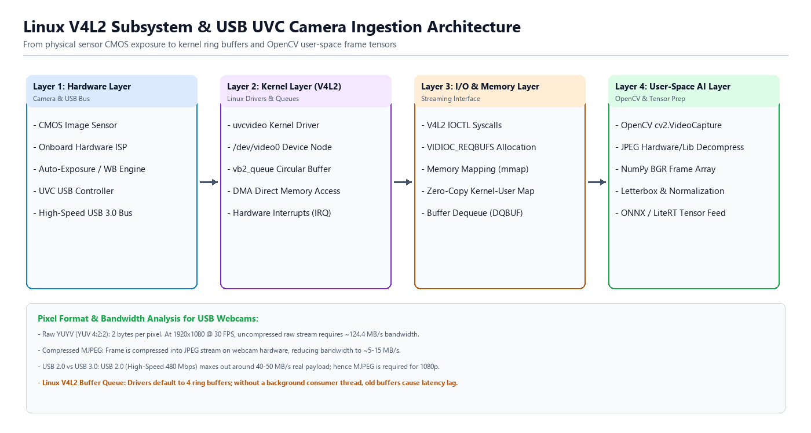

#### 이미지 센서와 ISP의 처리

카메라 모듈 안의 CMOS 이미지 센서는 빛을 전기 신호로 바꾸어 픽셀마다 밝기 값을 만든다. 일반적인 컬러 센서의 각 픽셀은 빨강, 초록, 파랑 가운데 한 가지 색의 빛만 받아들인다. 그래서 센서 바로 뒤에 있는 ISP(Image Signal Processor)가 이 값을 가공해 완성된 컬러 영상을 만든다. ISP는 영상 신호를 처리하는 전용 회로이며, 주로 다음 작업을 한다.

- 디모자이킹(Demosaicing): 한 가지 색의 값만 있는 픽셀에 주변 픽셀의 값을 이용해 나머지 두 색의 값을 채운다.
- 자동 노출(AE, Auto Exposure): 장면의 밝기에 맞추어 노출 시간과 신호 증폭 정도를 조절한다.
- 자동 화이트 밸런스(AWB, Auto White Balance): 조명의 색이 달라도 흰 물체가 흰색으로 보이도록 색을 보정한다.
- 감마 보정: 밝기 값을 사람의 눈이 느끼는 밝기에 가깝게 변환한다.
- 렌즈 왜곡 보정: 렌즈 때문에 휘어 보이는 영상을 바로잡는다. 이 기능은 카메라에 따라 없을 수도 있다.

#### USB 전송과 대역폭

UVC 카메라는 완성된 프레임을 패킷이라는 작은 데이터 묶음으로 나누어 USB로 보낸다. 실습 장비에서는 USB 호스트 컨트롤러가 이 패킷을 받는다. 1초 동안 보내야 하는 데이터의 양, 즉 필요한 대역폭은 해상도, FPS, 픽셀 형식에 따라 정해진다.

YUYV는 압축하지 않은 픽셀 형식이다. 밝기 정보(Y)는 픽셀마다 저장하고, 색 정보(U, V)는 가로로 이웃한 두 픽셀이 함께 쓴다. 그래서 픽셀 하나에 평균 2바이트를 쓰며, 이런 방식을 YUV 4:2:2라고 한다. YUYV 형식의 Full-HD(1920×1080) 영상을 30 FPS로 보내려면 1초에 다음 양의 데이터를 전송해야 한다.

$$1920 \times 1080 \times 2 \times 30 \text{ bytes/s} \approx 124.4\text{ MB/s} \quad (\approx 995.3\text{ Mbps})$$

여기서 1MB는 1,000,000바이트이고, 1Mbps는 1초에 1,000,000비트를 보내는 속도이다. 1바이트는 8비트이므로 124.4MB/s는 약 995.3Mbps이다.

이 값은 USB 2.0 High-Speed 규격의 이론상 최대 속도인 480Mbps보다 크다. 실제로는 통신 제어에 드는 몫을 빼야 하므로, 영상 전송에 쓸 수 있는 유효 대역폭은 보통 35~40MB/s 정도이다. 따라서 USB 2.0 카메라로는 이 조건의 비압축 영상을 보낼 수 없다.

그래서 USB 카메라는 프레임마다 JPEG로 압축해 보내는 MJPEG(Motion JPEG) 형식을 많이 쓴다. MJPEG는 전송할 데이터의 양을 크게 줄여 USB 대역폭의 부담을 낮춘다. 압축 비율은 장면과 카메라의 화질 설정에 따라 다르며, 원본의 1/10 정도가 되기도 한다. 대신 다음과 같은 대가가 따른다.

- 장면이 복잡할수록 압축이 덜 되므로, 프레임마다 데이터의 양(비트레이트)이 달라진다.
- 실습 장비의 CPU가 프레임을 받을 때마다 JPEG 압축을 풀어야 하므로 그만큼 계산 시간이 든다. 이처럼 본래 작업 외에 추가로 드는 시간이나 자원을 오버헤드라고 한다.

따라서 해상도와 목표 FPS를 정할 때는 USB 대역폭의 여유와 CPU가 압축을 푸는 데 드는 비용을 함께 고려한다.

#### V4L2 드라이버와 링 버퍼

리눅스 커널의 uvcvideo 드라이버는 USB 카메라를 인식하면 /dev/video0 같은 장치 파일을 만든다. 드라이버는 운영체제가 특정 하드웨어를 다룰 수 있게 해 주는 프로그램이고, 장치 파일은 프로그램이 하드웨어에 접근할 때 쓰는 파일 형태의 창구이다. 사용자 프로그램은 ioctl()이라는 시스템 호출로 장치 파일에 명령을 보내 카메라를 설정한다. 시스템 호출은 프로그램이 커널에 작업을 요청하는 방법이다. 주요 명령은 다음과 같다.

- VIDIOC_S_FMT: 원하는 해상도와 픽셀 형식(YUYV, MJPG 등)을 요청한다. 카메라가 지원하지 않는 값을 요청하면 드라이버가 지원 가능한 가까운 값으로 조정한다.
- VIDIOC_REQBUFS: 프레임을 담을 버퍼 여러 개를 커널에 준비해 달라고 요청한다.
- VIDIOC_QBUF, VIDIOC_DQBUF: 빈 버퍼를 대기열(큐)에 넣고(QBUF), 프레임이 채워진 버퍼를 꺼낸다(DQBUF).

버퍼는 데이터를 잠시 담아 두는 메모리 영역이다. 드라이버는 준비된 버퍼에 차례로 새 프레임을 채우고, 프로그램은 다 쓴 버퍼를 다시 대기열에 넣는다. 이렇게 정해진 개수의 버퍼를 고리처럼 돌려 쓰는 구조를 링 버퍼라고 한다. 이때 메모리 매핑(V4L2_MEMORY_MMAP) 방식을 쓰면 커널의 버퍼를 사용자 프로그램이 직접 읽을 수 있으므로, 프레임 데이터를 한 번 더 복사하는 시간을 줄일 수 있다. 버퍼를 주고받는 방식에는 이 밖에도 USERPTR, DMABUF 등이 있으며, 어떤 방식을 쓰는지는 드라이버와 설정에 따라 다르다.

#### OpenCV의 디코딩과 배열 변환

사용자 프로그램에서는 OpenCV의 cv2.VideoCapture가 V4L2로 버퍼의 데이터를 받아 다음과 같이 처리한다.

- 받은 데이터가 MJPEG 형식이면 libjpeg나 libjpeg-turbo 같은 JPEG 디코더로 압축을 푼다.
- 압축을 푼 픽셀 데이터를 NumPy 배열(numpy.ndarray)로 만들어 돌려준다. 이 배열의 형상은 (높이 H, 너비 W, 채널 수 C)이고, 각 픽셀의 색은 파랑(B), 초록(G), 빨강(R)의 순서로 저장된다. 값의 자료형은 0~255의 정수를 담는 uint8(부호 없는 8비트 정수)이다.

예를 들어 640×480 컬러 프레임은 형상이 (480, 640, 3)인 배열이 되고, 이 배열에는 480×640×3 = 921,600개의 값이 들어 있다. OpenCV는 관례적으로 RGB가 아닌 BGR 순서를 쓰므로, RGB 순서의 입력을 기대하는 모델에 넣을 때는 채널 순서를 바꾸어야 한다. 이 변환은 2장에서 다룬다.

카메라와 드라이버가 설정을 조정할 수 있으므로 실제 해상도와 FPS는 요청한 값과 다를 수 있다. 따라서 카메라를 연 직후 cap.get(cv2.CAP_PROP_FRAME_WIDTH)처럼 get()으로 실제 설정을 읽어 확인한다.

### 실습 1-1. 하드웨어와 딥러닝 실행 환경 진단

> **풀고 싶은 문제**
> 실습 코드를 실행하기 전에 실습 장비의 CPU와 메모리 상태, 파이썬 실행 환경을 어떻게 확인할 것인가? 온도 센서를 읽지 못한 경우와 라이브러리가 설치되지 않은 경우를 어떻게 구분할 것인가?

이 실습에서는 실습 장비의 CPU, 메모리, 온도와 딥러닝 라이브러리의 설치 상태를 한 번에 출력하는 진단 프로그램(hardware_inspector.py)을 만든다. 사전 학습 단계에서는 이 프로그램에 필요한 기능을 차례로 익힌다. 1단계에서는 리눅스의 가상 파일을 읽어 온도와 CPU 기능을 확인하고, 2단계에서는 psutil 라이브러리로 CPU와 메모리 상태를 조회한다. 3단계에서는 라이브러리가 설치되어 있는지 오류 없이 확인하는 방법을 익힌다.

이 교재의 코드는 첫 줄의 주석에 파일 이름이 적혀 있다. 각 코드를 작업 공간(/home/tos/Workspace)에 그 이름으로 저장하고, 실습 장비의 터미널에서 python 파일이름.py 형식으로 실행한다.

#### 사전 학습 1단계: 리눅스 가상 파일에서 하드웨어 정보 읽기

리눅스는 CPU 정보와 온도 같은 하드웨어 상태를 /proc와 /sys 디렉터리 아래의 파일로 보여 준다. 이 파일은 디스크에 저장된 실제 파일이 아니라, 읽을 때마다 리눅스 커널이 그 순간의 값을 만들어 주는 가상 파일이다. 따라서 파이썬의 open() 함수로 일반 텍스트 파일처럼 읽을 수 있다.

```python
# step1_read_sysfs.py

# SoC 온도 읽기
# /sys/class/thermal/thermal_zone0/temp 파일에는 밀리섭씨(1/1000°C) 단위의 정수가 들어 있다.
with open("/sys/class/thermal/thermal_zone0/temp", "r") as f:
    raw_temp = f.read().strip()          # 파일 내용 읽기 (예: "48234")
    temp_c = float(raw_temp) / 1000.0     # °C 단위로 변환
    print(f"현재 CPU 온도: {temp_c:.1f}'C")

# CPU 사양 및 가속 기능(NEON/asimd) 확인
# /proc/cpuinfo 파일에서 'Features' 줄을 찾아 NEON(ARM64에서는 asimd)이 있는지 확인한다.
with open("/proc/cpuinfo", "r") as f:
    for line in f:
        if "Features" in line:
            features = line.split(":", 1)[1].lower()
            has_neon = "asimd" in features or "neon" in features
            print(f"NEON 가속 지원 여부: {'지원함' if has_neon else '미지원'}")
            break
```

코드에서 # 뒤의 내용은 주석이다. 주석은 사람이 읽기 위한 설명이며 실행되지 않는다.

with open("파일 경로", "r") as f:는 파일을 읽기 모드("r")로 열고, 열린 파일을 f라는 이름으로 쓰게 한다. 콜론(:) 다음 줄부터 들여쓴 부분이 with 블록이며, 블록이 끝나면 파일이 자동으로 닫힌다. 파이썬은 이처럼 들여쓰기로 코드 블록의 범위를 나타낸다.

f.read()는 파일 내용 전체를 문자열로 읽고, .strip()은 문자열 앞뒤의 공백과 줄바꿈 문자를 지운다. 온도 파일에는 "48234"처럼 1/1000°C 단위의 숫자가 문자열로 들어 있다. 그래서 float()로 실수로 바꾼 뒤 1000.0으로 나누어 48.234°C를 얻는다. = 기호는 오른쪽의 계산 결과를 왼쪽의 변수에 저장하라는 뜻이다.

print(f"현재 CPU 온도: {temp_c:.1f}'C")에서 f"..."는 f-문자열이다. f-문자열의 중괄호 {} 자리에는 변수의 값이 들어가고, :.1f는 소수점 아래 한 자리까지 표시하라는 형식 지정자이다. 따라서 48.234는 48.2로 출력된다.

두 번째 with 블록은 /proc/cpuinfo를 읽어 CPU가 NEON을 지원하는지 확인한다. for line in f:는 파일을 한 줄씩 읽어 line에 넣으면서 아래 블록을 반복 실행한다. if "Features" in line:은 그 줄에 Features라는 글자가 들어 있을 때만 아래 블록을 실행한다. line.split(":", 1)은 첫 번째 콜론을 기준으로 문자열을 두 조각으로 나누어 리스트로 돌려준다. 리스트는 여러 값을 순서대로 담는 자료형이며, 각 값은 0부터 시작하는 번호(인덱스)로 꺼낸다. 따라서 [1]은 두 번째 조각, 즉 콜론 뒤의 기능 목록이다. .lower()는 모든 글자를 소문자로 바꾸어 대소문자가 섞여 있어도 비교할 수 있게 한다.

ARM64 리눅스는 NEON 지원을 asimd(Advanced SIMD)라는 이름으로 표시하므로 코드는 asimd와 neon을 모두 찾는다. "asimd" in features는 features에 asimd가 들어 있으면 True(참), 없으면 False(거짓)가 되며, or는 둘 중 하나라도 참이면 참이 되는 연산자이다. '지원함' if has_neon else '미지원'은 has_neon이 참이면 '지원함', 거짓이면 '미지원'이 되는 조건 표현식이다. 원하는 줄을 찾으면 더 읽을 필요가 없으므로 break로 반복을 끝낸다.

#### 사전 학습 2단계: psutil 라이브러리로 CPU와 메모리 상태 조회

psutil은 CPU, 메모리, 프로세스 같은 시스템 정보를 조회하는 파이썬 라이브러리이다. 1단계처럼 파일을 직접 읽지 않아도 코어 수, 클록, 메모리 양을 함수 호출 한 번으로 얻을 수 있다.

```python
# step2_psutil_basics.py
import psutil

# CPU 코어 및 동작 클록
physical_cores = psutil.cpu_count(logical=False) # 물리 코어 수
freq = psutil.cpu_freq()                         # CPU 주파수 정보

print(f"물리 코어 수: {physical_cores}개")
print(f"현재 클럭  : {freq.current:.1f} MHz (최대 {freq.max:.1f} MHz)")

# RAM 용량 확인 (바이트 단위를 GB로 변환: 1024^3으로 나눔)
mem = psutil.virtual_memory()
total_gb = mem.total / (1024 ** 3)
available_gb = mem.available / (1024 ** 3)

print(f"전체 메모리: {total_gb:.2f} GB")
print(f"여유 메모리: {available_gb:.2f} GB")
```

import psutil은 psutil 라이브러리를 불러와 psutil.함수이름() 형식으로 쓸 수 있게 한다. psutil.cpu_count(logical=False)는 물리 코어 수를 돌려준다. 괄호 안의 logical=False처럼 이름을 붙여 함수에 전달하는 값을 키워드 인자라고 한다. logical=True로 바꾸면 운영체제가 인식하는 논리 코어 수를 돌려주는데, Cortex-A76 코어는 한 번에 하나의 실행 흐름만 처리하므로 실습 장비에서는 두 값이 모두 4이다.

psutil.cpu_freq()는 현재 클록과 최대 클록을 함께 담은 객체를 돌려준다. 객체는 여러 값과 기능을 하나로 묶은 데이터이며, 객체에 담긴 값은 freq.current, freq.max처럼 점(.) 뒤에 이름을 써서 읽는다. 객체에 딸린 값을 속성, 객체에 딸린 함수를 메서드라고 한다. 1단계의 f.read()도 파일 객체 f의 메서드이다. 클록의 단위는 MHz이므로 2.4GHz는 2400.0으로 표시된다.

psutil.virtual_memory()가 돌려주는 객체에서 total은 전체 메모리, available은 새 프로그램이 바로 쓸 수 있는 메모리의 크기이다. 두 값의 단위는 바이트이므로 1024 ** 3으로 나누어 GB 단위로 바꾼다. **는 거듭제곱 연산자이며, 1024 ** 3은 1,073,741,824이다.

#### 사전 학습 3단계: 패키지 설치 여부와 버전 확인(try-except)

프로그램이 쓰는 라이브러리가 설치되어 있지 않으면, 그 라이브러리를 불러오는 순간 오류가 나고 프로그램이 멈춘다. 이처럼 실행 중에 생기는 오류를 예외라고 한다. 예외 처리를 쓰면 오류가 생겨도 프로그램을 멈추지 않고 다음 작업을 이어 갈 수 있다.

```python
# step3_check_packages.py

# 확인할 패키지 목록을 순회하며 검사
modules_to_check = ["cv2", "torch", "onnxruntime", "non_existing_pkg"]

for name in modules_to_check:
    try:
        # 문자열 이름으로 모듈 가져오기
        mod = __import__(name)
        version = getattr(mod, "__version__", "버전 정보 없음")
        print(f"[설치됨] {name} (버전: {version})")
    except ImportError:
        print(f"[미설치] {name} - 패키지가 설치되지 않았습니다.")
```

modules_to_check는 확인할 모듈 이름 네 개를 담은 리스트이다. 마지막의 non_existing_pkg는 설치되지 않은 경우의 출력을 보려고 일부러 넣은 없는 이름이다. for name in modules_to_check:는 리스트의 값을 하나씩 name에 넣으면서 블록을 반복한다.

try: 블록을 실행하다가 예외가 생기면, 파이썬은 try 블록의 남은 부분을 건너뛰고 except 뒤에 적힌 예외와 종류가 같은지 확인한다. 종류가 같으면 except 블록을 실행한 뒤 프로그램을 계속 진행한다. 모듈을 찾지 못하면 ImportError가 생기므로, 이 코드는 [미설치]를 출력하고 다음 이름으로 넘어간다.

__import__(name)은 문자열로 된 이름으로 모듈을 불러오는 파이썬 내장 함수이다. 평소에는 import cv2처럼 모듈 이름을 코드에 직접 쓰지만, 여기서는 이름이 변수 name에 들어 있으므로 이 함수를 쓴다. getattr(mod, "__version__", "버전 정보 없음")은 모듈의 __version__ 속성, 즉 버전 문자열을 읽는다. 그 속성이 없으면 오류를 내는 대신 세 번째 인자인 "버전 정보 없음"을 돌려준다.

#### 최종 구현

다음 hardware_inspector.py는 사전 학습 단계의 기능을 함수로 묶어 실습 장비의 CPU 사양, 메모리, NEON 지원 여부, 딥러닝 라이브러리의 설치 상태를 한 번에 출력한다.

```python
# hardware_inspector.py
import sys
import platform
import psutil

def get_cpu_info():
    info = {}
    try:
        with open("/proc/cpuinfo", "r") as f:
            for line in f:
                if ":" in line:
                    key, val = line.split(":", 1)
                    info[key.strip()] = val.strip()
    except Exception as e:
        info["error"] = str(e)
    return info

def get_soc_temperature():
    try:
        with open("/sys/class/thermal/thermal_zone0/temp", "r") as f:
            temp_c = float(f.read().strip()) / 1000.0
            return f"{temp_c:.1f}'C"
    except Exception:
        return "N/A"

def get_arm_neon_support():
    cpu_info = get_cpu_info()
    features = cpu_info.get("Features", "").lower()
    # ARM64에서는 asimd가 NEON SIMD 명령어를 의미함
    has_neon = "asimd" in features or "neon" in features
    has_fp = "fp" in features
    return has_neon, has_fp, features

def main():
    missing_packages = []
    print("=" * 65)
    print("       Raspberry Pi 5 임베디드 AI 하드웨어 시스템 진단 결과")
    print("=" * 65)

    # 운영체제와 플랫폼 기본 정보
    print(f"[OS & Kernel] {platform.system()} {platform.release()} ({platform.machine()})")
    print(f"[Python Spec] Version {sys.version.split()[0]} ({sys.executable})")

    # CPU 및 NEON 벡터 가속기 진단
    cpu_count_physical = psutil.cpu_count(logical=False)
    cpu_count_logical = psutil.cpu_count(logical=True)
    cpu_freq = psutil.cpu_freq()
    has_neon, has_fp, _flags = get_arm_neon_support()

    print("\n[CPU 서브시스템]")
    print(f"  - 프로세서 모델 : ARM Cortex-A76 Quad-Core (BCM2712 SoC)")
    print(f"  - 물리 코어 수  : {cpu_count_physical}개 ({cpu_count_logical}개 논리 실행 단위)")
    print(f"  - 동작 클럭     : 현재 {cpu_freq.current:.1f} MHz (최대 {cpu_freq.max:.1f} MHz)")
    print(f"  - ARM NEON SIMD : {'지원됨 (128-bit Vector ASIMD 활성)' if has_neon else '미지원'}")
    print(f"  - 부동소수점 장치: {'지원됨 (VFPv4 단정밀도/배정밀도)' if has_fp else '미지원'}")
    print(f"  - 현재 다이 온도: {get_soc_temperature()}")

    # 메모리 서브시스템 진단
    vm = psutil.virtual_memory()
    swap = psutil.swap_memory()
    print("\n[메모리 서브시스템]")
    print(f"  - 시스템 RAM    : 총 {vm.total / (1024**3):.2f} GB (사용 가능: {vm.available / (1024**3):.2f} GB)")
    print(f"  - 메모리 규격   : LPDDR4X-4267 (32-bit Bus, 대역폭 ~17.0 GB/s)")
    print(f"  - 스왑(Swap) 공간: 총 {swap.total / (1024**2):.1f} MB (사용 중: {swap.used / (1024**2):.1f} MB)")

    # 모델 분석 도구
    print("\n[모델 분석 도구]")
    try:
        import netron
        print('  - Netron        : 설치됨')
    except ImportError:
        print("  - Netron        : 미설치")

    # 딥러닝 가속 라이브러리 스택 진단
    print("\n[딥러닝 런타임 프레임워크]")
    try:
        import torch
        print(f"  - PyTorch       : v{torch.__version__} (CPU Threads: {torch.get_num_threads()})")
    except ImportError:
        print("  - PyTorch       : 미설치")
        missing_packages.append("PyTorch")

    try:
        import onnx
        import onnxruntime as ort
        providers = ort.get_available_providers()
        print(f"  - ONNX Runtime  : v{ort.__version__} (Providers: {providers})")
    except ImportError:
        print("  - ONNX Runtime  : 미설치")
        missing_packages.append("ONNX 또는 ONNX Runtime")

    try:
        import cv2
        print(f"  - OpenCV Vision : v{cv2.__version__} (V4L2 Backend 지원)")
    except ImportError:
        print("  - OpenCV Vision : 미설치")
        missing_packages.append("OpenCV")

    print("=" * 65)
    if missing_packages:
        print("진단 완료: 다음 구성 요소가 설치되지 않았습니다 - " + ", ".join(missing_packages))
    else:
        print("진단 완료: 하드웨어와 주요 임베디드 AI 실행 환경을 확인했습니다.")
    print("=" * 65)

if __name__ == "__main__":
    main()
```

**코드 해설**

이 프로그램은 함수 네 개로 이루어진다. def 함수이름():은 함수를 정의하는 문법이며, 그 아래에 들여쓴 블록이 함수의 내용이다. 함수는 정의만 해서는 실행되지 않고 호출될 때 실행되며, return 뒤의 값을 호출한 곳으로 돌려준다. 파일 마지막의 if __name__ == "__main__":은 이 파일을 python hardware_inspector.py처럼 직접 실행했을 때만 main()을 호출하라는 뜻이다. 다른 프로그램이 이 파일을 import로 불러오면 main()이 자동으로 실행되지 않으므로 함수만 가져다 쓸 수 있다.

get_cpu_info()는 /proc/cpuinfo의 각 줄을 콜론 앞의 항목 이름과 콜론 뒤의 값으로 나누어 딕셔너리에 저장한다. 딕셔너리는 이름(키)과 값을 짝지어 저장하는 자료형이다. info = {}는 빈 딕셔너리를 만들고, info[key.strip()] = val.strip()은 앞뒤 공백을 지운 항목 이름으로 값을 저장한다. key, val = line.split(":", 1)은 두 조각으로 나뉜 결과를 key와 val에 차례로 나누어 담는다. 파일을 읽다가 예외가 생기면 except Exception as e: 블록이 오류 내용을 "error" 항목에 저장한다. Exception은 대부분의 예외를 포함하는 예외 종류이고, as e는 생긴 예외를 e라는 이름으로 받는다.

get_arm_neon_support()는 cpu_info.get("Features", "")로 Features 항목을 꺼낸다. 딕셔너리의 get() 메서드는 키가 없을 때 오류 대신 두 번째 인자, 여기서는 빈 문자열을 돌려준다. 이 함수는 운영체제가 보고한 기능 목록에서 asimd(NEON)와 fp(부동소수점 장치) 표시를 찾는다. return has_neon, has_fp, features처럼 값 여러 개를 쉼표로 이어 돌려주면, 호출한 쪽에서 has_neon, has_fp, _flags = get_arm_neon_support()처럼 차례로 나누어 받을 수 있다. 이름 앞의 밑줄은 받기는 하지만 쓰지 않는 값임을 나타내는 관례이다. 이 검사는 CPU가 해당 명령어를 지원하는지만 알려 준다. 특정 모델이 얼마나 빠르게 실행되는지, ONNX Runtime이 실제로 NEON 연산을 쓰는지는 알려 주지 않는다.

get_soc_temperature()는 1단계와 같은 방법으로 온도를 읽어 "48.2'C" 같은 문자열을 돌려준다. 센서 파일이 없거나 읽지 못하면 except 블록에서 "N/A"를 돌려주므로, 온도를 읽지 못해도 나머지 진단은 계속된다. 온도 파일의 경로와 접근 권한은 운영체제와 장비에 따라 다를 수 있으므로 N/A가 표시되면 그 장비의 온도 센서 경로를 확인한다.

main()은 진단 결과를 항목별로 출력한다. "=" * 65는 = 문자를 65번 이어 붙인 구분선이고, 문자열 안의 \n은 줄바꿈 문자이다. platform.system(), platform.release(), platform.machine()은 운영체제 이름, 커널 버전, CPU 구조(aarch64)를 돌려주고, sys.version과 sys.executable은 실행 중인 파이썬의 버전과 실행 파일의 경로를 알려 준다. psutil.swap_memory()는 스왑 공간의 크기와 사용량을 돌려준다. 스왑은 메모리가 부족할 때 데이터를 임시로 옮겨 두는 공간으로, 장비 설정에 따라 저장 장치나 압축 메모리를 사용한다. 스왑 사용량이 늘어나면 메모리가 부족해지고 있다는 신호로 볼 수 있다.

출력 항목 가운데 프로세서 이름(ARM Cortex-A76 Quad-Core)과 메모리 규격·대역폭(LPDDR4X-4267, 약 17.0GB/s)은 Raspberry Pi 5의 사양을 코드에 직접 적은 값이다. 반면 코어 수, 클록, 메모리 사용량, 온도는 실행 중인 운영체제에서 읽은 값이다. 따라서 다른 장비에서 실행하면 앞의 두 항목은 실제와 다를 수 있다.

라이브러리 확인 부분은 3단계와 같은 try-except 방식을 쓰되, 라이브러리마다 별도의 try-except 블록을 두므로 하나가 없어도 나머지를 계속 확인한다. import onnxruntime as ort의 as ort는 긴 모듈 이름 대신 ort라는 짧은 별칭을 쓰게 한다. 설치되지 않은 라이브러리의 이름은 missing_packages 리스트에 append()로 추가하고, 마지막에 ", ".join(missing_packages)로 쉼표를 넣어 한 줄로 이어 출력한다. Netron은 모델 구조를 그림으로 확인하는 보조 도구이므로, 설치되지 않아도 missing_packages에 넣지 않는다.

ort.get_available_providers()는 설치된 ONNX Runtime이 사용할 수 있는 실행 제공자(Execution Provider)의 목록을 돌려준다. 실행 제공자는 ONNX Runtime이 실제 계산을 맡기는 하드웨어별 실행 방식이며, 실습 장비에서는 CPU로 계산하는 CPUExecutionProvider를 쓴다. 다만 목록에 CPUExecutionProvider가 있어도 모델 추론이 성공하는지는 실제 입력을 넣어 따로 확인해야 한다.

> **알아두기 - 파이썬과 pip의 실행 경로**
> sys.executable은 현재 프로그램을 실행한 파이썬의 경로이다. pip는 파이썬 패키지를 설치하는 도구인데, 장비에 파이썬이 여러 개 있으면 터미널의 pip가 프로그램을 실행하는 파이썬과 다른 파이썬에 연결되어 있을 수 있다. 그러면 pip로 설치한 패키지를 프로그램이 찾지 못한다. 따라서 설치된 패키지 목록만 보지 말고 파이썬의 경로와 실제 import 결과를 함께 확인한다.

**실행 결과와 확인할 점**

hardware_inspector.py를 실행한다.

```sh
python hardware_inspector.py
```

출력에서 다음 항목을 확인한다.
- 운영체제와 파이썬: Linux, aarch64와 /usr/local/bin/python3 경로가 출력되는지 확인한다.
- CPU: 코어 수가 4로 표시되고 NEON 지원 여부가 표시되는지 확인한다. 프로세서 이름은 코드에 적은 기준값이라는 점을 구분한다.
- 메모리: 시스템 RAM과 스왑 사용량이 표시되는지 확인한다. 메모리 규격과 대역폭은 코드에 적은 실습 장비의 사양이다.
- 라이브러리: PyTorch, ONNX Runtime, OpenCV의 버전과 실행 제공자 목록이 표시되는지 확인한다.

> **한 걸음 더**
> 1. 온도 센서를 읽지 못했을 때 "N/A" 대신 None을 돌려주도록 get_soc_temperature()를 바꾸고, main()에서 None이면 별도의 안내 문구를 출력하게 한다. None은 '값이 없음'을 나타내는 파이썬의 특별한 값이다. 반환값의 자료형이 바뀌면 출력 코드를 어떻게 바꾸어야 하는지 설명한다.
> 2. 터미널에서 which python과 which pip를 실행한 결과를 sys.executable과 비교한다. which는 명령을 실행할 때 실제로 쓰이는 프로그램의 경로를 알려 주는 리눅스 명령이다. 경로가 다르면 패키지 설치와 프로그램 실행에 어떤 문제가 생길 수 있는지 정리한다.

### 실습 1-2. V4L2 카메라 장치 점검과 하드웨어 지원 모드 분석

> **풀고 싶은 문제**
> 카메라가 실제로 적용한 해상도, 픽셀 형식과 프레임 속도는 요청한 설정과 어떻게 다를 수 있는가? 실습을 시작하기 전에 이 차이를 어떻게 확인할 것인가?

프로그램에서 해상도와 픽셀 형식을 지정해도 카메라나 드라이버가 요청한 설정을 그대로 적용한다고 단정할 수 없다. V4L2 절에서 살펴본 것처럼 드라이버는 장치가 지원하는 값에 맞게 요청을 조정할 수 있다. 이 실습에서는 V4L2 장치 목록을 확인하고 카메라 장치 0에 여러 해상도와 형식을 요청한 뒤, 드라이버가 보고한 값과 프레임 수신 속도를 측정한다.

실습의 목표는 추론 프로그램을 만들기 전에 카메라 입력의 실제 조건을 확인하는 것이다. 측정 결과의 FPS는 카메라에서 프레임을 받아 오는 캡처 FPS이다. 전처리, 모델 추론, 화면 표시까지 모두 포함한 서비스 처리 속도와는 다르다. 예를 들어 카메라가 30 FPS로 프레임을 보내도 추론이 한 장에 80ms 걸리면 전체 서비스는 약 12.5 FPS보다 빨라지기 어렵다.

#### 사전 학습 1단계: 운영체제 명령으로 카메라 장치 목록 확인

V4L2 카메라 목록은 v4l-utils에 포함된 v4l2-ctl 명령으로 확인할 수 있다. 명령이 설치되지 않았거나 실행에 실패할 수 있으므로 예외를 처리해 안내한다.

```python
# step1_list_camera_devices.py
import subprocess

try:
    devices = subprocess.check_output(
        ["v4l2-ctl", "--list-devices"],
        text=True
    )
    print(devices.strip())
except (FileNotFoundError, subprocess.CalledProcessError) as error:
    print(f"카메라 목록 조회 실패: {error}")
```

subprocess 모듈은 파이썬 프로그램에서 운영체제 명령을 실행할 때 쓴다. 여기서는 v4l2-ctl --list-devices 명령을 실행해 카메라 장치 목록을 문자열로 받는다. check_output()은 명령을 실행하고 표준 출력의 내용을 돌려준다. 첫 번째 인자인 ["v4l2-ctl", "--list-devices"]는 실행할 명령과 옵션을 나누어 담은 리스트이다. text=True는 명령의 출력 결과를 바이트가 아니라 문자열로 받게 한다.

명령 파일을 찾지 못하면 FileNotFoundError가 생기고, 명령이 오류 종료 상태를 돌려주면 subprocess.CalledProcessError가 생긴다. except (FileNotFoundError, subprocess.CalledProcessError) as error:는 두 예외 가운데 하나가 생겼을 때 같은 블록에서 처리한다는 뜻이다. 괄호 안에 여러 예외를 튜플로 묶어 적고, as error로 실제 오류 객체를 error 변수에 담는다.

#### 사전 학습 2단계: 카메라 설정 요청과 실제 적용 값 비교

VideoCapture.set()은 해상도나 영상 형식을 장치에 요청하고, get()은 장치가 적용했다고 보고하는 값을 읽는다. 요청한 값과 실제 값이 다를 수 있으므로 둘을 나란히 확인한다.

```python
# step2_request_camera_mode.py
import cv2

cap = cv2.VideoCapture(0, cv2.CAP_V4L2)
if not cap.isOpened():
    raise RuntimeError("카메라를 열 수 없습니다.")

try:
    cap.set(cv2.CAP_PROP_FOURCC, cv2.VideoWriter_fourcc(*"MJPG"))
    cap.set(cv2.CAP_PROP_FRAME_WIDTH, 640)
    cap.set(cv2.CAP_PROP_FRAME_HEIGHT, 480)

    actual_width = int(cap.get(cv2.CAP_PROP_FRAME_WIDTH))
    actual_height = int(cap.get(cv2.CAP_PROP_FRAME_HEIGHT))
    print(f"요청: 640x480, 실제 적용: {actual_width}x{actual_height}")
finally:
    cap.release()
```

cv2.VideoCapture(0, cv2.CAP_V4L2)는 0번 카메라 장치, 보통 /dev/video0을 OpenCV로 연다. 두 번째 인자인 cv2.CAP_V4L2는 앞에서 살펴본 V4L2 백엔드를 쓰겠다는 지정이다. cap.isOpened()가 거짓이면 카메라를 열지 못한 상태이므로 raise RuntimeError(...)로 예외를 발생시킨다. raise는 프로그램이 더 진행되면 잘못된 결과가 나올 때 의도적으로 예외를 내는 문법이다.

try-finally 구조에서 finally 블록은 try 블록이 정상으로 끝나거나 예외가 생겨도 실행된다. 카메라는 프로그램 밖의 하드웨어 자원이므로 오류가 생겨도 cap.release()로 해제해야 한다. 그렇지 않으면 다음 실행에서 장치가 이미 사용 중인 상태로 남을 수 있다.

cap.set(cv2.CAP_PROP_FOURCC, ...)는 픽셀 형식을 요청하고, CAP_PROP_FRAME_WIDTH와 CAP_PROP_FRAME_HEIGHT는 너비와 높이를 요청한다. CAP_PROP으로 시작하는 값은 OpenCV가 카메라 속성을 구분하려고 정한 상수이다. cv2.VideoWriter_fourcc(*"MJPG")는 네 글자 형식명 MJPG를 정수 코드로 바꾼다. 앞의 *는 문자열 "MJPG"를 "M", "J", "P", "G" 네 글자로 풀어 함수에 전달한다. cap.get()은 실제로 적용되었다고 보고된 값을 실수로 돌려주므로 int()로 정수로 바꾸어 출력한다.

#### 사전 학습 3단계: 일정 프레임을 읽어 캡처 FPS 계산

카메라를 연 직후에는 자동 노출과 자동 화이트 밸런스가 안정되는 중일 수 있고, 드라이버와 OpenCV 내부 버퍼도 아직 일정한 흐름에 들어가기 전일 수 있다. 그래서 처음 몇 프레임은 워밍업으로 읽기만 하고 측정에서 제외한다. 그 뒤 일정 시간 동안 성공적으로 읽은 프레임 수를 경과 시간으로 나누어 캡처 FPS를 계산한다.

```python
# step3_measure_capture_fps.py
import cv2
import time

cap = cv2.VideoCapture(0, cv2.CAP_V4L2)
if not cap.isOpened():
    raise RuntimeError("카메라를 열 수 없습니다.")

try:
    for _ in range(5):
        cap.read()

    start = time.perf_counter()
    captured = 0
    for _ in range(30):
        success, _ = cap.read()
        if not success:
            break
        captured += 1

    elapsed = time.perf_counter() - start
    fps = captured / elapsed if elapsed > 0 else 0.0
    print(f"수신 프레임: {captured}, 경과 시간: {elapsed:.2f}s, FPS: {fps:.1f}")
finally:
    cap.release()
```

for _ in range(5):는 같은 코드를 5번 반복한다. range(5)는 0부터 4까지의 값을 차례로 만들지만, 이 값 자체를 쓰지 않으므로 반복 변수 이름을 _로 둔다. 밑줄 하나는 값을 받지만 사용하지 않는다는 관례이다. 뒤의 for _ in range(30):은 측정 구간에서 최대 30장을 읽는 반복문이다.

time.perf_counter()는 짧은 시간 차이를 재기에 알맞은 고해상도 시간 값을 돌려준다. 시작 시각을 start에 저장하고, 측정이 끝난 뒤 다시 읽은 값에서 start를 빼면 경과 시간이 된다. success, _ = cap.read()는 프레임 수신 성공 여부를 success에 받고, 실제 프레임 배열은 이 단계에서 쓰지 않으므로 _에 받는다.

fps = captured / elapsed if elapsed > 0 else 0.0은 조건 표현식이다. elapsed가 0보다 크면 captured / elapsed를 계산하고, 그렇지 않으면 0.0을 쓴다. 매우 짧은 구간에서 경과 시간이 0으로 보고되는 예외적인 상황에 대비해 0으로 나누는 오류를 피하는 코드이다. 여기서 계산한 값은 읽기 구간의 캡처 FPS이며, 추론까지 포함한 서비스 처리 속도가 아니다.

#### 최종 구현

다음 camera_prober.py는 v4l2-ctl로 장치 목록을 표시하고, 미리 정한 해상도와 픽셀 형식 조합을 차례로 시험한다. test_camera_mode 함수는 각 조합마다 5회 워밍업 루프를 수행한 뒤 30회 측정 구간에서 캡처 FPS를 계산한다.

```python
# camera_prober.py
import cv2
import time
import subprocess

def probe_v4l2_devices():
    print("시스템에 연결된 V4L2 비디오 장치 검색 중...")
    try:
        out = subprocess.check_output(
            ["v4l2-ctl", "--list-devices"],
            text=True
        )
        print("-" * 50)
        print(out.strip())
        print("-" * 50)
    except Exception as e:
        print(f"v4l2-ctl 실행 실패 (패키지 설치 필요): {e}")

def test_camera_mode(device_id, width, height, fourcc_str, test_frames=30):
    cap = cv2.VideoCapture(device_id, cv2.CAP_V4L2)
    if not cap.isOpened():
        return False, 0.0, "장치 열기 실패"

    fourcc = cv2.VideoWriter_fourcc(*fourcc_str)
    cap.set(cv2.CAP_PROP_FOURCC, fourcc)
    cap.set(cv2.CAP_PROP_FRAME_WIDTH, width)
    cap.set(cv2.CAP_PROP_FRAME_HEIGHT, height)

    actual_w = int(cap.get(cv2.CAP_PROP_FRAME_WIDTH))
    actual_h = int(cap.get(cv2.CAP_PROP_FRAME_HEIGHT))
    actual_fourcc_int = int(cap.get(cv2.CAP_PROP_FOURCC))
    actual_fourcc = "".join([chr((actual_fourcc_int >> 8 * i) & 0xFF) for i in range(4)])

    # 워밍업 (센서 노출 안정화)
    for _ in range(5):
        ret, _ = cap.read()
        if not ret:
            cap.release()
            return False, 0.0, "프레임 수신 실패"

    # 실제 FPS 측정
    t_start = time.perf_counter()
    captured_frames = 0
    for _ in range(test_frames):
        ret, _ = cap.read()
        if not ret:
            break
        captured_frames += 1
    t_elapsed = time.perf_counter() - t_start
    if captured_frames < test_frames:
        cap.release()
        return False, 0.0, f"프레임 수신 중단 ({captured_frames}/{test_frames})"

    measured_fps = captured_frames / t_elapsed if t_elapsed > 0 else 0.0

    cap.release()
    status_str = f"설정: {actual_w}x{actual_h} ({actual_fourcc}) | 실측 속도: {measured_fps:.1f} FPS"
    return True, measured_fps, status_str

def main():
    probe_v4l2_devices()

    device_index = 0
    test_configs = [
        (640, 480, "MJPG"),
        (640, 480, "YUYV"),
        (1280, 720, "MJPG"),
        (1280, 720, "YUYV"),
        (1920, 1080, "MJPG"),
    ]

    print(f"\n카메라 디바이스(/dev/video{device_index}) 성능 및 모드 검증 시작...")
    print("=" * 65)

    best_config = None
    max_fps = 0.0

    for width, height, codec in test_configs:
        success, fps, msg = test_camera_mode(
            device_index,
            width,
            height,
            codec
        )
        if success:
            print(f"  [성공] {width:4d}x{height:4d} [{codec}] -> {msg}")
            if fps > max_fps:
                max_fps = fps
                best_config = (width, height, codec, fps)
        else:
            print(f"  [실패] {width:4d}x{height:4d} [{codec}] -> {msg}")

    print("=" * 65)
    if best_config:
        bw, bh, bcodec, bfps = best_config
        print(f"추천 최적 모드: {bw}x{bh} [{bcodec}] (실측 {bfps:.1f} FPS)")
        print("  -> 실시간 딥러닝 추론 파이프라인의 기본 입력 규격으로 채택 권장")
    else:
        print("오류: 사용 가능한 카메라 모드를 찾을 수 없습니다.")

if __name__ == "__main__":
    main()
```

**코드 해설**

이 프로그램은 세 부분으로 이루어진다. probe_v4l2_devices()는 운영체제에 등록된 V4L2 비디오 장치 목록을 출력한다. test_camera_mode()는 한 가지 해상도와 픽셀 형식 조합을 열어 실제 적용 값과 캡처 FPS를 측정한다. main()은 시험할 조합 목록을 만들고, 성공한 조합 가운데 캡처 FPS가 가장 높은 항목을 마지막에 출력한다.

probe_v4l2_devices()는 v4l2-ctl --list-devices 명령의 결과를 출력하며, v4l-utils가 없거나 명령 실행에 실패해도 오류만 표시하고 이후의 카메라 모드 시험은 계속한다. 따라서 장치 목록 조회 실패와 프레임 수신 실패를 구분해 확인할 수 있다.

test_camera_mode()는 VideoCapture에 V4L2 백엔드를 지정해 카메라를 연 뒤 cap.set()으로 FOURCC와 영상 크기를 요청한다. 이어 cap.get()으로 드라이버가 보고하는 크기와 형식을 읽으므로, 설정 요청의 성공 여부만으로 실제 적용 형식을 확정하지 않는다. 요청한 값, 드라이버가 보고한 값, 실제 프레임 수신 성공 여부를 함께 보아야 한다.

VideoWriter_fourcc()는 네 문자 형식명을 정수 코드로 바꾼다. 반대로 actual_fourcc = "".join([chr((actual_fourcc_int >> 8 * i) & 0xFF) for i in range(4)])는 cap.get()으로 얻은 정수 코드를 다시 네 문자로 복원한다. chr()는 숫자를 문자로 바꾸는 함수이다. >>는 비트를 오른쪽으로 미는 연산자이고, & 0xFF는 맨 아래 8비트만 남기는 연산이다. 이 코드는 4바이트 정수에서 한 바이트씩 꺼내 문자 네 개를 만든 뒤 join()으로 이어 붙인다. 대괄호 안의 for는 리스트 컴프리헨션으로, 반복 결과를 리스트로 만드는 간단한 표기이다.

초기 프레임 다섯 장은 워밍업으로 읽어 측정에서 제외한다. 이후 time.perf_counter()로 경과 시간을 재며 최대 30장을 수신해 실제 FPS를 계산한다. 30장을 모두 받지 못하면 해당 조합을 실패로 기록하고, 각 시험이 끝나면 cap.release()로 카메라를 해제한다. 함수 중간에 실패를 반환하는 경로에서도 release()를 먼저 호출해 장치가 열린 채로 남지 않게 한다.

main()의 test_configs는 (너비, 높이, 픽셀 형식) 튜플을 담은 리스트이다. for width, height, codec in test_configs:는 각 튜플의 세 값을 변수 세 개로 나누어 받으면서 반복한다. best_config에는 현재까지 성공한 조합 중 캡처 FPS가 가장 높은 항목을 저장한다. best_config가 None이면 아직 성공한 조합이 없다는 뜻이고, 성공 항목이 생기면 (width, height, codec, fps) 튜플로 바뀐다.

이 프로그램이 출력하는 추천 모드는 캡처 FPS만 기준으로 고른 값이다. 높은 해상도는 물체의 세부 정보를 더 많이 담지만, 전처리와 추론 시간이 늘어날 수 있다. 따라서 추론 입력 모드는 캡처 FPS, 해상도, 영상 품질, 전처리와 추론 시간을 함께 측정해 결정한다.

> **알아두기 - 요청 설정과 적용 결과**
> VideoCapture.set은 카메라에 설정을 요청하는 함수이므로 드라이버가 이를 적용했는지는 get으로 확인하고, 수신 프레임의 배열 크기와 형식도 함께 살펴야 한다. 이후 전처리는 요청값이 아니라 실제로 받은 프레임에 맞춘다.

**실행 결과와 확인할 점**

다음 명령으로 camera_prober.py를 실행하면 표준 오류도 숨기지 않으므로 OpenCV나 카메라 드라이버의 경고를 함께 확인할 수 있다.

```sh
python camera_prober.py
```

출력 결과에서 다음 항목을 확인한다.
- 장치 목록: 연결된 카메라와 비디오 장치 노드가 출력되는지 확인한다.
- 모드 시험: 각 해상도와 형식 조합의 성공 여부, 실제 적용 크기와 FPS가 표시되는지 확인한다.
- 설정 차이: 요청한 형식과 드라이버가 보고한 형식이 다를 때 그 차이를 알아볼 수 있는지 확인한다.
- 모드 선택: 가장 높은 캡처 FPS만으로 추론에 적합한 입력이라고 결론 내리지 않고, 해상도와 후속 처리 시간도 고려했는지 확인한다.

> **한 걸음 더**
> 1. 워밍업 구간을 제외한 측정값과 포함한 측정값을 비교하고, 카메라를 연 직후의 프레임 수신 시간이 결과에 미치는 영향을 설명한다.
> 2. 시험 목록에 320×240 MJPG를 추가하고, 해상도별 캡처 FPS를 비교한다. 카메라의 최대 프레임 속도와 전송 형식의 영향을 구분한다.
> 3. 기준 실습에서 1280×720 YUYV의 캡처 속도가 낮게 나온 원인을 전송량과 연결해 분석하고, 다른 카메라에서도 같은 값이 나오는지 확인한다.

### 실습 1-3. 하드웨어 상태를 겹쳐 표시하는 영상 뷰어

> **풀고 싶은 문제**
> 카메라 미리보기와 함께 CPU 사용률, 메모리 사용률, 온도를 표시하려면 측정과 표시를 어떻게 구성해야 하는가? 상태 정보 갱신 주기가 영상 속도에 미치는 영향은 무엇인가?

이 실습에서는 카메라 프레임 위에 시스템 상태를 함께 표시하는 영상 뷰어(telemetry_viewer.py)를 만든다. 화면 위에 현재 속도와 장비 상태를 겹쳐 보여 주는 표시 영역을 HUD(Head-Up Display)라고 한다. 원래는 사용자가 시선을 크게 옮기지 않고 중요한 정보를 볼 수 있게 하는 표시 방식을 뜻하며, 이 실습에서는 영상 위의 작은 상태 패널을 가리킨다.

CPU와 메모리 사용률은 psutil로 읽고, 온도는 운영체제가 제공하는 센서 경로에서 읽는다. 시스템 상태는 매 프레임마다 읽지 않고 0.5초 간격으로 갱신한다. 이렇게 하면 영상 표시 주기와 상태 측정 주기를 분리해, 상태 조회 작업이 프레임 표시 속도에 주는 영향을 줄일 수 있다. 화면에는 스트림 FPS, 센서 온도, 메모리 사용률과 첫 네 CPU 논리 실행 단위의 사용률을 표시하고, 스페이스바를 누르면 현재 프레임을 JPEG 파일로 저장한다.

이 실습의 온도 색상 기준과 CPU 사용률 색상 기준은 화면에서 상태를 구분하기 위한 표시 기준이다. 모든 장치에 적용되는 안전 기준이나 성능 한계가 아니다.

#### 사전 학습 1단계: psutil로 CPU와 메모리 사용량 읽기

psutil은 실행 중인 운영체제에서 CPU, 메모리, 프로세스 같은 시스템 정보를 읽는 파이썬 라이브러리이다. 실습 1-1에서 psutil로 코어 수와 메모리 정보를 확인했으며, 여기서는 사용률을 읽어 화면에 표시할 값으로 쓴다.

```python
# step1_read_telemetry.py
import psutil

cpu_percent = psutil.cpu_percent(percpu=True, interval=0.1)
memory_percent = psutil.virtual_memory().percent

print("CPU별 사용률:", cpu_percent)
print(f"메모리 사용률: {memory_percent:.1f}%")
```

psutil.cpu_percent()는 CPU가 어느 정도 바쁘게 동작했는지를 백분율로 돌려준다. percpu=True를 지정하면 전체 평균 하나가 아니라 논리 실행 단위별 사용률 목록을 돌려준다. 예를 들어 논리 실행 단위가 4개인 장비에서는 [12.5, 8.0, 30.1, 4.2]처럼 네 값이 들어 있는 리스트가 된다. interval=0.1은 0.1초 동안 표본을 모아 사용률을 계산하라는 뜻이다. interval을 지정하면 그 시간만큼 함수가 기다리므로, 영상 루프 안에서 너무 자주 호출하면 표시 속도에 영향을 줄 수 있다.

psutil.virtual_memory()는 전체 메모리 상태를 담은 객체를 돌려준다. 그중 percent 속성은 현재 메모리 사용률을 백분율로 나타낸 값이다. f"{memory_percent:.1f}%"는 값을 소수점 첫째 자리까지 표시하고 뒤에 % 문자를 붙이는 f-문자열이다.

#### 사전 학습 2단계: 갱신 주기와 FPS 계산 분리

FPS와 시스템 상태는 서로 다른 주기로 계산할 수 있다. 매 반복에서 프레임 수는 세되, 각 타이머가 정한 간격에 도달했을 때만 해당 값을 갱신한다. 이렇게 하면 영상은 가능한 자주 표시하면서, 시스템 상태 조회는 0.5초처럼 정해진 간격으로만 실행할 수 있다.

```python
# step2_measure_at_intervals.py
import time

frame_count = 0
fps = 0.0
fps_timer = time.perf_counter()
last_telemetry_time = 0.0

for _ in range(100):  # 카메라 프레임을 처리하는 반복문을 간단히 모사
    now = time.perf_counter()
    frame_count += 1

    if now - fps_timer >= 0.5:
        fps = frame_count / (now - fps_timer)
        frame_count = 0
        fps_timer = now

    if now - last_telemetry_time >= 0.5:
        print(f"FPS 측정값: {fps:.1f}")
        last_telemetry_time = now
    time.sleep(0.01)  # 프레임 처리 간격을 간단히 모사
```

fps_timer는 FPS 계산을 시작한 시각이고, last_telemetry_time은 마지막으로 상태 정보를 갱신한 시각이다. 두 시각을 따로 두면 FPS는 프레임 수를 기준으로 계산하고, 상태 정보는 별도 간격으로 출력할 수 있다. now - fps_timer >= 0.5는 마지막 FPS 계산 뒤 0.5초 이상 지났는지 확인하는 조건이다. 조건이 참이면 그동안 처리한 frame_count를 경과 시간으로 나누어 FPS를 계산하고, frame_count와 fps_timer를 새 측정 구간에 맞게 다시 설정한다.

time.sleep(0.01)은 현재 프로그램을 약 0.01초 동안 쉬게 한다. 이 코드는 실제 카메라가 아니라 반복문으로 프레임 처리 간격을 흉내 내기 위한 예제이다. 실제 프로그램에서는 cap.read()로 프레임을 읽고 cv2.imshow()로 표시하는 작업이 반복문의 시간을 차지한다.

#### 사전 학습 3단계: 프레임 위에 상태 패널 합성

카메라 영상 위에 상태 값을 바로 쓰면 글자가 배경과 섞여 읽기 어려울 수 있다. 그래서 먼저 어두운 반투명 패널을 만들고, 그 위에 글자를 그린다. 테스트용 프레임에 패널과 글자를 합성해 파일로 저장하면 표시 결과를 카메라 없이 확인할 수 있다.

```python
# step3_draw_overlay.py
import cv2
import numpy as np

frame = np.zeros((240, 320, 3), dtype=np.uint8)

overlay = frame.copy()
cv2.rectangle(overlay, (10, 10), (260, 90), (20, 20, 30), -1)
cv2.addWeighted(overlay, 0.65, frame, 0.35, 0, frame)
cv2.putText(frame, "CPU: 42%", (20, 45), cv2.FONT_HERSHEY_SIMPLEX,
            0.6, (0, 255, 255), 1, cv2.LINE_AA)

output_path = "telemetry_preview.png"
if not cv2.imwrite(output_path, frame):
    raise RuntimeError("미리보기 이미지를 저장하지 못했습니다.")
print("상태 표시 예제 저장:", output_path)
```

np.zeros((240, 320, 3), dtype=np.uint8)은 모든 값이 0인 검은색 프레임을 만든다. 형상 (240, 320, 3)은 높이 240, 너비 320, 색상 채널 3개를 뜻한다. dtype=np.uint8은 각 값을 0~255 범위의 부호 없는 8비트 정수로 저장한다는 뜻이며, OpenCV 영상 배열에서 흔히 쓰는 자료형이다.

frame.copy()는 원본 프레임과 같은 내용을 가진 새 배열을 만든다. cv2.rectangle()은 지정한 두 좌표를 대각선 꼭짓점으로 삼아 사각형을 그린다. 좌표는 (x, y) 순서이며, 왼쪽 위가 (0, 0)이다. 색상 (20, 20, 30)은 BGR 순서이므로 파랑 20, 초록 20, 빨강 30을 뜻한다. 마지막 인자 -1은 사각형 내부를 채우라는 뜻이다.

cv2.addWeighted(overlay, 0.65, frame, 0.35, 0, frame)는 overlay의 픽셀 값에 0.65를 곱하고, frame의 픽셀 값에 0.35를 곱해 더한 뒤 결과를 다시 frame에 저장한다. 두 가중치의 합이 1.0이므로 원래 영상 위에 패널이 반투명하게 얹힌 것처럼 보인다. cv2.putText()는 문자열을 영상에 그리는 함수이다. 위치, 글꼴, 글자 크기, 색상, 두께, 선 종류를 인자로 받는다. cv2.imwrite()는 배열을 이미지 파일로 저장하고, 성공하면 True를 돌려준다.

#### 사전 학습 4단계: 키 입력으로 스냅샷 저장 또는 종료

imshow()로 창을 표시하는 동안 waitKey()가 키 입력을 확인한다. 스페이스바를 누르면 프레임을 저장하고 q를 누르면 창을 정리한 뒤 반복을 종료한다.

```python
# step4_keyboard_snapshot.py
import cv2
import numpy as np

frame = np.zeros((240, 320, 3), dtype=np.uint8)
cv2.putText(frame, "Press SPACE to save", (20, 100),
            cv2.FONT_HERSHEY_SIMPLEX, 0.6, (0, 255, 255), 1)

while True:
    cv2.imshow("Snapshot Practice", frame)
    key = cv2.waitKey(1) & 0xFF
    if key == 32:
        if not cv2.imwrite("snapshot.png", frame):
            raise RuntimeError("스냅샷을 저장하지 못했습니다.")
        print("스냅샷 저장: snapshot.png")
    elif key == ord("q"):
        break

cv2.destroyAllWindows()
```

while True는 break를 만날 때까지 계속 반복한다. cv2.imshow()는 지정한 이름의 창에 프레임을 표시한다. cv2.waitKey(1)은 OpenCV 창의 이벤트를 처리하고 키 입력을 기다린다. 인자 1은 최대 1ms 정도 기다리라는 요청이며, 실제 대기 시간은 운영체제와 화면 환경에 따라 달라질 수 있다. & 0xFF는 반환값의 아래 8비트만 남겨 ASCII 키 코드와 비교하기 위한 처리이다.

스페이스바의 키 코드는 32이므로 key == 32일 때 스냅샷을 저장한다. ord("q")는 문자 "q"의 코드 값을 돌려주므로, key == ord("q")이면 반복을 끝낸다. cv2.destroyAllWindows()는 OpenCV가 연 창을 닫는다.

#### 최종 구현

다음 telemetry_viewer.py는 카메라 영상을 열고, 프레임 위에 HUD를 그려 표시한다. FPS 계산에는 fps_timer를 쓰고, 시스템 상태 갱신에는 last_telemetry_time을 쓴다. 두 값은 모두 0.5초 간격으로 갱신하지만, 서로 다른 목적의 시간 변수이므로 따로 관리한다.

```python
# telemetry_viewer.py
import cv2
import time
import psutil

def get_soc_temp_float():
    try:
        with open("/sys/class/thermal/thermal_zone0/temp", "r") as f:
            temp_c = float(f.read().strip()) / 1000.0
            return temp_c
    except Exception:
        return 0.0

def draw_hud(frame, fps, temp, cpu_percents, ram_percent):
    frame_height, frame_width = frame.shape[:2]
    # 상단 반투명 어두운 오버레이 상자 생성
    overlay = frame.copy()
    cv2.rectangle(overlay, (frame_width - 260, 10), (frame_width - 10, 175), (20, 20, 30), -1)
    cv2.addWeighted(overlay, 0.65, frame, 0.35, 0, frame)
    cv2.rectangle(frame, (frame_width - 260, 10), (frame_width - 10, 175), (0, 255, 200), 1)

    # 텍스트 출력
    cv2.putText(frame, "SYSTEM TELEMETRY", (frame_width - 245, 30),
                cv2.FONT_HERSHEY_SIMPLEX, 0.5, (0, 255, 255), 1, cv2.LINE_AA)

    fps_color = (0, 255, 0) if fps >= 25.0 else (0, 165, 255)
    cv2.putText(frame, f"Stream FPS : {fps:4.1f}", (frame_width - 245, 52),
                cv2.FONT_HERSHEY_SIMPLEX, 0.45, fps_color, 1, cv2.LINE_AA)

    temp_color = (0, 255, 0) if temp < 65.0 else ((0, 165, 255) if temp < 75.0 else (0, 0, 255))
    cv2.putText(frame, f"SoC Temp   : {temp:4.1f} 'C", (frame_width - 245, 72),
                cv2.FONT_HERSHEY_SIMPLEX, 0.45, temp_color, 1, cv2.LINE_AA)

    cv2.putText(frame, f"System RAM : {ram_percent:4.1f} %", (frame_width - 245, 92),
                cv2.FONT_HERSHEY_SIMPLEX, 0.45, (255, 255, 255), 1, cv2.LINE_AA)

    # 4개 CPU 코어 부하율 막대 그리기
    for core_index, cpu_value in enumerate(cpu_percents[:4]):
        bar_top = 110 + core_index * 14
        cpu_value = max(0.0, min(100.0, float(cpu_value)))
        cv2.putText(frame, f"C{core_index}", (frame_width - 245, bar_top + 9),
                    cv2.FONT_HERSHEY_SIMPLEX, 0.35, (200, 200, 200), 1)
        # 배경 바
        cv2.rectangle(frame, (frame_width - 215, bar_top), (frame_width - 30, bar_top + 9), (50, 50, 50), -1)
        # 활성 바 (값에 비례)
        bar_length = int(185 * (cpu_value / 100.0))
        bar_color = (0, 255, 0) if cpu_value < 70 else (0, 0, 255)
        cv2.rectangle(
            frame,
            (frame_width - 215, bar_top),
            (frame_width - 215 + bar_length, bar_top + 9),
            bar_color,
            -1
        )

    # 하단 조작 단축키 가이드
    cv2.putText(frame, "[SPACE] Snapshot  |  [Q] Exit", (15, frame_height - 15),
                cv2.FONT_HERSHEY_SIMPLEX, 0.5, (0, 255, 0), 1, cv2.LINE_AA)

def main():
    cap = cv2.VideoCapture(0, cv2.CAP_V4L2)
    cap.set(cv2.CAP_PROP_FOURCC, cv2.VideoWriter_fourcc(*'MJPG'))
    cap.set(cv2.CAP_PROP_FRAME_WIDTH, 640)
    cap.set(cv2.CAP_PROP_FRAME_HEIGHT, 480)

    if not cap.isOpened():
        print("오류: 카메라 장치를 열 수 없습니다.")
        return

    print("스마트 비전 텔레메트리 뷰어 시작 (종료: 'q', 캡처: 'Space')")

    frame_count = 0
    fps = 0.0
    fps_timer = time.perf_counter()
    last_telemetry_time = 0.0

    cur_temp = get_soc_temp_float()
    cur_cpus = psutil.cpu_percent(percpu=True, interval=0.1)
    cur_ram = psutil.virtual_memory().percent

    try:
        while True:
            success, frame = cap.read()
            if not success:
                print("프레임을 수신할 수 없습니다.")
                break

            now = time.perf_counter()
            frame_count += 1
            if now - fps_timer >= 0.5:
                fps = frame_count / (now - fps_timer)
                frame_count = 0
                fps_timer = now

            # 0.5초 주기로 시스템 텔레메트리 갱신
            if now - last_telemetry_time >= 0.5:
                cur_temp = get_soc_temp_float()
                cur_cpus = psutil.cpu_percent(percpu=True)
                cur_ram = psutil.virtual_memory().percent
                last_telemetry_time = now

            draw_hud(frame, fps, cur_temp, cur_cpus, cur_ram)
            cv2.imshow("Physical AI Telemetry Viewer", frame)

            key = cv2.waitKey(1) & 0xFF
            if key == ord('q'):
                break
            elif key == 32:  # 스페이스바를 누르면 화면 캡처 저장
                filename = f"snapshot_{time.strftime('%Y%m%d_%H%M%S')}_{time.time_ns() % 1_000_000_000:09d}.jpg"
                if cv2.imwrite(filename, frame):
                    print(f"화면 캡처 저장 완료: {filename}")
                else:
                    print(f"화면 캡처 저장 실패: {filename}")

    finally:
        cap.release()
        cv2.destroyAllWindows()

if __name__ == "__main__":
    main()
```

**코드 해설**

이 프로그램은 get_soc_temp_float(), draw_hud(), main() 세 함수로 이루어진다. main()이 카메라를 열고 프레임을 반복해서 읽는다. 각 프레임마다 draw_hud()가 영상 위에 상태 패널을 그린 뒤 cv2.imshow()가 화면에 표시한다. 종료하거나 오류가 생기면 finally 블록에서 카메라와 창을 정리한다.

get_soc_temp_float()는 /sys/class/thermal/thermal_zone0/temp 파일에서 온도를 읽는다. 실습 1-1에서 살펴본 것처럼 이 값은 밀리섭씨 단위이므로 1000.0으로 나누어 °C 단위의 실수로 바꾼다. 경로가 없거나 읽기에 실패하면 0.0을 돌려준다. 따라서 화면의 0.0은 실제 온도 측정값이 아니라 센서 값을 읽지 못했다는 신호일 수 있다.

draw_hud()는 입력 프레임의 높이와 너비를 frame.shape[:2]로 얻는다. shape는 배열의 크기를 담은 튜플이고, [:2]는 앞의 두 값만 꺼내는 슬라이싱이다. 여기서는 높이와 너비만 필요하므로 색상 채널 수는 제외한다. 함수는 오른쪽 위에 반투명 패널을 만들고, 스트림 FPS, SoC 온도, 메모리 사용률, CPU 사용률 막대를 차례로 그린다.

cv2.rectangle()과 cv2.putText()의 좌표는 모두 (x, y) 순서이다. x는 왼쪽에서 오른쪽으로 커지고, y는 위에서 아래로 커진다. 색상은 BGR 순서이므로 (0, 255, 0)은 초록색, (0, 0, 255)는 빨간색이다. cv2.addWeighted()는 패널 복사본과 원본 프레임을 65:35 비율로 합성해 반투명 효과를 만든다.

for core_index, cpu_value in enumerate(cpu_percents[:4]):는 CPU 사용률 목록의 앞 네 값을 순서대로 꺼낸다. enumerate()는 반복 대상의 값과 함께 0부터 시작하는 순번을 돌려주므로 C0, C1, C2, C3 라벨을 만들 수 있다. cpu_percents[:4]는 리스트의 처음 네 값만 가져오는 슬라이싱이다. max()와 min()은 CPU 사용률을 0~100 범위로 제한해 막대가 패널 밖으로 나가지 않게 한다. 여기서 70%는 색상을 바꾸기 위한 표시 기준일 뿐 과부하나 안전 여부를 판정하는 공통 임계값은 아니다.

main()은 카메라를 V4L2 백엔드로 열고 MJPG, 640×480을 요청한다. 초기 CPU 측정은 psutil.cpu_percent(percpu=True, interval=0.1)로 0.1초 동안 표본을 모아 얻는다. 반복문에서는 frame_count를 세다가 now - fps_timer가 0.5초 이상이면 FPS를 계산한다. 시스템 상태도 now - last_telemetry_time이 0.5초 이상일 때만 갱신한다. 이처럼 fps_timer와 last_telemetry_time을 분리하면 화면 속도 계산과 상태 조회 주기를 서로 독립적으로 조절할 수 있다.

cv2.waitKey(1)은 키 입력을 확인하고 OpenCV 창의 화면 갱신 이벤트도 처리한다. key == ord('q')이면 종료하고, key == 32이면 스페이스바 입력으로 보고 화면을 저장한다. 파일 이름은 time.strftime('%Y%m%d_%H%M%S')로 만든 날짜·시각 문자열과 time.time_ns()의 나노초 일부를 함께 써서 만든다. 같은 초 안에서 여러 번 저장해도 파일 이름이 겹칠 가능성을 줄이기 위한 방식이다. cv2.imwrite()가 True를 돌려주면 저장 성공 메시지를 출력하고, False이면 실패 메시지를 출력한다.

> **알아두기 - 측정 주기와 표시 주기**
> 영상은 매 반복마다 표시하고 시스템 상태는 0.5초마다 갱신한다. 따라서 상태 값이 몇 프레임 동안 같게 보이는 것은 정상이다. 갱신 간격을 줄이면 더 자주 측정하지만, 측정 작업이 사용하는 자원도 늘어날 수 있다.

**실행 결과와 확인할 점**

telemetry_viewer.py를 실행한다.

```sh
python telemetry_viewer.py
```

화면이 나타나면 다음 항목을 확인한다.
- 상태 표시: 스트림 FPS, 센서 온도, 메모리 사용률과 CPU 사용률 막대가 표시되는지 확인한다. 온도 센서가 없는 경우에도 0.0이 실제 측정값이 아님을 구분한다.
- CPU 사용률 막대: 실습 장비에서 C0부터 C3까지 네 항목이 표시되는지 확인한다. 다른 CPU에서는 앞 네 논리 실행 단위만 표시될 수 있음을 확인한다.
- 키 조작: 스페이스바를 누르면 터미널에 스냅샷 저장 완료 메시지가 출력되고 현재 디렉터리에 jpg 파일이 생성되는지 확인한다.
- 정상 종료: q 키를 눌렀을 때 창이 닫히고 프로세스가 정리되는지 확인한다.

> **한 걸음 더**
> 1. 상태 갱신 간격을 0.5초에서 0.03초로 바꾸고, 처리량과 CPU 사용률의 변화를 기록한다. 관찰 결과를 측정 간격과 연결해 설명한다.
> 2. HUD를 그리기 전의 프레임을 별도로 보관하고, 스페이스바 입력 시 그 프레임을 저장하도록 수정한다. 저장 결과에 HUD가 포함되는지 확인한다.
> 3. FPS 측정 시각과 상태 갱신 시각을 별도 변수로 관리하는 이유를 설명한다.

### 실습 1-4. CPU 부하와 온도 변화 측정

> **풀고 싶은 문제**
> CPU에 단계적으로 행렬 연산 부하를 주었을 때 카메라 FPS, CPU 사용률과 온도는 어떻게 달라지는가? 이 실험으로 확인할 수 있는 범위는 어디까지인가?

이 실습은 신경망 추론 대신 행렬 곱셈으로 CPU 부하를 만들고, 실습 장비의 CPU 코어에 워커 프로세스를 단계적으로 배치해 카메라 FPS, 코어별 사용률, 온도와 제한 상태 표시의 변화를 관찰한다. 따라서 이 결과만으로 특정 모델의 성능이나 모든 장치에 적용되는 열 제한 기준을 예측할 수는 없다.

워커 수를 1개, 2개, 4개로 바꾸어 부하를 비교하고, 각 워커는 리눅스에서 지원될 때 지정된 CPU에 실행을 제한한다. 다만 CPU 친화도나 BLAS 설정이 적용되지 않으면 실제 부하가 의도한 단계와 달라질 수 있으므로 코어별 사용률을 확인한다.

#### 사전 학습 1단계: 반복 행렬 곱셈으로 CPU 부하 만들기

NumPy 배열 두 개를 반복해서 곱하면 CPU가 지속적으로 계산한다. 종료 신호를 받기 전까지 반복하는 함수를 워커 프로세스가 실행하게 만들 수 있다.

```python
# step1_matrix_worker.py
import multiprocessing
import numpy as np
import time

def stress_worker(stop_event):
    first = np.random.randn(128, 128).astype(np.float32)
    second = np.random.randn(128, 128).astype(np.float32)
    while not stop_event.is_set():
        np.dot(first, second)

if __name__ == "__main__":
    stop_event = multiprocessing.Event()
    worker = multiprocessing.Process(target=stress_worker, args=(stop_event,))
    worker.start()
    time.sleep(0.5)
    stop_event.set()
    worker.join()
    print("0.5초 동안 CPU 부하를 실행하고 워커를 종료했습니다.")
```

행렬은 숫자를 행과 열로 배치한 자료이다. 예를 들어 2×2 행렬 $A=\begin{bmatrix}1&2\\3&4\end{bmatrix}$와 $B=\begin{bmatrix}5&6\\7&8\end{bmatrix}$를 곱하면, 결과의 왼쪽 위 값은 $1×5+2×7=19$가 된다. 이처럼 행렬 곱은 한 행과 한 열의 값을 서로 곱해 더하는 계산을 여러 번 반복하므로 CPU 부하를 만들기에 적합하다.

np.random.randn(128, 128)은 평균이 0에 가까운 난수로 128×128 배열을 만든다. astype(np.float32)는 배열의 자료형을 32비트 부동소수점으로 바꾼다. 자료형을 맞추면 행렬 곱셈이 일정한 형식의 숫자에 대해 실행되므로 측정 조건을 비교하기 쉽다. np.dot(first, second)는 두 행렬의 곱을 계산하며, 같은 의미로 first @ second처럼 @ 연산자를 쓸 수도 있다.

프로세스는 운영체제가 따로 실행하고 관리하는 프로그램의 실행 단위이다. 스레드는 한 프로세스 안에서 나뉘어 실행되는 작업 흐름이다. multiprocessing.Process는 별도 프로세스를 만들기 때문에, 한 파이썬 인터프리터 안의 스레드 실행을 제한하는 GIL(Global Interpreter Lock)의 영향을 줄여 여러 CPU 코어에 부하를 나누어 줄 수 있다. Event는 여러 프로세스가 함께 확인하는 신호이며, stop_event.is_set()은 정지 신호가 켜졌는지 확인한다.

#### 사전 학습 2단계: Event로 프로세스의 종료 시점 제어

Event는 한 프로세스가 종료 신호를 알리고 다른 프로세스가 이를 확인하게 한다. Process.start()로 워커를 시작하고 Event.set()으로 정지 신호를 보낸 뒤 join()으로 종료를 기다린다.

```python
# step2_start_stop_worker.py
import multiprocessing
from step1_matrix_worker import stress_worker

if __name__ == "__main__":
    stop_event = multiprocessing.Event()
    worker = multiprocessing.Process(
        target=stress_worker,
        args=(stop_event,)
    )
    worker.start()

    input("Enter를 누르면 부하를 멈춥니다.")
    stop_event.set()
    worker.join()
```

from step1_matrix_worker import stress_worker는 앞 단계 파일에 정의한 stress_worker 함수만 가져온다. Process(target=stress_worker, args=(stop_event,))에서 target은 새 프로세스가 실행할 함수이고, args는 그 함수에 전달할 인자를 튜플로 묶은 값이다. 인자가 하나뿐인 튜플은 (stop_event,)처럼 쉼표를 붙여 적는다.

worker.start()는 프로세스를 시작하고 곧바로 다음 줄로 넘어간다. input("Enter를 누르면 부하를 멈춥니다.")는 사용자가 Enter 키를 누를 때까지 현재 프로세스를 멈추어 둔다. stop_event.set()은 워커가 확인할 종료 신호를 켜고, worker.join()은 워커 프로세스가 완전히 끝날 때까지 기다린다. join()을 호출하지 않으면 메인 프로세스가 먼저 끝나거나 자원 정리 시점이 불분명해질 수 있다.

#### 사전 학습 3단계: 시간 구간별 부하 상태 기록

time.perf_counter()로 단계가 시작된 시각을 저장하면 각 단계의 경과 시간과 남은 시간을 계산할 수 있다. 같은 갱신 지점에서 CPU 사용률과 온도를 읽어 단계별 상태와 함께 기록한다.

```python
# step3_track_stress_stage.py
import time
import psutil

stage_name = "STRESS 1 Core"
stage_duration = 15.0
stage_started = time.perf_counter()

while True:
    elapsed = time.perf_counter() - stage_started
    time_left = max(0.0, stage_duration - elapsed)
    cpu_percent = psutil.cpu_percent(interval=None, percpu=True)
    print(f"{stage_name}: 남은 시간 {time_left:.1f}s, CPU {cpu_percent}")
    if elapsed >= stage_duration:
        break
    time.sleep(0.2)
```

stage_name, stage_duration, stage_started는 각각 단계 이름, 지속 시간, 시작 시각을 저장한다. elapsed는 현재 시각에서 시작 시각을 뺀 경과 시간이고, time_left는 전체 지속 시간에서 경과 시간을 뺀 남은 시간이다. max(0.0, ...)은 계산 결과가 음수가 되더라도 화면에는 0보다 작은 시간이 나오지 않게 한다.

psutil.cpu_percent(interval=None, percpu=True)는 코어별 CPU 사용률 목록을 돌려준다. interval=None은 함수 호출 중 추가로 기다리지 않고 이전 호출 이후의 사용률을 계산하라는 뜻이다. while True 반복은 시간이 끝날 때까지 계속 실행되며, elapsed >= stage_duration이 되면 break로 반복을 빠져나간다. time.sleep(0.2)는 0.2초 동안 쉬어 출력과 측정이 지나치게 자주 실행되지 않게 한다.

#### 최종 구현

다음 cpu_stress_profiler.py는 카메라 프레임을 표시하면서 별도 워커 프로세스로 CPU 부하를 만든다. main()은 대기, 1개 워커, 2개 워커, 4개 워커, 냉각 단계를 차례로 실행하고, 각 단계에서 스트림 FPS, CPU 사용률, 온도와 제한 상태 참고 신호가 어떻게 바뀌는지 보여 준다.

```python
# cpu_stress_profiler.py
import os
os.environ["OPENBLAS_NUM_THREADS"] = "1"
os.environ["OMP_NUM_THREADS"] = "1"
os.environ["MKL_NUM_THREADS"] = "1"

import time
import multiprocessing
import numpy as np
import cv2
import psutil


def pin_worker_to_core(core_id):
    if not hasattr(os, "sched_setaffinity"):
        return
    try:
        cpu_count = os.cpu_count() or 1
        os.sched_setaffinity(0, {core_id % cpu_count})
    except (OSError, ValueError):
        pass

def stress_worker_process(core_id, stop_event):
    """CPU에 반복 행렬 곱셈 부하를 주는 워커"""
    pin_worker_to_core(core_id)
    # 512x512 행렬 곱셈 반복 (L2/L3 캐시 및 FPU 집중 부하)
    A = np.random.randn(512, 512).astype(np.float32)
    B = np.random.randn(512, 512).astype(np.float32)
    
    while not stop_event.is_set():
        _ = np.dot(A, B)

def get_system_telemetry(throttle_history=False):
    temp, throttled_now = None, False
    throttle_history = bool(throttle_history)
    try:
        # SoC 온도 측정 (sysfs)
        with open("/sys/class/thermal/thermal_zone0/temp", "r") as f:
            temp = float(f.read().strip()) / 1000.0

        # 아래 sysfs 값은 장치별 제한 상태를 살펴보는 참고 신호다.
        
        # 방식 A: 냉각 장치 상태 확인
        throttle_path = "/sys/class/thermal/cooling_device0/cur_state"
        if os.path.exists(throttle_path):
            with open(throttle_path, "r") as f:
                cur_state = int(f.read().strip())
                throttled_now = (cur_state > 0)
        
        # 방식 B: 온도가 높은 상태에서 현재 주파수와 최대 주파수를 비교
        freq_cur_path = "/sys/devices/system/cpu/cpu0/cpufreq/scaling_cur_freq"
        freq_max_path = "/sys/devices/system/cpu/cpu0/cpufreq/scaling_max_freq"
        
        if os.path.exists(freq_cur_path) and os.path.exists(freq_max_path):
            with open(freq_cur_path, "r") as f_cur, open(freq_max_path, "r") as f_max:
                cur_freq = int(f_cur.read().strip())
                max_freq = int(f_max.read().strip())
                if temp is not None and temp >= 80.0 and cur_freq < max_freq:
                    throttled_now = True

    except Exception:
        pass

    throttle_history = throttle_history or throttled_now
    return temp, throttled_now, throttle_history


def draw_hud(frame, fps, temp, throttled_now, throttle_history, cpu_percents, ram_percent, stage_name, stage_time_left):
    h, w = frame.shape[:2]

    # 상단 HUD 상자 생성(너비 290px, 높이 215px)
    overlay = frame.copy()
    cv2.rectangle(overlay, (w - 300, 10), (w - 10, 225), (20, 20, 30), -1)
    cv2.addWeighted(overlay, 0.7, frame, 0.3, 0, frame)
    cv2.rectangle(frame, (w - 300, 10), (w - 10, 225), (0, 255, 200), 1)

    # 헤더 및 부하 단계
    cv2.putText(frame, "SYSTEM & STRESS TELEMETRY", (w - 285, 30),
                cv2.FONT_HERSHEY_SIMPLEX, 0.45, (0, 255, 255), 1, cv2.LINE_AA)
    
    stage_str = f"STAGE: {stage_name} ({int(stage_time_left)}s)"
    cv2.putText(frame, stage_str, (w - 285, 50),
                cv2.FONT_HERSHEY_SIMPLEX, 0.42, (255, 200, 0), 1, cv2.LINE_AA)

    # FPS 및 온도
    fps_color = (0, 255, 0) if fps >= 25.0 else (0, 165, 255)
    cv2.putText(frame, f"Stream FPS : {fps:4.1f}", (w - 285, 70),
                cv2.FONT_HERSHEY_SIMPLEX, 0.42, fps_color, 1, cv2.LINE_AA)

    temp_text = f"{temp:4.1f} 'C" if temp is not None else "N/A"
    if temp is None:
        temp_color = (200, 200, 200)
    elif temp < 65.0:
        temp_color = (0, 255, 0)
    elif temp < 75.0:
        temp_color = (0, 165, 255)
    else:
        temp_color = (0, 0, 255)
    cv2.putText(frame, f"SoC Temp   : {temp_text}", (w - 285, 90),
                cv2.FONT_HERSHEY_SIMPLEX, 0.42, temp_color, 1, cv2.LINE_AA)

    # 열 제한 상태 경고
    th_now_str = "CHECK" if throttled_now else "NO FLAG"
    th_now_color = (0, 0, 255) if throttled_now else (0, 255, 0)
    th_hist_str = "YES" if throttle_history else "NO"
    cv2.putText(frame, f"Limit hint : {th_now_str} (Seen: {th_hist_str})", (w - 285, 110),
                cv2.FONT_HERSHEY_SIMPLEX, 0.42, th_now_color, 1, cv2.LINE_AA)

    # RAM 사용량
    cv2.putText(frame, f"System RAM : {ram_percent:4.1f} %", (w - 285, 130),
                cv2.FONT_HERSHEY_SIMPLEX, 0.42, (255, 255, 255), 1, cv2.LINE_AA)

    # CPU 코어별 사용률 바 그래프 (4코어)
    for idx, cpu_val in enumerate(cpu_percents[:4]):
        bar_top = 145 + idx * 18
        cpu_val = max(0.0, min(100.0, float(cpu_val)))
        
        cv2.putText(frame, f"C{idx}", (w - 285, bar_top + 11),
                    cv2.FONT_HERSHEY_SIMPLEX, 0.35, (200, 200, 200), 1)
        
        # 막대 배경과 활성 막대
        cv2.rectangle(frame, (w - 260, bar_top), (w - 25, bar_top + 12), (50, 50, 50), -1)
        bar_len = int(235 * (cpu_val / 100.0))
        bar_color = (0, 255, 0) if cpu_val < 70 else (0, 0, 255)
        cv2.rectangle(frame, (w - 260, bar_top), (w - 260 + bar_len, bar_top + 12), bar_color, -1)

    # 하단 단축키 설명
    cv2.putText(frame, "[SPACE] Snapshot  |  [Q] Exit", (15, h - 15),
                cv2.FONT_HERSHEY_SIMPLEX, 0.5, (0, 255, 0), 1, cv2.LINE_AA)


def main():
    multiprocessing.set_start_method("spawn", force=True)
    
    cap = cv2.VideoCapture(0, cv2.CAP_V4L2)
    cap.set(cv2.CAP_PROP_FOURCC, cv2.VideoWriter_fourcc(*'MJPG'))
    cap.set(cv2.CAP_PROP_FRAME_WIDTH, 640)
    cap.set(cv2.CAP_PROP_FRAME_HEIGHT, 480)

    if not cap.isOpened():
        print("오류: 카메라를 열 수 없습니다.")
        return

    # 스트레스 테스트 단계 구성 (단계명, 동시 구동 코어 수, 지속 시간s)
    stages = [
        ("IDLE (대기)", 0, 10),
        ("STRESS 1 Core", 1, 15),
        ("STRESS 2 Cores", 2, 15),
        ("STRESS 4 Cores MAX", 4, 20),
        ("COOL DOWN", 0, 10)
    ]
    
    stage_idx = 0
    current_workers = []
    stop_event = None
    stage_start_time = time.perf_counter()

    # 텔레메트리 변수
    cur_temp, cur_th_now, cur_th_hist = get_system_telemetry()
    cur_cpus = psutil.cpu_percent(percpu=True)
    cur_ram = psutil.virtual_memory().percent
    
    fps = 0.0
    frame_count = 0
    fps_timer = time.perf_counter()
    last_telemetry_time = 0.0

    print("통합 텔레메트리 & 스트레스 테스트 시작 ('q': 종료, 'Space': 스냅샷)")

    try:
        while True:
            ret, frame = cap.read()
            if not ret:
                print("카메라 프레임을 수신할 수 없습니다.")
                break

            now = time.perf_counter()

            # 부하 프로세스 제어 (단계 전환 로직)
            stage_name, target_cores, duration = stages[stage_idx]
            elapsed_stage = now - stage_start_time
            time_left = max(0.0, duration - elapsed_stage)

            if elapsed_stage >= duration:
                # 현재 단계의 워커 종료
                if stop_event:
                    stop_event.set()
                    for p in current_workers:
                        p.join()
                    current_workers.clear()
                
                # 다음 단계 이동
                stage_idx = (stage_idx + 1) % len(stages)
                stage_name, target_cores, duration = stages[stage_idx]
                stage_start_time = now
                time_left = float(duration)

                # 신규 단계의 프로세스 할당
                if target_cores > 0:
                    stop_event = multiprocessing.Event()
                    for i in range(target_cores):
                        p = multiprocessing.Process(
                            target=stress_worker_process, args=(i, stop_event)
                        )
                        p.start()
                        current_workers.append(p)

            # FPS 계산 (0.5초 주기)
            frame_count += 1
            if now - fps_timer >= 0.5:
                fps = frame_count / (now - fps_timer)
                frame_count = 0
                fps_timer = now

            # 시스템 상태 갱신(0.2초 주기, 대기 없음)
            if now - last_telemetry_time >= 0.2:
                cur_temp, cur_th_now, cur_th_hist = get_system_telemetry(cur_th_hist)
                cur_cpus = psutil.cpu_percent(interval=None, percpu=True)
                cur_ram = psutil.virtual_memory().percent
                last_telemetry_time = now

            # HUD 그리기 및 출력
            draw_hud(frame, fps, cur_temp, cur_th_now, cur_th_hist, 
                     cur_cpus, cur_ram, stage_name, time_left)
            
            cv2.imshow("CPU Stress Telemetry Viewer", frame)

            # 키 입력 제어
            key = cv2.waitKey(1) & 0xFF
            if key == ord('q'):
                break
            elif key == 32:  # 스페이스바: 스냅샷 저장
                fn = f"snapshot_{time.strftime('%Y%m%d_%H%M%S')}.jpg"
                cv2.imwrite(fn, frame)
                print(f"[스냅샷 저장 완료] {fn}")

    finally:
        # 프로세스 및 카메라 자원 정리
        if stop_event:
            stop_event.set()
            for p in current_workers:
                p.join()
        cap.release()
        cv2.destroyAllWindows()

if __name__ == "__main__":
    main()
```

**코드 해설**

이 프로그램은 카메라 프레임을 계속 표시하면서 별도 워커 프로세스로 CPU 부하를 만든다. main()은 카메라를 열고 stages 목록에 따라 대기, 1개 워커, 2개 워커, 4개 워커, 냉각 단계를 차례로 반복한다. 각 단계가 끝나면 현재 워커에 종료 신호를 보내고, 다음 단계에서 필요한 수만큼 새 워커를 시작한다. 화면에는 draw_hud()가 단계 이름, 남은 시간, FPS, 온도, CPU 사용률과 제한 상태 참고 신호를 겹쳐 그린다.

pin_worker_to_core()는 리눅스의 os.sched_setaffinity로 워커가 실행될 CPU를 제한한다. CPU 친화도는 운영체제 스케줄러에게 특정 프로세스를 어느 CPU 코어에서 실행할지 알려 주는 설정이다. 예를 들어 4코어 장치에서 core_id가 0이면 C0에, 1이면 C1에 묶는 식으로 부하를 나누려는 의도이다. core_id % cpu_count는 코어 번호가 CPU 수보다 커져도 0부터 다시 순환하게 한다. 운영체제가 이 기능을 지원하지 않거나 권한이 없으면 함수는 제한을 적용하지 않고 계속 진행한다.

stress_worker_process()는 각 워커에서 512×512 float32 행렬 두 개를 만들고 np.dot(A, B)를 반복한다. 최종 구현은 사전 학습보다 큰 행렬을 쓰므로 한 번의 곱셈에 필요한 계산량이 커진다. OPENBLAS_NUM_THREADS, OMP_NUM_THREADS, MKL_NUM_THREADS 환경 변수는 NumPy가 내부에서 쓰는 BLAS 스레드 수를 1로 제한하려는 설정이며, NumPy를 불러오기 전에 지정해야 한다. BLAS(Basic Linear Algebra Subprograms)는 행렬 곱셈 같은 기본 선형대수 연산을 빠르게 실행하는 저수준 수치 연산 라이브러리이다.

CPython의 GIL은 한 인터프리터에서 동시에 파이썬 바이트코드를 실행하는 스레드를 제한한다. 이 예제는 multiprocessing으로 별도 프로세스를 만들기 때문에 각 워커가 독립된 파이썬 인터프리터에서 실행된다. 또한 NumPy의 행렬 곱셈은 많은 계산을 C와 BLAS 같은 네이티브 코드에서 처리하므로, 순수 파이썬 반복문보다 GIL의 제약을 덜 받는다. 다만 BLAS 구현과 운영체제 설정에 따라 실제 코어 사용률은 달라질 수 있으므로 HUD의 코어별 막대로 확인한다.

get_system_telemetry()는 sysfs에서 SoC 온도, cooling_device0/cur_state, CPU 현재 주파수와 최대 주파수를 읽는다. 이 코드는 cur_state가 0보다 크거나, 온도가 80°C 이상이고 현재 주파수가 최대 주파수보다 낮으면 제한 상태의 참고 신호로 표시한다. Raspberry Pi 5는 보통 80°C 부근에서 클록을 낮추기 시작하고 85°C 부근에서 더 크게 낮춘다고 알려져 있으나, 펌웨어와 설정에 따라 달라질 수 있다. 따라서 80°C 기준과 cooling_device0/cur_state는 공식 판정이 아니라 이 실습에서 쓰는 관찰용 신호로 해석한다. 온도 경로를 읽지 못하면 HUD에는 N/A가 표시된다.

draw_hud()는 부하 단계와 남은 시간, 스트림 FPS, 온도, 메모리와 CPU 사용률을 표시한다. 이 코드의 Limit hint 줄은 제한 상태를 확정하는 진단기가 아니라, get_system_telemetry()에서 얻은 참고 신호를 화면에 보여 주는 역할이다. CHECK는 현재 참고 신호가 감지되었다는 뜻이고, NO FLAG는 감지된 참고 신호가 없다는 뜻이다. Seen 항목은 실행 중 한 번이라도 참고 신호가 감지되면 YES로 유지된다.

stages 목록은 ("IDLE (대기)", 0, 10)처럼 세 값을 묶은 튜플로 이루어진다. 첫 번째 값은 HUD에 표시할 단계 이름, 두 번째 값은 동시에 실행할 워커 수(target_cores), 세 번째 값은 지속 시간(초)이다. 예를 들어 ("STRESS 4 Cores MAX", 4, 20)은 20초 동안 네 워커를 실행한다는 뜻이다. 한 걸음 더 과제에서 3개 워커 단계를 넣을 때도 ("STRESS 3 Cores", 3, 15)처럼 같은 구조를 유지하면 된다.

main()은 multiprocessing.set_start_method("spawn", force=True)로 워커 시작 방식을 지정한다. spawn 방식은 새 파이썬 프로세스를 띄워 필요한 함수와 인자를 다시 전달하는 방식이며, 여러 환경에서 동작이 비교적 분명하다. 단계가 바뀌면 stop_event.set()으로 현재 워커들에게 종료 신호를 보내고, p.join()으로 모두 끝날 때까지 기다린다. terminate()처럼 프로세스를 강제로 끝내는 메서드도 있지만, 이 실습에서는 정리 시간을 주기 위해 Event와 join()을 사용한다. 워커를 백그라운드 작업처럼 다룰 때 데몬 프로세스로 만들 수도 있으나, 데몬 프로세스는 메인 프로세스가 끝날 때 함께 종료되므로 자원 정리 과정을 명확히 보여 주는 이 코드에는 쓰지 않는다.

카메라 프레임과 HUD는 반복문마다 갱신하고 CPU, 메모리, 온도는 약 0.2초마다 읽는다. interval=None인 CPU 측정은 호출 중 기다리지 않지만 조회와 파일 접근 비용은 여전히 있다. 스페이스바는 HUD가 그려진 프레임을 저장하고, q 입력이나 오류가 발생하면 finally 블록에서 워커, 카메라와 창을 정리한다. 행렬 곱셈 부하는 CPU 계산 능력과 발열 변화를 관찰하기 위한 도구이며, 실제 신경망 추론의 메모리 접근 패턴이나 실행 시간을 그대로 대신하지는 않는다.

> **알아두기 - CPU 부하와 프로세스 실행**
> 이 예제는 스레드가 아니라 별도 프로세스와 CPU 친화도로 부하를 나눈다. NumPy 같은 수치 라이브러리는 내부에서 네이티브 코드와 BLAS를 사용하므로, 실제 코어 사용률은 BLAS 구현과 운영체제 설정에 따라 달라진다.

> **알아두기 - sysfs 센서 값의 해석**
> sysfs는 커널이 제공하는 장치 상태 인터페이스이며, 이 예제는 외부 명령 대신 해당 파일을 직접 읽는다. 다만 경로와 값의 의미는 장치와 커널에 따라 달라지고 파일 읽기에도 처리 비용이 있으므로 필요한 간격으로 측정하며, 누락되거나 지원되지 않는 값은 실제 0과 구분한다.

**실행 결과와 확인할 점**

cpu_stress_profiler.py를 실행한다.

```sh
python cpu_stress_profiler.py
```

화면에 스트레스 측정 창이 나타나면 다음 항목을 확인한다.
- HUD: 부하 단계와 남은 시간, 스트림 FPS, 온도, 메모리 및 CPU 사용률이 표시되는지 확인한다. 온도 조회 실패 시 N/A가 나타나고 Limit hint가 확정 판정이 아님을 구분한다.
- 부하 단계: 단계에 따라 실행 워커 수와 CPU 사용률이 달라지는지 확인한다. 특정 사용률에 도달한다고 가정하지 않고 관측값을 기록한다.
- 온도와 제한 신호: 부하 전후의 온도와 Limit hint를 비교한다. 이 항목은 간이 신호이므로 공식 열 제한 상태와 동일시하지 않는다.
- 카메라 처리: 부하 단계별 스트림 FPS 변화를 기록하고, CPU 부하와 프레임 처리량의 관계를 설명한다.
- 냉각 단계: 워커가 종료된 뒤 CPU 사용률과 온도가 어떻게 변하는지 시간에 따라 관찰한다.
- 종료: 스페이스바로 저장된 파일을 확인하고 q 키로 종료했을 때 워커, 카메라와 창이 정리되는지 확인한다.

> **한 걸음 더**
> 1. 냉각 장치를 분리하지 말고, 기준 냉각 조건에서 대기/부하/냉각 단계의 온도와 FPS를 기록한다. 측정 중 온도가 장치의 허용 범위에 접근하면 즉시 시험을 중단한다.
> 2. 행렬 크기를 512×512에서 128×128 또는 1024×1024로 바꾸고 온도와 FPS 변화를 비교한다. 행렬 크기만으로 메모리 대역폭 부하가 증가한다고 단정하지 말고, 계산량과 실제 측정 결과를 함께 해석한다.
> 3. stages에 3개 워커 단계를 추가하고, 각 단계의 지속 시간과 CPU 사용률/온도 변화를 표로 정리한다.

1장에서는 실습 장비의 CPU, 메모리, 온도, 카메라 입력과 화면 표시가 서로 영향을 주는 과정을 확인했다. 또한 같은 코드라도 카메라 설정, CPU 부하, 냉각 상태와 운영체제의 스케줄링에 따라 FPS와 지연 시간이 달라질 수 있음을 관찰했다. 2장에서는 이 기반 위에서 OpenCV로 들어오는 카메라 프레임을 더 안정적으로 받고, 딥러닝 모델 입력에 맞게 전처리하는 방법을 다룬다.

---

<div style="page-break-before: always;"></div>

## 2장. OpenCV 기반 실시간 영상 입력과 전처리 최적화

> **풀고 싶은 문제**
> 딥러닝 모델의 추론 주기가 카메라의 프레임 생성 주기보다 길어질 때, 왜 화면에 오래된 장면이 나타나는가? 세 슬롯(삼중 버퍼)을 쓰는 최신 프레임 우선 비동기 파이프라인으로 프레임 나이를 줄이고, 레터박스 전처리와 원본 좌표 복원을 어떻게 구현할 것인가?

이 장은 1장에서 확인한 카메라 입력, 화면 표시, CPU 부하의 관계를 이어받는다. OpenCV로 들어오는 카메라 프레임을 안정적으로 받고, 딥러닝 모델 입력에 맞게 전처리하는 방법을 다룬다. 목표는 표시 FPS만 높이는 것이 아니라, 지금 처리하는 프레임이 얼마나 오래된 것인지 줄이는 것이다.

먼저 단일 스레드 처리에서 왜 프레임이 밀리는지 살펴본다. 이어 생산자와 소비자를 분리하고, 세 슬롯을 교환해 최신 프레임을 우선하는 비동기 카메라 구조를 정의한다. 마지막으로 레터박스, 좌표 복원, 정규화, BGR에서 RGB로의 변환, HWC에서 NCHW로의 변환과 연속 메모리 배치를 정리한다.

### OpenCV VideoCapture와 프레임 대기 지연

화면이 높은 FPS로 갱신된다고 해서 화면 속 장면이 현재 상태를 보여 준다고 단정할 수 없다. 표시 FPS는 1초 동안 화면에 몇 장을 그렸는지를 나타내고, 프레임 나이(Frame Age)는 그 프레임이 카메라에서 나온 뒤 지금까지 얼마나 시간이 지났는지를 나타낸다. 예를 들어 화면이 30 FPS로 부드럽게 바뀌더라도, 표시하는 프레임이 500ms 전에 캡처된 것이라면 반응은 0.5초 늦다.

프레임 지체(Frame Lag)는 새 프레임이 계속 들어오는데 처리 쪽이 늦어서 오래된 프레임이 화면에 나타나는 현상이다. 이 문제는 화면 표시 속도만 보아서는 찾기 어렵다. 실시간 비전 추론에서는 처리 FPS와 함께 프레임 나이를 보아야 한다.

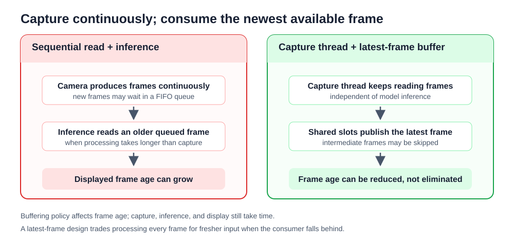

cv2.VideoCapture.read()는 V4L2 커널의 링 버퍼에서 준비된 프레임을 사용자 공간으로 가져온다. 링 버퍼는 정해진 개수의 칸을 돌려 쓰는 저장 공간이다. 카메라 센서가 초당 $\text{FPS}_{\text{cam}}$의 속도로 프레임을 만들 때 입력 주기 $T_{\text{cam}}$은 다음과 같이 정의된다.

$$T_{\text{cam}} = \frac{1}{\text{FPS}_{\text{cam}}}$$

예를 들어 30 FPS 카메라는 약 $33.3\text{ms}$마다 새 프레임을 만든다. 한 반복에서 프레임 읽기, 전처리, 신경망 추론, HUD 그리기까지 걸리는 시간을 $T_{\text{process}}$라고 하자. 카메라처럼 프레임을 만드는 쪽을 생산자(Producer), 프레임을 읽어 처리하는 쪽을 소비자(Consumer)라고 한다.

- **$T_{\text{process}} \le T_{\text{cam}}$인 경우**: 소비자가 생산자보다 늦지 않으므로 대기열에 프레임이 쌓이지 않는다. 각 반복은 비교적 최근 프레임을 처리한다.
</p>

- **$T_{\text{process}} > T_{\text{cam}}$인 경우**: 소비자가 생산자를 따라가지 못해 대기열에 프레임이 쌓인다. 대기열(Queue)은 처리할 데이터를 잠시 담아 두는 줄이며, 선입선출(FIFO)은 먼저 들어온 값을 먼저 꺼내는 방식이다. V4L2와 OpenCV 백엔드의 버퍼가 이런 방식으로 동작하면 소비자는 새 프레임보다 먼저 쌓인 오래된 프레임을 받는다.

소비자가 한 프레임을 처리하는 동안 버퍼에 남아 있는 미처리 프레임 수를 $N_{\text{buffer}}$라고 하자. 대기열 때문에 생기는 지연 시간 $D_{\text{queue}}$는 대략 다음과 같이 계산할 수 있다.

$$D_{\text{queue}} \approx N_{\text{buffer}} \times T_{\text{cam}}$$

30 FPS 카메라에서는 $T_{\text{cam}} \approx 33.3\text{ms}$이다. 버퍼에 4장이 쌓였다면 $D_{\text{queue}} \approx 4 \times 33.3\text{ms} \approx 133\text{ms}$이다. 여기에 현재 프레임의 처리 시간과 화면 표시 시간이 더해질 수 있다. 이 지연을 줄이려면 프레임 수집과 추론 처리를 서로 다른 스레드로 나누고, 처리가 늦을 때 오래된 중간 프레임을 버리고 최신 프레임을 선택하는 정책이 필요하다.

### 최신 프레임을 우선하는 비동기 카메라 설계

스레드는 한 프로그램 안에서 독립적으로 실행되는 작업 흐름이다. 프레임 수집을 맡은 캡처 스레드가 카메라를 계속 읽고, 추론과 화면 표시를 맡은 소비자 쪽이 최신 프레임만 가져가면 오래된 프레임을 차례로 처리하는 시간을 줄일 수 있다. 이 장의 실습 2-2에서는 HighPerformanceAsyncCamera가 이런 구조를 사용한다.

최신 프레임 우선 정책은 대기열의 모든 프레임을 처리하지 않는다. 새 프레임이 여러 장 들어온 동안 소비자가 바빴다면 중간 프레임은 건너뛰고 가장 최근에 공유된 프레임만 읽는다. 따라서 프레임 누락 수는 늘 수 있지만, 화면에 표시되는 장면의 나이는 작아진다.

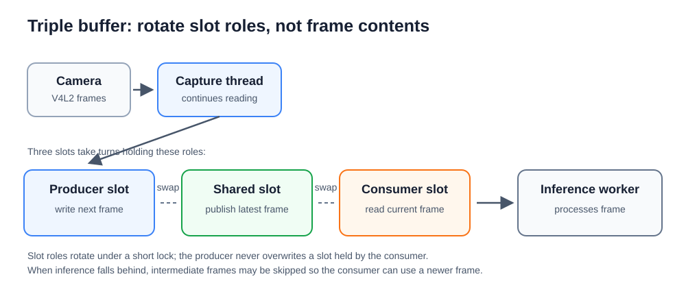

- **GIL(Global Interpreter Lock)과 OpenCV 호출**: 파이썬의 GIL은 한 인터프리터에서 여러 스레드가 동시에 파이썬 바이트코드를 실행하는 것을 제한한다. 다만 OpenCV의 cv2.VideoCapture.read() 같은 입출력 대기와 C++ 백엔드 호출은 보통 대기하는 동안 GIL을 해제하도록 구현되어 있어 다른 파이썬 스레드가 실행될 수 있다. 세부 동작은 OpenCV 빌드, 백엔드, 파이썬 버전에 따라 달라질 수 있으므로 실제 효과는 실습에서 측정한다.
</p>

- **세 슬롯 교환과 락 경합**: 락(Lock)은 동시에 여러 스레드가 같은 상태를 바꾸지 못하도록 잠그는 장치이다. 여러 스레드가 같은 락을 오래 기다리는 상황을 락 경합(Lock Contention)이라고 한다. 실습 2-2의 코드는 생산자 슬롯, 공유 슬롯, 소비자 슬롯 세 개의 역할을 정수 인덱스로 관리한다. cap.read()가 반환한 프레임 참조를 생산자 슬롯에 연결하고, 락 안에서는 큰 픽셀 데이터를 복사하지 않고 인덱스와 상태만 짧게 바꾼다. 소비자가 들고 있는 슬롯은 생산자 슬롯으로 바로 쓰이지 않도록 역할을 돌려 쓰므로, 소비 중인 프레임 참조를 덮어쓰지 않는다. 다만 cap.read()가 새 배열을 반환하므로 이 구조만으로 모든 배열 할당이 사라지는 것은 아니다.
</p>

- **조건 변수와 대기 방식**: 조건 변수(Condition)는 어떤 상태가 바뀔 때까지 스레드를 재워 두었다가 깨우는 동기화 도구이다. 생산자는 새 프레임을 준비한 뒤 notify()로 알리고, 소비자는 wait()로 기다린다. 새 프레임이 있는지 계속 반복해서 확인하는 바쁜 대기(Busy-Waiting)는 CPU를 불필요하게 쓴다. 조건 변수를 쓰면 새 프레임이 없을 때 소비자가 잠시 멈춰 CPU 사용량을 줄일 수 있다.
</p>

- **타임스탬프와 프레임 나이 측정**: 타임스탬프는 어떤 일이 일어난 시각을 숫자로 저장한 값이다. 실습 2-2의 캡처 스레드는 cap.read()가 반환된 직후 time.perf_counter() 값을 저장한다. 소비자는 현재 시각에서 이 값을 빼서 Read-to-Process Age를 계산한다. 이 값은 프로그램이 프레임을 받은 뒤 지난 시간이며, 센서가 실제로 노출을 시작한 시각부터의 전체 지연은 아니다.

### 카메라 프레임을 딥러닝 입력 텐서로 바꾸기

OpenCV가 읽은 카메라 프레임은 보통 BGR 순서의 uint8 배열이다. 딥러닝 모델은 입력 크기, 색상 순서, 값의 범위, 축의 순서가 정해져 있다. 따라서 한 프레임을 모델에 넣기 전에 크기와 패딩, 색상 순서, 정규화, 메모리 배치를 차례로 맞추어야 한다.

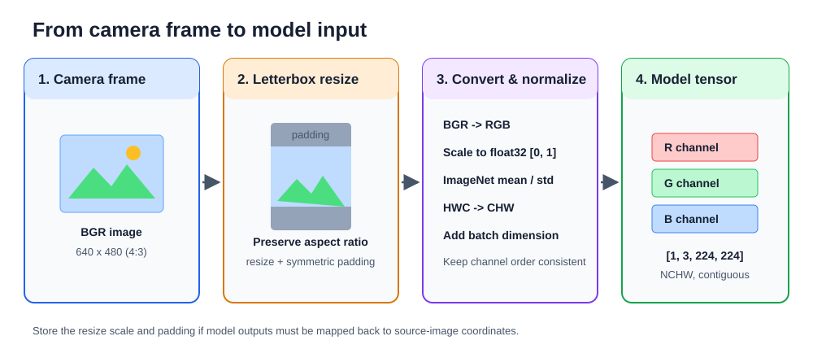

#### 종횡비를 지키는 레터박스 변환

종횡비는 영상의 가로와 세로 비율이다. 640×480 영상의 종횡비는 4:3이고, 224×224 입력의 종횡비는 1:1이다. 640×480 영상을 224×224로 단순히 늘이거나 줄이면 물체가 가로 또는 세로로 찌그러진다.

레터박스(Letterbox)는 원본 비율을 유지해 영상을 줄인 뒤, 남는 영역을 고정 색으로 채우는 방식이다. 이 장의 예제는 패딩 색으로 114 회색값을 쓴다. 114는 검은색 0과 흰색 255의 중간보다 약간 어두운 값이며, 여러 객체 검출 예제에서 배경 패딩으로 흔히 쓰인다. BGR 영상에서는 (114, 114, 114)처럼 세 채널에 같은 값을 넣으면 회색이 된다.

- **축소 배율 $r$ 계산**: 가로 방향 배율과 세로 방향 배율 중 더 작은 값을 전체 축소 배율로 고른다. 더 큰 값을 고르면 한쪽이 목표 크기를 넘어가기 때문이다.

  $$r = \min\left(\frac{w_{\text{dst}}}{w_{\text{src}}}, \; \frac{h_{\text{dst}}}{h_{\text{src}}}\right) = \min\left(\frac{224}{640}, \; \frac{224}{480}\right) = \min(0.35, \; 0.4667) = 0.35$$

- **축소된 영역과 패딩 계산**: 원본 640×480 영상에 $r=0.35$를 곱하면 224×168이 된다. 목표 높이 224에서 168을 빼면 56픽셀이 남으므로 위쪽과 아래쪽에 28픽셀씩 패딩을 둔다.

  $$w_{\text{unpad}} = \operatorname{round}(640 \times 0.35) = 224, \quad h_{\text{unpad}} = \operatorname{round}(480 \times 0.35) = 168$$
  $$dw = \frac{224 - 224}{2} = 0, \quad dh = \frac{224 - 168}{2} = 28$$

  따라서 원본 프레임을 224×168로 축소한 뒤, 위와 아래에 각각 28픽셀의 여백을 붙여 224×224 입력을 만든다.

#### 경계 상자 좌표를 원본 프레임으로 되돌리기

모델이 출력한 경계 상자 좌표 $(x_{\text{box}}, y_{\text{box}})$는 패딩이 포함된 224×224 입력 공간의 좌표이다. 이 좌표를 원본 640×480 프레임 위에 그리려면 패딩을 먼저 빼고, 축소 배율 $r$로 나누어야 한다.

$$x_{\text{raw}} = \frac{x_{\text{box}} - p_{\text{left}}}{r}, \quad y_{\text{raw}} = \frac{y_{\text{box}} - p_{\text{top}}}{r}$$

예를 들어 $r=0.35$, $p_{\text{left}}=0$, $p_{\text{top}}=28$이고 입력 좌표가 $(50, 60)$이면 원본 좌표는 $x_{\text{raw}}=(50-0)/0.35\approx143$, $y_{\text{raw}}=(60-28)/0.35\approx91$이다. $p_{\text{left}}$와 $p_{\text{top}}$은 각각 왼쪽과 위쪽 패딩 픽셀 수이다.

좌표를 되돌린 뒤에는 클리핑(Clipping)을 한다. 클리핑은 값이 허용 범위를 벗어나지 않도록 자르는 처리이다. 원본 영상의 x 좌표는 $[0, w_{\text{src}}-1]$, y 좌표는 $[0, h_{\text{src}}-1]$ 범위 안에 있어야 한다. 예를 들어 640×480 영상에서는 x를 0~639, y를 0~479 안으로 제한한다.

#### 색상 순서 변환과 평균·표준편차 정규화

OpenCV의 기본 픽셀 배열은 BGR 채널 순서와 0~255 범위의 uint8 정수 값을 쓴다. 많은 딥러닝 모델은 RGB 순서와 float32 실수 입력을 기대한다. 그래서 cv2.cvtColor()로 BGR을 RGB로 바꾸고, 255.0으로 나누어 값을 0.0~1.0 범위로 만든다.

정규화(Normalization)는 입력 값에서 평균을 빼고 표준편차로 나누어 값의 분포를 맞추는 처리이다. 평균은 기준 데이터에서 채널별 값이 대체로 어디에 있는지를 나타내고, 표준편차는 값이 그 평균 주변에서 얼마나 퍼져 있는지를 나타낸다.

$$x_{\text{norm}} = \frac{x_{\text{float}} - \mu}{\sigma}$$

$$\mu = [0.485, \; 0.456, \; 0.406], \quad \sigma = [0.229, \; 0.224, \; 0.225]$$

이 값들은 ImageNet 데이터셋으로 학습한 모델에서 널리 쓰는 RGB 채널별 평균과 표준편차이다. ImageNet은 많은 일반 물체 사진과 라벨을 모은 대규모 데이터셋이며, 사전 학습 가중치의 기준 입력 분포를 맞추기 위해 이 값을 쓴다. 모델이 다른 평균과 표준편차를 요구하면 그 모델의 명세를 따라야 한다.

#### HWC 배열을 NCHW 텐서로 바꾸기

OpenCV 배열은 높이-너비-채널(HWC) 순서이다. 예를 들어 224×224 BGR 영상의 형상은 (224, 224, 3)이다. 여기서 첫 번째 축은 높이, 두 번째 축은 너비, 세 번째 축은 색상 채널이다.

PyTorch와 ONNX Runtime에 넣는 이미지 모델은 흔히 배치-채널-높이-너비(NCHW) 순서를 요구한다. 배치 N은 한 번에 함께 처리하는 이미지 수이다. 이미지 한 장만 처리하면 N=1이므로 입력 형상은 (1, 3, 224, 224)가 된다. 채널 수 3은 RGB 또는 BGR 같은 색상 채널 세 개를 뜻한다.

NumPy의 transpose()는 축 순서를 바꾼 배열을 만든다. 그러나 대부분의 경우 픽셀 데이터를 새로 정렬해 복사하지 않고, 원본 메모리를 다른 순서로 읽는 스트라이드 뷰(Strided View)를 반환한다. 스트라이드는 한 축에서 다음 값으로 이동할 때 메모리 주소를 몇 바이트 건너뛰는지를 나타내는 정보이다. 이런 뷰는 논리적인 축 순서는 NCHW처럼 보이지만 메모리가 물리적으로 연속(contiguous)하지 않을 수 있다.

연속 메모리는 배열의 값이 런타임이 기대하는 순서대로 끊김 없이 놓인 상태이다. 불연속 배열을 C++ 추론 런타임에 넘기면 내부에서 다시 복사할 수 있어 추가 시간이 든다. 그래서 transpose() 뒤에는 np.ascontiguousarray()로 연속 배열을 만들거나, 실습 2-3처럼 미리 할당한 버퍼에 결과를 직접 채워 넣어 반복 할당과 복사를 줄인다.

> **알아두기 - HWC와 NCHW 메모리 배치 차이**
> - **HWC 배열**: 한 픽셀의 채널 값이 서로 가까이 놓인다. OpenCV가 읽은 원본 프레임에서는 한 픽셀의 B, G, R 값이 인접한 위치에 놓이고, BGR을 RGB로 바꾼 뒤에는 R, G, B 값이 인접한 위치에 놓인다. 화면 표시, JPEG 압축과 해제, 픽셀 단위 처리에서 다루기 쉬운 배치이다.
> </p>
>
> - **NCHW 텐서**: 배치 안에서 채널별 평면이 먼저 놓인다. RGB 입력이라면 한 이미지의 R 평면, G 평면, B 평면 순서로 높이×너비 값이 이어진다. 딥러닝 합성곱은 채널과 공간 축을 정해진 순서로 읽으므로, 모델이 요구하는 형상과 메모리 연속성을 맞추어야 불필요한 변환을 줄일 수 있다.

### 실습 2-1. 단일 스레드 카메라 루프에서 처리 지연과 버퍼 누적 관찰

> **풀고 싶은 문제**
> 단일 스레드 영상 루프에 처리 지연을 더하면 프레임 처리량과 화면 반응은 어떻게 달라지는가? 이 실습의 시간 측정값은 어느 구간을 나타내는가?

이 실습에서는 640×480 MJPG 카메라 루프에 0, 50, 100, 200ms의 인위적 대기 시간을 넣는다. 실제 신경망은 실행하지 않고, 추론처럼 시간이 걸리는 작업이 있다고 가정해 단일 스레드 루프의 변화를 관찰한다. 앞에서 설명한 프레임 지체와 대기열을 떠올리며, 프레임을 읽는 속도와 화면 반응이 어떻게 달라지는지 확인한다.

이 실습의 측정값은 프로그램 안에서 기록한 시각을 기준으로 계산한다. 버퍼에 실제로 몇 장이 쌓였는지, 센서가 언제 노출을 시작했는지, 화면에 그려진 프레임이 실제 장면보다 몇 ms 오래되었는지는 직접 측정하지 않는다. 오래된 프레임이 cap.read()에서 얼마나 반환되는지는 OpenCV 백엔드, V4L2 드라이버, 카메라 설정에 따라 달라질 수 있다.

#### 사전 학습 1단계: 프레임 읽기와 처리 대기 구분

VideoCapture.read()는 프레임을 읽을 때까지 기다릴 수 있고, time.sleep()은 같은 스레드의 다음 작업을 일정 시간 늦춘다. 두 작업의 앞뒤 시각을 재면 카메라에서 프레임을 받는 데 걸린 시간과 인위적으로 넣은 대기 시간이 함께 포함된다.

```python
# step1_read_and_delay.py
import cv2
import time

cap = cv2.VideoCapture(0)
if not cap.isOpened():
    raise RuntimeError("카메라를 열 수 없습니다.")

try:
    started = time.perf_counter()
    success, frame = cap.read()
    if success:
        time.sleep(0.05)  # 실제 추론 대신 50ms 대기
        elapsed_ms = (time.perf_counter() - started) * 1000
        print(f"프레임 읽기와 추가 대기: {elapsed_ms:.1f}ms")
finally:
    cap.release()
```

이 코드는 카메라를 열고 프레임 한 장을 읽은 뒤, time.sleep(0.05)로 0.05초, 즉 50ms를 기다린다. time 모듈의 perf_counter()는 짧은 실행 시간을 재는 데 쓰기 좋은 고해상도 시계를 돌려준다. started에 시작 시각을 저장하고, 나중에 다시 perf_counter()를 호출해 두 시각의 차이를 구한다. 초 단위 차이에 1000을 곱하면 ms 단위 시간이 된다.

success, frame = cap.read()는 반환값 두 개를 각각 success와 frame에 나누어 담는다. success가 참이면 프레임을 읽은 것이고, frame에는 OpenCV 배열이 들어 있다. raise RuntimeError(...)는 더 진행할 수 없는 오류를 직접 발생시킨다. try-finally 구조는 중간에 오류가 나더라도 finally 블록의 cap.release()를 실행해 카메라 장치를 닫게 한다.

#### 사전 학습 2단계: 일정 구간의 처리 FPS 계산

한 프레임의 시간 대신 일정 구간에서 처리한 프레임 수를 세면 FPS를 구할 수 있다. 측정 구간이 끝나면 카운터와 기준 시각을 다시 설정해 다음 구간을 측정한다.

```python
# step2_count_frames.py
import time

frame_count = 0
fps = 0.0
window_started = time.perf_counter()

for _ in range(100):  # 여기에 프레임 처리 코드를 둔다.
    frame_count += 1
    now = time.perf_counter()
    if now - window_started >= 1.0:
        fps = frame_count / (now - window_started)
        print(f"처리 FPS: {fps:.1f}")
        frame_count = 0
        window_started = now
```

frame_count는 측정 구간 안에서 처리한 프레임 수를 저장하는 카운터이다. for _ in range(100):은 같은 코드를 최대 100번 반복한다. 반복 변수 이름을 _로 쓴 것은 그 값 자체를 사용하지 않는다는 관례이다.

now - window_started >= 1.0 조건은 측정 창이 1초 이상 지났는지 검사한다. 이 조건이 참이면 프레임 수를 실제 경과 시간으로 나누어 처리 FPS를 계산한다. 출력 뒤에는 frame_count를 0으로 되돌리고 window_started를 현재 시각으로 바꾸어 다음 1초 구간을 새로 측정한다.

#### 최종 구현

최종 프로그램은 카메라 설정, 프레임 읽기, 인위적 대기, 화면 표시, 키 입력에 따른 대기 시간 변경을 하나의 반복문에서 처리한다. 단일 스레드 구조이므로 대기 시간 동안에는 새 프레임을 읽지 못한다.

```python
# buffer_latency_benchmark.py
import cv2
import time

def main():
    cap = cv2.VideoCapture(0, cv2.CAP_V4L2)
    cap.set(cv2.CAP_PROP_FOURCC, cv2.VideoWriter_fourcc(*'MJPG'))
    cap.set(cv2.CAP_PROP_FRAME_WIDTH, 640)
    cap.set(cv2.CAP_PROP_FRAME_HEIGHT, 480)

    if not cap.isOpened():
        print("오류: 카메라를 열 수 없습니다.")
        return

    print("=" * 65)
    print("      단일 스레드 OpenCV 카메라 버퍼 지연 누적 정량 벤치마크")
    print("=" * 65)
    print("키 조작: [1] 지연 없음 | [2] 50ms 지연 | [3] 100ms 지연 | [4] 200ms 지연 | [Q] 종료")

    simulated_delay = 0.0  # 초 단위 인위적 지연
    frame_count = 0
    fps = 0.0
    fps_timer = time.perf_counter()
    start_time = fps_timer

    try:
        while True:
            cycle_start = time.perf_counter()

            # 프레임 읽기 (동기식 대기 호출)
            success, frame = cap.read()
            if not success:
                print("프레임 수신 실패")
                break

            frame_count += 1
            current_time = time.perf_counter()
            elapsed_time = current_time - start_time

            # 인위적인 딥러닝 추론 지연 시간 주입
            if simulated_delay > 0:
                time.sleep(simulated_delay)

            read_delay_ms = (time.perf_counter() - cycle_start) * 1000.0

            if time.perf_counter() - fps_timer >= 1.0:
                fps = frame_count / (time.perf_counter() - fps_timer)
                frame_count = 0
                fps_timer = time.perf_counter()

            # 화면 렌더링
            cv2.rectangle(frame, (10, 10), (380, 150), (20, 20, 30), -1)
            cv2.rectangle(frame, (10, 10), (380, 150), (0, 0, 255) if simulated_delay > 0 else (0, 255, 0), 2)

            cv2.putText(frame, "SINGLE THREAD BUFFER MONITOR", (20, 35),
                        cv2.FONT_HERSHEY_SIMPLEX, 0.55, (255, 255, 255), 1)
            cv2.putText(frame, f"Injected Delay  : {simulated_delay * 1000.0:4.1f} ms", (20, 65),
                        cv2.FONT_HERSHEY_SIMPLEX, 0.5, (0, 255, 255), 1)
            cv2.putText(frame, f"Read + Delay    : {read_delay_ms:4.1f} ms", (20, 90),
                        cv2.FONT_HERSHEY_SIMPLEX, 0.5, (0, 255, 255), 1)
            cv2.putText(frame, f"Processing FPS  : {fps:4.1f} FPS", (20, 115),
                        cv2.FONT_HERSHEY_SIMPLEX, 0.5, (0, 255, 0) if fps >= 20 else (0, 0, 255), 1)
            cv2.putText(frame, f"Elapsed Time    : {elapsed_time:4.1f} s", (20, 140),
                        cv2.FONT_HERSHEY_SIMPLEX, 0.45, (200, 200, 200), 1)

            cv2.imshow("Buffer Latency Benchmark", frame)

            key = cv2.waitKey(1) & 0xFF
            if key == ord('q'):
                break
            elif key == ord('1'):
                simulated_delay = 0.0
                print("지연 설정: 0ms (지연 없음)")
            elif key == ord('2'):
                simulated_delay = 0.05
                print("추가 대기 시간: 50ms")
            elif key == ord('3'):
                simulated_delay = 0.10
                print("추가 대기 시간: 100ms")
            elif key == ord('4'):
                simulated_delay = 0.20
                print("추가 대기 시간: 200ms")

    finally:
        cap.release()
        cv2.destroyAllWindows()

if __name__ == "__main__":
    main()
```

**코드 해설**

이 프로그램은 main() 하나가 전체 흐름을 맡는다. 먼저 cv2.VideoCapture(0, cv2.CAP_V4L2)로 0번 카메라를 V4L2 백엔드로 열고, cap.set()으로 픽셀 형식과 프레임 크기를 요청한다. 그 뒤 while True 반복문에서 cap.read(), 인위적 대기, FPS 계산, HUD 그리기, 키 입력 처리를 차례로 실행한다. 파일 끝의 if __name__ == "__main__": 구조는 앞 장에서 본 것처럼 이 파일을 직접 실행할 때만 main()을 호출한다.

cap.set()은 카메라 장치나 OpenCV 백엔드에 설정 값을 요청하는 함수이다. cv2.CAP_PROP_FOURCC는 픽셀 형식, cv2.CAP_PROP_FRAME_WIDTH와 cv2.CAP_PROP_FRAME_HEIGHT는 프레임 크기를 뜻한다. cv2.VideoWriter_fourcc(*'MJPG')의 *는 문자열 'MJPG'의 네 글자를 함수 인자로 하나씩 풀어 넣는다. 이런 요청은 드라이버가 지원하는 범위 안에서만 적용되므로, 실제 적용 값은 장치와 백엔드에 따라 달라질 수 있다.

simulated_delay는 실제 추론 시간 대신 넣는 추가 대기 시간을 초 단위로 저장한다. 숫자 키 1~4를 누르면 이 값이 0, 0.05, 0.10, 0.20으로 바뀌고 다음 반복부터 적용된다. cv2.waitKey(1) & 0xFF는 화면 표시 이벤트를 갱신하면서 키 입력을 읽고, ord('1')처럼 문자 하나를 숫자 키 코드로 바꾸어 비교한다. 이 방식으로 프로그램을 다시 시작하지 않고 처리 지연 조건을 바꿀 수 있다.

read_delay_ms는 cycle_start부터 time.sleep()이 끝난 직후까지의 경과 시간이다. 따라서 cap.read()에서 프레임을 기다린 시간, 반복문 안의 작은 파이썬 처리 시간, 인위적으로 넣은 대기 시간을 포함한다. 그러나 HUD를 그리는 시간, cv2.imshow()와 cv2.waitKey() 시간, 센서 노출부터 커널 버퍼에 들어오기까지의 시간은 이 값에 직접 포함되지 않는다. 특히 cap.read()가 이미 오래된 프레임을 반환했는지는 이 값만으로 알 수 없다.

Processing FPS는 read()에 성공한 반복 횟수를 약 1초 길이의 측정 창으로 나눈 값이다. 한 창 안에는 이전 반복들의 화면 표시와 키 입력 처리 시간이 함께 들어가므로, 순수 cap.read() 속도나 카메라 센서의 실제 FPS가 아니다. 이 값은 단일 스레드 루프가 프레임을 얼마나 자주 처리했는지 보여 주는 참고 지표이다.

화면에 그리는 사각형과 글자는 1장에서 다룬 HUD와 같은 역할을 한다. 지연이 없을 때는 테두리를 초록색으로, 지연이 있을 때는 빨간색으로 그려 현재 조건을 구분한다. finally 블록은 반복문이 정상 종료되거나 중간에 빠져나오더라도 cap.release()와 cv2.destroyAllWindows()를 실행해 카메라와 창 자원을 정리한다.

> **알아두기 - 측정값의 범위**
> Read + Delay는 cap.read()와 추가 대기를 포함한 애플리케이션 반복 구간의 측정값이다. 커널 버퍼 안에서 프레임이 기다린 시간, 센서의 프레임 생성 시각, 화면 표시 시각은 기록하지 않는다. 그러므로 이 값만으로 전체 영상 지연이나 프레임 나이를 계산할 수는 없다.

**실행 결과와 확인할 점**

buffer_latency_benchmark.py를 실행한다.

```sh
python buffer_latency_benchmark.py
```

각 키로 대기 시간을 바꾸며 다음 항목을 확인한다.

- 1, 2, 3, 4 키를 눌렀을 때 Injected Delay 값이 0, 50, 100, 200ms로 바뀌는지 확인한다.
- 대기 시간이 늘어날수록 Processing FPS가 낮아지는지 확인한다.
- 카메라 앞 장면을 빠르게 바꾸었을 때 화면 반응이 늦어지는지 확인한다.
- Read + Delay 값이 인위적 대기 시간보다 작지 않고, cap.read() 대기와 반복문 오버헤드 때문에 조금 더 커질 수 있음을 확인한다.

결과는 카메라, 드라이버, OpenCV 백엔드, 실습 장비의 부하에 따라 달라질 수 있다. 특정 FPS를 정답으로 삼지 않고, 대기 시간이 늘 때 반복 처리 속도와 화면 반응이 어떻게 달라지는지 비교한다.

> **한 걸음 더**
> 1. cap.set(cv2.CAP_PROP_BUFFERSIZE, 1)을 추가하고 대기 시간을 고정해 실행 전후의 화면 반응을 비교한다. cv2.CAP_PROP_BUFFERSIZE는 OpenCV가 카메라 버퍼 개수를 요청할 때 쓰는 속성이다. 이 요청은 드라이버에 따라 무시되거나 다른 방식으로 적용될 수 있으므로, 적용 여부와 관찰 결과를 함께 기록한다.
> 2. 100ms 대기 중 카메라 앞 장면을 바꾸고 화면 반응을 관찰한다. 이 관찰은 지연의 존재를 보여 주지만, 센서 시각을 기록하지 않으므로 대기 프레임 수를 정확히 계산하는 근거는 아님을 설명한다.

### 실습 2-2. 최신 프레임 우선 비동기 카메라 클래스 구현

> **풀고 싶은 문제**
> 캡처 스레드가 프레임을 갱신하는 동안 처리 스레드가 현재 프레임을 안전하게 사용하는 방법은 무엇인가? 세 슬롯 구조와 조건 변수는 어떤 역할을 하는가?

이 실습에서는 HighPerformanceAsyncCamera 클래스를 만들고, 카메라 캡처 작업과 화면 처리 작업을 서로 다른 스레드로 분리한다. 목표는 모든 프레임을 순서대로 처리하는 것이 아니라, 처리 쪽이 늦어질 때 오래된 중간 프레임을 건너뛰고 가장 최근 프레임을 받는 것이다.

사전 학습 단계에서는 조건 변수로 새 프레임을 기다리는 방법, 세 슬롯의 인덱스를 바꾸는 방법, 스레드를 안전하게 종료하는 방법을 차례로 확인한다. 최종 구현에서는 이 세 가지를 하나의 카메라 클래스로 묶는다. HighPerformanceAsyncCamera는 생산자 슬롯, 공유 슬롯, 소비자 슬롯의 역할을 정수 인덱스로 관리하고, 새 프레임이 없을 때는 조건 변수로 소비자를 잠시 멈춘다. 슬롯 인덱스를 교환하므로 락 안에서 프레임 데이터를 복사하지 않지만, cap.read()가 반환한 배열 참조를 생산자 슬롯에 연결하므로 배열 할당 자체가 모두 없어지는 구조는 아니다.

#### 사전 학습 1단계: 조건 변수로 새 프레임 기다리기

생산자는 새 프레임을 저장한 뒤 notify()로 소비자에게 알리고, 소비자는 프레임이 준비될 때까지 wait()로 기다린다. 조건을 while로 검사하면 알림이 왔더라도 새 프레임이 준비되지 않은 경우를 다시 확인할 수 있다.

```python
# step1_condition_handoff.py
import threading
import time

condition = threading.Condition()
latest_frame = None

def publish(frame):
    global latest_frame
    with condition:
        latest_frame = frame
        condition.notify()

def read_latest(timeout=0.1):
    global latest_frame
    with condition:
        while latest_frame is None:
            if not condition.wait(timeout=timeout):
                return None
        frame = latest_frame
        latest_frame = None
        return frame

received = []
consumer = threading.Thread(target=lambda: received.append(read_latest()))
consumer.start()
time.sleep(0.05)  # 소비자가 조건변수에서 기다리도록 잠시 둔다.
publish("예제 프레임")
consumer.join(timeout=1.0)
print("소비자가 받은 값:", received[0] if received else None)
```

threading.Condition()은 락과 대기 신호를 함께 다루는 동기화 도구이다. 앞 절에서 살펴본 것처럼 락은 두 스레드가 같은 변수를 동시에 바꾸지 못하게 하고, 조건 변수는 기다리던 스레드를 필요한 시점에 깨우는 역할을 한다. with condition:은 조건 변수에 연결된 락을 얻은 뒤 블록을 실행하고, 블록이 끝나면 락을 놓는다.

latest_frame = None은 아직 프레임이 없음을 나타낸다. None과 비교할 때는 ==보다 is None을 쓴다. publish()는 global latest_frame으로 함수 밖 변수 latest_frame을 바꾸겠다고 알린 뒤 프레임을 저장하고 notify()로 대기 중인 소비자 하나를 깨운다.

read_latest()의 timeout=0.1은 호출할 때 값을 생략하면 0.1초를 기본 대기 시간으로 쓰는 키워드 인자 기본값이다. condition.wait(timeout=timeout)은 알림이 오거나 제한 시간이 끝날 때까지 락을 놓고 기다렸다가 다시 락을 얻고 돌아온다. 알림 없이 시간이 끝나면 False가 되므로 이 예제는 None을 반환한다.

threading.Thread(target=...)는 새 스레드가 실행할 함수를 지정한다. 여기서는 lambda: received.append(read_latest())처럼 이름 없는 작은 함수를 target으로 전달해 read_latest()의 반환값을 리스트에 저장한다. start()는 스레드를 시작하고, join(timeout=1.0)은 최대 1초 동안 스레드 종료를 기다린다. 이 예제에서 소비자는 wait()로 잠들어 있다가 publish()의 notify()를 받은 뒤 "예제 프레임"을 읽는다.

#### 사전 학습 2단계: 슬롯 인덱스를 교환하고 건너뛴 프레임 세기

세 슬롯을 생산자/공유/소비자 역할로 나누면 소비 중인 프레임을 락 안에서 복사하지 않고 참조의 역할을 바꿀 수 있다. 프레임 번호 차이로 중간에 소비하지 못한 입력 수도 셀 수 있다.

```python
# step2_swap_slots.py
slots = ["초기 프레임", "초기 프레임", "초기 프레임"]
producer_idx, shared_idx, consumer_idx = 0, 1, 2

slots[producer_idx] = "새 프레임"
producer_idx, shared_idx = shared_idx, producer_idx
consumer_idx, shared_idx = shared_idx, consumer_idx
print("소비할 최신 프레임:", slots[consumer_idx])

latest_frame_id = 8
last_consumed_frame_id = 5
skipped = max(0, latest_frame_id - last_consumed_frame_id - 1)
print("건너뛴 프레임:", skipped)
```

slots 리스트는 세 프레임 참조를 담는 공간이다. producer_idx, shared_idx, consumer_idx는 각각 생산자가 쓸 슬롯, 가장 최근 프레임을 담은 공유 슬롯, 소비자가 읽을 슬롯의 번호이다. producer_idx, shared_idx = shared_idx, producer_idx는 두 변수의 값을 한 줄에서 맞바꾸는 튜플 대입이다.

생산자가 새 프레임을 생산자 슬롯에 넣고 producer_idx와 shared_idx를 맞바꾸면, 공유 슬롯이 최신 프레임을 가리키게 된다. 소비자는 consumer_idx와 shared_idx를 맞바꾸어 최신 프레임을 자기 슬롯으로 가져온다. 이때 프레임 배열 전체를 복사하는 것이 아니라 어떤 슬롯을 어떤 역할로 볼지만 바꾼다.

latest_frame_id와 last_consumed_frame_id의 차이를 이용하면 소비자가 건너뛴 프레임 수를 계산할 수 있다. 예를 들어 마지막으로 소비한 번호가 5이고 최신 번호가 8이면, 6번과 7번 두 장을 소비하지 못했으므로 8 - 5 - 1 = 2가 된다. max(0, ...)은 계산 결과가 음수가 되지 않게 한다.

#### 사전 학습 3단계: 종료 신호를 보내고 캡처 스레드 기다리기

스레드를 시작하면 캡처 작업을 메인 화면 처리와 동시에 진행할 수 있다. Event로 종료 신호를 전달하고 join()을 호출해 작업이 끝난 뒤 카메라를 해제한다.

```python
# step3_stop_capture_thread.py
import threading
import time

stop_event = threading.Event()

def capture_worker():
    while not stop_event.is_set():
        stop_event.wait(0.01)  # 실제 코드에서는 이 지점에서 프레임을 읽는다.

worker = threading.Thread(target=capture_worker)
worker.start()
stop_event.set()
worker.join(timeout=1.0)
print("캡처 스레드 종료 여부:", not worker.is_alive())
```

threading.Event()는 스레드 사이에서 켜짐과 꺼짐 상태를 공유하는 신호이다. stop_event.is_set()은 신호가 켜졌는지 확인하고, stop_event.set()은 신호를 켠다. capture_worker()의 반복문은 신호가 켜지기 전까지 계속 실행된다.

stop_event.wait(0.01)은 0.01초 동안 정지 신호를 기다린다. 이 예제에서는 실제 카메라 대신 짧은 대기로 작업 시간을 흉내 낸다. worker = threading.Thread(target=capture_worker)는 capture_worker 함수를 실행할 스레드 객체를 만들고, start()가 실제 실행을 시작한다.

join(timeout=1.0)은 스레드가 끝날 때까지 기다리되, 지정한 시간이 지나면 호출한 쪽으로 돌아온다. is_alive()는 스레드가 아직 실행 중인지 알려 주며, not worker.is_alive()는 종료되었는지 확인하는 조건이다. 최종 구현에서는 카메라 해제 전에 이 절차로 백그라운드 캡처 스레드가 끝나기를 기다린다.

#### 최종 구현

다음 async_camera_engine.py는 카메라를 여는 코드, 백그라운드 캡처 스레드, 최신 프레임 읽기 함수, 통계 조회 함수와 자원 해제 함수를 HighPerformanceAsyncCamera 클래스 안에 묶는다. main()은 이 클래스를 사용해 화면 표시와 인위적 처리 지연을 실행하고, 지연이 커질 때 소비 FPS와 건너뛴 프레임 수가 어떻게 바뀌는지 보여 준다.

```python
# async_camera_engine.py
import cv2
import threading
import time

class HighPerformanceAsyncCamera:
    """
    - 삼중 버퍼 슬롯 교환으로 단일 소비 중 프레임 덮어쓰기 방지
    - 프레임 데이터 복사 없이 인덱스와 상태를 락으로 동기화
    - V4L2 캡처 버퍼 크기를 1로 요청 (백엔드 지원 여부에 따름)
    """
    def __init__(self, src=0, width=640, height=480, codec='MJPG'):
        self.width = width
        self.height = height

        # V4L2 백엔드 명시
        self.cap = cv2.VideoCapture(src, cv2.CAP_V4L2)
        if not self.cap.isOpened():
            raise RuntimeError(f"카메라 장치(/dev/video{src})를 열 수 없습니다.")

        # 카메라 하드웨어 매개변수 설정
        self.cap.set(cv2.CAP_PROP_FOURCC, cv2.VideoWriter_fourcc(*codec))
        self.cap.set(cv2.CAP_PROP_FRAME_WIDTH, self.width)
        self.cap.set(cv2.CAP_PROP_FRAME_HEIGHT, self.height)
        self.cap.set(cv2.CAP_PROP_BUFFERSIZE, 1)

        # 초기 프레임 확인
        ret, init_frame = self.cap.read()
        if not ret or init_frame is None:
            self.cap.release()
            raise RuntimeError("카메라에서 첫 프레임을 읽어오지 못했습니다.")

        self.running = True
        self.lock = threading.Lock()
        self.condition = threading.Condition(self.lock)

        # 생산자, 공유, 소비자 역할을 위한 세 슬롯 구성
        # 0: Producer Write Buffer, 1: Shared Latest Buffer, 2: Consumer Read Buffer
        self.pool = [init_frame.copy(), init_frame.copy(), init_frame.copy()]
        self.producer_idx = 0
        self.shared_idx = 1
        self.consumer_idx = 2

        self.new_frame_ready = False
        self.frame_id = 0
        self.last_consumed_frame_id = 0
        self.latest_timestamp = 0.0

        # 통계 지표
        self.produced_frames = 0
        self.consumed_frames = 0
        self.dropped_frames = 0
        self.capture_fps = 0.0

        # 백그라운드 캡처 스레드 가동
        self.thread = threading.Thread(target=self._capture_worker, daemon=True)
        self.thread.start()

    def _capture_worker(self):
        fps_count = 0
        fps_timer = time.perf_counter()

        while self.running:
            # 카메라에서 프레임을 읽어 반환받는다.
            ret, frame = self.cap.read()
            capture_time = time.perf_counter()

            if not ret or frame is None:
                time.sleep(0.002)
                continue

            # 반환된 프레임 참조를 생산자 슬롯에 연결
            self.pool[self.producer_idx] = frame

            # 임계 구역에서는 프레임 데이터를 복사하지 않고 슬롯과 상태를 갱신
            with self.condition:
                # 생산자 슬롯과 공유 슬롯의 인덱스를 맞바꾼다.
                self.producer_idx, self.shared_idx = self.shared_idx, self.producer_idx
                self.frame_id += 1
                self.produced_frames += 1
                self.latest_timestamp = capture_time
                self.new_frame_ready = True

                # 대기 중인 소비자에게 새 프레임 도착을 알림
                self.condition.notify()

            # FPS 계측
            fps_count += 1
            now = time.perf_counter()
            if now - fps_timer >= 1.0:
                with self.lock:
                    self.capture_fps = fps_count / (now - fps_timer)
                fps_count = 0
                fps_timer = now

    def read_latest(self, block=True, timeout=None):
        """
        소비자가 최신 프레임 참조와 호스트 캡처 시각을 획득하는 함수.
        프레임 참조는 다음 read_latest 호출 전까지 사용하고, 그 이후까지 보관하려면 복사한다.
        
        Returns:
            (success: bool, frame: np.ndarray, timestamp: float)
        """
        with self.condition:
            if block and not self.new_frame_ready:
                if not self.condition.wait(timeout=timeout):
                    return False, None, 0.0

            if not self.new_frame_ready:
                return False, None, 0.0

            # 소비자 슬롯과 공유 슬롯을 교환해 최신 프레임 참조를 획득
            self.consumer_idx, self.shared_idx = self.shared_idx, self.consumer_idx

            # 건너뛴 프레임 통계 계산
            skipped = self.frame_id - self.last_consumed_frame_id - 1
            if skipped > 0:
                self.dropped_frames += skipped
            self.last_consumed_frame_id = self.frame_id
            self.consumed_frames += 1
            self.new_frame_ready = False

            ts = self.latest_timestamp
            current_frame = self.pool[self.consumer_idx]

        return True, current_frame, ts

    def get_stats(self):
        with self.lock:
            return {
                "capture_fps": self.capture_fps,
                "latest_frame_id": self.frame_id,
                "consumed_frame_id": self.last_consumed_frame_id,
                "produced": self.produced_frames,
                "consumed": self.consumed_frames,
                "dropped": self.dropped_frames
            }

    def release(self):
        with self.condition:
            self.running = False
            self.condition.notify_all()
            
        if self.thread.is_alive():
            self.thread.join(timeout=1.0)
            
        if self.cap.isOpened():
            self.cap.release()

def main():
    cam = HighPerformanceAsyncCamera(width=640, height=480)
    
    print("=" * 70)
    print("      삼중 버퍼링(Triple-Buffered) 비동기 카메라 엔진 벤치마크")
    print("=" * 70)
    print("  [1] 지연 0ms (실시간 캡처 추종)")
    print("  [2] 지연 50ms (경량 객체 검출 모델 부하)")
    print("  [3] 지연 100ms (일반 딥러닝 추론 부하)")
    print("  [4] 지연 200ms (고부하 연산 시 버퍼 드롭 및 레이턴시 방어 테스트)")
    print("  [Q] 테스트 종료\n")

    simulated_delay = 0.05  # 기본 50ms 지연 설정
    process_fps_count = 0
    process_fps = 0.0
    fps_timer = time.perf_counter()

    # 지연 시간 이동 평균 계산용
    avg_latency_ms = 0.0
    alpha = 0.1  # 지수 이동 평균 계수

    try:
        while True:
            # 최신 프레임 핸드셰이크 (소비자 전용 버퍼 획득)
            loop_start = time.perf_counter()
            success, frame_ref, cap_ts = cam.read_latest(block=True, timeout=0.1)
            if not success or frame_ref is None:
                continue

            # [가상 딥러닝 추론 부하 시뮬레이션]
            # frame_ref의 원본 참조를 쥔 상태에서 지연이 발생해야
            # 생산자가 버퍼를 침범하지 않는지(Triple Buffer 안전성)를 테스트할 수 있음
            if simulated_delay > 0:
                time.sleep(simulated_delay)

            # read() 반환 직후의 호스트 시각부터 현재까지 경과한 시간 측정
            now = time.perf_counter()
            current_latency_ms = (now - cap_ts) * 1000.0
            avg_latency_ms = (alpha * current_latency_ms) + ((1.0 - alpha) * avg_latency_ms)

            # 소비자 FPS 측정
            process_fps_count += 1
            if now - fps_timer >= 1.0:
                process_fps = process_fps_count / (now - fps_timer)
                process_fps_count = 0
                fps_timer = now

            stats = cam.get_stats()

            # [시각화 HUD 그리기]
            # 삼중 버퍼 내부 데이터 오염을 막기 위해 화면 표시용 프레임에 그린다.
            display_frame = frame_ref.copy()

            # HUD 패널 배경
            cv2.rectangle(display_frame, (10, 10), (450, 185), (20, 25, 20), -1)
            cv2.rectangle(display_frame, (10, 10), (450, 185), (0, 255, 128), 2)

            # 상태 텍스트 출력
            cv2.putText(display_frame, "ENGINE: TRIPLE-BUFFERED LATEST-FRAME", (20, 35),
                        cv2.FONT_HERSHEY_SIMPLEX, 0.55, (0, 255, 255), 1)
            
            # 카메라 하드웨어 FPS와 소비자 FPS
            cv2.putText(display_frame, f"Camera HW Capture Rate : {stats['capture_fps']:5.1f} FPS", (20, 65),
                        cv2.FONT_HERSHEY_SIMPLEX, 0.45, (255, 255, 255), 1)
            cv2.putText(display_frame, f"Consumer Processing FPS: {process_fps:5.1f} FPS", (20, 90),
                        cv2.FONT_HERSHEY_SIMPLEX, 0.45, (0, 255, 0), 1)

            # 지연 시간 지표
            latency_color = (0, 255, 0) if avg_latency_ms < 60 else ((0, 165, 255) if avg_latency_ms < 150 else (0, 0, 255))
            cv2.putText(display_frame, f"Read-to-Process Age    : {avg_latency_ms:5.1f} ms", (20, 115),
                        cv2.FONT_HERSHEY_SIMPLEX, 0.45, latency_color, 1)

            # 주입된 인위적 지연값
            cv2.putText(display_frame, f"Simulated AI Delay     : {simulated_delay * 1000.0:5.1f} ms", (20, 140),
                        cv2.FONT_HERSHEY_SIMPLEX, 0.45, (200, 200, 200), 1)

            # 건너뛴 오래된 프레임 수
            cv2.putText(display_frame, f"Auto-Purged Old Frames : {stats['dropped']} Frames", (20, 165),
                        cv2.FONT_HERSHEY_SIMPLEX, 0.45, (160, 160, 255), 1)

            cv2.imshow("High-Performance Async Camera Test", display_frame)

            # 키보드 입력 처리
            key = cv2.waitKey(1) & 0xFF
            if key == ord('q'):
                break
            elif key == ord('1'):
                simulated_delay = 0.0
            elif key == ord('2'):
                simulated_delay = 0.05
            elif key == ord('3'):
                simulated_delay = 0.10
            elif key == ord('4'):
                simulated_delay = 0.20

    finally:
        cam.release()
        cv2.destroyAllWindows()

if __name__ == "__main__":
    main()
```

**코드 해설**

이 프로그램은 HighPerformanceAsyncCamera 클래스와 main() 함수로 이루어진다. main()이 클래스 객체를 만들면 __init__()이 카메라를 열고 첫 프레임으로 세 슬롯을 준비한 뒤 백그라운드 캡처 스레드를 시작한다. 이후 캡처 스레드는 _capture_worker()에서 프레임을 계속 읽고, 메인 스레드는 read_latest()로 최신 프레임을 받아 인위적 지연과 화면 표시를 실행한다. 종료 시에는 finally 블록에서 release()를 호출해 스레드, 카메라와 OpenCV 창을 정리한다.

class HighPerformanceAsyncCamera:는 카메라와 동기화 상태를 하나로 묶는 클래스 정의이다. 클래스 안에 정의된 함수는 메서드라고 하며, 첫 번째 매개변수 self는 현재 객체 자신을 가리킨다. __init__()은 객체를 만들 때 자동으로 실행되는 초기화 메서드이다. self.width, self.cap, self.pool처럼 self.이 붙은 이름은 객체가 계속 보관하는 인스턴스 속성이다.

__init__()은 cv2.VideoCapture(src, cv2.CAP_V4L2)로 카메라를 열고, FourCC, 너비, 높이와 버퍼 크기를 요청한다. codec='MJPG'처럼 함수 정의에 값을 적으면 호출자가 codec을 생략했을 때 그 값이 기본값으로 쓰인다. 첫 프레임을 읽지 못하면 cap.release()로 자원을 해제하고 RuntimeError를 발생시킨다. 그 뒤 threading.Lock(), threading.Condition(self.lock), 세 슬롯 목록, 프레임 번호와 통계 값을 준비한다.

threading.Thread(target=self._capture_worker, daemon=True)는 _capture_worker 메서드를 실행할 스레드를 만든다. daemon=True는 메인 프로그램이 끝날 때 이 스레드가 프로그램 종료를 막지 않는다는 뜻이다. 그러나 데몬 스레드에만 의존하면 자원 정리 시점이 불분명하므로, 이 코드는 release()에서 running을 False로 바꾸고 join()으로 종료를 기다린다.

_capture_worker()는 cap.read()로 프레임을 읽고, read()가 끝난 직후 time.perf_counter()로 프로그램 기준 시각을 기록한다. 프레임 읽기에 실패하면 0.002초 쉬고 다음 반복으로 넘어간다. 성공하면 반환된 frame 참조를 생산자 슬롯에 연결한 뒤 with self.condition: 블록 안에서 생산자 슬롯과 공유 슬롯의 인덱스를 맞바꾼다. 이 짧은 임계 구역에서 프레임 번호, 생산 프레임 수, 타임스탬프와 새 프레임 준비 상태를 갱신하고 notify()로 소비자에게 알린다.

read_latest(block=True, timeout=None)는 최신 프레임을 가져오는 소비자 쪽 메서드이다. block=True이면 새 프레임이 없을 때 condition.wait(timeout=timeout)으로 기다리고, block=False이면 기다리지 않고 바로 실패를 반환할 수 있다. 반환값은 success, frame, timestamp 세 값의 튜플이다. success가 False이거나 frame이 None이면 호출한 쪽은 그 프레임을 사용하지 않아야 한다.

새 프레임이 준비되면 read_latest()는 소비자 슬롯과 공유 슬롯을 맞바꾸고, 현재 frame_id와 last_consumed_frame_id의 차이로 건너뛴 프레임 수를 계산한다. 반환된 frame_ref는 NumPy 배열 객체에 대한 참조이다. 다음 read_latest() 호출 이후에는 슬롯 역할이 바뀌어 같은 참조를 계속 안전하게 보관한다고 단정할 수 없으므로, 화면 표시처럼 값을 수정할 때는 display_frame = frame_ref.copy()로 사본을 만든다.

get_stats()는 capture_fps, produced, consumed, dropped 같은 통계를 딕셔너리로 돌려준다. with self.lock:은 통계 값을 읽는 동안 캡처 스레드가 같은 값을 동시에 바꾸지 못하게 한다. release()는 with self.condition: 블록에서 running을 False로 바꾸고 notify_all()로 조건 변수에서 기다리는 모든 스레드를 깨운다. notify()가 대기자 하나를 깨우는 데 비해 notify_all()은 모든 대기자를 깨우므로, 종료처럼 상태를 전체에 알려야 할 때 알맞다. 이어 캡처 스레드가 살아 있으면 최대 1초 동안 join()으로 기다리고, 카메라가 열려 있으면 release()로 해제한다.

main()은 기본 50ms의 인위적 지연을 넣어 딥러닝 추론 시간이 있는 상황을 흉내 낸다. 키 1~4는 simulated_delay를 0, 50, 100, 200ms로 바꾼다. Read-to-Process Age는 cap.read() 반환 직후 기록한 cap_ts부터 지연을 거쳐 화면 표시 직전까지의 경과 시간이다. 이 값은 센서 노출 시각이나 커널 버퍼 안에서 기다린 시간까지 포함하는 전체 프레임 나이가 아니라, 사용자 공간에서 관찰한 경과 시간임을 구분해야 한다.

> **알아두기 - 조건 변수 알림**
> 조건 변수의 notify()는 대기 중인 스레드에 상태 변경을 알리지만, 실제 실행 시점은 운영체제 스케줄링에 따라 달라지므로 알림이 즉시 실행을 보장하지는 않는다.

**실행 결과와 확인할 점**

async_camera_engine.py를 실행한다.

```sh
python async_camera_engine.py
```

화면이 나타나면 다음 항목을 조작하며 결과를 대조한다.
- 지연 설정: 1, 2, 3, 4 키를 눌렀을 때 Simulated AI Delay 값이 0, 50, 100, 200ms로 바뀌는지 확인한다.
- 최신 프레임과 프레임 건너뜀: 지연 시간을 크게 할수록 Consumer Processing FPS가 낮아지고 Auto-Purged Old Frames 수가 늘어나는지 확인한다. 카메라 입력 속도와 수치는 장치마다 다르므로 특정 FPS나 프레임 수를 정답으로 삼지 않는다.
- 프로그램 기준 경과 시간: 키 1~4의 Read-to-Process Age를 비교한다. 이 값은 cap.read() 반환 직후부터 대기 뒤 측정한 시점까지이며, 센서 노출부터 반환까지의 지연은 포함하지 않는다.
- 대기와 자원 사용: 별도 시스템 모니터로 block=True 상태에서 새 프레임을 기다릴 때 CPU 사용률이 불필요하게 높아지지 않는지 확인한다. 측정값을 기록하고, 락 점유 시간이나 메모리 할당이 특정 양만큼 줄었다고 가정하지 않는다.
- 화면 표시용 사본: HUD가 display_frame = frame_ref.copy()로 만든 사본 위에 그려지는지 확인한다. frame_ref를 직접 수정하면 캡처 스레드와 소비자 쪽 표시가 같은 배열 참조를 건드릴 수 있음을 설명한다.

> **한 걸음 더**
> 1. block=False로 바꾸어 프레임이 없을 때 즉시 반복하는 경우와 대기하는 경우의 CPU 사용량을 비교한다. 실패 여부를 확인하지 않고 반환 프레임을 사용할 때 생기는 문제도 설명한다.
> 2. display_frame = frame_ref.copy()를 생략하고 frame_ref에 직접 HUD를 그린 뒤, 지연 시간이 클 때 화면이 어떻게 달라지는지 관찰한다. 참조를 오래 보존하거나 값을 수정해야 할 때는 복사본을 만들어야 하는 이유를 설명한다.

### 실습 2-3. 레터박스 전처리와 원본 좌표 복원

> **풀고 싶은 문제**
> 카메라 영상의 비율을 유지해 모델 입력 크기로 바꾸려면 어떤 계산이 필요한가? 변환된 좌표를 원본 프레임으로 되돌릴 때 어떤 값을 보관해야 하는가?

이 실습에서는 카메라 프레임을 모델 입력 크기에 맞추는 전처리 클래스를 만든다. 단순 크기 조정과 레터박스 변환 결과를 나란히 표시해, 비율을 무시한 변환이 물체 모양을 어떻게 바꾸는지 확인한다. 이어 모델 입력 좌표로 표시한 경계 상자를 원본 프레임 좌표로 되돌린다. 경계 상자는 물체의 위치를 감싸는 직사각형이며, 보통 왼쪽 위 꼭짓점과 오른쪽 아래 꼭짓점 또는 왼쪽 위 좌표와 너비·높이로 나타낸다.

실습의 목표는 VisionPreprocessor 클래스로 레터박스, ImageNet 정규화, HWC에서 NCHW로의 축 이동, 좌표 복원을 한 흐름으로 묶는 것이다. 2장 개념 절에서 이미 살펴본 축소 배율 r, 패딩, BGR→RGB, 배치 축, 연속 메모리와 미리 할당한 버퍼를 코드에서 직접 사용한다. 입력 크기와 정규화 조건은 모델마다 다르므로, 실제 추론 프로그램에서는 모델 명세와 학습 때의 전처리 조건을 확인해야 한다.

VisionPreprocessor는 캔버스와 주요 수치 배열을 재사용해 반복 할당을 줄인다. 그러나 cv2.cvtColor()의 결과, 프레임별 좌표 정보, 화면 표시용 사본은 새로 만들어지므로 모든 메모리 할당이 없어지는 것은 아니다. transform_to_tensor()는 매번 같은 self.out_tensor 객체를 돌려주며, 다음 호출에서 그 내용이 덮어써진다. 이전 텐서 값을 비교하거나 저장해야 할 때는 copy()로 별도 사본을 만들어야 한다.

마지막으로 배율과 실제 패딩 값을 사용해 입력 좌표를 원본 프레임으로 변환한다. 정수 반올림과 프레임 경계 클리핑 때문에 1~2화소 정도의 차이가 생길 수 있다. 이 예제에는 패딩 영역에만 놓인 검출 결과를 제외하는 처리가 포함되어 있지 않다.

#### 사전 학습 1단계: 종횡비를 유지해 패딩된 입력 만들기
원본과 목표 크기의 가로/세로 비율 중 더 작은 축소 비율을 선택하면 영상이 찌그러지지 않는다. 축소 후 남는 공간은 패딩으로 채우고, 실제 배율과 패딩 위치를 좌표 복원에 사용한다.

```python
# step1_letterbox.py
import cv2
import numpy as np

image = np.zeros((480, 640, 3), dtype=np.uint8)
target_width, target_height = 224, 224
source_height, source_width = image.shape[:2]
ratio = min(target_width / source_width, target_height / source_height)
resized_width = round(source_width * ratio)
resized_height = round(source_height * ratio)
pad_left = (target_width - resized_width) // 2
pad_top = (target_height - resized_height) // 2

canvas = np.full((target_height, target_width, 3), 114, dtype=np.uint8)
roi = canvas[pad_top:pad_top + resized_height,
             pad_left:pad_left + resized_width]
cv2.resize(image, (resized_width, resized_height), dst=roi)
print("변환된 영상 크기:", canvas.shape)
print("배율과 왼쪽/위쪽 패딩:", ratio, pad_left, pad_top)
```

image = np.zeros((480, 640, 3), dtype=np.uint8)은 높이 480, 너비 640, 색상 채널 3개를 가진 검은 영상을 만든다. image.shape[:2]는 형상에서 앞의 두 값인 높이와 너비만 가져온다. 이미 앞에서 본 슬라이싱이지만, 여기서는 색상 채널 수를 제외하고 좌표 계산에 필요한 공간 크기만 읽는 용도이다.

ratio = min(...)은 목표 너비 기준 배율과 목표 높이 기준 배율 중 작은 값을 고른다. 640×480 영상을 224×224에 넣으면 너비 기준 배율은 224/640=0.35이고, 높이 기준 배율은 224/480≈0.467이다. 작은 값인 0.35를 써야 축소된 높이가 168이 되어 224 안에 들어간다. 남는 높이 56화소는 위와 아래에 각각 28화소씩 패딩으로 들어간다.

np.full((target_height, target_width, 3), 114, dtype=np.uint8)은 모든 화소가 114인 회색 캔버스를 만든다. roi = canvas[pad_top:pad_top + resized_height, pad_left:pad_left + resized_width]는 캔버스 안에서 축소 영상이 들어갈 관심 영역(ROI)을 고른다. ROI는 큰 배열 안에서 작업 대상이 되는 부분 영역이다. cv2.resize(image, (resized_width, resized_height), dst=roi)는 image를 지정한 크기로 줄이고 결과를 roi에 바로 쓴다. interpolation은 크기를 바꿀 때 새 화소 값을 계산하는 보간 방법을 뜻하며, 기본 보간을 쓰거나 최종 구현처럼 cv2.INTER_LINEAR를 지정할 수 있다.

#### 사전 학습 2단계: 변환된 상자 좌표를 원본으로 되돌리기
모델 입력 좌표에서는 패딩을 먼저 빼고 축소 비율로 나누어 원본 좌표를 계산한다. 반올림한 상자가 프레임 경계를 벗어나지 않도록 시작점과 크기도 제한한다.

```python
# step2_restore_box.py
ratio = 0.35
pad_left, pad_top = 0, 28
source_width, source_height = 640, 480
box_x, box_y, box_width, box_height = 50, 60, 120, 100

raw_x = round((box_x - pad_left) / ratio)
raw_y = round((box_y - pad_top) / ratio)
x = max(0, min(raw_x, source_width - 1))
y = max(0, min(raw_y, source_height - 1))
width = max(1, min(round(box_width / ratio), source_width - x))
height = max(1, min(round(box_height / ratio), source_height - y))
print("원본 프레임 상자:", [x, y, width, height])
```

box_x, box_y, box_width, box_height는 모델 입력 영상에서 찾은 경계 상자를 왼쪽 위 좌표와 너비·높이로 표현한 값이다. raw_x와 raw_y를 계산할 때 먼저 pad_left와 pad_top을 빼는 이유는 모델 입력 영상의 좌표에 패딩 영역이 포함되어 있기 때문이다. 그다음 ratio로 나누면 축소되기 전 원본 좌표계의 값으로 돌아간다.

round()는 계산 결과를 가까운 정수로 반올림한다. 영상 좌표는 정수 화소 단위이므로 화면에 상자를 그리려면 정수 좌표가 필요하다. x = max(0, min(raw_x, source_width - 1)) 구조는 값이 0보다 작으면 0으로, 오른쪽 경계를 넘으면 source_width - 1로 제한한다. 이처럼 허용 범위를 벗어난 값을 범위 안으로 자르는 처리를 클리핑이라고 한다.

width와 height도 같은 방식으로 제한한다. max(1, ...)을 쓰는 이유는 상자의 너비나 높이가 0이 되면 cv2.rectangle()로 화면에 표시할 수 없기 때문이다. 이 코드는 상자가 패딩 영역에 걸쳐 있어도 원본 프레임 안으로 잘라 표시한다. 패딩 영역에만 있는 검출 결과를 버리려면 별도의 조건 검사가 필요하다.

#### 사전 학습 3단계: BGR 영상에서 정규화된 NCHW 텐서 만들기
OpenCV 영상은 BGR 순서의 HWC 배열이므로, 모델 입력에 맞춰 RGB로 바꾸고 정규화한 뒤 채널 축을 앞으로 이동한다. 배치 축을 추가하면 결과 형상은 NCHW가 된다.

```python
# step3_make_tensor.py
import cv2
import numpy as np

bgr = np.zeros((224, 224, 3), dtype=np.uint8)
rgb = cv2.cvtColor(bgr, cv2.COLOR_BGR2RGB).astype(np.float32) / 255.0
mean = np.array([0.485, 0.456, 0.406], dtype=np.float32)
std = np.array([0.229, 0.224, 0.225], dtype=np.float32)
normalized = (rgb - mean) / std
tensor = np.transpose(normalized, (2, 0, 1))[None, ...]
print("텐서 형상과 자료형:", tensor.shape, tensor.dtype)
```

cv2.cvtColor(bgr, cv2.COLOR_BGR2RGB)는 OpenCV가 쓰는 BGR 채널 순서를 모델이 기대하는 RGB 순서로 바꾼다. astype(np.float32)는 uint8 값을 32비트 부동소수점 배열로 바꾼다. / 255.0은 0~255 범위의 픽셀 값을 0.0~1.0 범위로 줄인다.

mean과 std는 RGB 세 채널 각각에 적용할 평균과 표준편차이다. normalized = (rgb - mean) / std에서 rgb의 형상은 (224, 224, 3)이고 mean과 std의 형상은 (3,)이다. NumPy는 마지막 축의 길이 3을 맞추어 모든 높이와 너비 위치에 같은 세 채널 값을 적용한다. 이렇게 작은 배열을 큰 배열 계산에 맞춰 자동으로 확장해 계산하는 규칙을 브로드캐스팅이라고 한다.

np.transpose(normalized, (2, 0, 1))은 축의 순서를 바꾼다. normalized의 축 번호는 0이 높이 H, 1이 너비 W, 2가 채널 C이다. (2, 0, 1)은 채널을 맨 앞으로 옮겨 CHW 형식으로 만들라는 뜻이다. [None, ...]은 맨 앞에 길이 1인 새 축을 추가해 NCHW 형식으로 만든다. 여기서 None은 np.expand_dims(..., axis=0)과 같은 역할을 하며, ...은 나머지 축을 그대로 두라는 뜻이다.

#### 최종 구현
```python
# vision_preprocessor_suite.py
import cv2
import numpy as np
from async_camera_engine import HighPerformanceAsyncCamera

class VisionPreprocessor:
    """
    ROI 레터박스와 사전 할당 버퍼 재사용을 적용한 전처리 엔진
    """
    def __init__(self, target_size=(224, 224), pad_color=(114, 114, 114)):
        # target_size: (Width, Height)
        self.w_dst, self.h_dst = target_size
        self.pad_color = pad_color
        
        # 캔버스 버퍼 사전 확보 (uint8 HWC) - 레터박스용
        self.canvas_bgr = np.full((self.h_dst, self.w_dst, 3), pad_color, dtype=np.uint8)
        
        # 융합 연산 계수 (ImageNet RGB 기준)
        # x_norm = (x_rgb / 255.0 - mean) / std = x_rgb * scale + bias
        mean = np.array([0.485, 0.456, 0.406], dtype=np.float32).reshape(1, 1, 3)
        std = np.array([0.229, 0.224, 0.225], dtype=np.float32).reshape(1, 1, 3)
        self.scale = (1.0 / (255.0 * std)).astype(np.float32)
        self.bias = (-mean / std).astype(np.float32)

        # ONNX 주입용 사전 할당 텐서 (NCHW float32)
        self.out_tensor = np.zeros((1, 3, self.h_dst, self.w_dst), dtype=np.float32)
        
        # 정규화 연산의 중간 버퍼 사전 확보
        self.float_hwc = np.empty((self.h_dst, self.w_dst, 3), dtype=np.float32)

    def letterbox(self, img):
        """
        사전 할당된 캔버스의 중앙 ROI에 축소 영상을 직접 기록하는 레터박스
        - 패딩 캔버스를 새로 만들지 않고 기존 캔버스를 재사용
        - 홀수 크기 여백은 오른쪽 또는 아래쪽에 한 픽셀 더 배정
        """
        h_src, w_src = img.shape[:2]

        # 축소 비율 계산
        r = min(self.w_dst / w_src, self.h_dst / h_src)
        w_unpad = int(round(w_src * r))
        h_unpad = int(round(h_src * r))

        # 남은 픽셀을 정수 패딩으로 분배
        pad_w = self.w_dst - w_unpad
        pad_h = self.h_dst - h_unpad
        left = pad_w // 2
        top = pad_h // 2

        # 기존 캔버스를 여백 색으로 채운다.
        self.canvas_bgr[:] = self.pad_color

        # 영상이 들어갈 캔버스 중앙 영역을 선택한다.
        roi = self.canvas_bgr[top:top + h_unpad, left:left + w_unpad]

        # 중앙 영역에 축소 결과를 바로 기록한다.
        if (w_src, h_src) != (w_unpad, h_unpad):
            cv2.resize(img, (w_unpad, h_unpad), dst=roi, interpolation=cv2.INTER_LINEAR)
        else:
            np.copyto(roi, img)

        params = {
            "ratio": r,
            "pad_left": left,
            "pad_top": top,
            "src_shape": (h_src, w_src)
        }
        return self.canvas_bgr, params

    def transform_to_tensor(self, bgr_img):
        """
        주요 중간 버퍼와 출력 텐서를 재사용하는 변환 파이프라인
        """
        # BGR 색 순서를 RGB로 바꾼다.
        rgb = cv2.cvtColor(bgr_img, cv2.COLOR_BGR2RGB)

        # 계산 결과를 미리 준비한 float_hwc 배열에 기록한다.
        np.multiply(rgb, self.scale, out=self.float_hwc, dtype=np.float32)
        self.float_hwc += self.bias

        # 색상, 높이, 너비 순서로 바꾸어 출력 텐서에 기록한다.
        # 출력 텐서의 크기: (묶음 수, 색상 수, 높이, 너비)
        self.out_tensor[0] = self.float_hwc.transpose(2, 0, 1)
        return self.out_tensor

    def inverse_transform_bbox(self, box, params):
        """
        [x, y, w, h] (레터박스 좌표) -> 원본 좌표계 복원
        """
        r = params["ratio"]
        pad_left = params["pad_left"]
        pad_top = params["pad_top"]
        h_src, w_src = params["src_shape"]

        bx, by, bw, bh = box
        raw_x = (bx - pad_left) / r
        raw_y = (by - pad_top) / r
        raw_w = bw / r
        raw_h = bh / r

        # 프레임 경계 안으로 클리핑
        x1 = max(0, min(int(round(raw_x)), w_src - 1))
        y1 = max(0, min(int(round(raw_y)), h_src - 1))
        w = max(1, min(int(round(raw_w)), w_src - x1))
        h = max(1, min(int(round(raw_h)), h_src - y1))

        return [x1, y1, w, h]


def main():
    camera = HighPerformanceAsyncCamera()
    preprocessor = VisionPreprocessor(target_size=(224, 224))
    
    print("=" * 70)
    print("   버퍼 재사용 비전 전처리 엔진 & 삼중 버퍼 카메라 통합 테스트")
    print("=" * 70)
    print("  비율을 유지한 영상 변환, 텐서 구성, 좌표 복원과 프레임 경과 시간 측정 ('q': 종료)\n")

    last_tensor = None
    proc_fps_count = 0
    proc_fps = 0.0
    fps_timer = time.perf_counter()

    avg_preprocess_ms = 0.0
    avg_e2e_latency_ms = 0.0
    alpha = 0.1  # 지수 이동 평균 가중치

    try:
        while True:
            # 세 값 나누어 받기: 성공 여부, 소비자 전용 프레임 참조, 캡처 타임스탬프
            success, frame_ref, cap_ts = camera.read_latest(block=True, timeout=0.1)
            if not success or frame_ref is None:
                continue

            # 전처리 소요 시간 측정 시작
            t_pre_start = time.perf_counter()

            # 비율을 무시한 단순 크기 조정(비교용)
            naive_resized = cv2.resize(frame_ref, (224, 224), interpolation=cv2.INTER_LINEAR)

            # 가로세로 비율을 유지해 캔버스 영역에 영상을 기록한다.
            letterbox_img, params = preprocessor.letterbox(frame_ref)

            # 미리 할당한 버퍼 기반 NCHW float32 텐서 변환
            input_tensor = preprocessor.transform_to_tensor(letterbox_img)
            last_tensor = input_tensor

            t_pre_end = time.perf_counter()

            # 전처리 시간과 프레임 경과 시간 통계를 갱신한다.
            pre_cost_ms = (t_pre_end - t_pre_start) * 1000.0
            e2e_cost_ms = (t_pre_end - cap_ts) * 1000.0  # cap.read() 반환 직후부터 텐서 준비까지

            avg_preprocess_ms = (alpha * pre_cost_ms) + ((1.0 - alpha) * avg_preprocess_ms)
            avg_e2e_latency_ms = (alpha * e2e_cost_ms) + ((1.0 - alpha) * avg_e2e_latency_ms)

            # 처리 FPS 계측
            proc_fps_count += 1
            if t_pre_end - fps_timer >= 1.0:
                proc_fps = proc_fps_count / (t_pre_end - fps_timer)
                proc_fps_count = 0
                fps_timer = t_pre_end

            # 가상 검출 상자 좌표 복원 테스트(224x224 모델 좌표 -> 640x480 원본 좌표)
            dummy_box = [50, 60, 120, 100]
            raw_box = preprocessor.inverse_transform_bbox(dummy_box, params)

            # 화면 표시 단계: 내부 버퍼 보호를 위한 사본 분리
            display_frame = frame_ref.copy()
            display_letterbox = letterbox_img.copy()

            # 레터박스 영상에 모델 검출 상자 표시
            cv2.rectangle(display_letterbox, (50, 60), (170, 160), (0, 255, 0), 2)
            cv2.putText(display_letterbox, "Model Box", (50, 50),
                        cv2.FONT_HERSHEY_SIMPLEX, 0.4, (0, 255, 0), 1)

            # 원본 영상에 복원된 상자 표시
            rx, ry, rw, rh = raw_box
            cv2.rectangle(display_frame, (rx, ry), (rx + rw, ry + rh), (0, 255, 255), 2)
            cv2.putText(display_frame, f"Projected Box: ({rx},{ry},{rw}x{rh})", (rx, max(20, ry - 10)),
                        cv2.FONT_HERSHEY_SIMPLEX, 0.5, (0, 255, 255), 1)

            # 성능 지표 HUD 출력
            stats = camera.get_stats()
            cv2.rectangle(display_frame, (10, 10), (370, 110), (20, 25, 20), -1)
            cv2.rectangle(display_frame, (10, 10), (370, 110), (0, 255, 128), 1)
            cv2.putText(display_frame, f"Camera FPS: {stats['capture_fps']:4.1f} | Process FPS: {proc_fps:4.1f}", 
                        (20, 35), cv2.FONT_HERSHEY_SIMPLEX, 0.45, (255, 255, 255), 1)
            cv2.putText(display_frame, f"Resize + Preprocess : {avg_preprocess_ms:4.2f} ms", 
                        (20, 60), cv2.FONT_HERSHEY_SIMPLEX, 0.45, (0, 255, 255), 1)
            cv2.putText(display_frame, f"Read-to-Tensor Time  : {avg_e2e_latency_ms:4.1f} ms", 
                        (20, 85), cv2.FONT_HERSHEY_SIMPLEX, 0.45, (0, 255, 0), 1)

            # 화면 병합 표시
            side_panel = np.vstack([
                cv2.resize(naive_resized, (240, 240)),
                cv2.resize(display_letterbox, (240, 240))
            ])
            cv2.putText(side_panel, "Simple Resize (224x224)", (10, 25),
                        cv2.FONT_HERSHEY_SIMPLEX, 0.45, (0, 0, 255), 1)
            cv2.putText(side_panel, "Letterbox (224x224)", (10, 265),
                        cv2.FONT_HERSHEY_SIMPLEX, 0.45, (0, 255, 0), 1)

            combined = np.hstack([display_frame, side_panel])
            cv2.imshow("Vision Preprocessor Suite", combined)

            if cv2.waitKey(1) & 0xFF == ord('q'):
                break

    finally:
        camera.release()
        cv2.destroyAllWindows()

    if last_tensor is not None:
        print(f"\n[성공] 최종 생성된 텐서 정보:")
        print(f" - Tensor Shape : {last_tensor.shape} (NCHW)")
        print(f" - Data Type    : {last_tensor.dtype}")
        print(f" - Value Range  : [{last_tensor.min():.3f} ~ {last_tensor.max():.3f}] (ImageNet Normalized)")


if __name__ == "__main__":
    main()
```

**코드 해설**

vision_preprocessor_suite.py는 앞 실습의 HighPerformanceAsyncCamera와 새로 만든 VisionPreprocessor를 연결한다. main()은 최신 프레임을 받아 단순 크기 조정, 레터박스, 텐서 변환, 좌표 복원과 화면 표시를 차례로 실행한다. VisionPreprocessor는 전처리 계산과 버퍼 재사용을 맡고, 카메라 클래스는 캡처 스레드와 최신 프레임 전달을 맡는다. 종료할 때는 finally 블록에서 camera.release()와 cv2.destroyAllWindows()를 호출해 카메라와 창을 정리한다.

VisionPreprocessor.__init__()은 목표 크기와 패딩 색을 저장하고 ImageNet 입력용 정규화 계수를 미리 계산한다. mean.reshape(1, 1, 3)과 std.reshape(1, 1, 3)은 채널별 평균과 표준편차가 HWC 배열 전체에 브로드캐스팅되도록 형상을 맞춘다. self.scale과 self.bias는 x_norm = x_rgb * scale + bias 형태로 한 번에 계산하기 위한 계수이다. self.canvas_bgr, self.float_hwc, self.out_tensor는 반복해서 쓰는 배열이며, 출력 텐서 self.out_tensor의 형상은 배치 크기 1인 (1, 3, 높이, 너비)이다.

letterbox()는 원본 너비와 높이에 대한 목표 너비·높이의 비율 중 작은 값을 r로 고른다. w_unpad와 h_unpad는 패딩을 제외한 축소 영상의 크기이고, left와 top은 왼쪽과 위쪽 패딩 크기이다. self.canvas_bgr[:] = self.pad_color는 기존 캔버스 전체를 패딩 색으로 다시 채운다. roi = self.canvas_bgr[...]는 캔버스 안의 관심 영역을 가리키는 뷰이며, cv2.resize(..., dst=roi, interpolation=cv2.INTER_LINEAR)는 선형 보간으로 줄인 영상을 이 영역에 바로 쓴다.

letterbox()는 return self.canvas_bgr, params처럼 두 값을 튜플로 돌려준다. 호출하는 쪽의 letterbox_img, params = preprocessor.letterbox(frame_ref)는 이 튜플을 두 변수에 나누어 받는다. params 딕셔너리에는 축소 배율, 왼쪽·위쪽 패딩과 원본 형상이 들어 있어 좌표 복원에 쓰인다. self.canvas_bgr는 다음 호출에서도 재사용되므로, 화면 표시처럼 값을 보존해야 하는 곳에서는 display_letterbox = letterbox_img.copy()로 사본을 만든다.

transform_to_tensor()는 먼저 cv2.cvtColor()로 BGR을 RGB로 바꾼다. np.multiply(rgb, self.scale, out=self.float_hwc, dtype=np.float32)는 곱셈 결과를 새 배열에 만들지 않고 self.float_hwc에 기록한다. out= 인자는 계산 결과를 저장할 배열을 지정하는 기능이며, 이 방식은 반복 루프에서 임시 배열 생성을 줄인다. 이어 self.float_hwc += self.bias로 채널별 편향을 더해 ImageNet 정규화를 끝낸다.

self.float_hwc.transpose(2, 0, 1)는 HWC 배열을 CHW 순서로 보는 스트라이드 뷰를 만든다. 이 값을 self.out_tensor[0]에 대입하면 배치 축의 첫 번째 위치에 복사되어 NCHW 텐서가 된다. transform_to_tensor()는 항상 같은 self.out_tensor 객체를 반환한다. 따라서 input_tensor와 last_tensor는 같은 버퍼를 가리키며, 다음 프레임이 들어오면 이전 텐서 값은 덮어써진다.

inverse_transform_bbox()는 [x, y, w, h] 형태의 모델 입력 좌표를 원본 좌표계로 되돌린다. 왼쪽과 위쪽 패딩을 빼고 r로 나누면 원본 영상에서의 위치와 크기를 얻는다. int(round(...))로 정수 화소 좌표를 만들고, max()와 min()으로 프레임 밖으로 나가지 않게 클리핑한다. 이 함수는 상자를 최소 1화소 크기로 유지하지만, 패딩 영역에만 있는 상자를 제거하지는 않는다.

main()은 cap_ts와 함께 프레임을 받아 단순 크기 조정, 레터박스 변환과 텐서 변환의 시간을 측정한다. HUD의 Resize + Preprocess 값에는 단순 크기 조정 비교, 레터박스와 텐서 변환 시간이 함께 들어간다. Read-to-Tensor Time은 cap.read() 반환 직후부터 텐서 준비까지의 경과 시간이다. 센서 노출부터 캡처 반환까지의 지연이나 cv2.imshow() 뒤 화면 갱신까지의 시간은 포함하지 않는다.

두 시간값은 현재 측정값에 0.1, 이전 평균에 0.9의 가중치를 주는 지수 이동 평균으로 표시한다. 지수 이동 평균은 순간적으로 크게 벗어나는 값보다 최근 추세를 보기 쉽게 하지만, 개별 프레임의 실제 측정값을 대신하지는 않는다. dummy_box = [50, 60, 120, 100]은 모델 입력 좌표계에서 왼쪽 위 (50, 60), 너비 120, 높이 100인 가상 경계 상자이다. 화면에는 레터박스 영상의 초록색 상자와 원본 프레임으로 복원한 노란색 상자를 함께 그려 좌표 복원 결과를 비교한다.

> **알아두기 - 모델별 입력 형식**
> 이 예제는 MobileNetV2의 RGB 순서, ImageNet 평균/표준편차, 입력 크기와 자료형을 사용하므로 다른 모델에 적용할 때는 해당 모델의 입력 형식과 학습 전처리를 확인해야 한다.

**실행 결과와 확인할 점**

vision_preprocessor_suite.py를 실행한다.

```sh
python vision_preprocessor_suite.py
```

화면이 표시되면 카메라 앞에 둥근 물체를 두고 다음 항목을 확인한다.
- 모양 비교: 단순 크기 조정 결과에서는 둥근 물체가 찌그러지고, 레터박스 결과에서는 모양이 유지되며 위아래에 회색 여백이 보이는지 확인한다.
- 좌표 복원: 레터박스 영상의 초록색 검출 상자와 원본 영상의 노란색 상자가 비슷한 위치와 크기를 가리키는지 확인한다. 좌표를 정수로 반올림하므로 작은 차이는 생길 수 있다.
- 성능 지표: HUD의 캡처 FPS와 처리 FPS를 비교한다. Resize + Preprocess에는 단순 크기 조정 비교도 포함되며, Read-to-Tensor Time에는 화면 표시 시간이 포함되지 않는다.
- 경과 시간의 범위: Read-to-Tensor Time은 cap.read() 반환 직후부터 텐서 준비까지의 시간이다. 센서 노출부터 캡처 반환까지의 지연이나 화면 표시까지의 지연을 포함하지 않는다는 점을 확인한다.
- 출력 자료: 종료 후 텐서의 크기가 (1, 3, 224, 224)이고 자료형이 float32인지 살펴본다. 정규화 값의 최솟값과 최댓값은 카메라에 비춘 장면에 따라 달라진다. 해설 예시의 한 장면에서는 최솟값 -2.118과 최댓값 2.640이 표시될 수 있다.

> **한 걸음 더**
> 1. VisionPreprocessor의 target_size를 (320, 224)로 바꾸고 패딩의 방향과 크기를 계산한다. 좌표 복원 시 반올림으로 생기는 차이도 설명한다.
> 2. 연속해서 두 텐서를 만들고 transform_to_tensor()가 같은 out_tensor 객체를 돌려주는지 확인한다. 첫 번째 값을 보존하는 경우와 복사본을 만들지 않는 경우를 비교한다.
> 3. 종료 시 표시되는 정규화 값의 최솟값과 최댓값을 확인하고, 입력 장면에 따라 달라지는 이유를 설명한다.

### 실습 2-4. 멀티스레드 영상 파이프라인의 구간별 시간 측정

> **풀고 싶은 문제**
> 프레임 획득 대기부터 화면 갱신까지의 구간을 어떻게 나누어 측정할 것인가? 측정값의 합으로 알 수 있는 범위와 알 수 없는 범위는 무엇인가?

이 실습에서는 HighPerformanceAsyncCamera와 VisionPreprocessor를 연결하고, 영상 한 장이 프로그램 안에서 거치는 주요 구간의 시간을 나누어 측정한다. 이렇게 구간별 실행 시간과 자원 사용량을 측정해 병목을 찾는 일을 프로파일링(Profiling)이라고 한다. 여기서는 자원 사용량보다 시간 측정에 집중하며, 실제 모델 추론 대신 18ms 대기를 넣어 추론 구간을 흉내 낸다.

사전 학습 단계에서는 time.perf_counter()로 경과 시간을 밀리초 단위로 바꾸는 방법, 딕셔너리에 구간별 측정값을 모아 합산하는 방법, 화면의 일부 영역에만 반투명 패널을 그리는 방법을 확인한다. 최종 구현에서는 ingest, preprocess, infer, postprocess, render 다섯 구간을 측정해 HUD에 표시한다. 다만 첫 구간에는 read_latest()가 프레임을 기다리는 시간도 들어간다. 따라서 구간 합은 프로그램 내부 처리 주기를 비교하는 값이며, 센서 노출부터 실제 화면 표시까지의 전체 지연 시간은 아니다.

#### 사전 학습 1단계: 작업 구간의 경과 시간을 밀리초로 바꾸기

perf_counter()는 짧은 실행 시간을 재는 데 적합한 고해상도 시각 값을 돌려준다. 시작 시각과 종료 시각의 차이를 구한 뒤 1000.0을 곱하면 초 단위 경과 시간이 밀리초(ms) 단위로 바뀐다. 예를 들어 0.018초는 18.0ms이다.

```python
# step1_time_stages.py
import time

started = time.perf_counter()
time.sleep(0.01)  # 한 처리 단계를 간단히 모사
finished = time.perf_counter()
stage_ms = (finished - started) * 1000.0
print(f"단계 처리 시간: {stage_ms:.2f}ms")
```

started와 finished에는 서로 다른 시점의 perf_counter() 값이 들어간다. finished - started는 두 시점 사이에 지난 시간이며, 이 값의 단위는 초이다. stage_ms = (finished - started) * 1000.0은 초를 밀리초로 바꾸는 계산이다. f"{stage_ms:.2f}"는 숫자를 소수점 아래 두 자리까지 표시하라는 형식 지정이다.

이 방식은 측정 구간의 경계를 코드로 명확히 정해야 의미가 있다. started를 어느 줄 앞에 두고 finished를 어느 줄 뒤에 두는지에 따라 포함되는 작업이 달라진다. 실제 측정에서는 카메라 대기, 전처리, 추론, 화면 표시처럼 경계를 나누어야 어느 구간이 시간을 많이 쓰는지 비교할 수 있다.

#### 사전 학습 2단계: 딕셔너리에 구간별 측정값 모으기

측정값을 이름과 함께 딕셔너리에 저장하면 각 단계의 시간과 합계를 함께 관리할 수 있다. 이 실습의 최종 구현도 같은 구조를 쓰며, 직전 프레임의 측정값과 현재 프레임을 측정하는 임시 값을 분리해 보관한다.

```python
# step2_sum_stage_metrics.py
metrics = {
    "ingest": 8.0,
    "preprocess": 3.0,
    "infer": 18.0,
    "postprocess": 1.5,
    "render": 2.0,
}
cycle_ms = sum(metrics.values())
print(f"측정 구간 합: {cycle_ms:.1f}ms")
```

metrics는 문자열 키와 숫자 값을 짝지어 저장하는 딕셔너리이다. "ingest"는 프레임을 받아 오는 구간, "preprocess"는 모델 입력을 준비하는 구간, "infer"는 추론 구간, "postprocess"는 추론 결과를 원본 영상 좌표로 되돌리는 구간, "render"는 화면에 그리는 구간을 뜻한다. metrics.values()는 딕셔너리의 값만 꺼내는 뷰를 돌려주고, sum()은 그 값을 모두 더한다.

평균을 계산할 때는 측정값을 누적한 합을 개수로 나눈다. 예를 들어 total_ms += stage_ms로 합계를 더하고 count += 1로 개수를 센 뒤 total_ms / count를 계산하면 평균 시간이 된다. 이 예제에서는 한 프레임의 구간 합만 계산하지만, 한 걸음 더 과제에서는 같은 원리로 30초 동안의 평균을 구할 수 있다.

#### 사전 학습 3단계: 화면의 일부 영역에 반투명 패널 그리기

렌더링은 계산 결과나 상태 정보를 화면에 보이도록 그리는 작업이다. HUD를 그릴 때 프레임 전체를 복사하지 않고 필요한 영역만 처리하면 화면 표시 준비에 드는 비용을 줄일 수 있다. NumPy의 배열 슬라이싱으로 선택한 부분은 원본 배열의 일부를 가리키므로, 그 부분에 결과를 기록하면 원본 프레임도 함께 바뀐다.

```python
# step3_blend_roi.py
import cv2
import numpy as np

frame = np.zeros((240, 320, 3), dtype=np.uint8)
x1, y1, x2, y2 = 10, 10, 180, 90
roi = frame[y1:y2, x1:x2]
panel = np.full(roi.shape, (15, 23, 42), dtype=np.uint8)
cv2.addWeighted(panel, 0.75, roi, 0.25, 0, dst=roi)
cv2.rectangle(frame, (x1, y1), (x2, y2), (6, 182, 212), 1)
print("ROI가 반영된 프레임 형상:", frame.shape)
```

frame[y1:y2, x1:x2]는 세로 방향 y1 이상 y2 미만, 가로 방향 x1 이상 x2 미만의 영역을 선택한다. 이처럼 큰 영상 안에서 작업 대상이 되는 부분 영역을 관심 영역(ROI)이라고 한다. np.full(roi.shape, (15, 23, 42), dtype=np.uint8)은 ROI와 같은 크기와 자료형을 가진 단색 패널 배열을 만든다.

cv2.addWeighted(panel, 0.75, roi, 0.25, 0, dst=roi)는 패널 75%와 원래 ROI 25%를 섞어 dst로 지정한 roi에 저장한다. 이 계산은 화면 일부에 색을 입히면서 원래 영상도 흐리게 보이게 하는 반투명 합성이다. 마지막의 cv2.rectangle()은 같은 좌표에 테두리를 그려 HUD 영역의 경계를 표시한다.

#### 최종 구현

다음 realtime_pipeline_profiler.py는 다섯 구간의 시간을 매 프레임 측정하고, 직전 프레임의 측정 결과를 현재 화면의 HUD에 표시한다. 코드의 함수 이름과 HUD 문자열은 뒤의 해설 문서에서 참조하므로 그대로 유지한다.

```python
# realtime_pipeline_profiler.py
import cv2
import time
import numpy as np
from async_camera_engine import HighPerformanceAsyncCamera
from vision_preprocessor_suite import VisionPreprocessor

def draw_profiler_hud_fast(frame, metrics, fps_cam, fps_proc):
    """
    전체 프레임 복사(copy) 대신 HUD 패널 영역(ROI)만 잘라내어
    메모리 사용과 CPU 합성 연산 오버헤드를 줄인 함수
    """
    x1, y1, x2, y2 = 10, 10, 360, 230
    
    # 프레임 전체가 아닌 ROI 슬라이스만 선택 (메모리 복사 최소화)
    roi = frame[y1:y2, x1:x2]
    
    # ROI와 완전히 동일한 크기(shape) 및 타입(dtype)의 BGR 단색 배경 배열 생성
    # (15, 23, 42) BGR 색상으로 패널 채우기
    panel = np.full(roi.shape, (15, 23, 42), dtype=np.uint8) # BGR
    
    # ROI 영역에 대해서만 75:25 반투명 합성 실행
    cv2.addWeighted(panel, 0.75, roi, 0.25, 0, dst=roi)
    
    # HUD 테두리선
    cv2.rectangle(frame, (x1, y1), (x2, y2), (6, 182, 212), 1)
    cv2.putText(frame, "PIPELINE LATENCY BREAKDOWN", (20, 32),
                cv2.FONT_HERSHEY_SIMPLEX, 0.52, (0, 255, 255), 1, cv2.LINE_AA)

    # 매 프레임 튜플/리스트 생성 제거를 위해 미리 상수로 분리 가능
    stages = (
        ("1. Frame Wait + Ingest", metrics["ingest"], (34, 197, 94)),
        ("2. Letterbox & Tensor ", metrics["preprocess"], (59, 130, 246)),
        ("3. Neural Inference   ", metrics["infer"], (245, 158, 11)),
        ("4. Post & Inverse Map ", metrics["postprocess"], (168, 85, 247)),
        ("5. GUI Render & Show  ", metrics["render"], (239, 68, 68)),
    )

    total_time = sum(m[1] for m in stages)

    for i, (name, val, col) in enumerate(stages):
        y = 58 + i * 24
        cv2.putText(frame, f"{name}: {val:4.1f} ms", (20, y),
                    cv2.FONT_HERSHEY_SIMPLEX, 0.42, (240, 240, 240), 1, cv2.LINE_AA)
        
        # 지연 시간 수평 바 (최대 120px)
        bar_w = int(val * 3.0)
        if bar_w > 120:
            bar_w = 120
        if bar_w > 0:
            cv2.rectangle(frame, (220, y - 10), (220 + bar_w, y), col, -1)

    # 하단 요약 정보
    cv2.line(frame, (20, 182), (350, 182), (100, 116, 139), 1)
    tot_col = (0, 255, 0) if total_time < 33.3 else (0, 165, 255)
    cv2.putText(frame, f"Measured Cycle: {total_time:4.1f} ms", (20, 202),
                cv2.FONT_HERSHEY_SIMPLEX, 0.46, tot_col, 1, cv2.LINE_AA)
    cv2.putText(frame, f"Cam Capture: {fps_cam:4.1f} FPS | Process: {fps_proc:4.1f} FPS", (20, 222),
                cv2.FONT_HERSHEY_SIMPLEX, 0.42, (200, 200, 200), 1, cv2.LINE_AA)


def main():
    cam = HighPerformanceAsyncCamera()
    preprocessor = VisionPreprocessor(target_size=(224, 224))

    print("=" * 65)
    print("      실시간 비전 파이프라인 구간별 지연 시간 정밀 프로파일러 (최적화 버전)")
    print("=" * 65)

    proc_count = 0
    fps_proc = 0.0
    fps_timer = time.perf_counter()

    # 완료된 프레임과 현재 프레임의 측정값을 번갈아 저장한다.
    metrics = {
        "ingest": 0.0,
        "preprocess": 0.0,
        "infer": 0.0,
        "postprocess": 0.0,
        "render": 0.0
    }
    frame_metrics = metrics.copy()
    
    dummy_pred_box = [60, 50, 100, 120]

    try:
        while True:
            t0 = time.perf_counter()

            # 1구간: 프레임 비동기 인출
            success, frame, _ = cam.read_latest()
            if not success:
                time.sleep(0.0005) # 0.5ms 대기로 타이트하게 전환
                continue
            t1 = time.perf_counter()

            # 2구간: 전처리 (Letterbox + Tensor 변환)
            boxed_img, params = preprocessor.letterbox(frame)
            tensor = preprocessor.transform_to_tensor(boxed_img)
            t2 = time.perf_counter()

            # 3구간: NPU/CPU 딥러닝 추론 모사 (18ms)
            time.sleep(0.018)
            t3 = time.perf_counter()

            # 4구간: 후처리
            raw_box = preprocessor.inverse_transform_bbox(dummy_pred_box, params)

            rx, ry, rw, rh = raw_box
            cv2.rectangle(frame, (rx, ry), (rx + rw, ry + rh), (0, 255, 0), 2)

            stats = cam.get_stats()
            proc_count += 1
            now = time.perf_counter()
            if now - fps_timer >= 0.5:
                fps_proc = proc_count / (now - fps_timer)
                proc_count = 0
                fps_timer = now

            t4 = time.perf_counter()
            frame_metrics["ingest"] = (t1 - t0) * 1000.0
            frame_metrics["preprocess"] = (t2 - t1) * 1000.0
            frame_metrics["infer"] = (t3 - t2) * 1000.0
            frame_metrics["postprocess"] = (t4 - t3) * 1000.0

            # 5구간: 렌더링 및 HUD 표시
            render_start = time.perf_counter()
            draw_profiler_hud_fast(frame, metrics, stats.get("capture_fps", 0.0), fps_proc)
            cv2.imshow("Real-Time Vision Pipeline Profiler", frame)
            
            key = cv2.waitKey(1) & 0xFF
            frame_metrics["render"] = (time.perf_counter() - render_start) * 1000.0
            metrics, frame_metrics = frame_metrics, metrics

            if key == ord('q'):
                break
    finally:
        cam.release()
        cv2.destroyAllWindows()

if __name__ == "__main__":
    main()
```

**코드 해설**

이 프로그램은 main()이 전체 반복 흐름을 실행하고, draw_profiler_hud_fast()가 화면 왼쪽 위 HUD를 그리는 구조이다. main()은 카메라 클래스에서 최신 프레임을 받고, 전처리, 가상 추론 대기, 좌표 복원, HUD와 화면 표시를 차례로 실행한다. 각 구간의 시작과 끝에 perf_counter() 값을 읽어 경과 시간을 계산한다. 마지막에는 finally 블록에서 카메라와 OpenCV 창을 정리한다.

draw_profiler_hud_fast()는 전체 프레임을 복사하지 않고 HUD 패널에 해당하는 ROI만 잘라 반투명 합성을 적용한다. 이 함수가 받는 metrics는 현재 화면을 그리는 중에 새로 계산한 값이 아니라 직전 프레임에서 완성된 측정값이다. main()이 draw_profiler_hud_fast(frame, metrics, ...)를 호출한 뒤 현재 프레임의 render 시간을 frame_metrics에 기록하고, 마지막에 metrics, frame_metrics = frame_metrics, metrics로 두 딕셔너리를 맞바꾸기 때문이다. 첫 프레임에는 직전 측정값이 없으므로 초기값 0.0이 표시된다.

HUD의 다섯 구간 이름은 코드의 stages 튜플에 정리되어 있다. Frame Wait + Ingest는 t0부터 read_latest() 반환까지이므로 새 프레임을 기다린 시간과 프레임 참조를 받는 시간을 포함한다. Letterbox & Tensor는 레터박스와 텐서 변환 시간이다. Neural Inference는 실제 MobileNetV2 실행이 아니라 time.sleep(0.018)로 만든 약 18ms의 인위적 추론 지연이다. Post & Inverse Map은 가상 경계 상자를 원본 좌표로 복원하고 화면에 상자를 그릴 준비를 하는 시간이며, GUI Render & Show는 HUD 그리기, cv2.imshow(), cv2.waitKey() 호출을 포함한다.

Measured Cycle은 HUD에 표시한 다섯 구간 시간의 합이다. Cam Capture는 카메라 클래스가 내부 통계로 계산한 캡처 FPS이고, Process는 main() 반복이 성공적으로 처리한 프레임 수를 약 0.5초 측정 창으로 나눈 처리 FPS이다. 이 코드에는 Display FPS라는 별도 항목이 없으며, 화면 표시 준비 비용은 GUI Render & Show 시간으로 확인한다. 다섯 값의 합은 프로그램 안에서 정한 측정 구간의 합일 뿐 센서 노출 시각, 커널 버퍼 대기, 모니터의 실제 화면 갱신 지연을 모두 포함하지 않는다.

frame_metrics["ingest"] = (t1 - t0) * 1000.0처럼 딕셔너리에 구간별 값을 갱신하고, render 구간까지 끝난 뒤 두 딕셔너리를 맞바꾸는 방식은 현재 프레임의 render 시간을 같은 프레임 HUD에 넣을 수 없는 문제를 피한다. render 시간은 HUD를 그린 뒤에야 알 수 있으므로, 현재 프레임의 모든 측정값은 다음 프레임에 표시된다. 이 구조를 이해해야 HUD 숫자를 현재 프레임의 실시간 값으로 잘못 해석하지 않는다.

> **알아두기 - 관심 영역 처리**
> ROI는 원본 프레임에서 선택한 부분 영역이다. 이 구현은 HUD 영역만 합성해 전체 화면 처리보다 연산량을 줄이지만, panel 배열은 호출할 때마다 새로 만들기 때문에 메모리 할당까지 없애지는 않는다.

> **알아두기 - 구간 합과 종단 간 지연**
> 이 실습은 센서의 촬영 시각을 기록하지 않으므로 구간 합이 33.3ms보다 작아도 화면에 표시된 프레임이 최신이라고 단정할 수 없다. 실제 영상 나이를 평가하려면 캡처 시각이나 프레임 번호를 표시 시각과 대조해야 한다. 종단 간(End-to-End) 지연은 입력이 생긴 시점부터 결과가 사용자에게 보이는 시점까지의 전체 지연을 뜻한다.

**실행 결과와 확인할 점**

realtime_pipeline_profiler.py를 실행한다.

```sh
python realtime_pipeline_profiler.py
```

화면 왼쪽 위 HUD에서 다음 항목을 확인한다.

- Frame Wait + Ingest, Letterbox & Tensor, Neural Inference, Post & Inverse Map, GUI Render & Show가 다섯 구간으로 표시되는지 확인한다.
- Neural Inference가 약 18ms 근처로 표시되는지 확인한다. 이 값은 실제 모델 추론이 아니라 time.sleep(0.018)로 만든 인위적 대기이다.
- Measured Cycle이 다섯 구간의 합으로 표시되는지 확인한다. 33.3ms는 30 FPS 입력 주기에 해당하는 참고값이며, 실제 입력 FPS와 측정 범위에 맞춰 해석한다.
- Cam Capture와 Process를 구분해 본다. Cam Capture는 카메라 클래스의 캡처 통계이고, Process는 main() 반복이 처리한 프레임 속도이다.
- 첫 화면에는 구간 값이 0으로 보일 수 있고, 이후 HUD 값은 직전 프레임의 측정값임을 확인한다.
- q 키로 종료한 뒤 카메라와 창이 정리되는지 확인한다.

> **한 걸음 더**
> 1. 30초 동안 구간별 측정값을 기록하고 평균과 순간 변동을 구분해 가장 큰 비용을 찾는다.
> 2. 측정 주기의 합이 실제 입력 주기보다 길 때 프레임 대기와 최신 프레임 구조에 생길 수 있는 영향을 설명한다.
> 3. 모사 대기 시간을 18ms에서 30ms로 바꾸고 추론 구간과 처리 FPS의 변화를 비교한다. 이 대기 시간은 실제 모델 추론 측정값이 아님을 명시한다.

2장에서는 OpenCV 카메라 입력에서 시작해 최신 프레임 우선 캡처, 레터박스 전처리, 좌표 복원, 구간별 시간 측정까지 확인했다. 여기까지의 목표는 카메라 프레임을 모델 입력 텐서로 안정적으로 바꾸고, 각 처리 단계가 어느 정도 시간을 쓰는지 구분하는 것이다. 다음 3장에서는 이렇게 준비한 입력을 실제 딥러닝 모델에 넣기 위해 PyTorch 모델을 분석하고 ONNX 형식으로 변환하는 절차를 다룬다.

---

<div style="page-break-before: always;"></div>

## 3장. 딥러닝 모델 배포와 ONNX 변환

> **풀고 싶은 문제**
> PyTorch에서 만든 모델을 실습 장비로 옮길 때 입력 텐서의 형상이나 연산자 지원 범위가 맞지 않으면 어떤 문제가 생기는가? ONNX 형식으로 변환한 모델이 원래 모델과 같은 출력을 내는지 어떻게 확인할 것인가?

2장에서는 카메라 프레임을 모델 입력 텐서로 바꾸는 과정을 다루었다. 이 장에서는 그 텐서를 실제 신경망 모델에 넣어 추론하기 위한 준비를 한다. 먼저 신경망 모델의 기본 구성과 영상 분류 모델의 출력을 이해한다. 이어서 ResNet과 MobileNet 계열 백본의 차이를 비교하고, PyTorch 모델을 ONNX(Open Neural Network Exchange) 파일로 내보낸 뒤 구조와 출력이 올바른지 확인한다.

학습을 마친 모델이라도 배포 단계에서 입력 형상, 축 순서, 런타임이 지원하는 연산자 버전이 맞지 않으면 실습 장비에서 실행되지 않거나 출력이 달라질 수 있다. PyTorch 전체를 실습 장비에 올려 추론할 수도 있지만, 학습 기능까지 포함한 라이브러리는 메모리와 설치 의존성이 크다. 따라서 이 교재에서는 모델 구조와 가중치를 ONNX 파일로 저장하고, 4장에서 ONNX Runtime으로 실행한다.

### 신경망 모델의 기본 구성

신경망은 입력 텐서가 여러 계층을 차례로 지나며 출력으로 바뀌는 계산 구조이다. 2장에서 만든 NCHW 텐서 [1, 3, 224, 224]는 배치 1개, 색상 채널 3개, 높이와 너비가 각각 224인 입력이다. 여기서 배치는 여러 입력을 한 번에 묶어 처리하는 단위이며, NCHW의 N이 배치 크기이다.

계층은 입력 텐서를 다른 텐서로 바꾸는 계산 단위이다. 합성곱 계층, 활성화 함수 계층, 배치 정규화 계층, 완전 연결 계층이 대표적이다. 계층마다 학습으로 얻은 파라미터가 있을 수 있으며, 파라미터는 보통 가중치와 편향으로 이루어진다. 가중치는 입력에 곱하는 값이고, 편향은 계산 결과에 더하는 값이다.

학습은 모델이 많은 예시를 보면서 파라미터를 고치는 과정이다. 추론은 학습이 끝난 파라미터를 고정하고 새 입력의 결과만 계산하는 과정이다. 이 교재는 모델을 새로 학습시키지 않고, 공개된 모델 구조와 가중치를 불러와 추론, 변환, 검증, 최적화를 다룬다.

영상 분류 모델은 입력 영상이 어떤 클래스에 가까운지 계산한다. 클래스는 모델이 구분하는 이름의 목록이다. ImageNet은 1,000개 클래스로 이루어진 대표적인 영상 데이터셋이며, torchvision의 많은 모델은 ImageNet으로 미리 학습된 사전 학습 가중치를 제공한다. 이런 가중치를 쓰면 모델은 1,000개 클래스마다 점수 하나씩을 출력한다. 이 점수를 로짓이라고 하며, 예를 들어 출력 텐서 형상이 [1, 1000]이면 배치 1개에 대해 클래스별 로짓 1,000개가 있다는 뜻이다.

합성곱은 작은 필터를 영상 위에서 옮기며 곱하고 더하는 계산이다. 예를 들어 3×3 입력 조각이 $\begin{bmatrix}1&2&0\\0&1&3\\2&1&1\end{bmatrix}$이고 3×3 필터가 $\begin{bmatrix}1&0&-1\\1&0&-1\\1&0&-1\end{bmatrix}$이면, 같은 위치끼리 곱해 모두 더해 $(1-0)+(0-3)+(2-1)=-1$을 얻는다. 이 필터를 한 칸씩 옮기면 위치마다 새 값이 나오고, 이렇게 얻은 출력 배열을 특징 맵이라고 한다.

컬러 영상처럼 입력 채널이 3개이면 합성곱 필터도 보통 채널 방향으로 3개 값을 함께 본다. 출력 채널 수는 필터 수와 같다. 예를 들어 출력 채널을 16개로 만들려면 필터 16개가 필요하며, 결과 특징 맵도 채널 16개를 가진다.

활성화 함수는 계층 출력에 간단한 비선형 변환을 적용한다. ReLU는 음수를 0으로 바꾸고 양수는 그대로 둔다. 예를 들어 [-2, 0.5, 7]은 [0, 0.5, 7]이 된다. ReLU6는 ReLU 결과를 다시 0~6 범위로 자르므로 같은 입력은 [0, 0.5, 6]이 된다. MobileNetV3에서 쓰는 h-swish는 ReLU6를 이용해 곱셈과 나눗셈으로 swish와 비슷한 효과를 내는 활성화 함수이며, 실습에서는 그래프에서 HardSwish 연산자로 나타날 수 있다.

배치 정규화(BatchNorm)는 계층 출력의 범위를 일정하게 맞추는 계층이다. 학습 때는 배치의 평균과 분산을 이용해 값을 조정하고, 추론 때는 학습 중 저장한 평균과 분산을 쓴다. 완전 연결 계층(Linear)은 입력 벡터의 모든 값에 가중치를 곱해 출력 벡터를 만든다. 분류 모델의 마지막 계층에서 1,000개 로짓을 만들 때 자주 쓰인다.

백본은 입력에서 특징을 뽑아내는 모델의 본체이다. ResNet과 MobileNet은 영상 특징을 추출하는 백본으로 많이 쓰인다. 분류 모델에서는 백본 뒤에 평균 풀링과 완전 연결 계층을 붙여 클래스 점수를 만든다.

계산 그래프는 모델 계산을 노드와 연결선으로 나타낸 구조이다. 노드는 Conv, Relu, Add처럼 계산 하나를 뜻하고, 연산자는 그 노드가 수행하는 계산의 종류를 뜻한다. 입력 텐서가 여러 노드를 지나 출력 텐서가 되는 흐름을 그래프로 표현하면, 변환 도구와 런타임이 모델 구조를 읽고 실행할 수 있다. 상수 접기는 입력이 바뀌어도 결과가 같은 부분을 변환 시점에 미리 계산해 그래프를 단순하게 만드는 최적화이다.

### 비전 백본과 연산량 비교: ResNet과 MobileNetV2/V3

임베디드 비전 시스템에서 백본을 고를 때는 Top-1 정확도뿐 아니라 파라미터 수, MACs와 FLOPs, 중간 텐서가 차지하는 메모리, 실제 지연 시간을 함께 본다. MACs는 곱셈-누적 연산 횟수이고, FLOPs는 부동소수점 연산 횟수이다. 보통 곱셈 한 번과 덧셈 한 번을 각각 1 FLOP로 세기 때문에 FLOPs는 약 2×MACs로 계산한다. 공개 자료에서는 두 기준을 섞어 쓰는 경우가 있으므로 표기 기준을 확인해야 한다.

같은 MACs를 가진 모델이라도 실제 지연 시간은 다를 수 있다. CPU가 데이터를 메모리에서 얼마나 자주 읽는지, 런타임의 합성곱 커널이 해당 연산을 얼마나 잘 구현했는지, 캐시를 얼마나 잘 쓰는지에 따라 달라진다. 따라서 이론 연산량 감소가 실제 지연 시간 감소와 항상 같은 비율로 이어지지는 않는다.

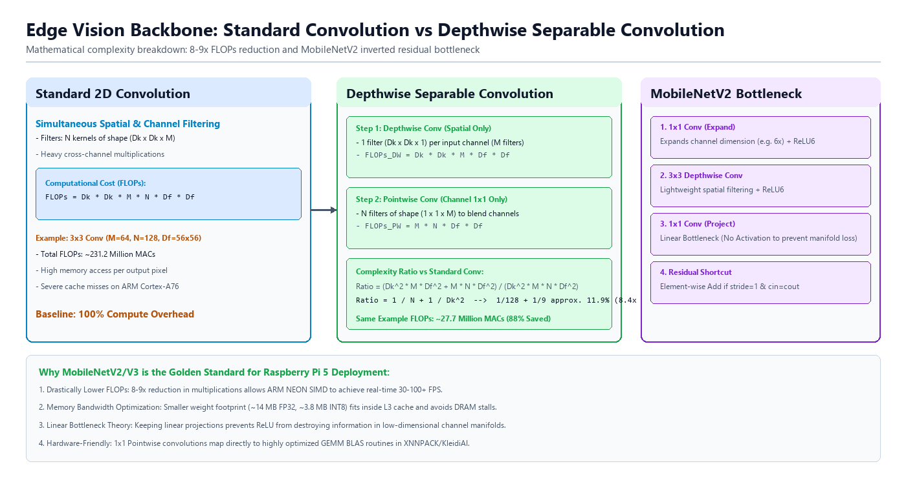

#### 표준 합성곱과 깊이별 분리 합성곱의 연산량

표준 합성곱과 깊이별 분리 합성곱의 MACs를 비교하기 위해 출력 특징 맵의 높이를 $H$, 너비를 $W$, 합성곱 커널 크기를 $K \times K$, 입력 채널 수를 $C_{\text{in}}$, 출력 채널 수를 $C_{\text{out}}$으로 둔다. 출력 특징 맵의 한 위치와 한 출력 채널을 계산하려면 $K \times K \times C_{\text{in}}$개의 값을 곱해 더한다.

- **표준 합성곱(Standard Convolution)**: 공간 방향의 이웃 값과 채널 방향의 값을 한 번에 섞어 출력 채널을 만든다. 필요한 MACs는 다음과 같다.

  $$\text{MACs}_{\text{standard}} = H \times W \times K \times K \times C_{\text{in}} \times C_{\text{out}}$$
  $$\text{FLOPs}_{\text{standard}} \approx 2 \times \text{MACs}_{\text{standard}}$$
</p>

- **깊이별 분리 합성곱(Depthwise Separable Convolution)**: 공간 방향 계산과 채널 섞기를 두 단계로 나눈다.
  - **깊이별 합성곱(Depthwise Convolution)**: 입력 채널마다 따로 $K \times K$ 필터 하나를 적용한다. 채널을 서로 섞지 않으므로 출력 채널 수는 일단 입력 채널 수와 같다.
    
    $$\text{MACs}_{\text{depthwise}} = H \times W \times K \times K \times C_{\text{in}}$$

  - **점별 합성곱(Pointwise Convolution)**: $1 \times 1$ 필터로 채널을 섞어 원하는 출력 채널 수를 만든다.
    
    $$\text{MACs}_{\text{pointwise}} = H \times W \times C_{\text{in}} \times C_{\text{out}}$$

따라서 깊이별 분리 합성곱의 총 MACs는 다음과 같다.

$$\text{MACs}_{\text{separable}} = (H \times W \times K^2 \times C_{\text{in}}) + (H \times W \times C_{\text{in}} \times C_{\text{out}})$$

작은 숫자로 계산하면 차이가 분명하다. $H=4$, $W=4$, $K=3$, $C_{\text{in}}=3$, $C_{\text{out}}=8$이면 표준 합성곱은 $4 \times 4 \times 3 \times 3 \times 3 \times 8 = 3{,}456$ MACs이다. 깊이별 분리 합성곱은 깊이별 합성곱이 $4 \times 4 \times 3 \times 3 \times 3 = 432$ MACs이고, 점별 합성곱이 $4 \times 4 \times 3 \times 8 = 384$ MACs이다. 합계는 816 MACs이므로 이 예에서는 표준 합성곱의 약 23.6%이다.

두 방식의 비율은 다음처럼 정리된다.

$$\text{Ratio} = \frac{\text{MACs}_{\text{separable}}}{\text{MACs}_{\text{standard}}} = \frac{1}{C_{\text{out}}} + \frac{1}{K^2}$$

$K=3$, $C_{\text{out}}=128$이면 $\frac{1}{128} + \frac{1}{9} \approx 0.1189$이다. 같은 출력 크기를 만들 때 MACs가 표준 합성곱의 약 11.9%까지 줄어들 수 있다는 뜻이다. 다만 깊이별 합성곱은 채널마다 따로 계산하므로 데이터 재사용이 적고 메모리 접근 비중이 커질 수 있다. 그래서 실제 속도 향상은 연산량 감소보다 작을 수 있다.

#### 대표 백본별 구조 비교

| 구조 | 핵심 계층과 블록 | 장점 | 엣지 CPU에서 확인할 점 |
|---|---|---|---|
| ResNet-18 | 잔차 연결(Residual Connection)과 3×3 표준 합성곱 | 구조가 단순하고 특징 표현력이 높음 | 파라미터 수가 약 11.7M이고 공개 기준 연산량이 약 1.8G MACs로 비교적 큼 |
| MobileNetV2 | 역잔차 블록(Inverted Residual), 선형 병목(Linear Bottleneck), 깊이별 분리 합성곱 | 파라미터 수가 약 3.5M이고 공개 기준 연산량이 약 300M MACs로 가벼움 | 깊이별 합성곱의 메모리 접근 비용 때문에 MACs 감소만큼 지연 시간이 줄지 않을 수 있음 |
| MobileNetV3-Small | 깊이별 분리 합성곱, Squeeze-and-Excitation(SE), h-swish | 파라미터 수가 약 2.5M이고 공개 기준 연산량이 약 56M MACs로 작음 | SE의 풀링과 작은 완전 연결 계층, HardSwish 연산이 런타임에서 어떻게 구현되는지 확인해야 함 |

표의 연산량은 224×224 입력을 쓰는 대표 공개 수치이며 MACs 기준이다. FLOPs 기준으로 쓰면 대략 두 배가 된다. 예를 들어 MobileNetV2 1.0 모델의 약 300M MACs는 약 600M FLOPs로 적을 수 있다. 이 장과 뒤 실습에서는 공개 수치를 언급할 때 MACs 기준으로 맞춘다.

MobileNetV2는 입력 채널을 1×1 합성곱으로 늘린 뒤 3×3 깊이별 합성곱을 적용하고, 다시 1×1 합성곱으로 채널을 줄인다. 이 구조를 역잔차 블록이라고 한다. 선형 병목은 출력 쪽의 좁은 채널 표현에서 ReLU를 빼 정보 손실을 줄이려는 설계이다. 잔차 연결은 입력과 출력의 채널 수와 공간 크기가 같을 때만 더하기로 연결된다.

MobileNetV3-Small은 MobileNetV2의 가벼운 합성곱 구조에 SE와 h-swish를 더한다. SE는 각 채널의 중요도를 계산해 채널별로 값을 다시 조절하는 블록이다. h-swish는 $x \times \text{ReLU6}(x+3) / 6$ 형태의 활성화 함수이며, swish를 더 단순한 연산으로 근사한다. 이런 연산은 정확도와 속도 사이의 균형을 위해 쓰이지만, 실습 장비에서는 런타임 구현에 따라 실제 지연 시간이 달라질 수 있다.

### ONNX 모델 형식과 그래프 구조

PyTorch는 학습과 실험에 편리한 기능을 많이 제공한다. 그러나 실습 장비에서 필요한 작업은 학습이 아니라 순전파 추론이다. ONNX는 PyTorch 같은 학습 도구와 ONNX Runtime 같은 실행 도구 사이에서 모델 구조와 가중치를 주고받기 위한 공개 모델 형식이다. ONNX로 내보내면 모델을 만든 도구와 실행하는 런타임을 분리할 수 있다.

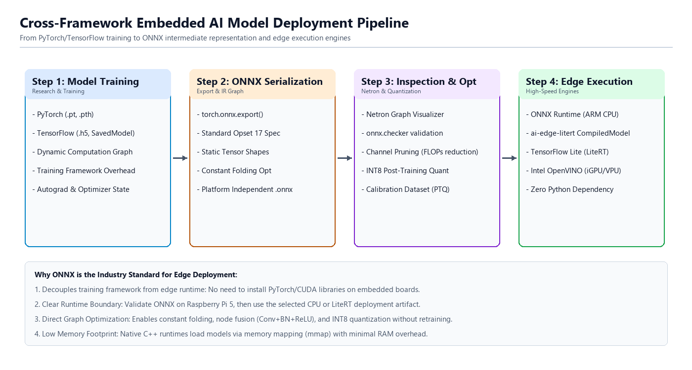

#### Protocol Buffers 기반 계층 구조

ONNX 파일은 Protocol Buffers를 바탕으로 저장된다. Protocol Buffers는 정해진 구조를 가진 데이터를 작은 바이트열로 저장하고 다시 읽기 위한 형식이다. 직렬화는 메모리 속 객체를 파일로 저장할 수 있는 바이트열로 바꾸는 일이다. .onnx 파일은 모델 객체를 직렬화한 결과이다.

ONNX는 계산 그래프를 DAG(Directed Acyclic Graph), 즉 방향이 있고 순환이 없는 그래프로 표현한다. 방향이 있다는 말은 입력에서 출력으로 흐름이 정해져 있다는 뜻이다. 순환이 없다는 말은 어떤 노드의 출력이 다시 자기 자신을 거쳐야 하는 구조가 없다는 뜻이다. 추론은 입력 노드에서 시작해 정해진 순서로 노드를 계산해 출력 노드까지 진행한다.

- **ModelProto**: ONNX 모델의 최상위 객체이다. 모델을 만든 도구, 모델 버전, opset 버전, GraphProto를 담는다.
</p>

- **GraphProto**: 실제 계산 그래프이다. graph.input은 입력 텐서 정보, graph.output은 출력 텐서 정보, graph.initializer는 가중치와 상수 텐서, graph.node는 연산 노드 목록을 담는다.
</p>

- **NodeProto**: Conv, BatchNormalization, Relu, Gemm처럼 계산 하나를 나타낸다. op_type은 연산자의 종류이고, input과 output은 다른 노드와 연결되는 텐서 이름이다. attribute에는 커널 크기, 패딩, 스트라이드 같은 설정이 들어간다.
</p>

- **TensorProto**: 가중치, 편향, 고정 상수 같은 텐서를 저장한다. 예를 들어 합성곱 계층의 필터 값은 TensorProto로 저장되어 GraphProto의 initializer에 들어간다.

#### 정적 형상과 opset 버전 고정

- **opset 버전**: opset(Operator Set)은 ONNX 연산자 집합의 버전이다. 같은 Resize나 BatchNormalization이라도 opset 버전에 따라 속성 이름이나 동작 규칙이 달라질 수 있다. 변환할 때 opset 버전을 고정하면 PC와 실습 장비가 같은 규칙으로 그래프를 해석하는지 확인하기 쉽다. 최신 버전이 항상 좋은 선택은 아니며, 실습 장비의 ONNX Runtime이 지원하는 버전을 골라야 한다.
</p>

- **정적 형상 고정**: 정적 형상은 입력 형상을 [1, 3, 224, 224]처럼 고정하는 것이다. 동적 형상은 배치 크기나 높이·너비를 실행 때마다 바꿀 수 있게 두는 방식이다. 실시간 영상 분류처럼 입력 크기가 정해진 실습에서는 정적 형상이 단순하다. 런타임이 중간 텐서의 메모리 크기를 미리 알 수 있어 초기화와 메모리 계획에 유리하지만, 모든 오버헤드가 사라진다고 단정할 수는 없다.
</p>

- **전처리와 모델의 역할 분리**: ONNX 그래프에는 보통 신경망 텐서 연산만 담는다. 카메라 영상의 레터박스 크기 조정, BGR→RGB 변환, [0.0, 1.0] 범위 조정, ImageNet 평균·표준편차 정규화, HWC→NCHW 변환은 2장에서 다룬 전처리 코드가 맡는다. 이렇게 역할을 나누면 모델 그래프의 입력과 출력이 분명해지고, 변환 전후 출력 비교도 쉬워진다.

내보내기 도구는 그래프를 저장할 때 상수 접기를 적용할 수 있다. 예를 들어 입력과 무관하게 항상 같은 결과가 나오는 계산은 변환 시점에 미리 계산해 TensorProto 상수로 넣을 수 있다. Conv와 BatchNorm처럼 추론 때 합칠 수 있는 연산은 런타임이나 변환 도구가 하나의 계산으로 다룰 수 있지만, 실제 그래프 모양은 도구와 버전에 따라 달라질 수 있다.


### 실습 3-1. 비전 백본 구조 분석과 Netron 그래프 확인

> **풀고 싶은 문제**
> ResNet-18과 MobileNet 계열은 합성곱 구조와 파라미터 수에서 어떤 차이를 보이는가? ONNX 그래프에서 연산자 연결과 융합 후보를 어떻게 확인하는가?

이 실습에서는 ResNet-18, MobileNetV2와 MobileNetV3-Small의 파라미터 수와 합성곱 구성을 계산한다. 이어서 세 모델을 같은 입력 형상의 ONNX 파일로 내보내고, Netron으로 그래프를 확인한다. Netron은 ONNX 같은 모델 파일의 계층과 연결 관계를 브라우저에서 보여 주는 도구이다. 세 모델은 weights=None으로 생성해 사전 학습 가중치를 사용하지 않는다. 따라서 이 실습은 구조와 그래프를 비교하는 데 목적이 있으며, 분류 품질은 평가하지 않는다.

실습 목표는 백본마다 파라미터 수, FP32 가중치 크기, 표준 합성곱과 깊이별 합성곱의 개수가 어떻게 다른지 확인하는 것이다. 프로그램은 같은 입력 형상과 opset으로 내보낸 ONNX 모델의 연산자 수와 그래프 연결도 출력한다. 코드가 세는 융합 지점은 그래프 패턴에 따른 후보일 뿐이며, 실제 런타임에서 융합이 적용되었다는 뜻은 아니다.

#### 사전 학습 1단계: 모델의 파라미터와 계층 종류 세기

torchvision에서 모델을 만들고 parameters()의 원소 수를 더하면 학습 가능한 파라미터 수를 알 수 있다. modules()를 순회하면 모델을 구성하는 계층도 종류별로 셀 수 있다.

```python
# step1_count_model_parts.py
import torch.nn as nn
import torchvision.models as models

model = models.mobilenet_v2(weights=None)
parameter_count = sum(parameter.numel() for parameter in model.parameters())
conv_count = sum(1 for layer in model.modules() if isinstance(layer, nn.Conv2d))
print("파라미터 수:", parameter_count)
print("Conv2d 계층 수:", conv_count)
```

import torch.nn as nn은 PyTorch의 신경망 계층 모듈을 nn이라는 짧은 이름으로 불러온다. Conv2d와 Linear 같은 계층 클래스는 torch.nn 안에 있다. import torchvision.models as models는 torchvision이 제공하는 대표 모델 생성 함수를 models.resnet18(), models.mobilenet_v2()처럼 쓸 수 있게 한다.

models.mobilenet_v2(weights=None)는 MobileNetV2 구조를 만들되 사전 학습 가중치를 내려받지 않고 무작위 초깃값으로 파라미터를 채운다. 반대로 weights=models.MobileNet_V2_Weights.DEFAULT처럼 지정하면 ImageNet으로 학습된 가중치를 함께 불러온다. 이 단계에서는 분류 결과가 아니라 구조만 세므로 weights=None을 쓴다.

model.parameters()는 모델 안의 학습 가능한 파라미터 텐서를 차례로 돌려준다. parameter.numel()은 한 텐서에 들어 있는 값의 개수이다. sum(parameter.numel() for parameter in model.parameters())는 각 파라미터 텐서의 원소 수를 하나씩 만들어 더하는 제너레이터 표현식이다. model.modules()는 모델 자신과 내부 계층을 모두 순회하고, isinstance(layer, nn.Conv2d)는 해당 계층이 2차원 합성곱 계층인지 확인한다.

#### 사전 학습 2단계: groups 값으로 깊이별 합성곱 구분

Conv2d의 groups가 입력 채널 수와 같으면 각 입력 채널을 독립적으로 처리하는 깊이별 합성곱이다. 이 기준을 계층마다 적용해 표준 합성곱과 구분한다.

```python
# step2_find_depthwise_layers.py
import torch.nn as nn
import torchvision.models as models

model = models.mobilenet_v2(weights=None)
for index, layer in enumerate(model.modules()):
    if isinstance(layer, nn.Conv2d):
        is_depthwise = layer.groups == layer.in_channels and layer.in_channels > 1
        if is_depthwise:
            print(index, layer.in_channels, layer.out_channels, layer.groups)
```

enumerate(model.modules())는 계층을 하나씩 꺼내면서 0부터 시작하는 순번도 함께 만든다. 순번을 함께 출력하면 Netron에서 보이는 구조와 터미널 출력의 대략적인 위치를 대조하기 쉽다. if isinstance(layer, nn.Conv2d):는 합성곱 계층에만 아래 검사를 적용한다.

Conv2d 계층에는 in_channels, out_channels, kernel_size, groups 같은 속성이 있다. in_channels는 입력 특징 맵의 채널 수이고, out_channels는 출력 특징 맵의 채널 수이다. kernel_size는 합성곱 커널의 높이와 너비이며, groups는 입력 채널을 몇 묶음으로 나누어 계산할지 정한다. groups가 1이면 일반적인 표준 합성곱이고, groups가 입력 채널 수와 같으면 채널별로 따로 계산하는 깊이별 합성곱이다.

#### 사전 학습 3단계: 모델을 ONNX로 내보내 그래프 검사

모델을 eval()로 전환하고 고정 형상의 더미 입력을 주면 ONNX 그래프를 저장할 수 있다. onnx.checker는 파일 구조를 검사하며, 연산자 종류를 세면 그래프의 구성도 확인할 수 있다.

```python
# step3_export_and_inspect.py
from collections import Counter
import onnx
import torch
import torchvision.models as models

model = models.mobilenet_v2(weights=None).eval()
example = torch.randn(1, 3, 224, 224)
torch.onnx.export(model, example, "mobilenet_v2.onnx", opset_version=18)
graph = onnx.load("mobilenet_v2.onnx")
onnx.checker.check_model(graph)
print(Counter(node.op_type for node in graph.graph.node).most_common(5))
```

from collections import Counter는 값의 등장 횟수를 세는 Counter 클래스를 불러온다. import torch는 PyTorch의 기본 모듈을 불러오며, 여기서는 더미 입력을 만들고 ONNX로 내보내는 데 쓴다. model.eval()은 모델을 추론 모드로 바꾼다. 학습 모드에서는 배치 정규화나 드롭아웃처럼 학습에 맞춘 동작을 하는 계층이 있고, 추론 모드에서는 저장된 통계와 고정된 계산 규칙을 사용한다.

torch.randn(1, 3, 224, 224)는 형상이 [1, 3, 224, 224]인 임의의 FP32 텐서를 만든다. 이 더미 입력은 실제 사진이 아니라 모델의 입력 형상과 자료형을 알려 주기 위한 가짜 입력이다. 값 자체는 중요하지 않지만, 배치 크기 1, RGB 채널 3개, 높이와 너비 224라는 형상은 모델 입력과 맞아야 한다.

torch.onnx.export()는 PyTorch 모델을 ONNX 파일로 내보낸다. 주요 인자는 모델, 더미 입력, 저장할 파일 이름, opset_version이다. 이 예제에서는 "mobilenet_v2.onnx" 파일을 만들고 opset 18의 연산자 규칙으로 그래프를 저장한다. onnx.load()는 저장한 ONNX 파일을 읽고, onnx.checker.check_model()은 그래프 구조가 ONNX 형식 규칙에 맞는지 검사한다. Counter(node.op_type for node in graph.graph.node)는 그래프 노드의 연산자 종류를 세고, most_common(5)는 가장 많이 나온 다섯 종류를 출력한다.

#### 최종 구현

다음 model_architecture_inspector.py는 세 모델의 구조 수치를 표로 출력하고, 선택한 ONNX 그래프를 Netron 웹 화면으로 보여 준다. 실습 장비에서 프로그램을 실행한 뒤 PC 브라우저에서 http://192.168.254.1:8080으로 접속한다. 실습 장비의 IP 주소를 바꾸어 쓰는 환경에서는 192.168.254.1 대신 해당 주소를 입력한다.

```python
# model_architecture_inspector.py
import argparse
import collections
import os
import time

import netron
import torch
import torch.nn as nn
import torchvision.models as models
import onnx

def analyze_model_structure(name, model):
    total_params = sum(p.numel() for p in model.parameters())
    fp32_size_mb = (total_params * 4) / (1024 * 1024)

    conv_count = 0
    depthwise_count = 0
    linear_count = 0

    for m in model.modules():
        if isinstance(m, nn.Conv2d):
            conv_count += 1
            if m.groups == m.in_channels and m.in_channels > 1:
                depthwise_count += 1
        elif isinstance(m, nn.Linear):
            linear_count += 1

    return {
        "name": name,
        "params": total_params,
        "size_mb": fp32_size_mb,
        "conv_total": conv_count,
        "depthwise": depthwise_count,
        "standard_conv": conv_count - depthwise_count,
        "linear": linear_count
    }

def export_to_onnx(model, filename):
    """PyTorch 모델을 ONNX 파일로 변환"""
    model.eval()
    dummy_input = torch.randn(1, 3, 224, 224)
    torch.onnx.export(
        model,
        dummy_input,
        filename,
        opset_version=18,  # 최신 PyTorch 비전 계층 내보내기 오류 방지
        do_constant_folding=True,
        input_names=["input"],
        output_names=["output"]
    )

def analyze_onnx_graph(onnx_path):
    model = onnx.load(onnx_path)
    nodes = list(model.graph.node)
    if not nodes:
        raise ValueError("ONNX 그래프에 연산 노드가 없습니다.")

    op_counts = collections.Counter(node.op_type for node in nodes)
    
    # 노드 연결 관계 추적
    output_consumers = collections.defaultdict(list)
    for node in nodes:
        for input_name in node.input:
            output_consumers[input_name].append(node)

    # Conv -> BN -> Act 또는 Conv -> Act 융합 패턴 정밀 계측
    fused_candidates = 0
    fusion_activations = {"Relu", "Clip", "HardSwish", "Sigmoid"}
    
    for node in nodes:
        if node.op_type != "Conv":
            continue
        
        for out_name in node.output:
            consumers = output_consumers[out_name]
            for c in consumers:
                if c.op_type == "BatchNormalization":
                    fused_candidates += 1  # Conv + BN 융합 후보
                    for bn_out in c.output:
                        for bn_c in output_consumers[bn_out]:
                            if bn_c.op_type in fusion_activations:
                                fused_candidates += 1  # (Conv+BN) + Act 융합 후보
                elif c.op_type in fusion_activations:
                    fused_candidates += 1  # Conv + Act 직접 융합 후보

    return op_counts, fused_candidates, len(nodes)

def main():
    parser = argparse.ArgumentParser(description="비전 백본 구조 분석과 Netron 그래프 확인")
    parser.add_argument("--port", type=int, default=8080)
    args = parser.parse_args()

    print("=" * 70)
    print("      비전 백본 구조 분석과 Netron 그래프 확인")
    print("=" * 70)

    # 대상 모델 사전 준비
    model_dict = {
        "1": ("ResNet-18", models.resnet18(weights=None), "resnet18.onnx"),
        "2": ("MobileNetV2", models.mobilenet_v2(weights=None), "mobilenet_v2.onnx"),
        "3": ("MobileNetV3-Small", models.mobilenet_v3_small(weights=None), "mobilenet_v3_small.onnx")
    }

    print("\n1. 전체 모델 구조 측정 실행 중...")
    results = [analyze_model_structure(name, m) for name, m, _ in model_dict.values()]

    print("\n" + "=" * 84)
    print(f"{'모델 구조':<29} | {'파라미터':<4} | {'가중치 크기(FP32)':<12} | {'Depthwise Conv'}")
    print("-" * 84)
    for r in results:
        print(f"{r['name']:<35} | {r['params']/1e6:6.2f} M | {r['size_mb']:14.2f} MB | {r['depthwise']:2d} / {r['conv_total']:2d} 계층")
    print("=" * 84)

    # ONNX 파일 내보내기
    print("\n2. ONNX 그래프 파일 생성 중...")
    for key, (name, model, onnx_file) in model_dict.items():
        export_to_onnx(model, onnx_file)
        file_size_mb = os.path.getsize(onnx_file) / (1024 * 1024)
        print(f"  - [{key}] {name} -> {onnx_file} 변환 완료 ({file_size_mb:.2f} MB)")

    # 대화형 Netron 서버 제어 루프
    print("\n" + "=" * 70)
    print(f"Netron 웹 서버 시작 (접속 주소: http://192.168.254.1:{args.port})")
    print("=" * 70)

    current_key = "2"  # 기본 탐색: MobileNetV2
    
    try:
        while True:
            name, model, onnx_file = model_dict[current_key]
            op_counts, fused_candidates, total_nodes = analyze_onnx_graph(onnx_file)

            print(f"\n[현재 탐색 중인 모델: {name} ({onnx_file})]")
            print(f"  - 총 연산 노드 수: {total_nodes}개")
            print("  - 주요 연산자 상위 분포:")
            for op, count in op_counts.most_common(5):
                pct = (count / total_nodes) * 100.0
                bar = "#" * int(pct / 3)
                print(f"    * {op:<18} : {count:3d}회 ({pct:5.1f}%) {bar}")
            print(f"  - 계층 융합(Fusion) 가능 지점: 약 {fused_candidates}개소 감지")

            # 기존 Netron 서버 정지 및 소켓 방출 대기
            netron.stop()
            time.sleep(0.5)  # 소켓(OSError 98) 해제를 위한 짧은 대기 시간

            # Netron 웹 서버에 선택한 파일 로드
            netron.start(onnx_file, address=("0.0.0.0", args.port), browse=False)

            print("\n" + "-" * 50)
            print(" [선택] 1: ResNet-18 | 2: MobileNetV2 | 3: MobileNetV3-Small | q: 종료")
            user_input = input(" 탐색할 모델 번호를 입력하세요 > ").strip().lower()

            if user_input == 'q':
                break
            elif user_input in model_dict:
                current_key = user_input
            else:
                print(" 잘못된 입력입니다. 1, 2, 3, q 중 하나를 입력하세요.")

    except KeyboardInterrupt:
        pass
    finally:
        print("\nNetron 서버를 종료합니다.")
        netron.stop()
        # 생성된 ONNX 파일 정리
        for _, _, onnx_file in model_dict.values():
            if os.path.exists(onnx_file):
                os.remove(onnx_file)

if __name__ == "__main__":
    main()
```

**코드 해설**

model_architecture_inspector.py는 모델 구조 분석, ONNX 내보내기, ONNX 그래프 분석, Netron 서버 실행의 네 부분으로 이루어진다. main()은 명령행 인자를 읽고 model_dict에 분석할 모델 목록을 만든다. 그 뒤 analyze_model_structure()로 구조 표를 출력하고, export_to_onnx()로 ONNX 파일을 만든다. 마지막으로 반복문에서 사용자가 고른 모델의 그래프 정보를 출력하고 Netron 서버에 해당 파일을 올린다.

analyze_model_structure()는 학습 가능한 파라미터 수와 FP32 가중치의 이론적 크기를 계산한다. FP32 파라미터 하나는 4바이트를 차지하므로 파라미터가 350만 개이면 가중치만 약 1,400만 바이트, 즉 약 13.4MiB이다. 교재나 도구에 따라 1MB를 1,000,000바이트로 계산하면 약 14MB로 볼 수 있다. 이 값에는 ONNX 그래프의 노드 정보와 파일 형식의 부가 정보, 실행 중 중간 텐서와 런타임 메모리가 포함되지 않으므로 실제 파일 크기나 RSS와는 다르다.

Conv2d의 groups가 입력 채널 수와 같고 채널 수가 1보다 크면 해당 계층을 깊이별 합성곱으로 센다. nn.Linear는 완전 연결 계층이므로 linear_count에 더한다. model_dict는 메뉴 번호를 키로 하고, 모델 이름, 모델 객체, ONNX 파일 이름을 값으로 저장하는 딕셔너리이다. "1"은 ResNet-18, "2"는 MobileNetV2, "3"은 MobileNetV3-Small을 뜻한다.

export_to_onnx()는 [1, 3, 224, 224] 더미 입력을 사용해 모델을 opset 18의 ONNX 파일로 내보낸다. input_names와 output_names는 그래프 입력과 출력에 각각 input, output이라는 이름을 붙인다. do_constant_folding=True는 입력과 무관한 계산을 변환 시점에 미리 계산하도록 요청한다. 실제로 어떤 노드가 줄어드는지는 PyTorch와 ONNX 버전, 모델 구조에 따라 달라질 수 있다.

ONNX 파일을 만든 뒤 os.path.getsize(onnx_file)은 파일 크기를 바이트 단위로 읽는다. 이 값은 파라미터 이론값과 비슷한 경향을 보이지만 완전히 같지는 않다. ONNX 파일에는 파라미터뿐 아니라 그래프 구조, 노드 이름, 입력·출력 이름 같은 정보도 함께 들어가기 때문이다.

analyze_onnx_graph()는 onnx.load()로 파일을 읽고 node.op_type을 세어 연산자 분포를 만든다. 그래프에 연산 노드가 없으면 raise ValueError(...)로 잘못된 상태를 명확히 알린다. collections.defaultdict(list)는 없는 키를 처음 읽을 때 빈 리스트를 자동으로 만들어 주는 딕셔너리이다. output_consumers는 이 자료형으로 한 노드의 출력 이름을 다음에 소비하는 노드 목록에 연결한다. 이를 이용해 Conv 뒤에 BatchNormalization이나 활성화 함수가 이어지는 패턴을 찾는다. 여기서 찾은 값은 융합 후보이며, 실제 ONNX Runtime이 해당 연산을 하나로 합쳐 실행했다는 증거는 아니다.

argparse.ArgumentParser는 터미널에서 전달한 옵션을 읽는 도구이다. 이 프로그램은 --port 값으로 Netron 서버 포트를 바꿀 수 있으며, 생략하면 8080을 쓴다. netron.start(onnx_file, address=("0.0.0.0", args.port), browse=False)는 실습 장비의 모든 네트워크 인터페이스에서 지정한 포트로 Netron 서버를 연다. 따라서 PC 브라우저에서는 http://192.168.254.1:8080처럼 실습 장비 주소와 포트를 함께 입력한다. browse=False는 실습 장비에서 브라우저를 자동으로 열지 않게 하는 설정이다.

반복문은 현재 선택한 모델의 통계를 출력하고 Netron 서버에 해당 ONNX 파일을 올린 뒤, input()으로 다음 선택을 기다린다. input()은 사용자가 엔터를 누를 때까지 문자열을 읽고, strip().lower()는 앞뒤 공백을 지우고 소문자로 바꾼다. 사용자가 q를 입력하거나 Ctrl+C를 누르면 finally 블록에서 netron.stop()을 호출해 서버를 닫는다. Ctrl+C로 중단할 때 생기는 KeyboardInterrupt는 except KeyboardInterrupt:에서 받아 정상 종료 흐름으로 넘긴다. 마지막으로 os.path.exists()로 파일이 있는지 확인하고 os.remove()로 생성한 ONNX 파일을 삭제한다. 이 정리는 실습 폴더에 임시 파일이 남지 않게 하기 위한 처리이다.

> **알아두기 - 구조 수치와 배포 수치의 차이**
> 파라미터 수와 FP32 이론값은 가중치만 계산한다. ONNX 파일에는 그래프 정보가 더해지고 실행 중에는 중간 텐서와 런타임 메모리도 필요하다. 따라서 이론적 가중치 크기, ONNX 파일 크기와 RSS는 서로 다른 값이다.

**실행 결과와 확인할 점**

model_architecture_inspector.py를 실행한다.

```sh
python model_architecture_inspector.py
```

실행 후 다음 항목을 확인한다.

- 구조 비교표: 세 모델의 파라미터 수와 FP32 가중치 이론값이 출력되는지 확인한다. 결과는 torchvision 모델 구현에 따라 달라질 수 있다.
- ONNX 파일 크기: 내보낸 파일의 실제 크기가 함께 출력되는지 확인한다. 파라미터 수가 적은 모델일수록 대체로 파일도 작지만, 그래프 정보가 포함되므로 이론값과 정확히 같지는 않다.
- 깊이별 합성곱 계층 수: ResNet-18과 MobileNet 계열의 측정값을 비교한다. MobileNet 계열에서 깊이별 합성곱 비중이 더 크게 나타나는지 확인한다.
- 기본 상태(2번 MobileNetV2): PC 브라우저에서 http://192.168.254.1:8080에 접속해 역 잔차 블록과 선형 병목 구조를 확인한다. 실습 장비의 주소가 다르면 해당 주소와 포트 8080을 사용한다. 터미널의 Conv, Clip, Add 연산자 수와 융합 후보를 그래프와 대조한다.
- 1번 입력(ResNet-18): 터미널에 1을 입력했을 때 Netron 서버가 전환되는지 확인한다. 브라우저를 새로고침한 뒤 표준 합성곱과 잔차 연결 위주의 그래프로 갱신되는지 확인한다.
- 3번 입력(MobileNetV3-Small): 터미널에 3을 입력했을 때 HardSwish와 Squeeze-and-Excitation 모듈이 포함된 그래프로 갱신되는지 확인한다.
- Conv 속성 확인: Netron에서 MobileNetV2의 Conv 노드를 선택하고 group 속성을 확인한다. group 값이 입력 채널 수와 같은 Conv 노드는 깊이별 합성곱에 해당한다.
- 안전 종료와 임시 파일 정리: q를 입력했을 때 Netron 서버가 종료되고, 작업 폴더에 생성되었던 세 ONNX 파일이 삭제되는지 확인한다.

> **한 걸음 더**
> 1. model_dict에 4번 MobileNetV3-Large를 추가하고 선택 메뉴를 갱신한다. Small과 Large의 파라미터 수, 깊이별 합성곱 계층 수와 그래프를 비교한다.
> 2. Netron에서 MobileNetV2의 Conv 속성과 ResNet-18의 Conv 속성을 비교한다. groups 값이 각 구조에서 어떤 역할을 하는지 설명한다.

### 실습 3-2. ONNX 그래프의 상수 접기 전후 비교

> **풀고 싶은 문제**
> 상수 접기 설정에 따라 ONNX 그래프의 노드와 연결은 어떻게 달라지는가? 변환 전후 그래프를 어떤 기준으로 비교할 수 있는가?

이 실습에서는 같은 MobileNetV2 구조와 입력 형상으로 ONNX 그래프 두 개를 만들고, 레거시 내보내기 경로에서 한 파일은 상수 접기를 끄고 다른 파일은 켠다. 사전 학습 1단계는 구조 비교만 하므로 weights=None을 쓰고, 최종 구현은 실제 배포에 더 가까운 ImageNet 사전 학습 가중치를 사용한다. 두 그래프의 연산자 수와 BatchNormalization 노드, 연결 관계를 비교하되 이 실습에서는 구조만 살펴보고 속도 향상이나 출력 일치는 실습 3-3에서 별도로 검증한다.

#### 사전 학습 1단계: 같은 모델에서 변환 설정만 바꾸기

사전 학습 단계에서는 다운로드 시간을 줄이려고 weights=None으로 MobileNetV2 구조만 만든다. 사전 학습 가중치가 없어도 그래프 구조와 내보내기 옵션의 차이는 확인할 수 있다. 모델 구조, 더미 입력, opset을 고정하고 do_constant_folding만 바꾸면 두 ONNX 그래프의 차이를 설정 변화와 연결해 살펴볼 수 있다. eval()은 모델을 추론 모드로 바꾸며, dynamo=False는 PyTorch의 레거시 내보내기 경로를 선택한다.

```python
# step1_export_two_graphs.py
import torch
import torchvision.models as models

model = models.mobilenet_v2(weights=None).eval()
example = torch.randn(1, 3, 224, 224)
for folding in (False, True):
    path = f"mobilenet_v2_folding_{folding}.onnx"
    torch.onnx.export(
        model, example, path,
        opset_version=17,
        do_constant_folding=folding,
        input_names=["input"], output_names=["output"],
        dynamo=False
    )
    print("그래프 저장 완료:", path)
    print("저장 완료:", path)
```

for folding in (False, True):는 False와 True 두 값을 차례로 folding 변수에 넣어 같은 코드를 두 번 실행한다. False와 True는 파이썬의 불 값이며, 여기서는 상수 접기 요청을 끌지 켤지를 나타낸다. path = f"mobilenet_v2_folding_{folding}.onnx"는 f-문자열로 파일 이름을 만든다. folding이 False이면 mobilenet_v2_folding_False.onnx, True이면 mobilenet_v2_folding_True.onnx가 된다.

torch.onnx.export()는 PyTorch 모델과 예제 입력을 받아 ONNX 파일을 만든다. model, example, path 뒤의 opset_version, do_constant_folding, input_names, output_names, dynamo는 이름을 붙여 전달하는 키워드 인자이다. do_constant_folding=True는 변환 시점에 계산할 수 있는 상수 부분을 접도록 요청한다. 다만 어떤 노드가 실제로 합쳐지는지는 PyTorch와 torchvision, ONNX 변환 도구의 버전에 따라 달라질 수 있으므로 항상 같은 그래프를 보장하지 않는다. 코드의 두 print()는 모두 저장된 파일 이름을 출력하며, 첫 줄과 둘째 줄의 내용은 중복된 확인 메시지이다.

#### 사전 학습 2단계: ONNX 그래프의 연산자 수 세기
ONNX 파일을 불러온 뒤 checker로 구조를 검사하고, GraphProto의 노드를 순회하면 연산자 종류별 개수를 셀 수 있다. 이 수치는 그래프 구조의 차이를 보여 줄 뿐 실행 속도나 출력 일치를 직접 증명하지 않는다.

```python
# step2_count_onnx_nodes.py
from collections import Counter
import onnx

for path in ("mobilenet_v2_folding_False.onnx",
             "mobilenet_v2_folding_True.onnx"):
    graph = onnx.load(path)
    onnx.checker.check_model(graph)
    print(path, Counter(node.op_type for node in graph.graph.node))
```

Counter는 같은 값이 몇 번 나왔는지 세는 collections 모듈의 클래스이다. node.op_type for node in graph.graph.node는 그래프의 노드를 하나씩 보며 Conv, BatchNormalization, Clip 같은 연산자 이름을 꺼내는 제너레이터 표현식이다. Counter(...)는 이 이름들의 빈도를 세어 연산자별 개수를 만든다.

onnx.load(path)는 ONNX 파일을 읽어 ModelProto 객체로 돌려준다. ModelProto 안에는 그래프를 담은 graph가 있고, graph.node에는 NodeProto 목록이 들어 있다. onnx.checker.check_model(graph)는 파일 구조가 ONNX 규칙에 맞는지 검사한다. 이 검사는 그래프가 실행 가능한 형식인지 확인하는 절차이며, 모델의 정확도나 속도를 평가하지는 않는다.

#### 최종 구현

다음 onnx_export_validator.py는 ImageNet 사전 학습 가중치를 가진 MobileNetV2를 두 ONNX 파일로 내보내고, 두 그래프의 노드 수를 비교한 뒤 Netron으로 번갈아 확인하게 한다. Raw 파일은 상수 접기 요청을 끈 결과이고, Opt 파일은 상수 접기 요청을 켠 결과이다.

```python
# onnx_export_validator.py
import argparse
from contextlib import contextmanager
import os
from pathlib import Path
import sys
import time
import torch
import torchvision.models as models
import onnx
import netron


@contextmanager
def suppress_stderr():
    """C++ 수준 또는 표준 경고 필터를 우회하여 stderr로 출력되는 레거시 경고를 숨긴다."""
    try:
        stderr_fd = sys.stderr.fileno()
        saved_stderr_fd = os.dup(stderr_fd)
        devnull_fd = os.open(os.devnull, os.O_WRONLY)
        os.dup2(devnull_fd, stderr_fd)
        os.close(devnull_fd)
        yield
    finally:
        os.dup2(saved_stderr_fd, stderr_fd)
        os.close(saved_stderr_fd)


def export_pytorch_to_onnx(model, raw_onnx_path, opt_onnx_path, input_shape=(1, 3, 224, 224), opset=17):
    model.eval()
    dummy_input = torch.randn(*input_shape, requires_grad=False)

    # 이전 실행으로 생성된 파일이 존재할 경우 사전에 제거한다.
    for path in [raw_onnx_path, opt_onnx_path]:
        p = Path(path)
        if p.exists():
            p.unlink()

    print("1. PyTorch -> Raw ONNX (상수 접기 미적용, 레거시 내보내기) 변환 중...")
    with suppress_stderr():
        torch.onnx.export(
            model,
            dummy_input,
            raw_onnx_path,
            export_params=True,
            opset_version=opset,
            do_constant_folding=False,  # 레거시 Exporter에서 상수 접기 요청을 끈다.
            input_names=['input'],
            output_names=['output'],
            dynamo=False                 # 상수 접기 비교 실습을 위해 레거시 엔진을 명시적으로 사용한다.
        )

    print("2. PyTorch -> Optimized ONNX (상수 접기 적용) 변환 중...")
    with suppress_stderr():
        torch.onnx.export(
            model,
            dummy_input,
            opt_onnx_path,
            export_params=True,
            opset_version=opset,
            do_constant_folding=True,   # 변환 시점에 가능한 상수 계산을 요청한다.
            input_names=['input'],
            output_names=['output'],
            dynamo=False
        )
    print(f" - [Raw] ONNX: {raw_onnx_path} ({Path(raw_onnx_path).stat().st_size / (1024*1024):.2f} MB)")
    print(f" - [Opt] ONNX: {opt_onnx_path} ({Path(opt_onnx_path).stat().st_size / (1024*1024):.2f} MB)")


def analyze_onnx_graph(onnx_path):
    model = onnx.load(onnx_path)
    nodes = list(model.graph.node)
    op_counts = {}
    for node in nodes:
        op_counts[node.op_type] = op_counts.get(node.op_type, 0) + 1
    return len(nodes), op_counts


def main():
    parser = argparse.ArgumentParser(description="Raw ONNX와 Opt ONNX 그래프 Netron 대화형 비교")
    parser.add_argument("--port", type=int, default=8080)
    args = parser.parse_args()

    raw_onnx = "mobilenet_v2_raw.onnx"
    opt_onnx = "mobilenet_v2_opt.onnx"

    print("=" * 70)
    print("      Raw ONNX와 Opt ONNX 그래프 비교 및 Netron 시각화")
    print("=" * 70)

    model = models.mobilenet_v2(weights=models.MobileNet_V2_Weights.DEFAULT)
    export_pytorch_to_onnx(model, raw_onnx, opt_onnx)

    raw_nodes, raw_ops = analyze_onnx_graph(raw_onnx)
    opt_nodes, opt_ops = analyze_onnx_graph(opt_onnx)

    print("\n" + "=" * 70)
    print("그래프 최적화 노드 변화 비교 분석:")
    print("-" * 70)
    print(f" - 최적화 전 (Raw ONNX 그래프) 총 노드 수 : {raw_nodes}개")
    print(f"   * BatchNorm 노드 수: {raw_ops.get('BatchNormalization', 0)}개")
    print(f" - 최적화 후 (Opt ONNX 그래프)    총 노드 수 : {opt_nodes}개")
    print(f"   * BatchNorm 노드 수: {opt_ops.get('BatchNormalization', 0)}개")
    print(f" - 전체 노드 수 차이                     : {raw_nodes - opt_nodes}개")
    print("=" * 70)

    model_dict = {
        "1": ("Raw ONNX 구조", raw_onnx),
        "2": ("Opt ONNX 구조 (상수 접기 요청)", opt_onnx)
    }

    current_key = "2"

    print(f"\nNetron 시각화 웹 서버 시작 (http://<device-ip>:{args.port})")
    try:
        while True:
            name, onnx_file = model_dict[current_key]
            print(f"\n[현재 Netron 서버 로드 중: {name} ({onnx_file})]")

            netron.stop()
            time.sleep(0.5)
            netron.start(onnx_file, address=("0.0.0.0", args.port), browse=False)

            print("-" * 50)
            print(" [선택] 1: Raw ONNX | 2: Opt ONNX | q: 종료")
            user_input = input(" 탐색할 그래프 번호를 입력하세요 > ").strip().lower()

            if user_input == 'q':
                break
            elif user_input in model_dict:
                current_key = user_input
            else:
                print(" 잘못된 입력입니다. 1, 2, q 중 하나를 입력하세요.")

    except KeyboardInterrupt:
        pass
    finally:
        print("\nNetron 서버 정지")
        netron.stop()


if __name__ == "__main__":
    main()
```

**코드 해설**

onnx_export_validator.py는 ImageNet 사전 학습 가중치를 가진 MobileNetV2를 Raw와 Opt 두 ONNX 파일로 내보낸다. main()은 인자를 읽고 모델을 만든 뒤 export_pytorch_to_onnx()를 호출한다. 이어 analyze_onnx_graph()로 두 파일의 전체 노드 수와 연산자별 개수를 세고, Netron 웹 서버에서 1번 Raw 모델과 2번 Opt 모델을 번갈아 보여 준다. 실습에서 생성되는 파일 이름은 mobilenet_v2_raw.onnx와 mobilenet_v2_opt.onnx이다.

export_pytorch_to_onnx()는 model.eval()로 모델을 추론 모드로 전환한다. 추론 모드에서는 BatchNormalization이 학습 중 저장한 평균과 분산을 사용한다. dummy_input = torch.randn(*input_shape, requires_grad=False)는 input_shape 튜플을 풀어 넣어 [1, 3, 224, 224] 형상의 예제 입력을 만든다. 같은 모델, 같은 입력 형상, 같은 opset을 쓰고 do_constant_folding만 바꾸어 내보내므로 두 파일의 차이를 상수 접기 요청과 연결해 관찰할 수 있다.

@contextmanager는 함수를 with 문에서 쓸 수 있는 문맥 관리자(Context Manager)로 바꾸는 데코레이터이다. 데코레이터는 함수 정의 바로 위에 붙여 그 함수의 동작을 감싸거나 바꾸는 문법이다. suppress_stderr() 안의 yield는 with 블록이 실행될 자리를 뜻한다. yield 앞에서는 표준 오류를 os.devnull로 돌리고, with 블록이 끝나면 finally에서 원래 표준 오류로 되돌린다.

파일 디스크립터는 운영체제가 열린 파일이나 표준 입출력을 구분하려고 쓰는 작은 정수 번호이다. sys.stderr.fileno()는 표준 오류의 파일 디스크립터를 얻고, os.dup()은 그 번호가 가리키는 대상을 복제해 나중에 복구할 수 있게 한다. os.dup2(devnull_fd, stderr_fd)는 표준 오류가 임시로 os.devnull을 가리키게 만든다. 이렇게 하는 이유는 레거시 내보내기 과정에서 파이썬 경고 필터를 거치지 않고 표준 오류로 바로 나오는 긴 경고를 실습 출력에서 잠시 숨기기 위해서이다.

Path(path)는 문자열 경로를 파일 객체처럼 다루게 해 주는 pathlib의 클래스이다. p.exists()는 파일 존재 여부를 확인하고, p.unlink()는 이전 실행에서 남은 ONNX 파일을 지운다. Path(raw_onnx_path).stat().st_size는 파일 크기를 바이트 단위로 읽고, 1024×1024로 나누어 MB 단위로 출력한다. MobileNetV2의 FP32 가중치가 대부분의 용량을 차지하므로 두 파일은 보통 약 14MB 수준으로 비슷하게 나타난다.

analyze_onnx_graph()는 onnx.load()로 파일을 읽고 model.graph.node를 리스트로 바꾼다. op_counts 딕셔너리는 연산자 이름을 키로 삼아 개수를 누적한다. 이 함수는 checker를 실행하지 않으므로, 구조 검사는 사전 학습 2단계처럼 필요할 때 별도로 수행한다. 노드 수 감소는 그래프가 단순해졌다는 신호이지만, 실행 속도 향상이나 출력 보존을 직접 증명하지는 않는다.

main()의 argparse.ArgumentParser는 --port 인자를 받아 Netron 서버 포트를 바꾸게 한다. model_dict는 입력 메뉴의 번호와 표시 이름, 파일 이름을 묶은 딕셔너리이다. 그래프를 바꿀 때는 netron.stop()으로 기존 서버를 멈추고 time.sleep(0.5)로 포트가 정리될 시간을 둔 뒤 netron.start()를 다시 호출한다. 프로그램을 종료할 때는 finally 블록에서 서버를 중지한다.

> **알아두기 - 그래프 후보와 실제 런타임 최적화**
> 그래프에서 Conv와 BatchNormalization이 이어져도 런타임이 반드시 하나의 커널로 결합하는 것은 아니므로, 융합 지원 여부와 성능 효과는 모델, 런타임, 장치에서 별도로 확인한다.

**실행 결과와 확인할 점**

onnx_export_validator.py를 실행한다.

```sh
python onnx_export_validator.py
```

실행 중 다음 항목을 확인한다.
- 노드 통계: Raw와 Opt의 전체 노드 수 및 BatchNormalization 노드 수를 비교한다. 기준 실습 환경에서는 Opt 그래프에서 BatchNormalization 노드가 사라지는 결과를 관찰할 수 있지만, 구체적인 개수는 PyTorch와 torchvision 버전에 따라 달라질 수 있다.
- 그래프 구조: Raw와 Opt를 선택할 때 브라우저에서 실습 장비 IP 주소와 포트 8080을 넣어 접속하고 Conv, BatchNormalization, Clip 연결을 비교한다.
- 종료: q를 눌렀을 때 Netron 서버가 중지되는지 확인한다. 생성된 ONNX 파일은 작업 폴더에 남는다.

Raw 그래프(mobilenet_v2_raw.onnx)는 Conv 노드 뒤에 BatchNormalization 노드가 별도 연산으로 이어진 형태를 보일 수 있다. MobileNetV2의 많은 Conv 계층은 bias=False로 만들어지므로 Raw 그래프에서 가중치 입력만 보이고 편향 입력이 비어 있을 수 있다. 기준 실습 환경의 Opt 그래프(mobilenet_v2_opt.onnx)에서는 BatchNormalization 노드 52개가 Conv 쪽으로 접혀 사라지고, Conv 노드의 편향 입력에 새 초기화 텐서가 연결되는 결과를 관찰했다. 다만 그 텐서 이름은 내보내기 도구가 정하므로 B <n>처럼 고정된 이름으로 나타난다고 가정하지 않는다.

Conv와 BatchNormalization을 합칠 수 있는 이유는 추론 때 BatchNormalization이 고정된 선형 계산이기 때문이다. BatchNormalization의 추론 식은 대략 $y = \gamma \times (x - \mu) / \sqrt{\sigma^2 + \epsilon} + \beta$이다. 여기서 $\mu$와 $\sigma^2$는 학습 중 저장한 평균과 분산이고, $\gamma$와 $\beta$는 학습된 스케일과 이동 값이다. 이 식은 $y = a \times x + b$ 형태로 바꿀 수 있다. 예를 들어 $\mu=2$, $\sigma^2=4$, $\gamma=3$, $\beta=1$, $\epsilon$이 매우 작다고 보면 $a=1.5$, $b=-2$가 되어 $y=1.5x-2$가 된다. Conv 출력 $x$가 10이면 BatchNormalization 뒤의 값은 13이다.

앞의 Conv가 $x = W \times u + c$를 계산했다면 BatchNormalization까지 합친 식은 $y = a \times (W \times u + c) + b$이다. 따라서 새 가중치는 $aW$, 새 편향은 $ac+b$로 미리 계산할 수 있다. Conv에 원래 편향이 없으면 $c=0$으로 보면 되므로 새 편향은 $b$가 된다. 이 변환은 입력 영상마다 다시 계산할 필요가 없는 값을 ONNX 파일 안의 Conv 가중치와 편향으로 옮기는 작업이다.

이 최적화가 임베디드 장비에서 중요한 이유는 별도 BatchNormalization 노드가 만들 수 있는 중간 텐서 읽기와 쓰기를 줄일 수 있기 때문이다.
- Raw 그래프에서는 Conv 결과가 다음 BatchNormalization의 입력으로 전달된다. 런타임 구현에 따라 중간 결과를 메모리에 기록하고 다시 읽는 비용이 생길 수 있다.
- Opt 그래프에서는 BatchNormalization의 고정 파라미터가 Conv의 가중치와 편향에 흡수된다. 런타임은 별도 BatchNormalization 노드를 실행하지 않아도 되므로 중간 텐서 접근과 노드 실행 오버헤드를 줄일 가능성이 있다.
- 실제 지연 시간 단축 폭은 ONNX 내보내기 도구, ONNX Runtime의 그래프 최적화, CPU 커널 구현과 입력 형상에 따라 달라진다. do_constant_folding=True가 모든 Conv와 BatchNormalization 융합을 항상 보장하지는 않는다.
- NEON SIMD의 FMA 명령어는 합성곱이나 행렬 곱에서 곱셈과 덧셈을 효율적으로 처리하는 데 쓰일 수 있다. 그러나 편향 덧셈까지 항상 한 명령으로 레지스터 안에서 끝난다고 단정할 수는 없다.

두 ONNX 파일의 크기는 크게 달라지지 않을 수 있다. 파일 크기의 대부분은 MobileNetV2의 FP32 가중치가 차지하며, 이 값은 약 14MB 수준이다. BatchNormalization의 평균, 분산, 스케일, 이동 값은 사라지는 것이 아니라 Conv의 새 가중치와 편향으로 흡수된다. 따라서 노드 수가 줄어도 가중치 전체 용량이 크게 줄어들지는 않는다.

> **한 걸음 더**
> 1. Raw와 Opt의 같은 Conv 노드에서 가중치와 편향을 비교한다. BatchNormalization의 값을 Conv의 가중치와 편향에 합치는 변환을 설명한다.
> 2. opset을 17에서 18로 바꾸어 내보내고 활성화 함수의 그래프 표현이 달라지는지 확인한다. 내보내기 도구의 버전도 함께 기록한다.
> 3. 두 파일의 노드 수와 파일 크기를 비교한다. 그래프 메타데이터와 가중치 중 어느 쪽이 파일 크기에 더 큰 영향을 주는지 설명한다.

### 실습 3-3. 세 실행 경로의 출력과 카메라 정지 영상 분류 결과 비교

> **풀고 싶은 문제**
> 같은 카메라 프레임을 여러 실행 경로에 입력했을 때 출력값과 Top-5 순위는 얼마나 일치하는가? 수치 오차와 분류 품질은 어떻게 구분해야 하는가?

이 실습에서는 같은 카메라 정지 영상을 세 실행 경로에 넣고 출력이 서로 얼마나 가까운지 비교한다. 첫 번째 경로는 파이썬에서 PyTorch 계층을 바로 실행하는 PyTorch Eager이다. 두 번째 경로는 PyTorch가 모델 계산을 추적해 저장한 torch.export 결과를 다시 불러 실행하는 방식이다. 세 번째 경로는 ONNX 파일을 ONNX Runtime으로 실행하는 방식이다. ONNX Runtime의 세션과 실행 제공자는 4장에서 자세히 다루므로, 여기서는 ONNX 파일을 열고 CPU에서 실행하는 데 필요한 부분만 사용한다.

같은 모델과 같은 입력을 사용해도 실행 경로별 연산 커널과 부동소수점 계산 순서가 다르면 출력값에 작은 차이가 생길 수 있다. 따라서 출력이 일치한다고 판단할 때는 모든 숫자가 완전히 같아야 한다고 보지 않고, 비교 목적에 맞는 허용 오차를 정한다. 이 실습에서는 최대 절대 오차, RMSE와 코사인 유사도로 1000차원 출력 벡터의 차이를 요약하고, Top-5 순위가 같은지도 함께 확인한다. 점수가 거의 같거나 같은 클래스가 있으면 Top-5 순서가 실행 경로마다 달라질 수 있으므로, 수치 지표와 순위 결과를 함께 해석한다.

스페이스바를 누르면 현재 카메라 프레임을 한 번만 전처리한 뒤 세 실행 경로에 같은 입력으로 전달한다. 각 경로의 로짓에서 출력 일치도를 확인하지만, 이것이 모델의 실제 분류 정확도나 다른 장면에서의 동작을 모두 보장하지는 않는다. 라벨이 있는 검증 자료로 정확도를 평가하는 일은 출력 일치도 검증과 별개의 문제이다.

#### 사전 학습 1단계: 카메라 영상 배열을 모델 입력으로 변환
OpenCV 영상은 BGR 순서의 HWC 배열이고, 이 모델은 RGB float32 NCHW를 입력으로 사용한다. 색상 순서를 바꾸고 정규화한 뒤 축 순서를 변환해 배치 축을 추가한다.

```python
# step1_prepare_model_input.py
import cv2
import numpy as np

bgr = np.zeros((224, 224, 3), dtype=np.uint8)
rgb = cv2.cvtColor(bgr, cv2.COLOR_BGR2RGB).astype(np.float32) / 255.0
mean = np.array([0.485, 0.456, 0.406], dtype=np.float32)
std = np.array([0.229, 0.224, 0.225], dtype=np.float32)
normalized = (rgb - mean) / std
input_nchw = np.transpose(normalized, (2, 0, 1))[None, ...]
print(input_nchw.shape, input_nchw.dtype)
```

np.zeros((224, 224, 3), dtype=np.uint8)은 224×224 크기의 검은색 영상 배열을 만든다. 세 번째 차원의 크기 3은 B, G, R 세 색상 채널을 뜻한다. cv2.cvtColor()는 색상 채널 순서를 BGR에서 RGB로 바꾸고, astype(np.float32) / 255.0은 0~255 범위의 정수 화소를 0.0~1.0 범위의 실수로 바꾼다.

mean과 std는 ImageNet 입력 정규화에 쓰는 채널별 평균과 표준편차이다. (rgb - mean) / std에서 mean과 std의 형상은 (3,)이지만, NumPy 브로드캐스팅 규칙에 따라 224×224의 모든 위치에 같은 채널별 값이 적용된다. np.transpose(normalized, (2, 0, 1))는 HWC 축 순서를 CHW로 바꾸고, [None, ...]은 맨 앞에 배치 축을 추가해 [1, 3, 224, 224] 형상을 만든다.

#### 사전 학습 2단계: 같은 입력을 여러 실행 경로에 전달
출력 차이를 비교하려면 입력 전처리를 한 번만 수행해 각 실행 경로에 같은 배열을 전달해야 한다. PyTorch 모델은 Tensor를, ONNX Runtime은 NumPy 배열을 받는다.

```python
# step2_run_same_input.py
import onnxruntime as ort
import torch
import torchvision.models as models
from step1_prepare_model_input import input_nchw

model = models.mobilenet_v2(weights=None).eval()
input_tensor = torch.from_numpy(input_nchw)
with torch.inference_mode():
    torch_output = model(input_tensor).numpy().ravel()

onnx_path = "mobilenet_v2_parity.onnx"
torch.onnx.export(
    model, input_tensor, onnx_path,
    opset_version=18,
    input_names=["input"], output_names=["output"],
    dynamo=False
)
session = ort.InferenceSession(onnx_path, providers=["CPUExecutionProvider"])
input_name = session.get_inputs()[0].name
onnx_output = session.run(None, {input_name: input_nchw})[0].ravel()
print("Eager/ONNX 출력 형상:", torch_output.shape, onnx_output.shape)
```

torch.from_numpy(input_nchw)는 NumPy 배열을 PyTorch 텐서로 바꾼다. 이때 가능한 경우 같은 메모리를 공유하므로, 배열 값을 바꾸면 텐서 값도 함께 바뀔 수 있다. 반대로 PyTorch 텐서가 CPU에 있고 학습용 기록이 붙어 있지 않으면 .numpy()로 NumPy 배열을 얻을 수 있다. ravel()은 여러 차원 배열을 1차원으로 펼쳐 1000개 클래스 점수를 비교하기 쉽게 만든다.

with torch.inference_mode():는 추론할 때 학습용 연산 기록을 만들지 않게 하는 문맥 관리자이다. 기울기 계산을 위한 기록을 남기지 않으므로 메모리 사용량과 실행 시간을 줄일 수 있다. torch.onnx.export()는 앞 실습에서 사용한 것처럼 PyTorch 모델과 예제 입력을 ONNX 파일로 저장한다.

ort.InferenceSession(onnx_path, providers=["CPUExecutionProvider"])은 ONNX Runtime 세션을 만든다. 세션은 모델 파일을 읽고 실행할 준비를 마친 객체이며, providers 인자는 어떤 실행 제공자를 쓸지 정한다. session.get_inputs()[0].name은 ONNX 모델의 첫 번째 입력 이름을 읽는다. session.run(None, {input_name: input_nchw})는 모든 출력을 계산하라는 뜻의 None과 입력 이름-배열 딕셔너리를 넘겨 추론을 실행한다.

#### 사전 학습 3단계: 출력 오차와 Top-5 순위 비교
최대 절대 오차는 가장 큰 원소 차이를, RMSE는 전체 오차의 크기를 요약한다. Top-5는 점수가 높은 다섯 인덱스를 비교하며, 출력이 비슷한지와 분류가 정확한지는 서로 다른 질문이다.

```python
# step3_compare_outputs.py
import numpy as np
from step2_run_same_input import torch_output, onnx_output

difference = torch_output - onnx_output
max_error = np.max(np.abs(difference))
rmse = np.sqrt(np.mean(difference ** 2))
torch_top5 = np.argsort(torch_output)[-5:][::-1]
onnx_top5 = np.argsort(onnx_output)[-5:][::-1]
print("최대 오차/RMSE:", max_error, rmse)
print("Top-5 순위 일치:", np.array_equal(torch_top5, onnx_top5))
```

np.abs(difference)는 원소별 오차의 절댓값을 구하고, np.max()는 그중 가장 큰 값을 고른다. 이 값이 최대 절대 오차이다. RMSE(Root Mean Squared Error)는 오차를 제곱해 평균한 뒤 제곱근을 취한 값이다. 큰 오차가 있으면 제곱 단계에서 더 크게 반영되므로, 출력 전체의 차이를 요약하는 데 쓴다.

np.argsort(torch_output)는 출력값을 작은 순서에서 큰 순서로 정렬했을 때의 인덱스를 돌려준다. [-5:]는 가장 큰 다섯 점수의 인덱스를 고르고, [::-1]은 순서를 뒤집어 높은 점수부터 나열한다. Top-1은 가장 높은 점수의 클래스 하나이고, Top-5는 가장 높은 점수 다섯 개의 클래스 목록이다. np.array_equal()은 두 인덱스 배열의 값과 순서가 모두 같은지 확인한다.

#### 최종 구현

다음 cross_framework_parity_validator.py는 카메라 미리보기 창을 띄우고, 스페이스바 입력을 받으면 현재 프레임 한 장으로 세 실행 경로의 출력 일치도를 비교한다. 코드는 3장 앞 실습에서 만든 mobilenet_v2_opt.onnx와 2장의 VisionPreprocessor를 사용한다.

```python
# cross_framework_parity_validator.py
import argparse
from itertools import combinations
from pathlib import Path
import urllib.request

import cv2
import numpy as np
import onnxruntime as ort
import torch
import torchvision.models as models
from vision_preprocessor_suite import VisionPreprocessor

DEFAULT_MAX_ABS_ERROR = 1e-4
DEFAULT_MAX_RMSE = 1e-5
DEFAULT_MIN_COSINE = 0.999999

def download_labels_if_needed(label_path="imagenet_classes.txt"):
    path = Path(label_path)
    if not path.is_file():
        url = "https://raw.githubusercontent.com/pytorch/hub/master/imagenet_classes.txt"
        print("ImageNet 라벨 파일 다운로드 중...")
        urllib.request.urlretrieve(url, str(path))
    labels = [line.strip() for line in path.read_text(encoding="utf-8").splitlines() if line.strip()]
    return labels

def cosine_similarity(first_output, second_output):
    first_flat = np.asarray(first_output, dtype=np.float64).ravel()
    second_flat = np.asarray(second_output, dtype=np.float64).ravel()
    denominator = np.linalg.norm(first_flat) * np.linalg.norm(second_flat)
    if denominator == 0.0:
        return 1.0 if np.array_equal(first_flat, second_flat) else 0.0
    return float(np.dot(first_flat, second_flat) / denominator)

def compare_outputs(first_output, second_output):
    diff = np.asarray(first_output, dtype=np.float64) - np.asarray(second_output, dtype=np.float64)
    return {
        "max_abs_error": float(np.max(np.abs(diff))),
        "rmse": float(np.sqrt(np.mean(np.square(diff)))),
        "cosine": cosine_similarity(first_output, second_output),
    }

def get_top5_predictions(logits, labels):
    shifted = logits - np.max(logits)
    probs = np.exp(shifted) / np.sum(np.exp(shifted))
    top5_idx = np.argsort(probs)[-5:][::-1]
    top5_probs = probs[top5_idx]
    top5_names = [labels[i] if i < len(labels) else f"Class {i}" for i in top5_idx]
    return top5_idx, top5_names, top5_probs

def run_cross_framework_validation(raw_img, models_dict, preprocessor, labels):
    """현재 프레임을 받아 3개 엔진(PyTorch Eager, Export, ONNX Runtime) 추론 및 일치도 측정"""
    print("\n" + "=" * 80)
    print(" 캡처된 프레임 기반 프레임워크 간 추론 일치도 검증 시작")
    print("=" * 80)

    # 전처리
    letterboxed, _ = preprocessor.letterbox(raw_img)
    input_tensor_np = preprocessor.transform_to_tensor(letterboxed)
    input_tensor_torch = torch.from_numpy(input_tensor_np)

    model_pt = models_dict["pt"]
    exported_module = models_dict["export"]
    session = models_dict["onnx"]

    # PyTorch Eager
    with torch.inference_mode():
        out_pt = model_pt(input_tensor_torch).cpu().numpy().flatten()

    # Torch Export
    with torch.inference_mode():
        out_export_raw = exported_module(input_tensor_torch)
        if isinstance(out_export_raw, (tuple, list)):
            out_export_raw = out_export_raw[0]
        out_export = out_export_raw.cpu().numpy().flatten()

    # ONNX Runtime
    input_name = session.get_inputs()[0].name
    out_ort = session.run(None, {input_name: input_tensor_np})[0].flatten()

    engine_outputs = {
        "PyTorch Eager": out_pt,
        "Torch Export": out_export,
        "ONNX Runtime": out_ort
    }

    # 수치 오차 대조
    print("\n엔진 쌍별 수치 오차 메트릭 비교:")
    print("-" * 80)
    print(f"{'비교 대상 엔진':<28} | {'최대 절대 오차':^14} | {'RMSE':^12} | {'코사인 유사도':^12}")
    print("-" * 80)
    all_passed = True
    for first, second in combinations(engine_outputs, 2):
        m = compare_outputs(engine_outputs[first], engine_outputs[second])
        passed = (
            m["max_abs_error"] <= DEFAULT_MAX_ABS_ERROR
            and m["rmse"] <= DEFAULT_MAX_RMSE
            and m["cosine"] >= DEFAULT_MIN_COSINE
        )
        all_passed = all_passed and passed
        print(f"{first + ' vs ' + second:<28} | {m['max_abs_error']:^14.2e} | {m['rmse']:^12.2e} | {m['cosine']:^12.8f}")
    print("=" * 80)

    # Top-5 결과 및 최다 예측 클래스 반환
    top5_results = {}
    print("\nTop-5 분류 예측 결과 비교:")
    print("-" * 80)
    for name, out in engine_outputs.items():
        idx, names, probs = get_top5_predictions(out, labels)
        top5_results[name] = idx
        print(f"[{name}]")
        for r in range(5):
            print(f"  {r+1}위: {names[r]:<25} (Class {idx[r]:<4}) - {probs[r]*100:.2f}%")

    top1_idx = top5_results["PyTorch Eager"][0]
    top1_name = labels[top1_idx] if top1_idx < len(labels) else f"Class {top1_idx}"
    ref_idx = top5_results["PyTorch Eager"]
    ranking_identical = all(np.array_equal(ref_idx, indices) for indices in top5_results.values())

    print("=" * 80)
    if all_passed and ranking_identical:
        print("최종 판정: 설정한 수치 오차 기준을 충족하고 Top-5 순서가 일치합니다.")
    else:
        print("최종 판정: 확인 필요 (수치 오차 초과 또는 클래스 순위 불일치가 발생했습니다.)")
    print("=" * 80)

    return top1_name

def main():
    parser = argparse.ArgumentParser(description="Camera 기반 실시간 프레임워크 추론 일치도 검증기")
    parser.add_argument("--onnx-model", default="mobilenet_v2_opt.onnx")
    parser.add_argument("--export-model", default="mobilenet_v2_exported.pt2")
    parser.add_argument("--camera-id", type=int, default=0, help="카메라 디바이스 ID")
    args = parser.parse_args()

    labels = download_labels_if_needed()
    onnx_path = Path(args.onnx_model)
    if not onnx_path.is_file():
        raise FileNotFoundError(f"ONNX 모델이 없습니다: {onnx_path}.")

    # 모델 세션 사전 준비 (매 프레임 재로딩 방지)
    print("검증용 모델 및 엔진 초기화 중...")
    model_pt = models.mobilenet_v2(weights=models.MobileNet_V2_Weights.DEFAULT).eval()

    dummy_tensor = torch.randn(1, 3, 224, 224)
    exported_program = torch.export.export(model_pt, (dummy_tensor,))
    torch.export.save(exported_program, args.export_model)
    loaded_exported = torch.export.load(args.export_model)
    exported_module = loaded_exported.module()

    session = ort.InferenceSession(str(onnx_path), providers=["CPUExecutionProvider"])
    
    models_dict = {
        "pt": model_pt,
        "export": exported_module,
        "onnx": session
    }

    preprocessor = VisionPreprocessor(target_size=(224, 224))

    # 카메라 열기
    cap = cv2.VideoCapture(args.camera_id)
    if not cap.isOpened():
        print(f"에러: 카메라(ID: {args.camera_id})를 열 수 없습니다.")
        return

    print("\n" + "=" * 80)
    print(" Camera 실시간 프레임워크 일치도 검증 실행 중")
    print("   - [SPACEBAR] : 현재 프레임 캡처 후 3개 엔진 추론 일치도 검증")
    print("   - [q]        : 프로그램 종료")
    print("=" * 80)

    last_result_text = "Press SPACE to Run Validation"

    while True:
        ret, frame = cap.read()
        if not ret:
            print("카메라에서 프레임을 읽을 수 없습니다.")
            break

        # UI 오버레이 안내 문구
        display_frame = frame.copy()
        cv2.putText(display_frame, f"Status: {last_result_text}", (10, 30), 
                    cv2.FONT_HERSHEY_SIMPLEX, 0.7, (0, 255, 0), 2)
        cv2.putText(display_frame, "SPACE: Validate | Q: Quit", (10, 60), 
                    cv2.FONT_HERSHEY_SIMPLEX, 0.6, (255, 255, 255), 1)

        cv2.imshow("Camera Parity Validator", display_frame)

        key = cv2.waitKey(1) & 0xFF
        if key == ord('q'):
            break
        elif key == 32:  # SPACEBAR
            last_result_text = run_cross_framework_validation(frame, models_dict, preprocessor, labels)

    cap.release()
    cv2.destroyAllWindows()

if __name__ == "__main__":
    main()
```

**코드 해설**

cross_framework_parity_validator.py는 시작할 때 라벨 파일, PyTorch 모델, torch.export 결과, ONNX Runtime 세션과 전처리 객체를 준비한다. 이후 카메라 미리보기 반복문을 돌다가 스페이스바가 눌리면 현재 프레임 한 장을 run_cross_framework_validation()에 넘긴다. 이 함수는 전처리를 한 번만 실행하고, 같은 입력을 PyTorch Eager, Torch Export, ONNX Runtime에 차례로 넣는다. 마지막으로 compare_outputs()와 get_top5_predictions()가 쌍별 오차와 Top-5 분류 결과를 출력한다.

download_labels_if_needed()는 imagenet_classes.txt가 없으면 urllib.request.urlretrieve()로 라벨 파일을 내려받고, 있으면 기존 파일을 읽는다. read_text(encoding="utf-8")은 파일 내용을 문자열로 읽고, splitlines()는 줄 단위 목록으로 나눈다. 리스트 컴프리헨션 안의 if line.strip()은 빈 줄을 제외한다. 이 함수가 돌려주는 labels 목록은 모델의 1000개 출력 인덱스를 클래스 이름에 연결하는 데 쓰인다. 라벨 파일의 줄 수가 모델 출력 클래스 수보다 적으면, 라벨이 없는 인덱스는 Class 999처럼 번호로 된 대체 이름으로 표시한다. 화면에 표시할 top1_name도 같은 방식으로 정하므로 라벨 수가 부족해도 인덱스 오류가 나지 않는다.

main()은 argparse로 ONNX 모델 경로, torch.export 저장 경로와 카메라 번호를 받는다. model_pt = models.mobilenet_v2(weights=models.MobileNet_V2_Weights.DEFAULT).eval()은 ImageNet 사전 학습 가중치를 가진 MobileNetV2를 추론 모드로 만든다. torch.export.export(model_pt, (dummy_tensor,))는 모델 계산을 추적해 ExportedProgram을 만든다. ExportedProgram은 PyTorch가 모델 계산을 그래프 형태로 저장한 프로그램이며, torch.export.save()와 torch.export.load()로 파일에 저장하고 다시 읽을 수 있다. loaded_exported.module()은 불러온 ExportedProgram을 파이썬에서 호출 가능한 모듈 형태로 돌려준다.

run_cross_framework_validation()은 VisionPreprocessor의 letterbox()와 transform_to_tensor()를 사용해 [1, 3, 224, 224] 형상의 float32 NCHW 배열을 만든다. torch.from_numpy()로 PyTorch 입력 텐서를 만들고, PyTorch Eager와 Torch Export 경로는 torch.inference_mode() 안에서 실행한다. ExportedProgram의 실행 결과는 텐서 하나일 수도 있고 튜플이나 리스트일 수도 있으므로, isinstance(out_export_raw, (tuple, list))로 확인해 첫 번째 출력을 꺼낸다. ONNX Runtime 경로는 session.get_inputs()[0].name으로 입력 이름을 얻은 뒤 session.run(None, {input_name: input_tensor_np})로 같은 NumPy 배열을 실행한다.

compare_outputs()는 itertools.combinations(engine_outputs, 2)로 세 실행 경로에서 가능한 두 개씩의 조합을 만든다. 출력 벡터는 np.asarray(..., dtype=np.float64).ravel()로 비교용 1차원 실수 배열로 맞춘다. 코사인 유사도는 두 벡터의 방향이 얼마나 같은지를 -1~1 범위로 나타낸 값이며, 1에 가까울수록 방향이 거의 같다. 분모가 0이면 나눗셈을 할 수 없으므로 두 벡터가 완전히 같을 때만 1.0을 돌려준다.

get_top5_predictions()는 로짓에서 가장 큰 값을 뺀 뒤 np.exp()와 합계로 소프트맥스 확률을 계산한다. 가장 큰 값을 먼저 빼면 지수 계산에서 너무 큰 값이 생기는 일을 줄일 수 있다. np.argsort(probs)[-5:][::-1]은 확률이 높은 다섯 클래스 인덱스를 높은 순서로 돌려준다. 최종 판정은 최대 절대 오차 1e-4 이하, RMSE 1e-5 이하, 코사인 유사도 0.999999 이상, 그리고 Top-5 순서 일치를 모두 만족할 때 통과로 표시한다. 기준 실습 환경에서는 최대 절대 오차가 약 1e-5 수준으로 나타날 수 있으나, 정확한 값은 라이브러리 버전과 실행 경로에 따라 달라질 수 있다.

미리보기 루프는 cap.read()로 프레임을 읽고 frame.copy()에 안내 문구를 그린 뒤 cv2.imshow()로 표시한다. cv2.waitKey(1) & 0xFF는 키 입력을 읽으며, q 키는 종료이고 키 코드 32는 스페이스바이다. 스페이스바가 눌리면 현재 frame만 검증 함수에 전달되므로, 움직이는 영상 전체가 아니라 정지 영상 한 장을 비교한다. 이 구성은 추론 속도 벤치마크가 아니라 출력 일치도 검증용이므로, 초기화 시간이나 카메라 표시 FPS를 성능 결과로 해석하지 않는다.

> **알아두기 - 부동소수점 연산 오차와 순위 일치**
> 실행 경로에 따라 작은 부동소수점 차이가 생길 수 있으며, 이 예제의 최대 절대 오차/RMSE/코사인 유사도 임계값은 비교용 설정이지 모든 모델과 장치에 적용되는 기준은 아니다. 허용 범위는 모델, 자료형, 런타임에 맞춰 정하고, 출력 일치와 실제 분류 정확도는 별도로 평가한다.

**실행 결과와 확인할 점**

cross_framework_parity_validator.py를 실행한다.

```sh
python cross_framework_parity_validator.py
```

실행 후 다음 사항을 확인한다.
- 카메라 미리보기: 영상과 함께 검증 대기 상태가 표시되는지 확인한다.
- 프레임 검증: 스페이스바를 누르면 한 프레임의 세 실행 경로별 오차 지표와 Top-5 결과가 출력되는지 확인한다.
- 수치 판정: 최대 절대 오차, RMSE, 코사인 유사도가 설정한 임계값 안에 있는지 확인한다. 임계값은 실행 경로와 버전에 따라 조정할 수 있다.
- 순위 비교: 세 경로의 Top-5 순위가 같은지 확인한다. 순위가 다르면 각 지표와 로짓 차이를 함께 살펴본다.
- 종료: q 키를 누르면 카메라와 GUI 창이 해제되는지 확인한다.

| 실행 경로 | 이 예제에서의 실행 방법 | 확인 대상 |
|---|---|---|
| PyTorch Eager | 파이썬에서 PyTorch 모델을 직접 실행 | PyTorch 기준 출력 |
| torch.export | 저장한 ExportedProgram을 PyTorch에서 불러 실행 | 그래프 내보내기 후 출력 |
| ONNX Runtime | ONNX 파일을 CPUExecutionProvider로 실행 | ONNX 변환 후 출력 |

torch.export 파일은 독립 실행용 C++ 프로그램을 생성하지 않으며, 이 예제의 ExportedProgram도 파이썬에서 실행한다.

> **한 걸음 더**
> 1. 여러 장면에서 같은 프레임을 세 실행 경로에 입력하고 출력 오차와 Top-5 순위를 기록한다. 장면에 따라 순위 일치 여부가 달라지는지 비교한다.
> 2. model_pt를 eval() 모드로 바꾸지 않았을 때 BatchNorm의 동작과 출력 차이가 어떻게 달라지는지 살펴본다. 모델의 평가 모드와 실행 경로를 바꾸는 경우를 구분해 결과를 설명한다.

3장에서는 비전 백본의 구조와 연산량을 살펴보고, PyTorch 모델을 ONNX로 내보낸 뒤 그래프가 어떻게 달라지는지 확인했다. 마지막으로 같은 카메라 프레임을 PyTorch Eager, torch.export, ONNX Runtime 세 경로에 넣어 변환 전후 출력이 허용 오차 안에서 일치하는지 검증했다. 이 과정은 모델 파일이 만들어졌다는 사실보다 입력 형상, 출력 크기, 수치 오차와 Top-5 결과를 함께 확인하는 절차가 중요하다는 점을 보여 준다.

4장에서는 여기서 준비한 ONNX 모델을 ONNX Runtime으로 실시간 실행한다. 이제 출력이 크게 어긋나지 않는다는 기준을 세웠으므로, 다음 단계에서는 세션 초기화, 실행 제공자, 스레드 수, 지연 시간과 자원 사용량을 측정해 실습 장비에서 실제 추론 파이프라인을 구성한다.

---

<div style="page-break-before: always;"></div>

## 4장. ONNX Runtime 기반 임베디드 추론

> **풀고 싶은 문제**
> PyTorch에서 검증한 ONNX 모델을 실습 장비에서 반복 실행하려면 ONNX Runtime 세션을 어떻게 준비해야 하는가? 모델 호출 자체의 지연 시간과 카메라 서비스 전체 처리 속도는 어떻게 나누어 측정해야 하는가?

3장에서는 비전 백본의 구조와 연산량을 살펴보고, PyTorch 모델을 ONNX로 내보낸 뒤 출력이 허용 오차 안에서 일치하는지 확인했다. 4장에서는 그 ONNX 모델을 실습 장비에서 계속 실행하는 단계로 넘어간다. 모델 파일이 올바르더라도 세션을 매번 새로 만들거나, 전처리와 추론 시간을 섞어 측정하면 실제 병목을 찾기 어렵다.

PyTorch는 학습과 연구에 필요한 기능을 폭넓게 제공한다. 그중 역전파는 모델 출력의 오차가 각 가중치에 얼마나 영향을 주는지 거꾸로 계산하는 절차이고, autograd는 이 기울기 계산을 자동으로 기록하고 실행하는 기능이다. 이 기능은 학습할 때 가중치를 고치는 데 필요하지만, 이미 학습된 모델로 순전파만 하는 추론에는 필요하지 않다. ONNX Runtime은 이런 학습 기능보다 ONNX 계산 그래프를 읽고 실행하는 일에 초점을 둔 런타임이다.

이 장에서는 ONNX Runtime 세션을 한 번 만들고 재사용하는 이유를 먼저 살펴본다. 이어서 SessionOptions로 그래프 최적화 수준과 스레드 수를 정하는 방법을 다룬다. 마지막으로 NEON과 MLAS가 CPU 실행에 어떤 역할을 하는지 상기하고, session.run() 구간의 순수 추론 지연과 카메라 캡처·전처리·후처리·표시를 포함한 종단 간 처리 속도를 나누어 측정한다. 출력 후처리에서는 3장의 get_top5_predictions()에서 계산한 소프트맥스 과정을 다시 떠올려 로짓을 확률로 바꾸는 의미를 정리한다.

### 런타임의 역할과 임베디드 배포 실행 흐름

임베디드 장비에 배포할 때는 학습에 필요한 기능을 실행 경로에서 빼고, 추론에 필요한 모델 실행 기능만 남기는 편이 관리와 측정에 유리하다. ONNX Runtime은 C++로 구현된 런타임을 파이썬에서 호출할 수 있게 해 주며, PyTorch보다 항상 작고 빠르다고 단정할 수는 없지만 학습 기능을 함께 들고 가지 않아도 된다는 장점이 있다.

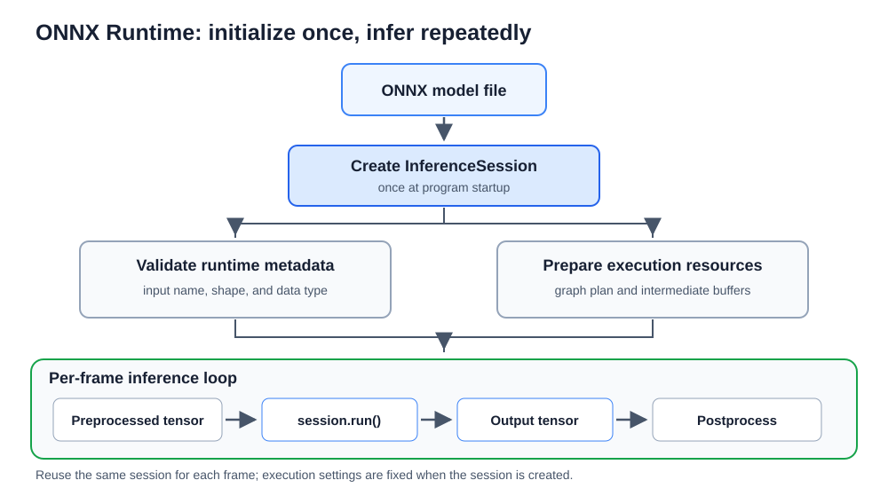

임베디드 추론 파이프라인은 보통 다음 네 단계로 구성한다.

- **세션 초기화**: 세션은 모델 파일을 읽어 실행 준비를 마친 객체이다. ONNX Runtime에서는 InferenceSession이 이 역할을 한다. 세션 초기화는 디스크의 .onnx 파일을 읽고, 파일에 저장된 바이트열을 다시 모델 구조와 텐서 정보로 되돌리는 역직렬화를 하며, 계산 그래프와 실행 계획을 메모리에 준비하는 과정이다. 매 프레임마다 세션을 다시 만들면 이 비용이 반복되므로, 보통 프로그램 시작 시 한 번 만들고 반복해서 재사용한다.
</p>

- **입출력 규격 확인**: 초기화 직후 session.get_inputs()와 session.get_outputs()를 호출해 모델이 요구하는 텐서 이름, 자료형(예: tensor(float))과 형상(예: [1, 3, 224, 224])을 읽는다. 2장의 전처리 절에서 설명한 연속 메모리 NCHW 배열이 이 규격과 맞는지 확인해야 session.run()에 같은 형식의 입력을 안정적으로 넣을 수 있다.
</p>

- **추론 반복 루프**: 카메라 스레드에서 받은 최신 프레임을 전처리한 뒤 session.run()에 넣어 추론을 실행한다. ONNX Runtime에는 메모리 플래너가 있어 중간 텐서에 필요한 메모리를 미리 계획하고 가능한 범위에서 다시 쓴다. 이렇게 하면 반복 실행 중 동적 메모리 할당, 즉 malloc처럼 실행 중에 새 메모리 영역을 요청하는 일이 줄어드는 경향이 있다. 다만 모델 구조, 입력 형상, 실행 제공자와 런타임 설정에 따라 달라지므로 모든 상황에서 동적 할당이 사라진다고 보장하지 않는다.
</p>

- **결과 후처리와 자원 해제**: 출력 텐서를 클래스 확률로 바꾸고 화면 표시 단계로 넘긴다. 프로그램이 끝날 때는 카메라 장치와 화면 창을 닫고, 더 이상 쓰지 않는 세션 객체가 정리되게 한다.

### ONNX Runtime 세션 아키텍처와 임베디드 최적화

ONNX Runtime은 실행 제공자(Execution Provider)를 이용해 계산을 어느 하드웨어와 라이브러리에 맡길지 정한다. 1장에서 본 CPUExecutionProvider는 CPU에서 ONNX 연산자를 실행하는 기본 실행 제공자이다. 실습 장비에는 별도 NPU를 쓰지 않으므로 이 장의 실습은 CPUExecutionProvider를 기준으로 진행한다.

SessionOptions는 InferenceSession을 만들 때 넘기는 설정 객체이다. 이 객체에 그래프 최적화 수준, 연산 내부 스레드 수 같은 값을 지정하면 세션이 만들어질 때 해당 설정이 반영된다. 한 번 만든 세션은 그 설정을 기준으로 실행되므로, 스레드 수를 비교하려면 설정이 다른 세션을 따로 만들거나 프로그램에서 새로 초기화해야 한다.

#### 그래프 최적화 수준

ONNX Runtime은 세션을 만들 때 계산 그래프를 분석해 일부 변환을 적용할 수 있다. 이 설정은 GraphOptimizationLevel 값으로 정한다. 실습에서는 가능한 최적화를 모두 켜는 ORT_ENABLE_ALL을 사용하지만, 변환 결과는 모델과 ONNX Runtime 버전에 따라 달라질 수 있다.

- **기본 최적화**: 실행 결과에 영향을 주지 않는 불필요한 노드를 지우고, 상수 접기처럼 실행 전에 계산할 수 있는 값을 미리 계산한다. 항등 연산이나 중복된 자료형 변환도 제거될 수 있다.
</p>

- **확장 최적화**: 노드 융합을 적용한다. 노드 융합은 Conv, BatchNormalization, Relu처럼 연속된 여러 노드를 하나의 더 큰 연산으로 묶는 변환이다. 이렇게 하면 중간 결과를 메모리에 쓰고 다시 읽는 횟수와 연산 커널 호출 횟수를 줄일 수 있다. 어떤 융합이 실제로 일어나는지는 그래프 형태와 실행 제공자에 따라 달라진다.
</p>

- **레이아웃 최적화**: 내부 텐서 배치를 실행 커널에 더 알맞게 바꾸어 불필요한 전치 연산이나 메모리 이동을 줄이려는 단계이다. CPU, GPU, NPU처럼 실행 제공자가 달라지면 유리한 배치도 달라질 수 있다.

#### 연산 내부 스레드 제어

intra_op_num_threads는 연산자 하나의 내부 계산을 몇 개의 스레드로 나누어 실행할지 정하는 값이다. 예를 들어 큰 합성곱이나 행렬 곱 하나를 여러 스레드가 나누어 계산하게 할 수 있다. inter_op 설정은 서로 다른 연산자 여러 개를 동시에 실행할 때의 병렬성을 뜻하며, 이 장의 실습은 주로 intra_op_num_threads를 바꾸어 비교한다.

Raspberry Pi 5에는 Cortex-A76 물리 코어 4개가 있으므로 1~4개 스레드를 후보로 둘 수 있다. 그러나 스레드 수를 물리 코어 수와 같게 둔다고 항상 가장 빠르지는 않다. 스레드를 나누고 다시 합치는 동기화 비용이 들고, 여러 코어가 같은 캐시와 메모리 대역폭을 함께 쓰기 때문이다.

또한 실제 서비스에서는 카메라 수집 스레드, 전처리, 화면 표시와 브라우저가 CPU를 함께 쓴다. 그래서 모델 호출만 보면 4개 스레드가 빠르더라도, 종단 간 처리에서는 2개나 3개 스레드가 더 안정적일 수 있다. 이 장의 실습에서는 여러 값을 실행해 보고, 평균뿐 아니라 P95와 P99 같은 꼬리 지연도 함께 본다.


### Cortex-A76의 NEON 벡터 연산

Raspberry Pi 5의 ARM Cortex-A76 코어는 1장에서 살펴본 128비트 NEON SIMD를 지원한다. SIMD는 명령어 하나로 여러 숫자를 한 번에 다루는 방식이다.

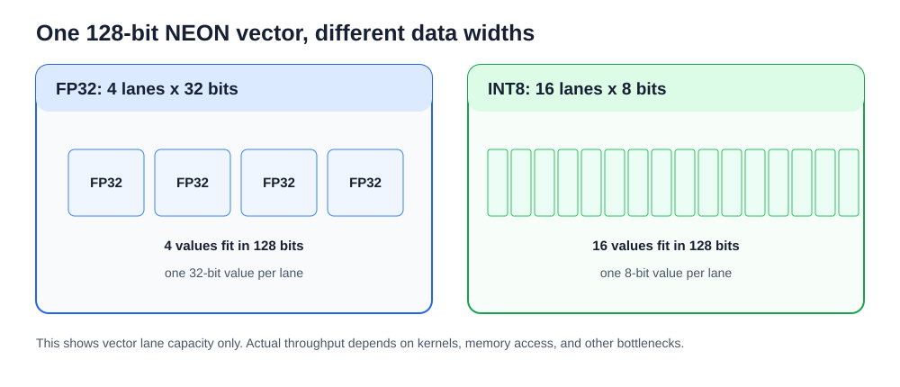

ONNX Runtime의 CPUExecutionProvider는 MLAS(Microsoft Linear Algebra Subprograms)를 사용한다. MLAS는 ONNX Runtime에 포함된 CPU용 수학 연산 라이브러리이며, 합성곱과 행렬 곱 같은 계산을 각 CPU에 맞는 커널로 실행한다. ARM64 환경에서는 가능한 경우 NEON 명령어를 쓰는 커널이 선택될 수 있다.

- **128비트 벡터 레지스터가 다루는 원소 수**: 128비트 크기의 NEON 벡터 레지스터 하나는 자료형에 따라 다음과 같은 개수의 원소를 한 명령어에서 다룰 수 있다.
  - **FP32(32비트 부동소수점)**: 128 bits / 32 bits = 4개 원소.
  - **INT8(8비트 정수)**: 128 bits / 8 bits = 16개 원소.
</p>

- **FMA 명령어**: FMA(Fused Multiply-Accumulate)는 $A \times B + C$ 형태의 곱셈과 덧셈을 하나의 명령어로 묶어 계산한다. 합성곱과 완전 연결 계층에서 자주 쓰이는 형태이므로 처리량을 높이는 데 도움을 준다.

다만 레지스터 폭만으로 실제 처리 속도를 단정할 수 없다. 실제 처리량은 명령어 발행 폭, 파이프라인, 캐시 적중률, 메모리 대역폭과 MLAS 커널 구현에 따라 달라진다. 2장의 연속 메모리 설명에서 본 것처럼 np.ascontiguousarray()로 배열을 연속 배치하면 런타임에 넘기는 입력 배열의 메모리 접근이 단순해진다. 그러나 입력 배열이 연속이라는 사실만으로 모든 내부 연산이 최고 속도로 실행된다고 보장하지는 않는다.

### 추론 결과의 의미와 출력 텐서 후처리

MobileNetV2와 같은 ImageNet 사전 학습 분류 모델의 session.run() 호출 결과는 보통 형상이 [1, 1000]인 FP32 텐서이다. 3장에서 다룬 것처럼 1000은 ImageNet 클래스 수이고, 각 값은 클래스별 로짓이다. 실시간 비전 프로그램은 이 로짓을 그대로 화면에 표시하지 않고, 확률처럼 해석하기 쉬운 값으로 바꾼 뒤 Top-1이나 Top-5 결과를 고른다.

#### 로짓과 소프트맥스 확률

로짓과 소프트맥스는 3장의 출력 일치도 검증에서 이미 사용했다. 로짓은 정규화되지 않은 예측 점수이므로 합이 1이 아니고 음수도 나올 수 있다. 소프트맥스는 로짓 $z_i$를 지수 함수로 바꾼 뒤 전체 합으로 나누어, 모든 클래스 확률의 합이 1이 되게 만든다.

$$P(y = i \mid x) = \frac{e^{z_i}}{\sum_{j=1}^{C} e^{z_j}} \quad (C = 1000)$$

여기서 $C$는 클래스 수이고, ImageNet 분류에서는 1000이다. 3장의 get_top5_predictions()처럼 가장 큰 로짓을 먼저 빼고 np.exp()를 적용하면 너무 큰 지수 값이 생기는 일을 줄일 수 있다.

소프트맥스 확률이 0.9로 나와도 입력이 반드시 올바른 물체라는 뜻은 아니다. 모델은 학습 데이터에 없던 물체가 들어와도 1000개 클래스 중 하나에 높은 값을 줄 수 있다. 따라서 카메라 서비스에서는 신뢰도 임계값을 두고, 예를 들어 0.6보다 낮은 결과는 화면 표시를 보류하는 방식이 필요할 수 있다.

#### 순수 추론 지연과 종단 간 처리 속도

실시간 임베디드 AI 시스템을 평가할 때는 모델 호출 시간과 화면에 결과가 갱신되는 속도를 구분해야 한다. session.run()만 빠르더라도 카메라 수신, 전처리, 후처리, 표시가 느리면 사용자가 보는 화면은 느리게 갱신된다. 반대로 화면 갱신은 빠르지만 같은 추론 결과를 오래 표시하고 있을 수도 있다.

| 성능 지표 | 측정 구간과 의미 | 평가 목적 |
|---|---|---|
| 순수 추론 지연 | session.run() 호출 시작부터 종료까지 걸린 시간(ms) | 모델 계산과 CPU 실행 설정 비교 |
| 이론상 모델 호출 FPS | 1000 / 순수 추론 지연 시간(ms) | 모델 호출만 고려한 최대 반복 가능 횟수 추정 |
| 카메라 입력 FPS | 카메라 스레드가 새 프레임을 받는 속도 | V4L2와 UVC 입력 흐름 확인 |
| 종단 간 처리 속도 | 캡처, 전처리, 추론, 후처리, 화면 표시를 포함한 전체 루프 속도 | 사용자가 보는 서비스의 실제 갱신 속도 확인 |

1000 / 순수 추론 지연으로 계산한 값은 모델 호출만 고려한 이론상 최대 FPS이다. 실제 서비스 FPS는 카메라와 전처리, 화면 표시, 스레드 경합을 포함하므로 이 값보다 낮아질 수 있다. 또한 평균만 보면 드물게 오래 걸린 프레임을 놓치기 쉬우므로, 2장에서 다룬 지터와 꼬리 지연을 떠올려 P95와 P99도 함께 확인한다.

### 실습 4-1. PyTorch Eager와 ONNX Runtime의 실시간 추론 속도 비교

> **풀고 싶은 문제**
> 같은 MobileNetV2를 PyTorch와 ONNX Runtime으로 실행할 때 추론 시간과 자원 사용량은 어떻게 달라지는가? 스레드 수에 따른 차이를 어떤 조건에서 비교해야 하는가?

이 실습의 목표는 같은 사전 학습 MobileNetV2를 PyTorch Eager와 ONNX Runtime으로 실행하면서 추론 지연 시간, 추론 FPS, 캡처 FPS, CPU 사용률과 RSS를 같은 화면에서 비교하는 것이다. 키 입력으로 실행 경로와 스레드 수를 바꾸어, 같은 장비에서도 런타임 설정에 따라 결과가 달라질 수 있음을 확인한다. 결과는 해당 장비와 런타임의 측정값이므로 어느 실행 경로가 항상 더 빠르다고 일반화하지 않는다.

카메라 캡처와 추론은 별도 스레드에서 수행해 화면 갱신이 추론 완료를 기다리지 않게 한다. ONNX Runtime 세션은 1/2/4 스레드 설정으로 미리 생성하고, PyTorch는 실행 중 torch.set_num_threads()로 스레드 수를 바꾼다. HUD에는 선택 경로, 추론·캡처 지표, CPU와 메모리 사용량, Top-1 라벨과 확률을 표시한다. 다만 경로를 전환하면 서로 다른 프레임이 입력될 수 있으므로, 이 실습은 같은 입력에 대한 출력 일치도 검증이 아니라 실시간 실행 조건의 속도 비교이다.

#### 사전 학습 1단계: ONNX Runtime 세션과 스레드 옵션 만들기

SessionOptions에 연산 내부 스레드 수와 그래프 최적화 수준을 지정한 뒤 InferenceSession을 만든다. 같은 모델을 반복 실행할 때는 세션을 계속 재사용한다.

```python
# step1_create_ort_session.py
import onnxruntime as ort

options = ort.SessionOptions()
options.intra_op_num_threads = 2
options.graph_optimization_level = ort.GraphOptimizationLevel.ORT_ENABLE_ALL
session = ort.InferenceSession(
    "mobilenet_v2_opt.onnx",
    sess_options=options,
    providers=["CPUExecutionProvider"]
)
print("입력 이름:", session.get_inputs()[0].name)
```

ort.SessionOptions()는 ONNX Runtime 세션을 만들 때 적용할 설정 객체를 생성한다. options.intra_op_num_threads = 2는 연산자 하나의 내부 계산을 두 스레드로 나누어 실행하도록 요청한다. options.graph_optimization_level은 앞에서 다룬 그래프 최적화 수준을 정하며, ORT_ENABLE_ALL은 가능한 최적화를 모두 켜라는 설정이다. InferenceSession에는 ONNX 파일 경로, sess_options, providers 목록을 넘긴다. providers=["CPUExecutionProvider"]는 CPU 실행 제공자를 쓰겠다는 뜻이다. session.get_inputs()[0].name은 모델의 첫 번째 입력 텐서 이름을 읽어, 뒤에서 session.run()에 입력 딕셔너리를 만들 때 쓴다.

#### 사전 학습 2단계: 모델 호출 시간과 FPS 계산

모델 호출만 측정하려면 입력 배열과 세션을 미리 준비하고, 워밍업 뒤 session.run() 주변의 경과 시간을 잰다. 이 값은 전처리나 카메라 입력을 포함하는 전체 반복 FPS와 다르다.

```python
# step2_time_model_call.py
import time
import numpy as np
from step1_create_ort_session import session

input_name = session.get_inputs()[0].name
sample = np.zeros((1, 3, 224, 224), dtype=np.float32)
feed = {input_name: sample}
for _ in range(3):
    session.run(None, feed)  # 워밍업

started = time.perf_counter()
for _ in range(10):
    session.run(None, feed)
elapsed = time.perf_counter() - started
mean_ms = elapsed * 1000 / 10
print(f"평균 호출 시간: {mean_ms:.2f}ms, 환산 FPS: {1000 / mean_ms:.1f}")
```

sample = np.zeros((1, 3, 224, 224), dtype=np.float32)는 모델 입력 형상과 자료형에 맞는 더미 입력 배열을 만든다. feed = {input_name: sample}은 입력 이름을 키로, 실제 입력 배열을 값으로 담은 딕셔너리이다. session.run(None, feed)의 첫 번째 인자 None은 모델의 모든 출력을 받겠다는 뜻이다.

워밍업 추론은 시간 측정 전에 같은 호출을 몇 번 실행하는 절차이다. 첫 호출에는 내부 준비나 캐시 상태 때문에 시간이 더 걸릴 수 있으므로, 여기서는 세 번 실행한 뒤 10회 반복 시간을 잰다. time.perf_counter()는 짧은 구간의 경과 시간을 재는 데 알맞은 고해상도 타이머이다. mean_ms는 10회 전체 시간을 호출 횟수로 나눈 평균 호출 시간이며, 1000 / mean_ms는 모델 호출 시간만으로 환산한 이론상 FPS이다.

#### 최종 구현

```python
# realtime_framework_comparator.py
import argparse
import os
from pathlib import Path
import time
import urllib.request
import threading

import cv2
import numpy as np
import onnxruntime as ort
import psutil
import torch
import torchvision.models as models
from async_camera_engine import HighPerformanceAsyncCamera
from vision_preprocessor_suite import VisionPreprocessor

def download_labels_if_needed(label_path="imagenet_classes.txt"):
    path = Path(label_path)
    if not path.is_file():
        url = "https://raw.githubusercontent.com/pytorch/hub/master/imagenet_classes.txt"
        print("ImageNet 라벨 파일 다운로드 중...")
        urllib.request.urlretrieve(url, str(path))
    return [line.strip() for line in path.read_text(encoding="utf-8").splitlines() if line.strip()]


def softmax(x):
    e_x = np.exp(x - np.max(x))
    return e_x / e_x.sum(axis=-1, keepdims=True)

class AsyncInferenceWorker:
    """독립 스레드에서 추론을 전담해 메인 화면 루프의 대기를 줄이는 워커"""
    def __init__(self, torch_model, ort_sessions, preprocessor, labels):
        self.torch_model = torch_model
        self.ort_sessions = ort_sessions
        self.preprocessor = preprocessor
        self.labels = labels

        self.current_engine = "ONNX Runtime"
        self.current_threads = 4

        self.latest_frame = None
        self.has_new_frame = False
        self.running = True
        self.lock = threading.Lock()
        self.condition = threading.Condition(self.lock)

        # 추론 통계 및 결과 데이터
        self.last_infer_ms = 0.0
        self.infer_fps = 0.0
        self.last_top_label = "Ready"
        self.last_top_prob = 0.0

        self.infer_count = 0
        self.fps_timer = time.perf_counter()

        self.thread = threading.Thread(target=self._worker_loop, daemon=True)
        self.thread.start()

    def set_config(self, engine, threads):
        with self.lock:
            self.current_engine = engine
            self.current_threads = threads
            if engine == "PyTorch Eager":
                torch.set_num_threads(threads)

    def push_frame(self, frame):
        frame_copy = frame.copy()
        with self.lock:
            self.latest_frame = frame_copy
            self.has_new_frame = True
            self.condition.notify()

    def get_results(self):
        with self.lock:
            return (
                self.current_engine,
                self.current_threads,
                self.last_infer_ms,
                self.infer_fps,
                self.last_top_label,
                self.last_top_prob
            )

    def _worker_loop(self):
        while self.running:
            with self.lock:
                while not self.has_new_frame and self.running:
                    self.condition.wait(timeout=0.05)
                
                if not self.running:
                    break
                
                frame_to_process = self.latest_frame
                self.has_new_frame = False
                engine = self.current_engine
                threads = self.current_threads

            if frame_to_process is None:
                continue

            # 전처리와 추론 수행(메인 화면 루프와 분리)
            # letterbox() 반환 튜플에서 패딩 영상만 사용
            letterboxed_img, _ = self.preprocessor.letterbox(frame_to_process)
            input_tensor_np = self.preprocessor.transform_to_tensor(letterboxed_img)

            t_start = time.perf_counter()
            if engine == "PyTorch Eager":
                input_tensor_torch = torch.from_numpy(input_tensor_np)
                with torch.inference_mode():
                    logits = self.torch_model(input_tensor_torch).cpu().numpy()[0]
            else:
                sess = self.ort_sessions[threads]
                input_name = sess.get_inputs()[0].name
                logits = sess.run(None, {input_name: input_tensor_np})[0][0]
            
            infer_ms = (time.perf_counter() - t_start) * 1000.0

            probs = softmax(logits)
            top_idx = int(np.argmax(probs))
            top_label = self.labels[top_idx] if top_idx < len(self.labels) else f"Class {top_idx}"
            top_prob = float(probs[top_idx])

            # 통계 갱신
            self.infer_count += 1
            now = time.perf_counter()
            if now - self.fps_timer >= 1.0:
                calc_fps = self.infer_count / (now - self.fps_timer)
                self.infer_count = 0
                self.fps_timer = now
            else:
                calc_fps = self.infer_fps

            with self.lock:
                self.last_infer_ms = infer_ms
                self.infer_fps = calc_fps
                self.last_top_label = top_label
                self.last_top_prob = top_prob

    def stop(self):
        with self.lock:
            self.running = False
            self.condition.notify_all()
        if self.thread.is_alive():
            self.thread.join(timeout=1.0)


def draw_hud(frame, engine_name, threads, infer_ms, infer_fps, cam_fps, cpu_pct, rss_mb, top_label, top_prob):
    x1, y1, x2, y2 = 10, 10, 420, 175
    roi = frame[y1:y2, x1:x2]
    panel = np.full(roi.shape, (15, 23, 42), dtype=np.uint8)
    cv2.addWeighted(panel, 0.75, roi, 0.25, 0, dst=roi)
    cv2.rectangle(frame, (x1, y1), (x2, y2), (6, 182, 212), 1)

    eng_col = (0, 120, 255) if engine_name == "PyTorch Eager" else (0, 255, 120)
    cv2.putText(frame, f"ENGINE : {engine_name} ({threads} Threads)", (20, 32),
                cv2.FONT_HERSHEY_SIMPLEX, 0.52, eng_col, 2, cv2.LINE_AA)

    cv2.putText(frame, f"Infer Latency : {infer_ms:4.1f} ms | Infer FPS : {infer_fps:4.1f}", (20, 58),
                cv2.FONT_HERSHEY_SIMPLEX, 0.42, (240, 240, 240), 1, cv2.LINE_AA)
    cv2.putText(frame, f"Camera Stream : {cam_fps:4.1f} FPS", (20, 80),
                cv2.FONT_HERSHEY_SIMPLEX, 0.42, (200, 200, 200), 1, cv2.LINE_AA)
    cv2.putText(frame, f"CPU Usage     : {cpu_pct:4.1f} %   | Process RSS : {rss_mb:4.1f} MB", (20, 102),
                cv2.FONT_HERSHEY_SIMPLEX, 0.42, (255, 200, 0), 1, cv2.LINE_AA)
    cv2.putText(frame, f"Top-1 Predict : {top_label} ({top_prob*100:.1f}%)", (20, 128),
                cv2.FONT_HERSHEY_SIMPLEX, 0.46, (0, 255, 255), 1, cv2.LINE_AA)

    cv2.putText(frame, "[P] PyTorch  [O] ONNX  [1/2/4] Threads  [Q] Exit", (20, 155),
                cv2.FONT_HERSHEY_SIMPLEX, 0.38, (160, 160, 160), 1, cv2.LINE_AA)


def main():
    parser = argparse.ArgumentParser(description="PyTorch vs ONNX Runtime 실시간 카메라 듀얼 벤치마크")
    parser.add_argument("--onnx-model", default="mobilenet_v2_opt.onnx")
    args = parser.parse_args()

    labels = download_labels_if_needed()
    if not Path(args.onnx_model).is_file():
        raise FileNotFoundError(f"ONNX 모델이 없습니다: {args.onnx_model}.")

    print("=" * 70)
    print("   PyTorch Eager vs ONNX Runtime 실시간 카메라 비동기 듀얼 벤치마크")
    print("=" * 70)

    print("1. PyTorch Eager 모델 로드 중...")
    torch_model = models.mobilenet_v2(weights=models.MobileNet_V2_Weights.DEFAULT).eval()

    print("2. ONNX Runtime 세션 초기화 중 (1, 2, 4 스레드)...")
    ort_sessions = {}
    for t in (1, 2, 4):
        opts = ort.SessionOptions()
        opts.intra_op_num_threads = t
        opts.graph_optimization_level = ort.GraphOptimizationLevel.ORT_ENABLE_ALL
        sess = ort.InferenceSession(str(args.onnx_model), sess_options=opts, providers=["CPUExecutionProvider"])
        ort_sessions[t] = sess

    cam = HighPerformanceAsyncCamera()
    
    # 워커 스레드 전용 전처리 객체 생성
    preprocessor = VisionPreprocessor(target_size=(224, 224))
    
    # 비동기 추론 워커 시작
    infer_worker = AsyncInferenceWorker(torch_model, ort_sessions, preprocessor, labels)

    process = psutil.Process(os.getpid())
    process.cpu_percent(None)

    current_engine = "ONNX Runtime"
    current_threads = 4
    infer_worker.set_config(current_engine, current_threads)

    last_cpu = 0.0
    last_rss = process.memory_info().rss / (1024 * 1024)
    last_telemetry_time = 0.0

    print("\n카메라 뷰어 실행 중: 화면 안내를 참고하여 키를 누르세요.")

    try:
        while True:
            # 캡처 엔진에서 최신 프레임 획득
            success, frame, _ = cam.read_latest(block=True, timeout=0.1)
            if not success:
                continue

            # 추론 전용 워커 스레드로 최신 프레임 전달
            infer_worker.push_frame(frame)

            # 비동기 추론 결과를 대기 없이 읽음
            engine_name, threads, infer_ms, infer_fps, top_label, top_prob = infer_worker.get_results()

            now = time.perf_counter()
            if now - last_telemetry_time >= 0.5:
                last_cpu = process.cpu_percent(None)
                last_rss = process.memory_info().rss / (1024 * 1024)
                last_telemetry_time = now

            display_frame = frame.copy()
            stats = cam.get_stats()
            
            # 메인 스레드는 화면 표시 작업을 수행
            draw_hud(
                display_frame,
                engine_name,
                threads,
                infer_ms,
                infer_fps,
                stats.get("capture_fps", 0.0),
                last_cpu,
                last_rss,
                top_label,
                top_prob
            )

            cv2.imshow("Dual Engine Realtime Benchmark", display_frame)
            key = cv2.waitKey(1) & 0xFF
            if key == ord('q'):
                break
            elif key in (ord('p'), ord('P')):
                current_engine = "PyTorch Eager"
                infer_worker.set_config(current_engine, current_threads)
            elif key in (ord('o'), ord('O')):
                current_engine = "ONNX Runtime"
                infer_worker.set_config(current_engine, current_threads)
            elif key == ord('1'):
                current_threads = 1
                infer_worker.set_config(current_engine, 1)
            elif key == ord('2'):
                current_threads = 2
                infer_worker.set_config(current_engine, 2)
            elif key == ord('4'):
                current_threads = 4
                infer_worker.set_config(current_engine, 4)
    finally:
        infer_worker.stop()
        cam.release()
        cv2.destroyAllWindows()


if __name__ == "__main__":
    main()
```

**코드 해설**

realtime_framework_comparator.py는 카메라 입력 스레드, 추론 워커 스레드, 메인 화면 루프를 나누어 실행한다. main()은 라벨 파일을 준비하고 PyTorch 모델과 ONNX Runtime 세션을 만든 뒤, HighPerformanceAsyncCamera와 AsyncInferenceWorker를 시작한다. 반복 루프에서는 최신 프레임을 워커에 전달하고, 워커가 마지막으로 계산한 결과를 읽어 HUD를 그린다. 종료할 때는 finally 블록에서 워커, 카메라와 OpenCV 창을 정리한다.

download_labels_if_needed()는 pathlib.Path로 라벨 파일 존재 여부를 확인하고, 없으면 urllib.request.urlretrieve()로 내려받는다. softmax()는 3장에서 다룬 방식처럼 가장 큰 로짓을 빼고 지수 함수를 적용해 확률 분포를 만든다. draw_hud()는 화면 왼쪽 위 ROI에 반투명 패널을 만들고, 실행 경로, 스레드 수, 추론 지연, 추론 FPS, 카메라 스트림 FPS, CPU 사용률, RSS, Top-1 라벨과 확률을 표시한다. Top-1 라벨과 확률은 워커가 마지막으로 완료한 추론 결과이다.

AsyncInferenceWorker는 추론을 별도 스레드에서 처리하는 클래스이다. __init__()은 모델, 세션 딕셔너리, 전처리 객체와 라벨 목록을 저장하고, threading.Lock()과 threading.Condition()을 만든다. 락은 여러 스레드가 같은 변수에 동시에 접근하지 못하게 보호하고, 조건 변수는 새 프레임이 들어올 때까지 워커 스레드가 기다리게 한다. 이 구조는 2장에서 다룬 스레드 동기화와 같은 원리이며, 여기서는 최신 프레임과 마지막 추론 결과를 안전하게 주고받는 데 쓴다.

push_frame()은 frame.copy()로 프레임 사본을 만든 뒤 latest_frame에 저장하고 condition.notify()로 워커를 깨운다. 이 복사 비용은 Infer Latency에 포함되지 않지만, 메인 루프의 실제 화면 갱신 비용에는 영향을 준다. _worker_loop()는 condition.wait(timeout=0.05)로 새 프레임을 기다리고, 프레임을 받으면 레터박스와 텐서 변환을 거친 뒤 선택된 경로로 모델을 호출한다. PyTorch Eager 경로는 torch.from_numpy()와 torch.inference_mode()를 쓰고, ONNX Runtime 경로는 선택된 스레드 수의 세션에서 session.run()을 호출한다.

set_config()는 현재 실행 경로와 스레드 수를 바꾼다. PyTorch Eager를 선택한 경우 torch.set_num_threads(threads)를 호출해 PyTorch 내부 연산 스레드 수를 바꾼다. ONNX Runtime은 이미 1/2/4 스레드 세션을 만들어 두었으므로, 워커는 self.ort_sessions[threads]로 해당 세션을 선택한다. 세션 생성 시간이 프레임별 Infer Latency에 섞이지 않도록 시작 단계에서 미리 만들었다는 점이 중요하다.

HUD의 측정 이름은 다음처럼 해석한다.

| HUD 항목 | 코드에서의 측정 범위 | 해석할 때의 주의점 |
|---|---|---|
| ENGINE | current_engine과 current_threads | P 키는 PyTorch Eager, O 키는 ONNX Runtime을 선택하며, 1/2/4 키는 스레드 수를 바꾼다. |
| Infer Latency | 워커의 t_start 직후부터 PyTorch 모델 호출 또는 session.run()이 끝날 때까지 | 전처리, frame.copy(), 화면 표시 시간은 포함하지 않는 순수 모델 호출 시간이다. |
| Infer FPS | 워커가 1초 동안 완료한 추론 횟수 | 비동기 구조에서는 화면 표시 FPS와 다를 수 있다. 첫 1초 전에는 초기값 0.0이 보일 수 있다. |
| Camera Stream | HighPerformanceAsyncCamera의 capture_fps | 카메라 스레드가 프레임을 받는 속도이며, 추론 완료 횟수와 같은 값이 아니다. |
| CPU Usage | psutil.Process(os.getpid()).cpu_percent(None) | 이 프로세스의 CPU 사용률이다. 0.5초마다 갱신되므로 순간 추론 한 번의 사용률이 아니다. |
| Process RSS | process.memory_info().rss를 MB로 환산한 값 | 현재 프로세스가 실제 메모리에 올려 둔 물리 메모리 크기이다. |
| Top-1 Predict | np.argmax(probs)로 고른 라벨과 소프트맥스 확률 | 마지막으로 완료된 추론 결과이며, 현재 화면 프레임과 완전히 같은 시점의 결과라고 단정하지 않는다. |

psutil.Process(os.getpid())는 현재 실행 중인 파이썬 프로세스를 나타내는 객체를 만든다. memory_info().rss는 RSS(Resident Set Size)를 바이트 단위로 돌려주며, 코드는 1024×1024로 나누어 MB 단위로 표시한다. process.cpu_percent(None)은 이전 호출 이후의 CPU 사용률을 계산하므로, main() 시작 직후 한 번 호출해 기준점을 만들고 이후 0.5초마다 값을 갱신한다.

이 프로그램은 비동기 구조이므로 화면 갱신과 추론 완료가 1:1로 맞지 않을 수 있다. 워커가 느리면 화면은 계속 갱신되지만 Top-1 결과는 이전 추론 결과가 유지된다. 반대로 추론이 빠르고 카메라와 화면 표시가 충분히 빠르면 Infer FPS와 Camera Stream이 비슷하게 보일 수 있다. 같은 모델을 두 경로로 비교할 때는 입력 크기, 냉각 상태, 백그라운드 부하와 스레드 수를 함께 기록해야 한다.

> **알아두기 - 실행 경로와 측정 결과**
> ONNX Runtime은 네이티브 커널과 그래프 최적화를 사용할 수 있지만 실제 연산 경로와 성능은 빌드, 모델, 장치에 따라 달라진다. 따라서 측정값만으로 모든 환경의 속도 우열이나 분류 정확도를 단정하지 않는다.

**실행 결과와 확인할 점**

realtime_framework_comparator.py를 실행한다.

```sh
python realtime_framework_comparator.py
```

화면이 나타나면 카메라 앞에 다양한 사물을 비추고 키를 누르며 다음 항목들을 대조한다.
- 실행 경로: P 키로 PyTorch Eager, O 키로 ONNX Runtime을 선택한다. HUD의 ENGINE 항목이 바뀌는지 확인한다.
- 추론 시간: 각 경로의 Infer Latency를 기록한다. 이 값은 전처리와 화면 표시를 제외한 모델 호출 시간인지 확인한다.
- 스레드 수: 1, 2, 4 키로 설정을 바꾸고, 4스레드일 때와 다른 스레드 수일 때의 Infer FPS와 CPU Usage를 비교한다. 스레드를 늘려도 처리량이 같은 비율로 증가하지 않을 수 있다.
- 카메라 입력: Camera Stream은 카메라 캡처 스레드의 속도인지 확인한다. 이 실습은 Display FPS를 별도로 표시하지 않으므로 화면 갱신 속도와 추론 완료 속도를 같은 값으로 해석하지 않는다.
- 자원 사용량: CPU Usage와 Process RSS를 기록한다. 장시간 비교할 때는 별도 온도 측정 결과도 함께 적어 열 제한이 측정값에 영향을 주는지 확인한다.
- 분류 표시: HUD의 Top-1 Predict에 라벨과 확률이 표시되는지 확인한다. 경로를 바꾼 직후에는 이전 추론 결과가 잠시 남아 있을 수 있다.

> **한 걸음 더**
> 1. 실행 경로와 스레드 수를 고정하고 일정 시간 동안 지연 시간, CPU 사용률과 온도를 기록한다. 냉각 조건도 함께 적는다.
> 2. 같은 저장 프레임을 두 실행 경로에 각각 입력하고 Top-1 및 Top-5 결과를 비교한다. 몇 장면의 일치가 전체 분류 정확도를 입증하지는 않는다는 점을 설명한다.

### 실습 4-2. 카메라 분류 결과를 확률 기준으로 보류하기

> **풀고 싶은 문제**
> 카메라 입력, 모델 실행과 화면 갱신 속도는 각각 어떻게 측정하는가? 확률 임계값과 Top-1/Top-2 격차는 어떤 경우에 결과 표시를 보류하는가?

이 실습에서는 ONNX Runtime으로 MobileNetV2 분류 모델을 실행하고, 화면에 표시할 결과를 확률 규칙으로 한 번 더 거른다. 카메라 프레임은 중앙 크롭으로 정사각형 관심 영역(ROI)만 잘라 모델에 넣는다. 관심 영역은 원본 영상 안에서 실제로 처리 대상이 되는 부분 영역이다.

소프트맥스 출력은 합이 1인 점수 분포일 뿐 정답 가능성이나 입력이 학습 데이터와 비슷한 정도를 보장하지 않는다. 학습에 없는 장면에도 한 클래스가 높은 점수를 받을 수 있고, 프레임별 예측은 장면 변화와 영상 잡음에 따라 흔들릴 수 있다. 따라서 이 실습은 최근 다섯 프레임의 확률 평균, Top-1 절대 확률 임계값, Top-1과 Top-2의 확률 차이인 마진을 함께 사용해 표시를 보류한다. 이 규칙은 화면 표시를 조심스럽게 만드는 예제이며, 확률 보정이나 미등록 객체 판별기는 아니다.

Capture FPS는 카메라 클래스가 프레임을 받아 오는 속도이다. Infer FPS와 Display FPS는 동기식 반복에서 각각 추론 완료 횟수와 화면 표시 반복 횟수를 센 값이다. 이 루프는 매번 추론과 표시를 모두 수행하므로 두 값은 순수 모델 최대 처리량을 뜻하지 않는다. 종료 시에는 session.run() 모델 호출 시간만 모아 P50/P95/P99를 출력한다.

#### 사전 학습 1단계: 온도 매개변수로 소프트맥스 계산
온도 매개변수 T는 소프트맥스에 넣기 전에 로짓을 얼마나 나누어 줄지 정하는 값이다. T가 1.0이면 원래 로짓을 그대로 쓰고, T가 0.5처럼 작으면 점수 차이가 커져 가장 큰 클래스에 확률이 더 몰린다. T가 2.0처럼 크면 점수 차이가 줄어 확률 분포가 더 평평해진다. 예를 들어 로짓 [2.0, 1.0, 0.1]은 T=0.5에서 대략 [0.864, 0.117, 0.019], T=1.0에서 [0.659, 0.242, 0.099], T=2.0에서 [0.501, 0.304, 0.194]가 된다.

로짓을 온도 T로 나눈 뒤 최댓값을 빼면 큰 수치에서 지수 계산이 불안정해지는 문제를 줄일 수 있다. 온도 조절은 확률 분포의 모양을 바꾸는 후처리일 뿐 모델의 정확도를 높이거나 확률을 실제 정답 확률에 맞추는 확률 보정이 아니다.

```python
# step1_softmax_temperature.py
import numpy as np

def softmax_with_temperature(logits, temperature):
    scaled = logits / temperature
    exponentials = np.exp(scaled - np.max(scaled))
    return exponentials / exponentials.sum()

scores = np.array([2.0, 1.0, 0.1], dtype=np.float32)
print(softmax_with_temperature(scores, 0.5))
```

softmax_with_temperature()는 로짓 배열과 온도 값을 인자로 받아 확률 배열을 반환한다. scaled = logits / temperature는 모든 로짓을 같은 온도로 나눈다. np.max(scaled)는 배열에서 가장 큰 값을 찾고, np.exp()는 각 원소의 지수 값을 계산한다. exponentials.sum()은 모든 지수 값을 더하며, 각 지수 값을 이 합으로 나누면 전체 합이 1인 소프트맥스 확률이 된다. dtype=np.float32는 배열 원소를 32비트 부동소수점으로 저장하라는 뜻이다.

#### 사전 학습 2단계: 최근 확률 평균과 Top-1/Top-2 차이
최근 프레임의 확률 벡터를 deque에 저장하면 짧은 변동을 평균으로 줄일 수 있다. deque는 양쪽 끝에 값을 빠르게 넣고 뺄 수 있는 자료구조이다. maxlen=5를 지정하면 여섯 번째 값을 넣을 때 가장 오래된 값이 자동으로 빠져 최근 다섯 개만 남는다. 가장 큰 확률과 두 번째로 큰 확률의 차이가 작으면 두 후보가 비슷하다는 뜻이므로 결과를 확정하지 않고 보류할 수 있다.

```python
# step2_smooth_and_hold.py
from collections import deque
import numpy as np

history = deque(maxlen=5)
history.append(np.array([0.52, 0.40, 0.08]))
history.append(np.array([0.46, 0.45, 0.09]))
average = np.mean(history, axis=0)
top_two = np.sort(average)[-2:]
top1, top2 = top_two[1], top_two[0]
show_label = top1 >= 0.30 and top1 - top2 >= 0.10
print("확정 표시:", show_label)
```

history.append()는 새 확률 벡터를 deque 끝에 넣는다. np.mean(history, axis=0)은 저장된 여러 확률 벡터를 같은 클래스끼리 평균낸다. axis=0은 첫 번째 축, 즉 프레임 방향으로 평균을 내고 클래스 축은 유지하라는 뜻이다. np.sort(average)는 확률을 작은 값에서 큰 값 순서로 정렬하고, [-2:]는 마지막 두 값인 가장 큰 두 확률을 고른다. show_label은 Top-1 확률이 0.30 이상이고 Top-1과 Top-2의 차이가 0.10 이상일 때만 True가 된다.

#### 사전 학습 3단계: 지연 시간의 백분위 계산
평균은 긴 지연이 드물게 발생하는 상황을 가릴 수 있으므로, 측정값을 배열로 모아 P50/P95/P99를 함께 계산한다. 이 단계에서는 앞 절에서 다룬 백분위 지표를 실제 NumPy 함수로 계산한다.

```python
# step3_latency_percentiles.py
import numpy as np

latencies_ms = np.array([8.2, 9.1, 10.4, 11.0, 25.0])
for percentile in (50, 95, 99):
    print(f"P{percentile}: {np.percentile(latencies_ms, percentile):.2f}ms")
```

latencies_ms 배열에는 모델 호출 시간을 ms 단위로 모은다. for percentile in (50, 95, 99)는 세 백분위 값을 차례로 반복한다. np.percentile()은 배열과 백분위 숫자를 받아 해당 위치의 값을 계산한다. f"P{percentile}: ..."는 P50, P95, P99처럼 이름을 붙여 출력하고, :.2f는 소수 둘째 자리까지 표시하라는 f-문자열 형식 지정자이다.

#### 최종 구현
```python
# realtime_classifier.py
import argparse
from collections import deque
from pathlib import Path
import time
import urllib.request

import cv2
import numpy as np
import onnxruntime as ort
from async_camera_engine import HighPerformanceAsyncCamera
from vision_preprocessor_suite import VisionPreprocessor


def download_labels_if_needed(label_path="imagenet_classes.txt"):
    path = Path(label_path)
    if not path.is_file():
        url = "https://raw.githubusercontent.com/pytorch/hub/master/imagenet_classes.txt"
        print("ImageNet 라벨 파일 다운로드 중...")
        urllib.request.urlretrieve(url, str(path))
    return [line.strip() for line in path.read_text(encoding="utf-8").splitlines() if line.strip()]


def softmax_with_temperature(x, temperature=0.35):
    x_scaled = x / temperature
    e_x = np.exp(x_scaled - np.max(x_scaled))
    return e_x / e_x.sum(axis=-1, keepdims=True)


def draw_classification_hud(frame, capture_fps, infer_fps, display_fps, infer_ms, top_results, temperature, threshold=0.30, margin_threshold=0.15):
    # 온도와 키 안내를 표시할 HUD 패널 영역을 만든다.
    x1, y1, x2, y2 = 10, 10, 460, 175
    roi = frame[y1:y2, x1:x2]
    panel = np.full(roi.shape, (15, 23, 42), dtype=np.uint8)
    cv2.addWeighted(panel, 0.75, roi, 0.25, 0, dst=roi)
    cv2.rectangle(frame, (x1, y1), (x2, y2), (6, 182, 212), 1)

    # 헤더 제목
    cv2.putText(frame, "REALTIME AI CLASSIFIER (ONNX 4T)", (20, 30),
                cv2.FONT_HERSHEY_SIMPLEX, 0.52, (0, 255, 255), 1, cv2.LINE_AA)

    # FPS 정보
    cv2.putText(frame, f"Capture: {capture_fps:4.1f} | Infer: {infer_fps:4.1f} | Display: {display_fps:4.1f} FPS",
                (20, 50), cv2.FONT_HERSHEY_SIMPLEX, 0.40, (200, 200, 200), 1, cv2.LINE_AA)
    
    # 모델 호출 시간과 현재 온도 값
    cv2.putText(frame, f"Model Latency: {infer_ms:4.1f} ms  |  Temp: {temperature:.2f}",
                (20, 70), cv2.FONT_HERSHEY_SIMPLEX, 0.42, (0, 255, 0), 1, cv2.LINE_AA)

    # Top 1 결과
    top1_name, top1_prob = top_results[0]
    top2_name, top2_prob = top_results[1]
    top3_name, top3_prob = top_results[2]
    prob_margin = top1_prob - top2_prob

    if top1_prob >= threshold and prob_margin >= margin_threshold:
        cv2.putText(frame, f"Top 1: {top1_name} ({top1_prob*100:.1f}%)", (20, 98),
                    cv2.FONT_HERSHEY_SIMPLEX, 0.48, (0, 255, 120), 2, cv2.LINE_AA)
    else:
        cv2.putText(frame, f"Top 1: Unsure / Low Margin ({top1_prob*100:.1f}%)", (20, 98),
                    cv2.FONT_HERSHEY_SIMPLEX, 0.48, (0, 165, 255), 2, cv2.LINE_AA)

    # Top 2, Top 3 보조 정보
    cv2.putText(frame, f"Top 2: {top2_name} ({top2_prob*100:.1f}%) | Top 3: {top3_name} ({top3_prob*100:.1f}%)",
                (20, 125), cv2.FONT_HERSHEY_SIMPLEX, 0.38, (180, 180, 180), 1, cv2.LINE_AA)

    # 실시간 키 조절 안내
    cv2.putText(frame, f"[Keys] 'a': Temp -0.05 | 'd': Temp +0.05 | 'q': Quit",
                (20, 150), cv2.FONT_HERSHEY_SIMPLEX, 0.35, (140, 140, 140), 1, cv2.LINE_AA)


class VisionPreprocessor(VisionPreprocessor):
    def __init__(self, target_size=(224, 224), pad_color=(114, 114, 114)):
        super().__init__(target_size=target_size, pad_color=pad_color)

    def center_crop(self, img):
        h_src, w_src = img.shape[:2]
        w_dst, h_dst = self.w_dst, self.h_dst

        crop_size = min(h_src, w_src)
        top = (h_src - crop_size) // 2
        left = (w_src - crop_size) // 2

        cropped = img[top : top + crop_size, left : left + crop_size]
        resized = cv2.resize(cropped, (w_dst, h_dst), interpolation=cv2.INTER_LINEAR)

        params = {
            "crop_size": crop_size,
            "crop_left": left,
            "crop_top": top,
            "src_shape": (h_src, w_src)
        }
        return resized, params


def main():
    parser = argparse.ArgumentParser(description="실시간 카메라 분류와 확률 기반 표시 보류")
    parser.add_argument("--onnx-model", default="mobilenet_v2_opt.onnx")
    parser.add_argument("--threshold", type=float, default=0.30, help="Top-1 최소 절대 확률 임계값")
    parser.add_argument("--margin-threshold", type=float, default=0.15, help="Top-1과 Top-2 간의 최소 확률 격차 임계값")
    args = parser.parse_args()

    labels = download_labels_if_needed()
    if not Path(args.onnx_model).is_file():
        raise FileNotFoundError(f"ONNX 모델이 없습니다: {args.onnx_model}.")

    opts = ort.SessionOptions()
    opts.intra_op_num_threads = 4  # 연산자 내부 4스레드 병렬화
    opts.execution_mode = ort.ExecutionMode.ORT_SEQUENTIAL  # 그래프를 순차 실행 모드로 설정
    opts.graph_optimization_level = ort.GraphOptimizationLevel.ORT_ENABLE_ALL
    session = ort.InferenceSession(str(args.onnx_model), sess_options=opts, providers=["CPUExecutionProvider"])
    input_name = session.get_inputs()[0].name

    cam = HighPerformanceAsyncCamera()
    preprocessor = VisionPreprocessor(target_size=(224, 224))

    prob_history = deque(maxlen=5)
    temperature = 0.40  # 초기 온도 설정

    print("=" * 70)
    print("      실시간 카메라 사물 분류 서비스 시작 (종료: 'q')")
    print(f"      표시 확률 기준: {args.threshold*100:.1f}% | 격차 기준: {args.margin_threshold*100:.1f}%")
    print("      조절 키: 'a' (Temperature 감소), 'd' (Temperature 증가)")
    print("=" * 70)

    latencies = []
    infer_count = 0
    display_count = 0
    infer_fps = 0.0
    display_fps = 0.0
    infer_fps_timer = time.perf_counter()
    display_fps_timer = time.perf_counter()

    try:
        while True:
            success, frame, _ = cam.read_latest(block=True, timeout=0.1)
            if not success:
                continue

            display_frame = frame.copy()
            cropped_img, crop_params = preprocessor.center_crop(frame)
            input_tensor = preprocessor.transform_to_tensor(cropped_img)

            # 순수 추론 시간 측정
            t0 = time.perf_counter()
            logits = session.run(None, {input_name: input_tensor})[0][0]
            infer_ms = (time.perf_counter() - t0) * 1000.0
            latencies.append(infer_ms)
            infer_count += 1
            infer_now = time.perf_counter()
            if infer_now - infer_fps_timer >= 1.0:
                interval = infer_now - infer_fps_timer
                infer_fps = infer_count / interval
                infer_count = 0
                infer_fps_timer = infer_now

            # 온도 적용 소프트맥스
            current_probs = softmax_with_temperature(logits, temperature=temperature)
            
            # 최근 5프레임 이동 평균
            prob_history.append(current_probs)
            smoothed_probs = np.mean(prob_history, axis=0)

            # Top-3 클래스 추출
            top3_idx = np.argsort(smoothed_probs)[-3:][::-1]
            top_results = [(labels[i] if i < len(labels) else f"Class {i}", float(smoothed_probs[i])) for i in top3_idx]

            # 중앙 크롭 관심 영역을 화면에 표시한다.
            crop_size = crop_params["crop_size"]
            x1_crop = crop_params["crop_left"]
            y1_crop = crop_params["crop_top"]
            cv2.rectangle(display_frame, (x1_crop, y1_crop), 
                          (x1_crop + crop_size, y1_crop + crop_size), (0, 255, 0), 2)

            # HUD 그리기
            stats = cam.get_stats()
            draw_classification_hud(
                display_frame,
                stats.get("capture_fps", 0.0),
                infer_fps,
                display_fps,
                infer_ms,
                top_results,
                temperature=temperature,
                threshold=args.threshold,
                margin_threshold=args.margin_threshold
            )

            cv2.imshow("Realtime Vision Classifier", display_frame)

            # 실시간 키 입력 조절('a': -0.05, 'd': +0.05, 'q': 종료)
            key = cv2.waitKey(1) & 0xFF
            display_count += 1
            display_now = time.perf_counter()
            if display_now - display_fps_timer >= 1.0:
                interval = display_now - display_fps_timer
                display_fps = display_count / interval
                display_count = 0
                display_fps_timer = display_now

            if key == ord('q'):
                break
            elif key in (ord('a'), 81):  # 'a' 키 또는 왼쪽 화살표
                temperature = max(0.05, temperature - 0.05)
            elif key in (ord('d'), 83):  # 'd' 키 또는 오른쪽 화살표
                temperature = min(2.00, temperature + 0.05)

    finally:
        cam.release()
        cv2.destroyAllWindows()

    if latencies:
        values = np.asarray(latencies, dtype=np.float64)
        print("\n" + "=" * 70)
        print("최종 서비스 성능 통계 요약 보고서:")
        print(f"  총 추론 프레임 수 : {len(values)}회")
        print(f"  평균 추론 지연    : {np.mean(values):.2f} ms ({1000.0/np.mean(values):.1f} FPS)")
        print(f"  지연 백분위 P50   : {np.percentile(values, 50):.2f} ms")
        print(f"  지연 백분위 P95   : {np.percentile(values, 95):.2f} ms")
        print(f"  지연 백분위 P99   : {np.percentile(values, 99):.2f} ms")
        print("=" * 70)


if __name__ == "__main__":
    main()
```

**코드 해설**

realtime_classifier.py는 최신 카메라 프레임을 받아 중앙 크롭으로 전처리하고, ONNX Runtime 세션으로 분류한 뒤 확률 규칙을 적용해 결과를 표시한다. 전체 흐름은 인자 해석, 라벨 파일 준비, ONNX Runtime 세션 생성, 카메라와 전처리기 생성, 반복 루프 실행, 종료 후 지연 시간 요약 순서이다. 반복 루프 안에서는 원본 프레임 복사, 중앙 크롭, 텐서 변환, session.run() 추론, 온도 적용 소프트맥스, 최근 확률 평균, Top-3 추출, HUD 표시가 차례로 실행된다.

download_labels_if_needed()는 ImageNet 라벨 파일이 없을 때 내려받고, 파일의 각 줄을 클래스 이름 목록으로 읽는다. softmax_with_temperature()의 기본 온도는 0.35이지만 main()에서는 temperature = 0.40으로 시작하고 매번 이 값을 명시해 호출한다. 따라서 실제 초기 실행에는 0.40이 적용되며, 함수 기본값 0.35는 온도 인자를 생략했을 때만 쓰인다. draw_classification_hud()는 카메라 입력 속도, 추론 완료 속도, 화면 표시 속도, 모델 호출 시간, 현재 온도와 Top-3 결과를 화면 왼쪽 위에 그린다.

class VisionPreprocessor(VisionPreprocessor):는 2장에서 만든 VisionPreprocessor를 같은 이름으로 다시 정의해 기능을 덧붙이는 코드이다. 괄호 안의 이름은 부모 클래스이고, 콜론 뒤에 들여쓴 블록은 새 자식 클래스의 내용이다. super().__init__(...)은 부모 클래스의 초기화 코드를 먼저 실행해 target_size, w_dst, h_dst, 정규화 버퍼 같은 기존 속성을 준비한다. 이런 방식은 파일 위쪽에서 from vision_preprocessor_suite import VisionPreprocessor로 부모 클래스가 먼저 import되어 있을 때만 동작한다. 같은 이름을 다시 쓰면 이후 코드에서 VisionPreprocessor는 확장된 자식 클래스를 가리키므로, 이름이 바뀌는 시점을 헷갈리지 않게 주의해야 한다.

center_crop()은 프레임의 짧은 변을 기준으로 중앙 정사각형을 잘라 모델 입력 크기인 224×224로 조정한다. 중앙 밖의 물체는 입력에서 제외될 수 있으며, crop_params는 잘라낸 영역을 화면에 녹색 상자로 표시할 때 쓰인다. 변환한 NCHW 텐서는 session.run()에 전달된다. 이 프로그램은 추론이 끝난 뒤 다음 프레임을 처리하는 동기식 구조이므로, 입력 버퍼가 다음 프레임으로 덮어쓰기 전에 현재 추론이 끝난다.

argparse.ArgumentParser는 실행할 때 넘기는 명령줄 인자를 정의한다. --onnx-model은 사용할 모델 파일, --threshold는 Top-1 최소 절대 확률, --margin-threshold는 Top-1과 Top-2 사이의 최소 확률 차이를 정한다. 예를 들어 --margin-threshold 0.30으로 실행하면 0.15일 때보다 두 후보의 차이가 더 커야 라벨이 확정 표시된다. np.argsort(smoothed_probs)[-3:][::-1]은 확률이 큰 클래스 세 개의 인덱스를 큰 값 순서로 얻는 표현이다.

infer_ms는 session.run() 호출만 측정하므로 크롭, 텐서 변환, 화면 표시 시간은 포함하지 않는다. prob_history는 최근 다섯 프레임의 확률 벡터를 평균해 단일 프레임의 변동을 줄이지만, 장면이 급변하면 표시가 늦어질 수 있다. HUD는 평균 Top-1 확률이 threshold 이상이고 Top-1/Top-2 마진이 margin_threshold 이상일 때만 라벨을 확정한다. 조건을 만족하지 못하면 코드 문자열 그대로 "Unsure / Low Margin"이 표시되며, 이는 확률이 낮거나 두 후보의 차이가 작아 표시를 보류한다는 뜻이다.

Infer FPS는 모델 호출 완료 횟수, Display FPS는 cv2.waitKey()까지 마친 화면 반복 횟수를 각각 시간창으로 나누어 계산한다. 동기식 루프가 매번 추론과 표시를 모두 수행하므로 두 값은 비슷할 수 있다. 별도로 저장한 latencies는 session.run() 시간만 나타내고 종료 시 그 분포의 P50/P95/P99를 요약한다. a 키와 d 키는 온도를 0.05씩 낮추거나 높이며, 코드가 허용하는 범위는 0.05~2.00이다.

> **알아두기 - 온도 조절과 마진 필터링의 관계**
> 소프트맥스는 입력 점수를 합이 1인 분포로 바꾸지만, 그 값만으로 입력이 학습 데이터와 비슷한지 또는 예측이 맞는지 알 수 없으며 학습에 없는 장면에도 높은 점수가 나올 수 있다. 따라서 확률을 확신도나 정확도와 동일시하지 않는다.
> 로짓을 온도 T로 나누는 온도 조절은 분포의 날카로움을 조절해 낮은 온도(T < 1.0)에서는 점수 차이를 키우고 높은 온도에서는 분포를 완만하게 만든다. 키보드로 값을 바꾸는 이 예제는 검증 데이터에 맞춘 확률 보정이 아니다. Top-1/Top-2 확률 차이인 마진 규칙도 두 후보가 비슷할 때 Unsure로 보류할 뿐 오탐이나 학습 범위 밖 입력을 모두 판별하지는 않는다.

**실행 결과와 확인할 점**

realtime_classifier.py를 실행한다.

```sh
python realtime_classifier.py
```

카메라 창이 나타나면 주변 사물(마우스, 스마트폰, 컵 등)을 카메라 앞에 비추며 다음 사항들을 확인한다.
- ROI 표시: 중앙 크롭 영역이 녹색 사각형으로 표시되는지 확인한다. 사각형 밖의 물체가 입력에서 제외되는지도 함께 확인한다.
- 확률 평균과 표시 보류: 여러 프레임의 결과가 평균되는지, 두 표시 조건을 충족하지 못할 때 Unsure / Low Margin이 나타나는지 확인한다. 이것이 미등록 객체 판별을 보장하지는 않는다.
- 온도 값: a와 d 키를 눌렀을 때 온도 매개변수가 0.05 간격으로 바뀌고, 확률 분포의 모양이 달라지는지 확인한다. 이를 정확도 개선으로 해석하지 않는다.
- 지연 통계: 카메라와 장치 조건을 기록하고 session.run() 시간의 P50/P95/P99를 확인한다. 특정 지연 시간에 도달하는 것을 통과 조건으로 삼지 않는다.

> **한 걸음 더**
> 1. 온도 값을 0.20, 1.00, 1.50으로 바꾸고 확률 분포와 표시 보류 빈도를 기록한다. 해당 설정으로 정확도나 확률 보정이 향상되었다고 결론 내리려면 별도의 검증 자료가 필요하다.
> 2. --margin-threshold 0.15와 0.30으로 각각 실행하고 Top-1/Top-2 차이가 표시 조건을 충족하는 빈도를 비교한다. 이 임계값은 검증 자료로 보정한 안전 기준이 아니다.

### 실습 4-3. 역할별 클래스로 나눈 실시간 분류 서비스와 오래된 결과 표시 보류

> **풀고 싶은 문제**
> 카메라 입력, 전처리, 추론, 표시와 계측을 어떤 책임 단위로 나눌 수 있는가? 추론을 마친 결과가 설정한 프레임 나이 한도를 넘으면 어떻게 표시를 보류할 것인가?

이 실습에서는 카메라 입력, 전처리, ONNX Runtime 추론, 결과 표시와 계측을 각각 별도 클래스로 나누어 실시간 분류 서비스를 만든다. 이렇게 클래스마다 한 가지 역할을 맡기는 설계를 책임 분리라고 한다. 책임을 나누면 어느 부분이 프레임을 읽고, 어느 부분이 모델을 실행하며, 어느 부분이 화면 표시 여부를 판단하는지 분명해진다.

실습용 서비스는 카메라가 별도 캡처 스레드에서 계속 최신 프레임을 받아 오는 동안, 주 반복문에서 전처리, 추론, 표시를 차례로 실행한다. 추론이 일부러 늦어지면 추론에 사용한 프레임 번호가 최신 프레임 번호보다 뒤처질 수 있다. 이때 ResultPresenter는 프레임 번호 차이를 프레임 나이(Frame Age)로 계산하고, 한도를 넘는 결과는 화면 표시를 보류한다. 추론 계산 자체는 이미 끝난 뒤이며, 이 실습에서 말하는 '오래된 결과 표시 보류'는 계산을 취소한다는 뜻이 아니다.

각 클래스와 데이터 묶음은 다음 책임을 맡는다.
- FramePacket: 카메라에서 소비한 프레임 번호, 그때의 프로그램 기준 시각, 영상 배열을 함께 담는다.
- InferenceResult: 추론에 사용한 프레임 번호, 추론 완료 시각, Top-3 결과와 추론 구간 시간을 함께 담는다.
- CameraSource: HighPerformanceAsyncCamera.read_latest()로 최신 프레임을 받아 FramePacket을 만든다.
- Preprocessor: 중앙 크롭과 모델 입력 텐서 변환을 한다.
- InferenceRunner: ONNX Runtime 세션을 재사용하고 온도 적용 소프트맥스와 최근 확률 평균을 계산한다.
- ResultPresenter: 프레임 나이를 확인해 결과를 표시하거나 Stale result discarded 문구로 표시 보류를 알린다.
- TelemetryLogger: 추론 시간, CPU 사용률, RSS와 온도를 기록하고 종료 보고서를 출력한다.

기본 한도는 max_age_frames=3이다. 코드의 조건은 age > max_age_frames이므로 age가 3이면 표시되고, 4 이상이면 표시가 보류된다. 프레임 나이는 프레임 번호 차이이며, ms 단위의 실제 지연 시간이나 센서 노출 시각부터 화면 표시까지의 경과 시간과는 다르다.

#### 사전 학습 1단계: 프레임 번호와 시각을 데이터 클래스로 묶기
dataclass는 프레임 번호, 읽은 시각, 영상 배열처럼 함께 전달할 값을 하나의 객체로 묶는다. 추론 결과에도 원본 프레임 번호를 보존하면 어느 입력에서 나온 결과인지 추적할 수 있다.

```python
# step1_frame_packets.py
from dataclasses import dataclass
import numpy as np

@dataclass
class FramePacket:
    frame_id: int
    observed_at: float
    image: np.ndarray

packet = FramePacket(frame_id=12, observed_at=4.5,
                     image=np.zeros((480, 640, 3), dtype=np.uint8))
print(packet.frame_id, packet.image.shape)
```

@dataclass의 @는 데코레이터 문법이다. 데코레이터는 바로 아래에 있는 클래스나 함수에 부가 기능을 붙인다. dataclass는 값을 담는 클래스를 짧게 정의하게 해 주며, frame_id: int처럼 콜론 뒤에 적은 int, float, np.ndarray는 타입 힌트이다. 타입 힌트는 이 값에 어떤 자료형이 들어올지 알려 주는 표시이며, 파이썬 실행 자체를 강제로 제한하지는 않는다.

FramePacket(frame_id=12, observed_at=4.5, image=...)는 클래스에서 객체를 만드는 코드이다. np.zeros((480, 640, 3), dtype=np.uint8)은 480×640 컬러 영상과 같은 형상의 배열을 0으로 채운다. packet.frame_id처럼 점 뒤에 이름을 붙이면 데이터 클래스 객체 안의 값을 읽을 수 있고, packet.image.shape는 영상 배열의 형상을 확인한다.

#### 사전 학습 2단계: 구성 요소마다 책임 하나 두기
카메라 읽기, 전처리와 추론을 작은 객체로 나누어 데이터가 어떻게 전달되는지 확인한다. 아래의 평균값 계산은 실제 모델 추론을 흉내 내는 예제이며, 최종 구현에서는 ONNX Runtime 호출로 대체한다.

```python
# step2_separate_components.py
from dataclasses import dataclass
import numpy as np

@dataclass
class ExamplePacket:
    frame_id: int
    image: np.ndarray

class CameraSource:
    def read_latest(self):
        image = np.zeros((4, 4, 3), dtype=np.uint8)
        return ExamplePacket(frame_id=7, image=image)

class Preprocessor:
    def transform(self, packet):
        return packet.image.astype(np.float32) / 255.0

class InferenceRunner:
    def run(self, packet, tensor):
        return {"frame_id": packet.frame_id, "mean_value": float(tensor.mean())}

packet = CameraSource().read_latest()
tensor = Preprocessor().transform(packet)
result = InferenceRunner().run(packet, tensor)
print("입력 프레임/텐서/결과:", packet.frame_id, tensor.shape, result)
```

이 예제는 책임 분리의 기본 흐름을 보여 준다. CameraSource.read_latest()는 프레임을 읽는 역할만 맡고, Preprocessor.transform()은 image 배열을 float32 자료형으로 바꾼 뒤 0~1 범위로 나눈다. InferenceRunner.run()은 전처리된 tensor와 packet.frame_id를 받아 결과 딕셔너리를 만든다. 딕셔너리는 이름과 값을 짝지어 저장하므로, "frame_id"와 "mean_value"처럼 결과 항목을 명확히 구분할 수 있다.

앞 실습에서 사용한 class 문법을 여기서는 역할별 구성 요소를 나누는 데 쓴다. 최종 구현에서는 같은 이름의 역할을 유지하되, 평균값 계산 대신 ONNX Runtime 세션 호출을 사용한다.

#### 사전 학습 3단계: 프레임 나이로 오래된 결과 표시 보류
최신 프레임 번호와 결과가 만들어진 프레임 번호의 차이는 건너뛴 프레임 수를 나타낸다. 이 차이가 허용치를 넘으면 결과를 화면에 표시하지 않되, 실제 경과 시간과 같은 지표로 해석하지 않는다.

```python
# step3_discard_stale_result.py
current_frame_id = 20
result_frame_id = 16
max_age_frames = 3

frame_age = max(0, current_frame_id - result_frame_id)
if frame_age > max_age_frames:
    print(f"오래된 결과 보류: {frame_age} frames")
else:
    print(f"결과 표시: {frame_age} frames")
```

current_frame_id는 카메라 클래스가 가장 최근에 생산한 프레임 번호이고, result_frame_id는 추론 결과가 만들어진 입력 프레임 번호이다. max(0, current_frame_id - result_frame_id)는 번호 차이가 음수가 되지 않게 막는다. 최신 프레임이 20이고 결과 프레임이 16이면 frame_age는 4이며, max_age_frames가 3일 때 age > max_age_frames 조건을 만족하므로 표시를 보류한다. 반대로 frame_age가 정확히 3이면 조건을 넘지 않았으므로 결과를 표시한다.

이 판단은 시간 단위 지연 측정과 다르다. 카메라가 30 FPS라면 프레임 번호 3개는 대략 100ms에 해당할 수 있지만, 실제 시간은 카메라 FPS와 캡처 스레드 상태에 따라 달라진다. 따라서 프레임 나이는 최신 장면과의 상대적인 뒤처짐을 보는 기준으로만 해석한다.

#### 최종 구현

다음 modular_classification_service.py는 사전 학습 단계에서 본 데이터 클래스와 책임 분리 구조를 실제 카메라, 전처리기, ONNX Runtime 세션, 화면 표시, 계측 코드에 적용한다. 코드의 출력 문자열과 기본값은 뒤의 해설 문서와 맞물리므로 그대로 사용한다.

```python
# modular_classification_service.py
import argparse
from collections import deque
from dataclasses import dataclass
import os
from pathlib import Path
import time
from typing import Optional

import cv2
import numpy as np
import onnxruntime as ort
import psutil
from async_camera_engine import HighPerformanceAsyncCamera
from vision_preprocessor_suite import VisionPreprocessor


def load_labels(path="imagenet_classes.txt"):
    label_path = Path(path)
    if not label_path.is_file():
        raise FileNotFoundError(f"라벨 파일이 없습니다: {label_path}")
    return [line.strip() for line in label_path.read_text(encoding="utf-8").splitlines() if line.strip()]


def get_soc_temperature():
    try:
        with open("/sys/class/thermal/thermal_zone0/temp", "r") as f:
            return float(f.read().strip()) / 1000.0
    except Exception:
        return None


def softmax_with_temperature(x, temperature=0.35):
    x_scaled = x / temperature
    e_x = np.exp(x_scaled - np.max(x_scaled))
    return e_x / e_x.sum(axis=-1, keepdims=True)


@dataclass
class FramePacket:
    frame_id: int
    observed_at: float
    image: np.ndarray


@dataclass
class InferenceResult:
    frame_id: int
    observed_at: float
    completed_at: float
    top_results: list
    infer_ms: float


class CameraSource:
    def __init__(self, source=0, width=640, height=480, codec="MJPG"):
        self.camera = HighPerformanceAsyncCamera(src=source, width=width, height=height, codec=codec)

    def read_latest(self) -> Optional[FramePacket]:
        success, image, captured_at = self.camera.read_latest(block=True, timeout=0.1)
        if not success:
            return None
        stats = self.camera.get_stats()
        return FramePacket(
            frame_id=int(stats["consumed_frame_id"]),
            observed_at=captured_at,
            image=image
        )

    def stats(self):
        return self.camera.get_stats()

    def release(self):
        self.camera.release()


class Preprocessor:
    def __init__(self, target_size=(224, 224)):
        self.target_size = target_size
        self.preprocessor = VisionPreprocessor(target_size=target_size)

    def transform(self, image: np.ndarray):
        h_src, w_src = image.shape[:2]
        crop_size = min(h_src, w_src)
        top = (h_src - crop_size) // 2
        left = (w_src - crop_size) // 2

        cropped = image[top : top + crop_size, left : left + crop_size]
        resized = cv2.resize(cropped, self.target_size, interpolation=cv2.INTER_LINEAR)
        tensor = self.preprocessor.transform_to_tensor(resized)
        crop_params = {"crop_left": left, "crop_top": top, "crop_size": crop_size}
        return tensor, crop_params


class InferenceRunner:
    def __init__(self, model_path="mobilenet_v2_opt.onnx", labels=None, threads=4, temperature=0.35, injected_delay_ms=0.0):
        self.labels = labels or []
        self.temperature = float(temperature)
        self.injected_delay_ms = float(injected_delay_ms)
        self.prob_history = deque(maxlen=5)

        options = ort.SessionOptions()
        options.intra_op_num_threads = threads
        options.graph_optimization_level = ort.GraphOptimizationLevel.ORT_ENABLE_ALL
        self.session = ort.InferenceSession(str(model_path), sess_options=options, providers=["CPUExecutionProvider"])
        self.input_name = self.session.get_inputs()[0].name
        self.output_name = self.session.get_outputs()[0].name

    def run(self, packet: FramePacket, input_tensor: np.ndarray) -> InferenceResult:
        start = time.perf_counter()
        if self.injected_delay_ms > 0:
            time.sleep(self.injected_delay_ms / 1000.0)

        logits = self.session.run([self.output_name], {self.input_name: input_tensor})[0][0]
        infer_ms = (time.perf_counter() - start) * 1000.0

        current_probs = softmax_with_temperature(logits, temperature=self.temperature)
        self.prob_history.append(current_probs)
        smoothed_probs = np.mean(self.prob_history, axis=0)

        top3_idx = np.argsort(smoothed_probs)[-3:][::-1]
        top_results = [
            (self.labels[i] if i < len(self.labels) else f"Class {i}", float(smoothed_probs[i]))
            for i in top3_idx
        ]

        return InferenceResult(
            frame_id=packet.frame_id,
            observed_at=packet.observed_at,
            completed_at=time.perf_counter(),
            top_results=top_results,
            infer_ms=infer_ms
        )


class ResultPresenter:
    def __init__(self, max_age_frames=3, threshold=0.30, margin_threshold=0.15):
        self.max_age_frames = max_age_frames
        self.threshold = threshold
        self.margin_threshold = margin_threshold

    def draw(self, frame, result, current_frame_id, crop_params, capture_fps, latency_fps, display_fps, telemetry):
        # 1. 화면 중앙 ROI 가이드 박스 표시
        if crop_params:
            x_crop = crop_params["crop_left"]
            y_crop = crop_params["crop_top"]
            c_size = crop_params["crop_size"]
            cv2.rectangle(frame, (x_crop, y_crop), (x_crop + c_size, y_crop + c_size), (0, 255, 0), 2)

        # 2. 상단 HUD 패널 생성
        x1, y1, x2, y2 = 10, 10, 460, 180
        roi = frame[y1:y2, x1:x2]
        panel = np.full(roi.shape, (15, 23, 42), dtype=np.uint8)
        cv2.addWeighted(panel, 0.75, roi, 0.25, 0, dst=roi)
        cv2.rectangle(frame, (x1, y1), (x2, y2), (6, 182, 212), 1)

        cv2.putText(frame, "MODULAR CLASSIFICATION SERVICE", (20, 30),
                    cv2.FONT_HERSHEY_SIMPLEX, 0.50, (0, 255, 255), 1, cv2.LINE_AA)
        cv2.putText(frame, f"Capture: {capture_fps:.1f} | Latency-eq: {latency_fps:.1f} | Disp: {display_fps:.1f} FPS",
                    (20, 50), cv2.FONT_HERSHEY_SIMPLEX, 0.40, (200, 200, 200), 1, cv2.LINE_AA)

        temp_str = f"{telemetry['temperature']:.1f}'C" if telemetry['temperature'] is not None else "N/A"
        cv2.putText(frame, f"CPU: {telemetry['cpu_percent']:.1f}% | RSS: {telemetry['rss_mb']:.1f}MB | Temp: {temp_str}",
                    (20, 70), cv2.FONT_HERSHEY_SIMPLEX, 0.40, (255, 255, 255), 1, cv2.LINE_AA)

        if result is None:
            cv2.putText(frame, "Result unavailable", (20, 100),
                        cv2.FONT_HERSHEY_SIMPLEX, 0.48, (0, 0, 255), 1, cv2.LINE_AA)
            return

        age = max(0, current_frame_id - result.frame_id)
        if age > self.max_age_frames:
            # 프레임 나이 한도 초과: 오래된 결과 표시 보류
            cv2.putText(frame, f"Stale result discarded: age={age} frames", (20, 102),
                        cv2.FONT_HERSHEY_SIMPLEX, 0.46, (0, 0, 255), 2, cv2.LINE_AA)
            cv2.putText(frame, f"Infer Interval: {result.infer_ms:.1f} ms", (20, 126),
                        cv2.FONT_HERSHEY_SIMPLEX, 0.40, (0, 165, 255), 1, cv2.LINE_AA)
            cv2.putText(frame, "[1] Delay 0ms  [2] Delay 200ms  [Q] Exit", (20, 155),
                        cv2.FONT_HERSHEY_SIMPLEX, 0.36, (150, 150, 150), 1, cv2.LINE_AA)
            return

        # 4-2의 절대 임계값 + 상대 마진 이중 필터링 적용
        top1_name, top1_prob = result.top_results[0]
        top2_name, top2_prob = result.top_results[1]
        top3_name, top3_prob = result.top_results[2]
        prob_margin = top1_prob - top2_prob

        if top1_prob >= self.threshold and prob_margin >= self.margin_threshold:
            cv2.putText(frame, f"Top 1: {top1_name} ({top1_prob*100:.1f}%) [Age={age}]", (20, 100),
                        cv2.FONT_HERSHEY_SIMPLEX, 0.48, (0, 255, 120), 2, cv2.LINE_AA)
        else:
            cv2.putText(frame, f"Top 1: Unsure / Low Margin ({top1_prob*100:.1f}%) [Age={age}]", (20, 100),
                        cv2.FONT_HERSHEY_SIMPLEX, 0.48, (0, 165, 255), 2, cv2.LINE_AA)

        cv2.putText(frame, f"Top 2: {top2_name} ({top2_prob*100:.1f}%) | Top 3: {top3_name} ({top3_prob*100:.1f}%)",
                    (20, 126), cv2.FONT_HERSHEY_SIMPLEX, 0.36, (180, 180, 180), 1, cv2.LINE_AA)
        cv2.putText(frame, f"Infer Interval: {result.infer_ms:.1f}ms | [1] Delay 0ms | [2] Delay 200ms | [Q] Exit",
                    (20, 155), cv2.FONT_HERSHEY_SIMPLEX, 0.36, (160, 160, 160), 1, cv2.LINE_AA)


class TelemetryLogger:
    def __init__(self):
        self.process = psutil.Process(os.getpid())
        self.latencies = []
        self.cpu_percent = 0.0
        self.temperature = None
        self.last_update = 0.0

    def observe(self, infer_ms):
        self.latencies.append(float(infer_ms))
        now = time.perf_counter()
        if now - self.last_update >= 0.5:
            self.cpu_percent = self.process.cpu_percent(None)
            self.temperature = get_soc_temperature()
            self.last_update = now

    def snapshot(self):
        vals = np.asarray(self.latencies, dtype=np.float64)
        p50 = 0.0 if len(vals) == 0 else float(np.percentile(vals, 50))
        p95 = 0.0 if len(vals) == 0 else float(np.percentile(vals, 95))
        p99 = 0.0 if len(vals) == 0 else float(np.percentile(vals, 99))
        inf_fps = 0.0 if len(vals) == 0 else 1000.0 / float(np.mean(vals))
        return {
            "p50_ms": p50, "p95_ms": p95, "p99_ms": p99,
            "latency_fps": inf_fps,
            "cpu_percent": self.cpu_percent,
            "rss_mb": self.process.memory_info().rss / (1024 * 1024),
            "temperature": self.temperature
        }

    def print_summary(self):
        snap = self.snapshot()
        temp_str = f"{snap['temperature']:.1f}'C" if snap['temperature'] is not None else "N/A"
        print("\n" + "=" * 70)
        print("모듈형 서비스 텔레메트리 최종 요약 보고서:")
        print(f"  P50 지연 : {snap['p50_ms']:.2f} ms | P95 지연 : {snap['p95_ms']:.2f} ms | P99 지연 : {snap['p99_ms']:.2f} ms")
        print(f"  평균 지연 역수 환산값 : {snap['latency_fps']:.1f} FPS")
        print(f"  CPU 부하 : {snap['cpu_percent']:.1f} % | 메모리(RSS) : {snap['rss_mb']:.1f} MB | 다이 온도 : {temp_str}")
        print("=" * 70)


def main():
    parser = argparse.ArgumentParser(description="모듈형 실시간 영상 분류 서비스")
    parser.add_argument("--model", default="mobilenet_v2_opt.onnx")
    parser.add_argument("--delay-ms", type=float, default=0.0)
    args = parser.parse_args()

    labels = load_labels("imagenet_classes.txt")
    camera = CameraSource()
    preprocessor = Preprocessor(target_size=(224, 224))
    runner = InferenceRunner(
        model_path=args.model,
        labels=labels,
        threads=4,
        temperature=0.35,
        injected_delay_ms=args.delay_ms
    )
    presenter = ResultPresenter(max_age_frames=3, threshold=0.30, margin_threshold=0.15)
    telemetry = TelemetryLogger()

    print("=" * 70)
    print("      모듈형 객체 지향 실시간 비전 서비스 가동 (종료: 'q')")
    print("=" * 70)

    display_count = 0
    display_fps = 0.0
    fps_timer = time.perf_counter()
    latest_result = None

    try:
        while True:
            packet = camera.read_latest()
            if packet is None:
                continue

            display_frame = packet.image.copy()
            input_tensor, crop_params = preprocessor.transform(packet.image)
            result = runner.run(packet, input_tensor)
            telemetry.observe(result.infer_ms)

            current_fid = camera.stats()["latest_frame_id"]
            latest_result = result

            display_count += 1
            now = time.perf_counter()
            if now - fps_timer >= 1.0:
                display_fps = display_count / (now - fps_timer)
                display_count = 0
                fps_timer = now

            stats = camera.stats()
            snap = telemetry.snapshot()
            presenter.draw(
                display_frame,
                latest_result,
                current_fid,
                crop_params,
                stats.get("capture_fps", 0.0),
                snap["latency_fps"],
                display_fps,
                snap
            )

            cv2.imshow("Modular Realtime Classification Service", display_frame)
            key = cv2.waitKey(1) & 0xFF
            if key == ord('q'):
                break
            elif key == ord('1'):
                runner.injected_delay_ms = 0.0
            elif key == ord('2'):
                runner.injected_delay_ms = 200.0
    finally:
        camera.release()
        cv2.destroyAllWindows()
        telemetry.print_summary()


if __name__ == "__main__":
    main()
```

**코드 해설**

modular_classification_service.py의 전체 흐름은 main()에서 시작된다. 먼저 라벨 파일을 읽고 CameraSource, Preprocessor, InferenceRunner, ResultPresenter, TelemetryLogger 객체를 만든다. 그 뒤 while True 반복문에서 CameraSource.read_latest()로 최신 프레임을 하나 소비하고, 같은 반복 안에서 전처리, 추론, 계측, 화면 그리기, 키 입력 처리를 차례로 실행한다. 카메라 프레임 수집은 HighPerformanceAsyncCamera 내부의 별도 캡처 스레드가 계속 담당하지만, 추론과 표시는 주 반복문에서 순서대로 실행된다.

FramePacket과 InferenceResult는 @dataclass로 정의한 값 묶음이다. FramePacket은 CameraSource가 HighPerformanceAsyncCamera.read_latest()를 호출해 받은 image와 captured_at, 그리고 camera.get_stats()의 consumed_frame_id를 함께 담는다. 여기서 observed_at은 cap.read()를 직접 호출한 직후가 아니라 카메라 클래스가 read_latest()로 돌려준 프로그램 기준 시각이다. InferenceResult는 이 frame_id를 Top-3 결과와 함께 보존하므로 화면 표시 단계에서 결과가 어느 입력 프레임에서 나왔는지 비교할 수 있다.

CameraSource는 카메라 클래스의 세부 구현을 감싸서 다른 코드가 read_latest(), stats(), release()만 쓰게 한다. Preprocessor는 중앙 정사각형 영역을 자르고 224×224로 크기를 바꾼 뒤, 앞 실습에서 만든 VisionPreprocessor.transform_to_tensor()로 NCHW 입력 텐서를 만든다. InferenceRunner는 ONNX Runtime 세션을 한 번 만들고 반복해서 재사용한다. run() 메서드는 선택적으로 time.sleep()으로 인위적 지연을 넣은 뒤 session.run()을 실행하고, 온도 매개변수 0.35와 최근 다섯 번의 확률 평균을 적용해 Top-3 목록을 만든다.

typing 모듈의 Optional[FramePacket]은 반환값이 FramePacket이거나 None일 수 있음을 알려 주는 타입 힌트이다. CameraSource.read_latest()는 프레임을 받지 못하면 None을 돌려주고, main()은 packet is None이면 이번 반복을 건너뛴다. list, dict, tuple 같은 구체적인 타입 힌트를 모두 쓰지는 않았지만, frame_id: int처럼 변수 뒤에 콜론과 자료형을 적는 방식은 코드의 의도를 읽기 쉽게 한다.

ResultPresenter.draw()는 중앙 크롭 영역과 HUD를 그리고, result가 없으면 Result unavailable을 표시한다. result가 있으면 current_frame_id - result.frame_id로 age를 계산한다. max_age_frames의 기본값은 3이고 조건은 age > self.max_age_frames이므로, age가 0, 1, 2, 3이면 Top-1 또는 Unsure / Low Margin 표시가 가능하다. age가 4 이상이면 "Stale result discarded: age=..." 문구를 표시하고 Top-3 라벨은 그리지 않는다.

이 표시 보류는 최신 결과 저장 방식과 함께 해석해야 한다. main()은 매 반복마다 runner.run()으로 이번 입력 프레임의 추론을 끝낸 뒤 latest_result = result로 갱신한다. 따라서 오래된 결과 자동 폐기는 과거에 쌓아 둔 대기열을 비우는 동작이 아니라, 이번 반복에서 계산을 마친 결과의 입력 프레임 번호가 현재 최신 프레임 번호보다 너무 뒤처졌으면 화면 표시를 하지 않는 동작이다. 추론 계산은 이미 실행되었고, TelemetryLogger.observe()도 그 지연 시간을 기록한 상태이다.

TelemetryLogger는 infer_ms 목록을 모아 P50, P95, P99 지연 시간을 계산한다. P95 지연 시간은 기록한 추론 구간의 95%가 그 값 이하였다는 뜻이다. snapshot()의 latency_fps는 평균 추론 구간 시간의 역수인 1000.0 / 평균 infer_ms이다. 이 값은 인위적 대기와 session.run()을 포함한 추론 구간을 FPS처럼 환산한 값이며, 카메라 수신, 전처리, 화면 표시, 키 입력까지 포함한 실제 서비스 완료 속도가 아니다. HUD의 "Latency-eq"와 "Infer Interval"도 이 범위의 측정값으로 해석한다.

키 1은 runner.injected_delay_ms를 0.0으로 바꾸어 인위적 지연을 끄고, 키 2는 200.0으로 바꾸어 추론 앞에 200ms 대기를 넣는다. 이 대기는 모델이 실제로 느려진 상황을 흉내 내기 위한 장치이다. 캡처 스레드는 이 동안에도 프레임을 계속 받을 수 있으므로, 카메라 FPS와 장비 부하에 따라 Frame Age가 커지고 표시 보류가 늘 수 있다. 종료할 때는 finally 블록에서 camera.release(), cv2.destroyAllWindows(), telemetry.print_summary()를 실행해 카메라 자원과 창을 정리하고 요약 보고서를 출력한다.

> **알아두기 - 처리 성공과 표시 유효성의 분리**
> 추론이 오류 없이 끝나도 결과가 현재 장면에 유효하다는 뜻은 아니므로, 이 예제는 소비 프레임과 최신 프레임의 번호 차이로 표시 여부를 정한다. 허용 프레임 수는 서비스의 처리 기한과 입력 속도에 맞춰 정해야 하며 모든 환경에 공통으로 적용되는 기준은 아니다.

**실행 결과와 확인할 점**

modular_classification_service.py를 실행한다.

```sh
python modular_classification_service.py
```

화면의 HUD와 종료 보고서에서 다음 항목을 확인한다.
- ROI와 분류 표시: 중앙 크롭 영역과 확률 기반 표시 보류가 동작하는지 확인한다. 표시된 예측은 정확도 평가가 아니라는 점을 구분한다.
- Frame Age: 소비한 프레임과 최신 프레임 번호의 차이를 확인한다. 이 값은 시간 단위 지연이 아니다.
- 지연 주입: 키 2를 눌러 200ms 대기를 넣고 Frame Age와 표시 보류 상태를 관찰한다. 실제 결과는 카메라 속도와 장치 부하에 따라 달라지므로 고정 FPS를 기대하지 않는다.
- 복구와 계측: 키 1로 대기를 끄고 표시 상태를 확인한다. 종료 보고서의 추론 구간 P50/P95/P99, CPU/RSS/온도도 기록한다.

> **한 걸음 더**
> 1. max_age_frames를 3에서 1로 바꾸고 같은 입력 속도와 지연 조건에서 표시 보류 빈도를 비교한다. 서비스의 처리 기한에 맞는 값을 선정하려면 실제 요구사항과 시험 자료가 필요하다.
> 2. 실행 시간을 늘려 P50/P95/P99, CPU 사용률과 온도를 기록한다. 시작 온도와 냉각 조건을 함께 적고, 실습 장비 측정값을 다른 장치에 일반화하지 않는다.

4장에서는 ONNX Runtime 세션을 만들고 재사용하는 방법, 그래프 최적화와 스레드 설정, 순수 추론 지연과 실제 서비스 속도의 차이를 확인했다. 실습 4-1과 실습 4-2에서는 실행 경로와 확률 표시 조건을 다루었고, 실습 4-3에서는 카메라 입력부터 표시와 계측까지 역할별 클래스로 나누어 오래된 결과 표시 보류까지 연결했다.

지금까지는 주로 같은 MobileNetV2 구조를 어떤 런타임과 서비스 구조로 실행할지 살펴보았다. 다음 5장에서는 모델 구조 자체를 가볍게 만드는 방법으로 넘어간다. 가지치기와 폭 배율 축소가 파라미터 수, 연산량, ONNX Runtime 지연 시간에 어떤 차이를 만드는지 측정한다.

---

<div style="page-break-before: always;"></div>

## 5장. 모델 구조 경량화: 가지치기와 폭 배율 축소

> **풀고 싶은 문제**
> 비구조적 가지치기와 폭 배율 축소는 모델의 가중치와 계산 그래프를 어떻게 바꾸는가? 작아진 모델이 실습 장비의 추론 지연 시간을 줄이는지는 어떻게 확인하는가?

4장에서는 ONNX Runtime 세션을 재사용하고, 같은 모델이라도 실행 경로와 스레드 설정에 따라 순수 추론 지연이 달라지는 것을 확인했다. 이제 실행 방법이 아니라 모델 구조 자체를 줄이는 단계로 넘어간다. 이 장에서는 개요에서 짧게 본 가지치기를 더 자세히 살펴보고, MobileNetV2의 채널 수를 줄이는 폭 배율 축소까지 다룬다.

가지치기(Pruning)는 모델에서 덜 중요하다고 판단한 가중치나 채널을 없애 모델을 가볍게 만드는 방법이다. 여기서 없앤다는 말은 두 가지 뜻으로 쓰인다. 하나는 가중치 원소 값을 0으로 바꾸는 것이고, 다른 하나는 필터나 채널을 실제 텐서 형상에서 빼는 것이다. 둘은 파일 크기와 지연 시간에 주는 영향이 다르므로 구분해야 한다.

먼저 실습 5-1에서는 MobileNetV2의 가중치 원소를 0으로 바꾸는 비구조적 가지치기를 적용하고, 희소율과 ONNX Runtime 지연 시간을 함께 측정한다. 다음 실습 5-2에서는 MobileNetV2의 폭 배율을 0.5배로 낮춘 구조를 만들고 ONNX로 내보낸다. 마지막 실습 5-3에서는 1.0배 모델과 0.5배 모델을 같은 카메라 입력과 같은 실행 조건에서 번갈아 실행해 지연 시간과 화면 동작을 비교한다.

실습 5-2의 코드는 0.5배 구조를 weights=None으로 먼저 만든 뒤, 사전 학습된 1.0배 모델의 상태 사전에서 0.5배 구조에 맞는 앞쪽 채널을 잘라 복사한다. 그래서 0.5배 모델도 1,000개 ImageNet 클래스 로짓을 출력할 수 있다. 그러나 이 모델은 0.5배 구조로 다시 학습하거나 미세 조정(Fine-tuning)한 모델이 아니므로 분류 품질을 보장하지 않는다. 정확도는 별도의 라벨이 있는 검증 자료로 평가해야 하며, 이 장의 측정은 주로 구조 변화와 지연 시간 변화에 초점을 둔다.

### 가지치기의 목적과 경량화 방법의 전체 지도

신경망의 가중치는 이전 계층의 출력 값을 다음 계층의 입력 계산에 연결한다. 경량화 방식은 가중치 텐서의 값만 0으로 바꾸는지, 텐서 형상 자체를 줄이는지에 따라 나눌 수 있다.

| 구분 | 변경 대상 | 텐서 형상 변화 | 일반적인 밀집 CPU 실행에서의 영향 | 실습 내용 |
|---|---|---|---|---|
| 비구조적 가지치기 | 개별 가중치 원소 | 바뀌지 않음. 내부 원소만 0이 됨 | 0을 건너뛰는 희소 연산 커널이 없으면 연산 횟수가 거의 그대로이므로 지연 시간 변화는 측정으로 확인해야 함 | 실습 5-1: 희소율과 지연 시간 측정 |
| 구조적 필터 가지치기 | 특정 합성곱 필터나 채널 | 출력 채널과 다음 계층 입력 채널이 함께 줄어듦 | 실제 행렬 곱 차원이 줄어 지연 시간이 줄어들 수 있으나, 런타임과 하드웨어에서 측정해야 함 | L1 노름 기반 필터 평가 이론 학습 |
| 폭 배율 축소 | 여러 계층의 채널 수 | 모델 전반의 채널 수가 같은 비율로 줄어듦 | MACs와 메모리 접근량이 줄어 지연 시간이 줄어들 수 있으나, 실측으로 확인해야 함 | 실습 5-2: ONNX 변환, 실습 5-3: 카메라 입력 지연 측정 |

비구조적 가지치기는 원소 단위 가지치기이다. 예를 들어 가중치 100개 가운데 50개를 0으로 만들면 희소율은 50%가 된다. 희소율은 전체 원소 가운데 0인 원소의 비율이고, 희소성은 0이 많이 들어 있는 성질을 뜻한다. 그러나 텐서 형상은 그대로 남으므로 메모리에는 여전히 100개 자리가 있다.

밀집 행렬 연산은 대부분의 값이 0이 아니라고 보고 일정한 순서로 곱셈과 덧셈을 실행한다. 따라서 전용 희소 행렬 연산 커널이 없으면 0인 가중치도 입력과 똑같이 곱한다. 반대로 희소 행렬 연산은 0인 위치를 건너뛰도록 자료 구조와 커널을 따로 설계한 계산 방식이다. 이 교재의 실습 장비에서 쓰는 일반 CPU 실행 조건에서는 희소율만 높아졌다고 지연 시간이 자동으로 줄어든다고 보지 않고, ONNX Runtime에서 직접 측정한다.

구조적 가지치기는 필터나 채널 단위 가지치기이다. 합성곱 필터 하나를 없애면 그 필터가 만들던 출력 특징 맵 채널도 없어진다. 다음 계층은 그 채널을 입력으로 받을 예정이었으므로, 다음 계층의 입력 채널에 해당하는 가중치도 함께 줄여야 한다. 한쪽만 줄이면 텐서 형상이 맞지 않아 계산 그래프를 실행할 수 없다.

### 희소성(Sparsity)과 가중치 가지치기의 수학적 원리

가중치 텐서 $W$에서 전체 원소 수를 $N$, 값이 0인 원소 수를 $N_0$라고 하면 희소율은 다음과 같이 계산한다.

$$\text{Sparsity} = \frac{N_0}{N} \times 100\%$$

여기서 $N$은 모든 가중치 원소의 개수이고, $N_0$는 그중 값이 0인 원소의 개수이다. 예를 들어 전체 가중치가 8개이고 그중 3개가 0이면 희소율은 $3 \div 8 \times 100\% = 37.5\%$이다.

크기 기반(Magnitude-based) 비구조적 가지치기는 절댓값이 작은 가중치부터 0으로 만든다. 절댓값은 부호를 뺀 크기이다. 예를 들어 가중치가 $[0.8, 0.1, -0.2, 0.7]$이고 두 개를 없앤다면, 절댓값이 작은 $0.1$과 $-0.2$가 먼저 0이 된다. 각 가중치 $w_i$의 크기 점수는 다음과 같이 쓴다.

$$I(w_i) = |w_i|$$

여기서 $w_i$는 $i$번째 가중치 원소이고, $|w_i|$는 그 원소의 절댓값이다. 값이 작을수록 출력에 주는 영향이 작다고 가정하고 먼저 제거한다. 이 가정은 간단하고 널리 쓰이지만, 모든 데이터에서 정확도를 보장하는 기준은 아니다.

마스크(Mask)는 원래 가중치와 같은 형상을 가진 0과 1의 배열이다. 1은 해당 위치의 가중치를 남긴다는 뜻이고, 0은 해당 위치의 가중치를 0으로 만든다는 뜻이다. 마스크를 적용할 때는 같은 위치의 원소끼리 곱하는 연산(아다마르 곱)을 사용한다.

$$W_{effective} = W \odot M, \quad M_i \in \{0, 1\}$$

여기서 $W$는 원래 가중치 텐서이고, $M$은 마스크이다. $M_i \in \{0, 1\}$은 마스크의 각 원소 $M_i$가 0 또는 1이라는 뜻이다. $\odot$는 같은 위치끼리 곱하는 연산이다. 예를 들어 $W=[0.8, 0.1, -0.2, 0.7]$, $M=[1, 0, 0, 1]$이면 $W_{effective}=[0.8, 0, 0, 0.7]$이 된다.

이렇게 만든 $W_{effective}$에는 0이 늘어나지만 텐서의 자리 수는 바뀌지 않는다. 따라서 모델 파일이나 런타임이 이 0을 별도로 압축하거나 건너뛰지 않으면 지연 시간 단축이 작을 수 있다.

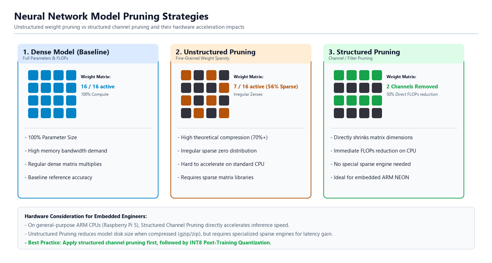

구조적 가지치기에서는 필터 하나를 통째로 평가한다. 대표적인 방법은 필터 안의 모든 가중치 절댓값을 더한 L1 노름을 점수로 쓰는 것이다. $k$번째 합성곱 필터의 점수는 다음과 같이 쓴다.

$$\text{Score}(F_k) = \lVert W_k \rVert_1 = \sum_{c, h, w} |W_{k, c, h, w}|$$

여기서 $F_k$는 $k$번째 출력 채널을 만드는 필터이고, $W_k$는 그 필터의 가중치 묶음이다. $W_{k,c,h,w}$는 $k$번째 필터 안에서 입력 채널 $c$, 세로 위치 $h$, 가로 위치 $w$에 있는 가중치이다. $\sum_{c,h,w}$는 그 모든 위치를 더한다는 뜻이다. 점수가 작은 필터를 제거하면 출력 채널 수가 줄고, 연결된 다음 계층의 입력 채널도 함께 줄여야 한다.

### 구조적 가지치기를 설계할 때 확인할 점

일반적인 2차원 표준 합성곱(Standard 2D Convolution) 한 계층의 MACs(곱셈-누적 연산 횟수)는 다음과 같이 계산한다.

$$\text{MACs} = H_{\text{out}} \times W_{\text{out}} \times K_h \times K_w \times C_{\text{in}} \times C_{\text{out}}$$

여기서 $H_{\text{out}}$과 $W_{\text{out}}$은 출력 특징 맵의 세로와 가로 크기이다. $K_h$와 $K_w$는 합성곱 커널의 세로와 가로 크기이다. $C_{\text{in}}$은 입력 채널 수이고, $C_{\text{out}}$은 출력 채널 수이다. 예를 들어 출력 특징 맵이 4×4, 커널이 3×3, 입력 채널이 8개, 출력 채널이 16개이면 MACs는 $4 \times 4 \times 3 \times 3 \times 8 \times 16 = 18{,}432$이다.

출력 특징 맵 크기와 커널 크기가 같을 때 $C_{\text{out}}$만 절반으로 줄이면 해당 계층의 MACs도 절반으로 줄어든다. 또 이전 계층의 출력 채널을 줄여 현재 계층의 $C_{\text{in}}$까지 절반이 되면, $C_{\text{in}} \times C_{\text{out}}$ 항이 함께 줄어 대략 4분의 1 수준이 될 수 있다. 다만 실제 모델에는 첫 계층, 마지막 분류 계층, 깊이별 합성곱, 잔차 연결, 채널 수 반올림 규칙이 있으므로 전체 모델의 감소율이 단순 계산과 정확히 같지는 않다.

특히 깊이별 분리 합성곱을 많이 쓰는 MobileNetV2에서는 채널 축소 때 다음 조건을 맞추어야 한다.

- **깊이별 합성곱의 채널 대응**: 깊이별 합성곱은 입력 채널 하나에 2차원 필터 하나가 대응된다($\text{groups} = C_{\text{in}} = C_{\text{out}}$). 따라서 어떤 채널을 없애면 그 채널에 연결된 깊이별 필터도 함께 없애야 한다.
</p>

- **잔차 연결의 채널 수 일치**: 잔차 연결은 입력 텐서와 출력 텐서를 같은 위치끼리 더한다. 두 텐서의 채널 수가 다르면 덧셈을 할 수 없다. 따라서 중간 필터만 임의로 없애면 형상이 맞지 않아 그래프 실행이 실패할 수 있다.

이 복잡성을 줄이는 방법 가운데 하나가 폭 배율(Width Multiplier, $\alpha$)이다. 폭 배율은 모든 주요 계층의 채널 수에 같은 비율을 곱해 더 좁은 모델을 만드는 구조 설정이다. 예를 들어 어떤 계층이 32채널이고 폭 배율이 0.5이면 그 계층은 16채널이 된다. MobileNetV2처럼 폭 배율을 지원하는 모델은 내부 규칙에 맞춰 채널 수를 함께 줄이므로, 임의 필터 제거보다 형상 불일치 위험이 작다.

폭 배율을 $\alpha$배로 줄이면 표준 합성곱의 많은 계층에서 입력 채널과 출력 채널이 함께 $\alpha$배가 된다. MACs 식의 $C_{\text{in}} \times C_{\text{out}}$ 부분이 $\alpha \times \alpha = \alpha^2$배가 되므로, 전체 MACs는 대략 폭 배율의 제곱에 비례해 줄어든다. 예를 들어 0.5배 모델은 많은 표준 합성곱 구간에서 채널 곱이 $0.5^2=0.25$배가 된다. 하지만 첫 계층은 입력 RGB 3채널이 고정이고, 마지막 분류 계층은 1,000개 클래스 출력이 유지되며, 계층별 채널 수 반올림도 있으므로 정확히 제곱 비율로 줄지는 않는다.

폭 배율 축소는 모델의 표현 용량을 줄이는 설계 변경이다. 표현 용량은 모델이 다양한 패턴을 담아낼 수 있는 크기와 여유를 뜻한다. 축소 모델의 정확도를 회복하려면 재학습이나 미세 조정이 필요할 수 있다. 재학습은 축소된 구조를 학습 자료로 다시 학습시키는 과정이고, 미세 조정은 이미 학습된 가중치를 출발점으로 삼아 더 작은 학습률과 목표 데이터로 가중치를 조금 더 조정하는 과정이다.

### 실습 5-1. 비구조적 가지치기와 실제 지연 시간 비교

> **풀고 싶은 문제**
> 가중치의 희소율을 높여도 일반 밀집 CPU 실행에서 지연 시간이 줄지 않을 수 있는 이유는 무엇인가? 같은 런타임에서 이를 어떻게 측정하는가?

이 실습에서는 PyTorch의 torch.nn.utils.prune 모듈로 MobileNetV2의 Conv2d와 Linear 가중치에 25%, 50%, 75% 비구조적 가지치기를 적용한다. 가지치기하지 않은 기준 모델도 함께 두고, 각 비율마다 같은 사전 학습 가중치에서 모델을 새로 만들어 가지치기가 누적되지 않게 한다. 네 모델은 모두 ONNX로 내보내고, 같은 난수 입력과 ONNX Runtime CPUExecutionProvider, 4스레드 설정으로 실행한다.

실습 목표는 희소율, ONNX 파일 크기, 순수 추론 지연 시간을 같은 조건에서 비교하는 것이다. 측정은 10회 워밍업 뒤 30회 session.run() 호출로 이루어지며 평균, P50, P95 지연 시간과 평균 지연 시간으로 환산한 FPS를 출력한다. 입력은 난수이므로 분류 품질은 평가하지 않는다. 가지치기만 하고 재학습이나 미세 조정을 하지 않으면 출력 품질이 떨어질 수 있으며, 이 실습은 품질 변화가 아니라 크기와 지연 시간 변화의 관찰에 초점을 둔다.

#### 사전 학습 1단계: 가중치 마스크와 희소율 계산
마스크의 1은 가중치를 유지하고 0은 제거하는 위치를 뜻한다. 마스크 적용 뒤 전체 원소 중 0이 된 비율을 계산하면 희소율을 구할 수 있다. 여기서는 작은 텐서 두 개로 가지치기 뒤의 유효 가중치와 희소율 계산 방법을 확인한다.

```python
# step1_weight_mask.py
import torch

weights = torch.tensor([0.8, 0.1, -0.2, 0.7])
mask = torch.tensor([1.0, 0.0, 0.0, 1.0])
effective_weights = weights * mask
sparsity = (effective_weights == 0).float().mean().item()
print("마스킹된 가중치:", effective_weights)
print(f"희소율: {sparsity:.0%}")
```

torch.tensor([...])는 파이썬 리스트를 PyTorch 텐서로 바꾼다. weights * mask는 같은 위치의 원소끼리 곱해 마스크가 0인 자리를 0으로 만든다. effective_weights == 0은 각 원소가 0인지 비교해 True와 False로 이루어진 텐서를 만들고, .float()는 이를 1.0과 0.0으로 바꾼다. 그 뒤 .mean()은 평균을 계산하고, .item()은 원소가 하나인 텐서에서 파이썬 숫자를 꺼낸다. 따라서 (effective_weights == 0).float().mean().item()은 전체 원소 중 0인 원소의 비율을 숫자로 얻는 표현이다.

#### 사전 학습 2단계: Conv2d와 Linear 가중치를 전역 가지치기
torch.nn.utils.prune은 PyTorch 모델의 가중치에 마스크를 붙여 가지치기를 적용하는 모듈이다. prune.l1_unstructured()는 한 계층 안에서 절댓값이 작은 가중치를 고르는 함수이고, 이 실습에서 쓰는 prune.global_unstructured()는 여러 계층의 가중치를 한데 모아 전체에서 절댓값이 작은 순서로 고른다. amount 인자는 제거할 비율을 정하며, 0.5는 대상 가중치의 절반을 0으로 만들라는 뜻이다.

대상 계층의 weight만 (계층 객체, "weight") 형태의 튜플 목록으로 모아 global_unstructured()에 전달한다. 가지치기를 적용하면 PyTorch는 원래 가중치를 weight_orig로, 마스크를 weight_mask로 따로 저장하고 forward 계산 때 둘을 곱해 유효 가중치로 쓴다. prune.remove()는 이 임시 구조를 없애고 마스크가 적용된 값을 일반 weight로 되돌린다. 이때 0이 된 값은 텐서 안에 그대로 남는다.

```python
# step2_global_pruning.py
import torch
import torch.nn as nn
import torch.nn.utils.prune as prune
import torchvision.models as models

model = models.mobilenet_v2(
    weights=models.MobileNet_V2_Weights.DEFAULT
).eval()
target_layers = [
    layer for layer in model.modules()
    if isinstance(layer, (nn.Conv2d, nn.Linear))
]
parameters = [(layer, "weight") for layer in target_layers]
prune.global_unstructured(
    parameters,
    pruning_method=prune.L1Unstructured,
    amount=0.5
)
for layer, parameter_name in parameters:
    prune.remove(layer, parameter_name)

zero_count = sum(
    int(torch.count_nonzero(layer.weight.detach() == 0))
    for layer in target_layers
)
element_count = sum(layer.weight.numel() for layer in target_layers)
actual_sparsity = 100.0 * zero_count / element_count
print(f"대상 계층 수: {len(target_layers)}")
print(f"실제 희소율: {actual_sparsity:.1f}%")
```

target_layers는 모델 안의 계층을 순회하면서 Conv2d와 Linear 계층만 담은 리스트이다. isinstance(layer, (nn.Conv2d, nn.Linear))는 계층이 두 종류 가운데 하나인지 검사한다. parameters = [(layer, "weight") for layer in target_layers]는 가지치기 대상 파라미터를 튜플 목록으로 만든다. 여기서 "weight"는 계층 안의 가중치 이름이다.

pruning_method=prune.L1Unstructured는 절댓값 기준의 비구조적 가지치기 방법을 지정한다. for layer, parameter_name in parameters:는 튜플 목록에서 계층과 파라미터 이름을 나누어 받으며 반복한다. torch.count_nonzero(layer.weight.detach() == 0)는 가중치 텐서에서 0인 원소 수를 센다. detach()는 이 계산을 학습용 기울기 기록과 분리해 단순 값 검사로 사용하게 한다. MobileNet_V2_Weights.DEFAULT의 가중치가 로컬에 없으면 처음 실행할 때 내려받을 수 있고, 사전 학습 가중치에 이미 0인 값이 있으면 실제 희소율은 amount로 지정한 비율과 조금 다를 수 있다.

#### 사전 학습 3단계: 가지치기 모델을 ONNX로 내보내고 파일 크기 확인
더미 입력은 분류 결과를 평가하는 데이터가 아니라 내보낼 입력 형상을 지정하는 예시 텐서이다. 내보낸 뒤 onnx.checker로 그래프 구조를 검사하고 파일의 실제 바이트 수를 확인한다. 구조 검사는 추론 정확도나 속도를 검증하지 않는다.

```python
# step3_export_pruned_model.py
from pathlib import Path
import onnx
import torch
from step2_global_pruning import model

output_path = Path("mobilenet_v2_pruned.onnx")
example = torch.randn(1, 3, 224, 224, dtype=torch.float32)
torch.onnx.export(
    model.eval(),
    example,
    str(output_path),
    opset_version=18,
    do_constant_folding=True,
    input_names=["input"],
    output_names=["logits"],
    dynamic_axes=None,
)
onnx.checker.check_model(onnx.load(str(output_path)))
file_size_mb = output_path.stat().st_size / (1024 * 1024)
print("ONNX 구조 검사 통과:", output_path)
print(f"실제 파일 크기: {file_size_mb:.2f} MB")
```

Path("mobilenet_v2_pruned.onnx")는 출력 파일 경로를 객체로 만든다. torch.randn(1, 3, 224, 224, dtype=torch.float32)는 배치 1개, RGB 3채널, 224×224 크기의 FP32 난수 입력을 만든다. torch.onnx.export()는 PyTorch 모델과 예시 입력을 받아 ONNX 파일로 내보낸다. opset_version=18은 ONNX 연산자 집합 버전을 고정하고, input_names와 output_names는 그래프의 입력과 출력 이름을 정한다. dynamic_axes=None은 입력 형상을 동적으로 바꾸지 않고 고정 형상으로 저장한다는 뜻이다.

onnx.load()는 저장된 ONNX 파일을 읽고, onnx.checker.check_model()은 그래프 형식이 ONNX 규칙에 맞는지 검사한다. output_path.stat().st_size는 파일 크기를 바이트 단위로 돌려주며, 1024×1024로 나누면 MB 단위가 된다. 비구조적 가지치기는 텐서 형상을 바꾸지 않고 값만 0으로 만들기 때문에 일반 ONNX 파일에서는 크기가 크게 줄지 않을 수 있다. 파일 형식이 0을 압축하거나 별도의 희소 텐서 표현을 쓰는 경우에는 결과가 달라질 수 있다.

#### 사전 학습 4단계: 실행 조건을 맞춰 지연 시간 분포 측정
첫 호출의 준비 비용을 제외하기 위해 워밍업을 수행한 뒤 같은 입력 텐서로 여러 번 추론한다. 평균 지연 시간과 P50/P95를 함께 기록하고, FPS는 각 호출 FPS의 평균이 아니라 평균 지연 시간의 역수로 계산한다. 이 측정은 session.run() 구간만 대상으로 하며 카메라 입력과 전처리는 포함하지 않는다.

```python
# step4_measure_onnx_latency.py
from pathlib import Path
import time
import numpy as np
import onnxruntime as ort

model_path = Path("mobilenet_v2_pruned.onnx")
options = ort.SessionOptions()
options.intra_op_num_threads = 4
options.graph_optimization_level = ort.GraphOptimizationLevel.ORT_ENABLE_ALL
session = ort.InferenceSession(
    str(model_path),
    sess_options=options,
    providers=["CPUExecutionProvider"],
)
input_name = session.get_inputs()[0].name
input_tensor = np.random.default_rng(42).standard_normal(
    (1, 3, 224, 224)
).astype(np.float32)
feed = {input_name: input_tensor}
for warmup_index in range(10):
    session.run(None, feed)

latencies_ms = []
for iteration_index in range(30):
    started = time.perf_counter()
    session.run(None, feed)
    latencies_ms.append((time.perf_counter() - started) * 1000)
mean_ms = float(np.mean(latencies_ms))
print("실제 ONNX 파일 크기:", f"{model_path.stat().st_size / (1024 * 1024):.2f} MB")
print("측정 횟수:", len(latencies_ms))
print(
    f"평균/P50/P95 지연: {mean_ms:.2f}/"
    f"{np.percentile(latencies_ms, 50):.2f}/"
    f"{np.percentile(latencies_ms, 95):.2f} ms"
)
print(f"평균 지연 시간 기준 FPS: {1000.0 / mean_ms:.1f}")
```

ort.SessionOptions()는 ONNX Runtime 세션을 만들 때 적용할 설정 객체이다. intra_op_num_threads = 4는 연산자 하나를 실행할 때 내부에서 사용할 스레드 수를 4개로 제한한다. graph_optimization_level은 ONNX Runtime의 그래프 최적화 수준을 정한다. ort.InferenceSession(..., providers=["CPUExecutionProvider"])는 CPU 실행 제공자로 모델을 실행하는 세션을 만든다.

np.random.default_rng(42)는 고정된 난수 생성기를 만들며, 같은 코드에서 같은 입력을 다시 만들기 쉽다. standard_normal((1, 3, 224, 224)).astype(np.float32)는 ONNX 모델 입력 형상에 맞는 FP32 배열을 만든다. feed = {input_name: input_tensor}는 입력 노드 이름과 실제 배열을 연결하는 딕셔너리이다. time.perf_counter()는 짧은 실행 시간을 재기에 알맞은 시각 값을 돌려주며, np.mean()과 np.percentile()은 측정값의 평균과 백분위를 계산한다.

#### 최종 구현

다음 sparsity_latency_report.py는 기준 모델과 세 가지 희소율 모델을 같은 절차로 만든다. 각 모델을 ONNX로 내보낸 뒤 같은 CPUExecutionProvider와 4스레드 설정으로 지연 시간을 측정한다. 코드의 출력 표는 희소율별 파일 크기와 지연 시간을 한 번에 비교하도록 구성되어 있다.

```python
# sparsity_latency_report.py
from pathlib import Path
import contextlib
import io
import os
import time

import numpy as np
import onnx
import onnxruntime as ort
import torch
import torch.nn as nn
import torch.nn.utils.prune as prune
import torchvision.models as models

TARGET_TYPES = (nn.Conv2d, nn.Linear)
WARMUP = 10
ITERATIONS = 30


def build_model():
    return models.mobilenet_v2(
        weights=models.MobileNet_V2_Weights.DEFAULT
    ).eval()


def target_parameters(model):
    return [
        (module, "weight")
        for module in model.modules()
        if isinstance(module, TARGET_TYPES)
    ]


def calculate_sparsity(model):
    zero_count = 0
    element_count = 0
    for module in model.modules():
        if isinstance(module, TARGET_TYPES):
            weights = module.weight.detach()
            zero_count += int(torch.count_nonzero(weights == 0))
            element_count += weights.numel()
    return (zero_count / element_count * 100.0) if element_count else 0.0


def apply_global_pruning(model, amount):
    prune.global_unstructured(
        target_parameters(model),
        pruning_method=prune.L1Unstructured,
        amount=amount,
    )
    for module, parameter_name in target_parameters(model):
        prune.remove(module, parameter_name)


def export_and_create_session(model, input_tensor, output_path):
    # torch.onnx 내부 표준 출력 및 표준 에러 로그 억제
    with contextlib.redirect_stdout(io.StringIO()), contextlib.redirect_stderr(io.StringIO()):
        torch.onnx.export(
            model,
            input_tensor,
            str(output_path),
            opset_version=18,
            input_names=["input"],
            output_names=["logits"],
            dynamic_axes=None,
        )

    onnx.checker.check_model(onnx.load(str(output_path)))

    options = ort.SessionOptions()
    options.intra_op_num_threads = 4
    # ORT 로그 레벨을 Warning 이상으로 설정하여 불필요한 알림 숨김
    options.log_severity_level = 3
    options.graph_optimization_level = ort.GraphOptimizationLevel.ORT_ENABLE_ALL

    session = ort.InferenceSession(
        str(output_path),
        sess_options=options,
        providers=["CPUExecutionProvider"],
    )
    return session, session.get_inputs()[0].name


def measure_latency(session, input_name, input_tensor):
    feed = {input_name: input_tensor}
    for _ in range(WARMUP):
        session.run(None, feed)

    latencies = []
    for _ in range(ITERATIONS):
        start = time.perf_counter()
        session.run(None, feed)
        latencies.append((time.perf_counter() - start) * 1000.0)

    values = np.asarray(latencies, dtype=np.float64)
    return {
        "mean_ms": float(np.mean(values)),
        "p50_ms": float(np.percentile(values, 50)),
        "p95_ms": float(np.percentile(values, 95)),
        "fps": 1000.0 / float(np.mean(values)),
    }


def main():
    input_tensor = torch.from_numpy(
        np.random.default_rng(42)
        .standard_normal((1, 3, 224, 224))
        .astype(np.float32)
    )

    print("=" * 72)
    print("      MobileNetV2 비구조적 가지치기(L1 Unstructured) 실측 벤치마크")
    print("=" * 72)
    print(f"{'희소율(%)':>8} | {'모델크기(MB)':>10} | {'평균(ms)':>8} | {'P50(ms)':>8} | {'P95(ms)':>8} | {'FPS':>4}")
    print("-" * 72)

    results = []
    for amount in (0.0, 0.25, 0.50, 0.75):
        model = build_model()
        if amount > 0.0:
            apply_global_pruning(model, amount)

        model_path = Path(f"mobilenet_v2_sparsity_{int(amount * 100):02d}.onnx")
        session, input_name = export_and_create_session(model, input_tensor, model_path)
        latency = measure_latency(session, input_name, input_tensor.numpy())
        sparsity = calculate_sparsity(model)
        file_size_mb = os.path.getsize(model_path) / (1024 * 1024)

        results.append((sparsity, file_size_mb, latency))
        print(
            f"{sparsity:10.1f}% | {file_size_mb:12.2f}MB | "
            f"{latency['mean_ms']:10.2f} | {latency['p50_ms']:8.2f} | "
            f"{latency['p95_ms']:8.2f} | {latency['fps']:5.1f}"
        )

    print("=" * 72)
    print("\n[실험 분석 및 결론]")
    base_lat = results[0][2]["mean_ms"]
    p75_lat = results[-1][2]["mean_ms"]
    diff_pct = ((p75_lat - base_lat) / base_lat) * 100.0
    print(f"1. 지연 시간 변화: 0% 희소율 대비 75% 희소율에서 지연 시간 변화율은 {diff_pct:+.1f}%이다.")
    print("2. 원인 분석: 가중치 텐서의 75%를 0으로 채웠음에도 ONNX 파일 크기와 CPU 연산 속도가 거의 동일하다.")
    print("3. 핵심 교훈: 범용 CPU의 밀집(Dense) 연산 커널은 0도 하나의 유효한 원소로 처리하므로,")
    print("   희소 가속(Sparse Engine)을 지원하지 않는 한 비구조적 가지치기로는 속도 이득을 얻을 수 없다.")


if __name__ == "__main__":
    main()
```

**코드 해설**

이 프로그램은 모델 생성, 가지치기, 희소율 계산, ONNX 내보내기, 지연 시간 측정을 함수로 나누어 실행한다. main()은 먼저 고정 난수 입력을 만들고, amount 값 0.0, 0.25, 0.50, 0.75를 차례로 적용한다. 각 반복에서 새 MobileNetV2 모델을 만들고 필요한 경우에만 가지치기를 적용한 뒤, ONNX 파일 생성과 지연 시간 측정을 같은 조건으로 실행한다. 마지막에는 0% 기준 모델과 75% 희소 모델의 평균 지연 시간 변화율을 계산해 표 아래에 출력한다.

build_model()은 MobileNet_V2_Weights.DEFAULT를 사용해 같은 사전 학습 가중치에서 시작하는 모델을 만든다. target_parameters()는 비구조적 가지치기의 대상인 Conv2d와 Linear 계층의 weight만 선택하므로 BatchNorm 같은 다른 계층 값은 변경하지 않는다. calculate_sparsity()는 대상 가중치에서 0인 원소 수와 전체 원소 수를 더해 실제 희소율을 계산한다. 이때 사전 학습 가중치에 이미 0이 있을 수 있으므로 출력 희소율은 amount로 지정한 값과 정확히 같지 않을 수 있다.

apply_global_pruning()은 target_parameters(model)이 돌려준 (모듈, "weight") 튜플 목록을 prune.global_unstructured()에 넘긴다. 이 함수는 여러 계층의 가중치를 하나의 집합으로 보고 L1 기준, 즉 절댓값이 작은 순서로 amount 비율만큼 마스크한다. 이어서 prune.remove()를 호출해 weight_orig와 weight_mask로 나뉘어 있던 임시 구조를 일반 weight로 되돌린다. 이 처리가 끝나도 0이 된 원소는 텐서 안에 남아 있으며, 텐서 형상은 바뀌지 않는다.

export_and_create_session()은 torch.onnx.export()의 표준 출력과 표준 오류를 contextlib.redirect_stdout()과 redirect_stderr()로 숨긴다. io.StringIO()는 문자열을 파일처럼 받는 객체이며, 여기서는 내보내기 로그를 화면에 보이지 않게 받는 데 쓰인다. ONNX checker가 파일 구조를 확인한 뒤에는 SessionOptions를 만들어 4스레드와 그래프 최적화 수준을 설정하고, CPUExecutionProvider 세션을 생성한다. 코드의 log_severity_level = 3은 ONNX Runtime의 정보성 로그를 줄이는 설정이다.

measure_latency()는 같은 입력 딕셔너리로 WARMUP 10회 실행한 뒤 ITERATIONS 30회 지연 시간을 잰다. 워밍업은 세션 내부 준비 비용이 첫 측정값에 섞이는 영향을 줄이기 위한 절차이다. 반환값 딕셔너리에는 평균, P50, P95 지연 시간과 평균 지연 시간의 역수로 계산한 FPS가 들어간다. 이 값은 순수 모델 호출 구간의 환산값이며, 카메라 입력이나 전처리까지 포함한 서비스 FPS가 아니다.

결과를 해석할 때는 표의 실제 희소율, 모델 크기, 평균/P50/P95 지연 시간을 함께 본다. 비구조적 가지치기는 텐서 형상을 그대로 두고 값만 0으로 만들기 때문에 ONNX 파일 크기가 거의 줄지 않을 수 있다. 일반 밀집 연산 커널도 0인 가중치를 자동으로 건너뛰지 않고 다른 숫자처럼 곱셈 대상으로 처리한다. 따라서 이 실습의 CPU 실행 조건에서는 희소율이 높아져도 지연 시간이 비슷하거나 오히려 흔들릴 수 있다. 압축 파일 형식, 희소 텐서 표현, 희소 연산 전용 커널이나 전용 하드웨어를 쓰면 결과가 달라질 수 있다.

> **알아두기 - 희소율과 CPU 연산 시간의 불일치**
> 일반적인 밀집 연산 커널은 0인 가중치를 자동으로 건너뛰지 않으므로 가중치만 0으로 바꾸고 텐서 형상과 실행 커널을 유지하면 속도가 빨라지지 않을 수 있다. 희소 연산의 효과는 실제 커널과 장치에서 확인한다.

**실행 결과와 확인할 점**

sparsity_latency_report.py를 실행한다.

```sh
python sparsity_latency_report.py
```

실행하면 0%, 25%, 50%, 75% 가지치기 결과가 각각 한 행으로 출력된다. 각 행에서 실제 희소율, ONNX 파일 크기, 평균/P50/P95 지연 시간과 환산 FPS를 비교한다. 마지막에 출력되는 0% 대비 75% 평균 지연 변화율이 표와 일치하는지 확인한다. 수치는 실습 장비, ONNX Runtime 빌드, 스레드 설정에 따라 달라지므로 고정값이 아니라 같은 실행 안의 상대 변화를 해석한다.

실행 중 별도 터미널에서 top 또는 htop을 열어 CPU 사용률도 관찰할 수 있다. htop은 프로세스별 CPU 사용률을 보여 주는 터미널 도구이다. 희소율을 높여도 CPU 사용률과 지연 시간이 함께 줄지 않는다면, 현재 실행 경로가 0인 가중치를 건너뛰는 희소 커널을 쓰지 않는다는 근거로 해석할 수 있다. 다만 CPU 사용률은 운영체제 스케줄링과 다른 프로세스의 부하에도 영향을 받으므로 지연 시간 표와 함께 본다.

일부 GPU와 가속기는 매 4개 값 중 2개가 0인 2:4 희소성처럼 정해진 패턴을 빠르게 처리하는 기능을 제공한다. 이런 기능은 모델, 런타임, 하드웨어가 모두 해당 형식을 지원해야 효과가 난다. 이 실습의 MobileNetV2 전역 비구조적 가지치기는 그런 패턴과 전용 커널을 설정하지 않으므로, 측정 결과를 희소 가속 하드웨어의 성능으로 일반화하지 않는다.

> **한 걸음 더**
> 1. sparsity_latency_report.py 실행 중 top 또는 htop으로 CPU 사용률을 기록한다. htop은 프로세스별 CPU 사용률을 보여 주는 터미널 도구이다. 희소율에 따라 사용률과 지연 시간이 어떻게 달라지는지 비교하고, 특정 코어 수나 사용률을 전제하지 않는다.
> 2. 사용 중인 밀집 CPU 커널이 0인 가중치를 건너뛰는지 조사한다. 희소 커널을 적용했을 때 비교 조건이 어떻게 달라지는지도 정리한다.

### 실습 5-2. MobileNetV2 폭 배율 축소 모델을 만들고 ONNX로 변환하기

> **풀고 싶은 문제**
> MobileNetV2의 폭 배율을 낮추면 채널 수와 파라미터 수는 어떻게 달라지는가? 두 구조의 지연 시간은 어떤 조건에서 비교해야 하는가?

이 실습의 목표는 torchvision이 제공하는 MobileNetV2 폭 배율 설정으로 0.5배 구조를 만들고, 이 구조를 mobilenet_v2_w05.onnx 파일로 내보내는 것이다. 기준 모델은 사전 학습된 MobileNetV2 1.0배 구조이다. 축소 모델은 weights=None으로 0.5배 구조만 먼저 만든 뒤, 1.0배 모델의 상태 사전에서 같은 이름의 텐서를 찾아 앞쪽 채널만 잘라 복사한다.

이 방식으로 만든 0.5배 모델은 입력을 받아 ImageNet 1,000개 클래스 로짓을 출력할 수 있다. 그러나 0.5배 구조에 맞게 재학습하거나 미세 조정한 모델은 아니다. 따라서 추론 실행, 파라미터 수, ONNX 파일 크기와 구조를 확인하는 데 사용하며, 분류 품질이 원본과 비슷하다고 보장하지 않는다.

MobileNet_V2_Weights.DEFAULT는 torchvision의 사전 학습 가중치를 뜻한다. 가중치 파일이 캐시에 있으면 로컬 파일을 쓰고, 없으면 내려받기를 시도한다. 오프라인 실습 전에는 인터넷이 연결된 환경에서 한 번 실행해 캐시를 준비해야 한다. 프로그램은 1.0배와 0.5배 모델의 파라미터 수와 FP32 가중치 이론 크기를 비교하고, 0.5배 모델을 opset 18과 고정 입력 [1, 3, 224, 224]으로 ONNX에 내보낸다.

#### 사전 학습 1단계: 기준 모델과 폭 축소 구조 만들기
width_mult는 계층별 채널 폭을 정하는 구조 설정이다. 두 구조의 첫 합성곱 채널 수와 분류기 출력 수를 확인한다. MobileNetV2의 최종 분류기 출력은 두 구조 모두 ImageNet-1K의 1,000개 클래스다.

```python
# step1_build_width_models.py
import torchvision.models as models

weights = models.MobileNet_V2_Weights.DEFAULT
base_model = models.mobilenet_v2(weights=weights).eval()
w05_model = models.mobilenet_v2(width_mult=0.5, weights=None).eval()

base_channels = base_model.features[0][0].out_channels
w05_channels = w05_model.features[0][0].out_channels
print("첫 합성곱 출력 채널:", base_channels, w05_channels)
print("기준/축소 분류기 출력 수:", base_model.classifier[-1].out_features,
      w05_model.classifier[-1].out_features)
```

models.mobilenet_v2()는 torchvision이 제공하는 MobileNetV2 생성 함수이다. weights 인자에 MobileNet_V2_Weights.DEFAULT를 넣으면 ImageNet으로 학습된 1.0배 가중치를 함께 불러온다. width_mult=0.5는 모델 내부 채널 수에 0.5배 폭 배율을 적용하라는 뜻이고, weights=None은 학습된 가중치를 불러오지 않고 구조만 만든다는 뜻이다.

eval()은 BatchNorm과 Dropout처럼 학습과 추론에서 동작이 달라지는 계층을 추론 모드로 바꾼다. base_model.features[0][0].out_channels는 첫 번째 특징 추출 블록 안의 합성곱 출력 채널 수를 읽는다. classifier[-1]의 -1 인덱스는 Sequential 안의 마지막 계층을 가리키며, out_features는 완전 연결 계층의 출력 수이다. 두 모델 모두 ImageNet 1,000개 클래스를 출력하므로 분류기 출력 수는 1,000으로 유지된다.

MobileNetV2는 내부에서 _make_divisible 같은 규칙으로 채널 수를 8의 배수에 가깝게 맞춘다. 이런 규칙은 SIMD와 텐서 계산 커널이 다루기 좋은 채널 묶음을 만들기 위한 설계이다. 그래서 폭 배율 0.5를 적용해도 모든 계층의 채널 수가 정확히 절반이 되지는 않을 수 있다.

#### 사전 학습 2단계: 1.0x 가중치를 0.5x 형상에 맞춰 이식하기
두 모델의 상태 사전에서 같은 키를 가진 텐서를 비교한다. 형상이 같으면 그대로 복사하고, 다른 경우에는 0.5x 텐서의 각 축 크기만큼 앞부분을 잘라 넣는다. 배치 정규화의 채널별 값과 합성곱 가중치도 같은 규칙으로 전달한다.

```python
# step2_slice_width_weights.py
from step1_build_width_models import base_model, w05_model

def slice_weights_to_w05(source_model, target_model):
    source_state = source_model.state_dict()
    target_state = target_model.state_dict()
    transferred_state = {}

    for key, target_tensor in target_state.items():
        if key not in source_state:
            raise KeyError(f"기준 모델에 상태 항목이 없습니다: {key}")

        source_tensor = source_state[key]
        if source_tensor.ndim != target_tensor.ndim:
            raise ValueError(f"텐서 차원이 다릅니다: {key}")
        if any(target_size > source_size for source_size, target_size in
               zip(source_tensor.shape, target_tensor.shape)):
            raise ValueError(f"축소 모델 텐서가 기준 텐서보다 큽니다: {key}")

        if source_tensor.shape == target_tensor.shape:
            transferred_state[key] = source_tensor
        else:
            slices = tuple(slice(0, size) for size in target_tensor.shape)
            transferred_state[key] = source_tensor[slices]

    target_model.load_state_dict(transferred_state, strict=True)

slice_weights_to_w05(base_model, w05_model)
print("1.0x 상태 사전을 0.5x 구조에 맞춰 이식했습니다.")
```

model.state_dict()는 계층 이름과 텐서를 짝지은 딕셔너리를 돌려준다. 이 딕셔너리에는 학습으로 갱신되는 가중치와 편향 같은 파라미터뿐 아니라 BatchNorm의 running_mean과 running_var 같은 버퍼도 들어 있다. 버퍼는 학습으로 직접 기울기를 계산해 고치는 값은 아니지만, 추론에 필요하므로 모델 파일에 함께 저장되는 값이다. 비슷하게 model.named_parameters()는 이름이 붙은 파라미터를 순회하고, model.named_buffers()는 이름이 붙은 버퍼를 순회할 때 쓴다.

for key, target_tensor in target_state.items():는 0.5배 모델 상태 사전의 이름과 텐서를 하나씩 꺼낸다. key not in source_state는 기준 모델에 같은 이름의 항목이 있는지 확인한다. source_tensor.ndim과 target_tensor.ndim은 텐서 차원 수이다. zip(source_tensor.shape, target_tensor.shape)은 두 텐서의 각 축 크기를 나란히 묶고, any(...)는 그중 하나라도 조건을 만족하면 참이 된다.

slices = tuple(slice(0, size) for size in target_tensor.shape)는 목표 텐서의 각 축 크기에 맞는 슬라이스 목록을 만든다. slice(0, n)은 해당 축에서 0번부터 n번 바로 앞까지, 즉 앞쪽 n개를 고른다는 뜻이다. 예를 들어 형상이 (4, 6)인 텐서에서 목표 형상이 (2, 3)이면 tuple은 (slice(0, 2), slice(0, 3))이 되고, source_tensor[slices]는 앞쪽 2행과 앞쪽 3열을 고른다. 합성곱 가중치처럼 축이 네 개인 텐서에도 같은 규칙을 각 축에 적용한다.

source_tensor[slices]는 실제로 1.0배 텐서의 앞쪽 채널과 원소 구간을 잘라 낸다. torch.no_grad()는 이런 복사 작업을 할 때 기울기 기록을 만들지 않게 하는 문맥이지만, 이 코드처럼 새 딕셔너리를 만들어 load_state_dict()에 넘기는 흐름에서는 직접 쓰지 않는다. 다른 방식으로 target_tensor.copy_(...)를 호출해 텐서 값을 제자리에서 복사한다면 torch.no_grad() 블록 안에서 실행해야 학습 기록과 충돌하지 않는다. load_state_dict(transferred_state, strict=True)는 만든 상태 사전을 0.5배 모델에 넣고, strict=True로 이름과 형상이 모두 맞는지 엄격하게 검사한다.

#### 사전 학습 3단계: 축소 모델의 추론 출력 확인
시험 입력은 분류 품질 평가 자료가 아니라 모델이 실행되어 클래스별 점수를 반환하는지 확인하는 입력이다. 출력 형상과 유한한 값을 검사하면 구조와 가중치 이식 후의 기본 추론 경로를 점검할 수 있다.

```python
# step3_check_width_inference.py
import torch
from step2_slice_width_weights import w05_model

example = torch.zeros((1, 3, 224, 224), dtype=torch.float32)
with torch.inference_mode():
    logits = w05_model(example)

if tuple(logits.shape) != (1, 1000):
    raise RuntimeError(f"예상하지 못한 출력 형상: {tuple(logits.shape)}")
if not bool(torch.isfinite(logits).all()):
    raise RuntimeError("모델 출력에 유한하지 않은 값이 있습니다.")
print("PyTorch 추론 출력 형상:", tuple(logits.shape))
print("상위 클래스 인덱스:", torch.topk(logits, k=5, dim=1).indices[0].tolist())
```

torch.zeros((1, 3, 224, 224), dtype=torch.float32)는 배치 1개, RGB 3채널, 224×224 크기의 FP32 입력 텐서를 만든다. 값이 모두 0이므로 실제 카메라 장면을 나타내지는 않는다. with torch.inference_mode():는 추론 전용 문맥이며, PyTorch가 기울기 계산과 학습용 기록을 만들지 않게 해 메모리 사용과 오버헤드를 줄인다.

tuple(logits.shape)는 출력 텐서의 형상을 튜플로 바꾸어 (1, 1000)과 비교한다. torch.isfinite(logits).all()은 출력 안에 NaN이나 무한대가 없는지 검사한다. torch.topk(logits, k=5, dim=1)는 클래스 점수가 큰 5개 위치를 고른다. 여기서 출력한 상위 클래스 인덱스는 실행 경로가 동작하는지 보는 참고값이며, 입력이 0 텐서이므로 분류 품질 판단에 쓰지 않는다.

#### 사전 학습 4단계: 파라미터 수와 FP32 가중치 이론 크기 계산
numel()은 텐서의 원소 수를 반환한다. FP32 원소는 4바이트이므로 파라미터 수에 4를 곱해 가중치 크기를 추정할 수 있다. 이 이론값에는 ONNX 그래프 정보가 포함되지 않는다.

```python
# step4_count_width_parameters.py
from step1_build_width_models import base_model
from step2_slice_width_weights import w05_model

def count_parameters(model):
    return sum(parameter.numel() for parameter in model.parameters())

base_count = count_parameters(base_model)
w05_count = count_parameters(w05_model)
for name, count in (("1.0x", base_count), ("0.5x", w05_count)):
    weight_size_mib = count * 4 / (1024 ** 2)
    print(f"{name}: {count:,} parameters, FP32 weights about {weight_size_mib:.2f} MiB")
print(f"파라미터 감축률: {(1 - w05_count / base_count) * 100:.1f}%")
```

model.parameters()는 모델 안의 학습 대상 파라미터를 차례로 돌려준다. sum(parameter.numel() for parameter in model.parameters())는 제너레이터 표현식으로 각 파라미터의 원소 수를 하나씩 더한다. FP32 파라미터 하나는 4바이트이므로 count * 4 / (1024 ** 2)로 MiB 단위의 이론적 가중치 크기를 계산한다.

파라미터 수가 줄면 ONNX 파일 크기도 대체로 줄어든다. 다만 ONNX 파일에는 가중치뿐 아니라 그래프 구조, 노드 이름, 텐서 메타데이터도 들어 있으므로 이론적 가중치 크기와 정확히 같지는 않다. MACs도 많은 계층에서 줄지만, 첫 RGB 입력 계층, 마지막 1,000클래스 분류기, 깊이별 합성곱, 채널 수 반올림 규칙 때문에 정확히 0.5의 제곱인 25%로 줄었다고 단정하지 않는다.

#### 사전 학습 5단계: 고정 입력으로 ONNX 내보내고 실행 확인
더미 입력은 내보내기 도구에 입력 형상을 알려 주는 예시 텐서이다. onnx.checker는 파일 구조를 검사하고, ONNX Runtime의 한 번 실행은 변환된 모델이 실제 로짓을 반환하는지 확인한다. 둘 다 분류 정확도를 평가하지는 않는다.

```python
# step5_export_width_model.py
from pathlib import Path
import onnx
import onnxruntime as ort
import torch
from step2_slice_width_weights import w05_model

output_path = Path("mobilenet_v2_w05.onnx")
example = torch.zeros((1, 3, 224, 224), dtype=torch.float32)
torch.onnx.export(
    w05_model,
    example,
    str(output_path),
    opset_version=18,
    do_constant_folding=True,
    input_names=["input"],
    output_names=["output"],
    dynamic_axes=None,
)
onnx.checker.check_model(onnx.load(str(output_path)))

session = ort.InferenceSession(str(output_path), providers=["CPUExecutionProvider"])
input_name = session.get_inputs()[0].name
logits = session.run(None, {input_name: example.numpy()})[0]
if logits.shape != (1, 1000):
    raise RuntimeError(f"예상하지 못한 ONNX 출력 형상: {logits.shape}")
print("ONNX Runtime 추론 출력 형상:", logits.shape)
print(f"ONNX 파일 크기: {output_path.stat().st_size / (1024 ** 2):.2f} MiB")
```

Path("mobilenet_v2_w05.onnx")는 결과 파일 경로를 Path 객체로 만든다. torch.onnx.export()는 PyTorch 모델과 더미 입력을 사용해 계산 그래프를 추적하고 ONNX 파일로 저장한다. opset_version=18은 ONNX 연산자 집합 버전을 18로 고정하고, do_constant_folding=True는 상수로 미리 계산할 수 있는 부분을 내보내기 시점에 접는 설정이다. dynamic_axes=None은 입력 형상을 동적으로 바꾸지 않고 [1, 3, 224, 224]로 고정한다는 뜻이다.

onnx.checker.check_model(onnx.load(...))은 저장한 ONNX 파일을 읽어 형식과 그래프 구조가 올바른지 검사한다. ONNX Runtime 세션을 만든 뒤 session.get_inputs()[0].name으로 입력 이름을 읽고, session.run(None, {input_name: example.numpy()})로 한 번 실행한다. example.numpy()는 PyTorch 텐서를 NumPy 배열로 바꾸며, ONNX Runtime은 이 배열을 입력으로 받는다. 이 검사는 변환 파일이 실행되는지 확인할 뿐, 추론 출력의 정확도나 분류 품질까지 평가하지는 않는다.

#### 최종 구현
```python
# export_width_scaled_model.py
import contextlib
import io
from pathlib import Path

import onnx
import torch
import torchvision.models as models


def count_parameters(model):
    return sum(p.numel() for p in model.parameters())

def slice_weights_to_w05(src_model, dst_model):
    """
    1.0x 모델의 사전 학습 가중치를 0.5x 형상에 맞추어 슬라이싱 이식한다.
    - 합성곱/선형 계층 가중치 및 편향: 각 축(Axis)별로 0.5x 크기만큼 슬라이싱
    - 배치 정규화(BatchNorm) 파라미터(running_mean, running_var 등): 채널 수만큼 슬라이싱
    - 최종 분류기(Classifier)의 출력 클래스 차원(1000): 그대로 유지
    """
    src_dict = src_model.state_dict()
    dst_dict = dst_model.state_dict()
    transferred_dict = {}

    for key, dst_tensor in dst_dict.items():
        if key not in src_dict:
            transferred_dict[key] = dst_tensor
            continue

        src_tensor = src_dict[key]
        if src_tensor.shape == dst_tensor.shape:
            # 분류기 출력 차원(1000개 클래스) 등 형상이 동일한 경우
            transferred_dict[key] = src_tensor
        else:
            # 0.5x 대상 텐서 형상에 맞추어 앞쪽 채널/원소 구간 슬라이싱
            slices = tuple(slice(0, dim) for dim in dst_tensor.shape)
            transferred_dict[key] = src_tensor[slices]

    dst_model.load_state_dict(transferred_dict)


def main():
    output_path = Path("mobilenet_v2_w05.onnx")
    print("=" * 70)
    print("   MobileNetV2 1.0x 사전 학습 가중치 기반 0.5x 모델 생성 및 ONNX 변환")
    print("=" * 70)

    # 모델 아키텍처 준비
    print("1. 로컬 사전 학습 MobileNetV2 1.0x 및 0.5x 뼈대 구성 중...")
    base_model = models.mobilenet_v2(weights=models.MobileNet_V2_Weights.DEFAULT).eval()
    w05_model = models.mobilenet_v2(width_mult=0.5, weights=None).eval()

    # 오프라인 가중치 채널 슬라이싱 주입
    print("2. 1.0x 가중치 채널 슬라이싱 및 0.5x 모델 이식 중...")
    slice_weights_to_w05(base_model, w05_model)

    base_params = count_parameters(base_model)
    w05_params = count_parameters(w05_model)

    print("\n모델 구조 및 파라미터 대조:")
    print(f"  - 원본 MobileNetV2 1.0x : {base_params / 1e6:4.2f}M 파라미터 ({base_params * 4 / (1024*1024):.2f} MB)")
    print(f"  - 경량 MobileNetV2 0.5x : {w05_params / 1e6:4.2f}M 파라미터 ({w05_params * 4 / (1024*1024):.2f} MB)")
    print(f"  - 파라미터 감축율       : {(1.0 - w05_params / base_params)*100:.1f}% 절감")

    # 정적 ONNX 변환 (진행 로그 억제)
    print(f"\n3. ONNX 변환 진행 중 -> {output_path}...")
    dummy_input = torch.randn(1, 3, 224, 224, dtype=torch.float32)

    with contextlib.redirect_stdout(io.StringIO()), contextlib.redirect_stderr(io.StringIO()):
        torch.onnx.export(
            w05_model,
            dummy_input,
            str(output_path),
            opset_version=18,
            do_constant_folding=True,
            input_names=["input"],
            output_names=["output"],
            dynamic_axes=None,
        )

    # ONNX 무결성 검증
    onnx.checker.check_model(onnx.load(str(output_path)))
    file_size_mb = output_path.stat().st_size / (1024 * 1024)
    print(f"4. ONNX 파일 생성 및 검증 통과: {output_path} ({file_size_mb:.2f} MB)")
    print("=" * 70)


if __name__ == "__main__":
    main()
```

**코드 해설**

export_width_scaled_model.py는 1.0배 MobileNetV2를 불러오고, 0.5배 MobileNetV2 구조를 새로 만든 뒤, 상태 사전 슬라이싱으로 가중치를 이식하고 ONNX 파일로 저장한다. 프로그램 전체 흐름은 보조 함수 정의, main()에서 두 모델 생성, slice_weights_to_w05() 호출, 파라미터 수 비교, torch.onnx.export() 실행, onnx.checker 검증 순서이다. 최종 산출물은 mobilenet_v2_w05.onnx이며, 이 파일은 실습 5-3에서 원본 모델과 지연 시간을 비교할 때 사용한다.

count_parameters()는 model.parameters()를 순회해 전체 파라미터 원소 수를 더한다. slice_weights_to_w05()는 src_model.state_dict()와 dst_model.state_dict()를 비교한다. 같은 형상의 텐서는 그대로 transferred_dict에 넣고, 형상이 다른 텐서는 0.5배 대상 형상에 맞춰 각 축의 앞부분을 자른다. 마지막의 dst_model.load_state_dict(transferred_dict)는 새 상태 사전을 축소 모델에 적용한다.

main()은 Path("mobilenet_v2_w05.onnx")로 출력 파일 이름을 정하고, models.mobilenet_v2(weights=models.MobileNet_V2_Weights.DEFAULT)로 기준 모델을 만든다. 이어 models.mobilenet_v2(width_mult=0.5, weights=None)로 축소 구조를 만든다. 여기서 weights=None은 무작위 초기값의 0.5배 구조를 만든다는 뜻이지만, 바로 뒤에서 1.0배 가중치의 앞쪽 채널을 잘라 복사하므로 최종 모델은 순수한 무작위 초기값 모델이 아니다. 다만 이 복사는 재학습이나 미세 조정이 아니므로 분류 품질을 보장하지 않는다.

최종 구현에는 사전 학습 단계에서 다룬 strict=True 검사가 명시되어 있지 않다. load_state_dict()의 기본 strict 값은 True이므로 이름이나 형상이 맞지 않으면 오류가 난다. contextlib.redirect_stdout()과 redirect_stderr()는 torch.onnx.export()가 출력하는 진행 로그를 화면에 보이지 않게 io.StringIO()로 보낸다. 이 기능은 결과 파일 자체에는 영향을 주지 않는다.

폭 배율을 낮추면 파라미터 수와 연산량이 줄 수 있지만, 모든 계층이 같은 비율로 줄지는 않는다. 점별 합성곱은 입력 채널과 출력 채널이 함께 줄 때 MACs가 크게 감소하고, 깊이별 합성곱은 채널 수에 더 직접적으로 비례한다. 첫 입력 계층과 마지막 분류 계층처럼 고정되는 부분도 있다. 따라서 실제 지연 시간은 다음 실습처럼 같은 런타임, 같은 스레드 수, 같은 입력 형상에서 측정해야 한다.

결과를 해석할 때는 구조 검증과 품질 평가를 구분한다. torch.onnx.export(), onnx.checker, ONNX Runtime의 한 번 실행은 파일이 만들어지고 실행 가능한지를 확인한다. 이 실습의 0.5배 모델은 1.0배 가중치에서 앞쪽 채널을 잘라 복사한 모델이므로, 특정 장면에서 어떤 클래스가 상위로 나오는지는 기준 실습 환경의 관찰 예일 뿐 일반적인 정확도 결과가 아니다. 분류 품질을 말하려면 라벨이 있는 검증 자료로 원본과 축소 모델을 같은 조건에서 평가해야 한다.

> **알아두기 - 폭 축소 모델과 분류 품질**
> 축소 모델의 분류 품질을 비교하려면 해당 구조에 맞는 학습 가중치와 별도의 라벨 검증 자료가 필요하므로, 이 예제에서는 구조/파일 크기/추론 시간만 확인한다.

**실행 결과와 확인할 점**

export_width_scaled_model.py를 실행한다.

```sh
python export_width_scaled_model.py
```

출력 결과에서 다음 항목들을 확인한다.
- 파라미터 수와 이론값: 원본과 0.5배 구조의 출력값을 비교한다. 결과는 torchvision 버전에 따라 달라질 수 있다.
- 모델 파일: mobilenet_v2_w05.onnx가 생성되고 onnx.checker를 통과하는지 확인한다. 생성된 파일 크기를 기록한다.
- ONNX 파일 크기: 0.5배 모델의 파일 크기를 원본 mobilenet_v2_opt.onnx와 비교한다. 파일 크기는 파라미터 수와 함께 줄어드는 경향이 있지만, 그래프 정보가 포함되므로 파라미터 이론 크기와 정확히 같지 않다.

> **한 걸음 더**
> 1. Netron에서 원본과 0.5배 모델의 Conv 가중치 형상을 비교한다. 모든 계층의 채널 수가 정확히 절반으로 바뀌지 않는 이유를 설명한다.
> 2. width_mult=0.35 구조를 내보내 파라미터 수와 파일 크기를 비교한다. 분류 품질 비교에는 별도 학습과 검증 자료가 필요함을 기록한다.

### 실습 5-3. MobileNetV2 원본과 폭 축소 모델의 카메라 지연 시간 비교

> **풀고 싶은 문제**
> 같은 ONNX Runtime 설정에서 MobileNetV2 원본과 0.5배 구조의 모델 호출 시간은 어떻게 달라지는가? 반복 속도와 카메라 입력 속도는 어떻게 구분하는가?

실습 5-2에서 만든 0.5배 ONNX 파일에는 1.0배 사전 학습 가중치의 앞쪽 채널을 잘라 넣은 값이 들어 있다. 그래서 두 ONNX 세션 모두 카메라 프레임을 받아 1,000개 ImageNet 클래스 로짓을 출력할 수 있다. 이 실습은 1번 키와 2번 키로 실행 모델을 바꾸고, 실제 카메라 프레임에서 session.run() 지연 시간, 반복 속도, 카메라 입력 속도, CPU 사용률을 표시한다.

이 실습의 비교 대상은 화면에 표시되는 클래스 이름이 아니라 모델 호출 구간의 시간과 CPU 사용률이다. 0.5배 모델은 축소 구조에 맞게 다시 학습한 모델이 아니라 채널 복사로 만든 모델이므로 분류 라벨로 품질을 판단할 수 없다. 키를 바꾸기 전후에는 서로 다른 카메라 프레임이 입력될 수 있으므로, Top-1/Top-2 표시는 추론 경로가 동작하는지 확인하는 참고 정보로만 본다.

#### 사전 학습 1단계: 두 ONNX 세션의 입출력 규격 확인
모델 파일마다 같은 ONNX Runtime 실행 제공자와 스레드 설정으로 세션을 만든다. 세션 메타데이터에서 입력 이름과 형상, 출력 형상을 확인해 전처리 결과 및 ImageNet 클래스 수와 맞는지 점검한다.

```python
# step1_open_two_sessions.py
from pathlib import Path
import onnxruntime as ort

model_paths = {
    "1.0x": Path("mobilenet_v2_opt.onnx"),
    "0.5x": Path("mobilenet_v2_w05.onnx"),
}
sessions = {}
for name, model_path in model_paths.items():
    if not model_path.is_file():
        raise FileNotFoundError(f"모델 파일이 없습니다: {model_path}")
    options = ort.SessionOptions()
    options.intra_op_num_threads = 2
    options.graph_optimization_level = ort.GraphOptimizationLevel.ORT_ENABLE_ALL
    session = ort.InferenceSession(
        str(model_path),
        sess_options=options,
        providers=["CPUExecutionProvider"],
    )
    input_info = session.get_inputs()[0]
    output_info = session.get_outputs()[0]
    print(name, "input:", input_info.name, input_info.shape)
    print(name, "output:", output_info.name, output_info.shape)
    sessions[name] = (session, input_info.name)
```

model_paths는 모델 이름과 파일 경로를 짝지은 딕셔너리이다. for name, model_path in model_paths.items():는 딕셔너리에서 이름과 경로를 한 쌍씩 꺼내 반복한다. 각 반복에서 SessionOptions를 새로 만들고, intra_op_num_threads와 graph_optimization_level을 같은 값으로 설정한다. 이렇게 해야 두 모델이 같은 ONNX Runtime 조건에서 비교된다.

sessions[name] = (session, input_info.name)은 세션 객체와 입력 텐서 이름을 튜플로 묶어 다시 딕셔너리에 저장한다. 나중에 "1.0x"나 "0.5x" 같은 키로 세션을 꺼내면, 모델 파일을 다시 읽지 않고 이미 준비된 세션을 바로 실행할 수 있다. 입력 이름은 ONNX 파일마다 다를 수 있으므로 session.get_inputs()[0].name으로 읽어 둔다.

#### 사전 학습 2단계: 같은 입력 텐서로 두 모델 추론하기
두 세션에 같은 [1, 3, 224, 224] float32 텐서를 넣으면 입력 차이가 없는 상태에서 출력 형상과 모델 호출 시간을 확인할 수 있다. 여기의 0 텐서는 인터페이스 점검용이며 실제 장면의 분류 평가 자료는 아니다.

```python
# step2_run_same_input.py
import time
import numpy as np
from step1_open_two_sessions import sessions

input_tensor = np.zeros((1, 3, 224, 224), dtype=np.float32)
results = {}
for name, (session, input_name) in sessions.items():
    started = time.perf_counter()
    logits = session.run(None, {input_name: input_tensor})[0][0]
    elapsed_ms = (time.perf_counter() - started) * 1000.0
    if logits.shape != (1000,):
        raise RuntimeError(f"{name}의 출력 형상이 예상과 다릅니다: {logits.shape}")
    results[name] = logits
    print(f"{name}: 출력 {logits.shape}, 모델 호출 {elapsed_ms:.2f}ms")
```

np.zeros((1, 3, 224, 224), dtype=np.float32)는 값이 모두 0인 NumPy 배열을 만든다. 형상은 배치 1개, RGB 3채널, 224×224 입력이라는 뜻이다. ONNX Runtime은 PyTorch 텐서가 아니라 NumPy 배열을 입력으로 받으므로, 최종 구현에서도 전처리 결과를 이 형식에 맞춘다.

started = time.perf_counter()는 session.run() 직전 시각을 저장한다. session.run(None, {input_name: input_tensor})는 모든 출력(None)을 계산하되, 입력 이름에 input_tensor를 연결한다. 반환값은 출력 배열의 리스트이므로 [0][0]으로 첫 번째 출력의 배치 0번 로짓을 꺼낸다. elapsed_ms는 session.run()에 든 시간을 밀리초로 바꾼 값이며, 카메라 수신과 화면 표시 시간은 포함하지 않는다.

#### 사전 학습 3단계: 로짓을 ImageNet 클래스 이름으로 변환
ONNX 출력은 클래스별 로짓이므로 최댓값을 빼는 안정화 소프트맥스로 점수 분포를 만든 뒤 큰 값의 인덱스를 클래스 이름에 연결한다. torchvision 가중치 메타데이터에 ImageNet-1K 이름이 포함되어 있어 별도 라벨 다운로드는 필요하지 않다.

```python
# step3_decode_top3.py
import numpy as np
import torchvision.models as models
from step2_run_same_input import results

categories = models.MobileNet_V2_Weights.DEFAULT.meta["categories"]

def top_predictions(logits, count=3):
    shifted = logits - np.max(logits)
    exponentials = np.exp(shifted)
    probabilities = exponentials / exponentials.sum()
    indices = np.argsort(probabilities)[-count:][::-1]
    return [
        (int(index), categories[index], float(probabilities[index]))
        for index in indices
    ]

for model_name, logits in results.items():
    print(model_name, top_predictions(logits))
```

categories는 torchvision의 MobileNetV2 기본 가중치에 포함된 ImageNet 클래스 이름 목록이다. top_predictions()는 로짓 배열에서 가장 큰 값의 위치를 찾기 전에 소프트맥스를 계산한다. shifted = logits - np.max(logits)는 지수 함수에 너무 큰 값이 들어가 수치가 넘치는 일을 줄이는 안정화 처리이다.

np.argsort(probabilities)는 확률이 작은 순서에서 큰 순서로 인덱스를 정렬한다. [-count:]는 마지막 count개, 즉 확률이 큰 항목을 고르고, [::-1]은 순서를 뒤집어 가장 큰 항목이 먼저 오게 한다. 반환되는 튜플은 클래스 번호, 클래스 이름, 확률이다. 이 확률은 로짓을 보기 좋게 바꾼 값이며, 0.5배 채널 복사 모델의 실제 정확도를 뜻하지 않는다.

#### 최종 구현
```python
# realtime_width_comparator.py
from pathlib import Path
import time

import cv2
import numpy as np
import onnxruntime as ort
import psutil
import torchvision.models as models
from async_camera_engine import HighPerformanceAsyncCamera
from vision_preprocessor_suite import VisionPreprocessor

IMAGENET_CATEGORIES = models.MobileNet_V2_Weights.DEFAULT.meta["categories"]


def center_crop_to_tensor(frame, preprocessor):
    source_height, source_width = frame.shape[:2]
    crop_size = min(source_height, source_width)
    crop_left = (source_width - crop_size) // 2
    crop_top = (source_height - crop_size) // 2
    cropped = frame[crop_top:crop_top + crop_size, crop_left:crop_left + crop_size]
    resized = cv2.resize(cropped, (224, 224), interpolation=cv2.INTER_LINEAR)
    input_tensor = preprocessor.transform_to_tensor(resized)
    return input_tensor, (crop_left, crop_top, crop_size)


def top_predictions(logits, count=3):
    values = np.asarray(logits, dtype=np.float64).reshape(-1)
    if values.size != len(IMAGENET_CATEGORIES):
        raise RuntimeError(f"예상하지 못한 클래스 수: {values.size}")
    if not np.isfinite(values).all():
        raise RuntimeError("모델 출력에 유한하지 않은 값이 있습니다.")

    shifted = values - np.max(values)
    exponentials = np.exp(shifted)
    probabilities = exponentials / exponentials.sum()
    indices = np.argsort(probabilities)[-count:][::-1]
    return [
        (int(index), IMAGENET_CATEGORIES[index], float(probabilities[index]))
        for index in indices
    ]


def compact_label(label, limit=30):
    return label if len(label) <= limit else label[:limit - 3] + "..."


def draw_hud(frame, model_name, infer_ms, loop_fps, cam_fps, cpu_pct, predictions):
    x1, y1, x2, y2 = 10, 10, 470, 190
    roi = frame[y1:y2, x1:x2]
    panel = np.full(roi.shape, (15, 23, 42), dtype=np.uint8)
    cv2.addWeighted(panel, 0.75, roi, 0.25, 0, dst=roi)
    cv2.rectangle(frame, (x1, y1), (x2, y2), (6, 182, 212), 1)

    model_color = (0, 165, 255) if "1.0x" in model_name else (0, 255, 120)
    cv2.putText(frame, f"MODEL: {model_name}", (20, 32),
                cv2.FONT_HERSHEY_SIMPLEX, 0.50, model_color, 2, cv2.LINE_AA)
    cv2.putText(frame, f"Model latency: {infer_ms:4.1f} ms | Loop: {loop_fps:4.1f} FPS",
                (20, 58), cv2.FONT_HERSHEY_SIMPLEX, 0.40, (240, 240, 240), 1, cv2.LINE_AA)
    cv2.putText(frame, f"Camera: {cam_fps:4.1f} FPS | CPU: {cpu_pct:4.1f}%",
                (20, 82), cv2.FONT_HERSHEY_SIMPLEX, 0.40, (200, 200, 200), 1, cv2.LINE_AA)

    top1_index, top1_name, top1_probability = predictions[0]
    top2_index, top2_name, top2_probability = predictions[1]
    cv2.putText(
        frame,
        f"Top-1 #{top1_index}: {compact_label(top1_name)} ({top1_probability * 100:.1f}%)",
        (20, 112), cv2.FONT_HERSHEY_SIMPLEX, 0.38, (0, 255, 255), 1, cv2.LINE_AA
    )
    cv2.putText(
        frame,
        f"Top-2 #{top2_index}: {compact_label(top2_name)} ({top2_probability * 100:.1f}%)",
        (20, 136), cv2.FONT_HERSHEY_SIMPLEX, 0.38, (220, 220, 220), 1, cv2.LINE_AA
    )
    cv2.putText(frame, "[1] MobileNetV2 1.0x  [2] MobileNetV2 0.5x  [Q] Exit",
                (20, 168), cv2.FONT_HERSHEY_SIMPLEX, 0.36, (160, 160, 160), 1, cv2.LINE_AA)


def open_session(model_path, options):
    session = ort.InferenceSession(
        str(model_path),
        sess_options=options,
        providers=["CPUExecutionProvider"],
    )
    input_info = session.get_inputs()[0]
    output_info = session.get_outputs()[0]
    if input_info.shape != [1, 3, 224, 224]:
        raise ValueError(f"지원하지 않는 입력 형상 {model_path}: {input_info.shape}")
    if output_info.shape[-1] != len(IMAGENET_CATEGORIES):
        raise ValueError(f"예상하지 못한 출력 형상 {model_path}: {output_info.shape}")
    return session, input_info.name


def main():
    model_10_path = Path("mobilenet_v2_opt.onnx")
    model_05_path = Path("mobilenet_v2_w05.onnx")
    for model_path in (model_10_path, model_05_path):
        if not model_path.is_file():
            raise FileNotFoundError(
                f"모델 파일이 없습니다: {model_path}. 실습 3-2와 5-2를 먼저 실행하세요."
            )

    options = ort.SessionOptions()
    options.intra_op_num_threads = 4
    options.graph_optimization_level = ort.GraphOptimizationLevel.ORT_ENABLE_ALL
    session_10, input_name_10 = open_session(model_10_path, options)
    session_05, input_name_05 = open_session(model_05_path, options)

    cam = HighPerformanceAsyncCamera()
    preprocessor = VisionPreprocessor(target_size=(224, 224))
    process = psutil.Process()
    process.cpu_percent(None)

    current_mode = "MobileNetV2 1.0x (Baseline)"
    loop_count = 0
    loop_fps = 0.0
    loop_timer = time.perf_counter()
    last_infer_ms = 0.0
    last_cpu = 0.0
    last_telemetry_time = 0.0
    last_predictions = [(0, "Ready", 0.0)] * 3

    try:
        while True:
            success, frame, _ = cam.read_latest(block=True, timeout=0.1)
            if not success or frame is None:
                continue

            input_tensor, crop = center_crop_to_tensor(frame, preprocessor)
            display_frame = frame.copy()
            crop_left, crop_top, crop_size = crop
            cv2.rectangle(
                display_frame,
                (crop_left, crop_top),
                (crop_left + crop_size - 1, crop_top + crop_size - 1),
                (0, 255, 0),
                2,
            )

            if "1.0x" in current_mode:
                selected_session, input_name = session_10, input_name_10
            else:
                selected_session, input_name = session_05, input_name_05

            started = time.perf_counter()
            logits = selected_session.run(None, {input_name: input_tensor})[0][0]
            last_infer_ms = (time.perf_counter() - started) * 1000.0
            last_predictions = top_predictions(logits)

            now = time.perf_counter()
            loop_count += 1
            if now - loop_timer >= 1.0:
                loop_fps = loop_count / (now - loop_timer)
                loop_count = 0
                loop_timer = now

            if now - last_telemetry_time >= 0.5:
                last_cpu = process.cpu_percent(None)
                last_telemetry_time = now

            camera_fps = cam.get_stats().get("capture_fps", 0.0)
            draw_hud(
                display_frame,
                current_mode,
                last_infer_ms,
                loop_fps,
                camera_fps,
                last_cpu,
                last_predictions,
            )
            cv2.imshow("MobileNetV2 Width Inference Benchmark", display_frame)

            key = cv2.waitKey(1) & 0xFF
            if key == ord("q"):
                break
            if key == ord("1"):
                current_mode = "MobileNetV2 1.0x (Baseline)"
            elif key == ord("2"):
                current_mode = "MobileNetV2 0.5x (Sliced Weights)"
    finally:
        cam.release()
        cv2.destroyAllWindows()


if __name__ == "__main__":
    main()
```

**코드 해설**

realtime_width_comparator.py는 실습 3-2의 1.0배 ONNX와 실습 5-2의 채널 복사 0.5배 ONNX를 각각 세션으로 연다. main()은 파일 존재 여부를 확인하고, 하나의 SessionOptions 설정을 두 세션에 똑같이 적용한다. 그 뒤 카메라 클래스와 전처리 클래스를 만들고, 반복문에서 프레임 수신, 중앙 크롭, 선택한 세션 실행, HUD 표시, 키 입력 처리를 차례로 실행한다.

open_session()은 ONNX 파일을 읽어 InferenceSession을 만들고 입력 형상과 출력 클래스 수를 검사한다. 두 세션은 반복문 안에서 새로 만들지 않고 미리 만들어 둔다. 반복문에서는 current_mode 문자열에 "1.0x"가 들어 있으면 session_10을, 그렇지 않으면 session_05를 선택한다. 이 구조는 1번 키와 2번 키를 눌렀을 때 모델 파일을 다시 읽지 않고 다음 반복부터 실행 세션만 바꾸는 방식이다.

center_crop_to_tensor()는 카메라 프레임의 중앙 정사각형을 224×224로 바꾸고 VisionPreprocessor의 색상 순서 변환과 ImageNet 정규화를 적용한다. top_predictions()는 session.run()이 돌려준 로짓을 1차원 배열로 펴고, 유한한 값인지 검사한 뒤 소프트맥스로 Top-3를 고른다. compact_label()은 긴 클래스 이름을 HUD 폭에 맞게 줄인다. draw_hud()는 모델 이름, session.run() 지연 시간, 반복 FPS, 카메라 FPS, CPU 사용률, Top-1/Top-2를 한 패널에 그린다.

process = psutil.Process()는 현재 파이썬 프로세스의 자원 사용량을 읽는 객체를 만든다. process.cpu_percent(None)는 첫 호출에서 기준 시점을 잡고, 이후 호출에서는 이전 호출 이후의 CPU 사용률을 돌려준다. 이 코드는 0.5초마다 값을 갱신하므로 화면 표시 비용을 줄이고, 모델 전환 전후의 CPU 사용률 변화를 같은 조건에서 관찰할 수 있다.

측정 시간은 started부터 selected_session.run() 반환 직후까지이며, 카메라 입력, 중앙 크롭, 텐서 변환, 소프트맥스, 화면 표시 시간은 포함하지 않는다. Loop FPS는 이 전체 반복률이므로 모델 호출 지연 시간의 역수와 같지 않다. 두 모델의 상대 지연 시간 비율을 계산할 때는 같은 실행 조건에서 여러 프레임의 session.run() 값을 기록한 뒤, 예를 들어 0.5배 평균 지연 시간을 1.0배 평균 지연 시간으로 나누어 해석한다. 이 비율은 기준 실습 환경의 측정 예이며, 장비 온도, 스레드 수, ONNX Runtime 버전, 카메라 부하에 따라 달라질 수 있다.

폭 배율을 0.5배로 낮추면 많은 점별 합성곱의 입력 채널과 출력 채널이 함께 줄어 MACs가 줄어든다. 그러나 실제 지연 시간은 MACs와 같은 비율로 줄지 않을 수 있다. 메모리 접근, 연산 커널의 벡터화 효율, 세션 호출과 화면 표시처럼 모델 크기와 무관한 고정 비용이 함께 섞이기 때문이다. 따라서 이 실습은 특정 배속을 정답으로 두지 않고, session.run() 지연 시간과 CPU 사용률을 실제로 측정해 비교한다.

> **알아두기 - 채널 슬라이싱과 분류 품질**
> 0.5배 모델은 1.0배 가중치의 앞쪽 채널을 이식했으므로 분류 로짓은 출력하지만, 축소 구조를 학습하거나 미세 조정한 모델과 같지는 않다. 소프트맥스 점수는 정확도를 뜻하지 않으며, 분류 품질은 같은 라벨 검증 자료에서 두 모델을 평가해야 한다.

**실행 결과와 확인할 점**

realtime_width_comparator.py를 실행한다.

```sh
python realtime_width_comparator.py
```

카메라 화면에서 중앙 크롭 영역과 Top-1/Top-2 클래스 이름 및 점수가 표시되는지 확인한다. 1번 키와 2번 키를 번갈아 눌러 Model latency, CPU 사용률, Capture FPS, Loop FPS를 관찰한다. Model latency는 session.run() 구간이고, Loop FPS는 카메라 수신 뒤 화면 표시까지 포함한 반복 속도임을 구분한다.

측정값은 모델 이름, 스레드 수, ONNX Runtime 실행 제공자, 장비 온도 조건과 함께 기록한다. 기준 실습 환경에서는 0.5배 모델의 session.run() 지연 시간이 1.0배 모델보다 짧게 나타날 수 있지만, 특정 밀리초 값이나 배속을 일반적인 정답으로 쓰지 않는다. 상대 비율은 같은 조건에서 기록한 여러 프레임의 평균이나 백분위를 사용해 계산한다.

0.5배 모델에서 특정 클래스가 자주 표시되더라도 그것을 품질 평가로 해석하지 않는다. 이 모델은 재학습 없이 채널을 복사한 모델이므로 특징 분포가 0.5배 구조에 맞게 조정되지 않았다. 이 실습에서 신뢰할 비교 항목은 분류 라벨이 아니라 session.run() 지연 시간과 CPU 사용률이다.

> **한 걸음 더**
> 1. 한 프레임을 저장해 같은 전처리 텐서를 두 세션에 각각 넣고 Top-3 출력과 지연 시간을 비교한다. 두 결과가 다르더라도 이를 정확도 차이라고 단정하지 않는다.
> 2. 라벨이 있는 검증 자료에서 Top-1 정확도를 계산하고, 필요하면 0.5배 모델을 미세 조정한 뒤 정확도와 지연 시간을 다시 비교한다.

> **알아두기 - 정식 0.5배 사전 학습 가중치를 쓰는 경우**
> 다음 코드는 MobileNetV2 0.5배 구조에 맞게 학습된 공개 가중치를 내려받아 ONNX로 변환하는 별도 예이다. 이 가중치는 torchvision의 MobileNetV2 구현이 아니라 해당 저장소의 모델 정의와 맞도록 만들어졌으므로, 체크포인트와 같은 계층 이름과 형상을 가진 클래스 구현을 함께 써야 한다. export_width_scaled_model2.py를 실행하면 mobilenet_v2_w05.onnx가 다시 만들어지므로, 앞에서 만든 채널 복사 모델과 파일 이름이 같다는 점에 주의한다.
>
> download_pretrained_weights()는 urllib.request.Request로 내려받기 요청을 만들고, urllib.request.urlopen()으로 응답을 연 뒤 open(dest_path, "wb")로 파일을 이진 쓰기 모드로 저장한다. with 문에 두 문맥 관리자를 쉼표로 나열하면 응답 객체와 파일 객체가 블록이 끝날 때 함께 정리된다. 이 함수는 파일을 준비하는 부수 효과만 있고 값을 반환하지 않으므로, 호출 결과를 변수에 저장하지 않는다.
>
> ```python
> # export_width_scaled_model2.py
> import contextlib
> import io
> from pathlib import Path
> import warnings
> import urllib.request
> 
> import onnx
> import torch
> import torch.nn as nn
> 
> warnings.filterwarnings("ignore")
> 
> PTH_URL = "https://github.com/d-li14/mobilenetv2.pytorch/raw/master/pretrained/mobilenetv2_0.5-eaa6f9ad.pth"
> LOCAL_PTH = Path("mobilenetv2_0.5-eaa6f9ad.pth")
> OUTPUT_ONNX = Path("mobilenet_v2_w05.onnx")
> 
> def _make_divisible(v, divisor, min_value=None):
>     # d-li14/mobilenetv2.pytorch 실제 원본 아키텍처 (체크포인트와 100% 일치)
>     if min_value is None:
>         min_value = divisor
>     new_v = max(min_value, int(v + divisor / 2) // divisor * divisor)
>     if new_v < 0.9 * v:
>         new_v += divisor
>     return new_v
> 
> def conv_3x3_bn(inp, oup, stride):
>     return nn.Sequential(
>         nn.Conv2d(inp, oup, 3, stride, 1, bias=False),
>         nn.BatchNorm2d(oup),
>         nn.ReLU6(inplace=True),
>     )
> 
> def conv_1x1_bn(inp, oup):
>     return nn.Sequential(
>         nn.Conv2d(inp, oup, 1, 1, 0, bias=False),
>         nn.BatchNorm2d(oup),
>         nn.ReLU6(inplace=True),
>     )
> 
> class InvertedResidual(nn.Module):
>     def __init__(self, inp, oup, stride, expand_ratio):
>         super(InvertedResidual, self).__init__()
>         self.stride = stride
>         assert stride in [1, 2]
> 
>         hidden_dim = round(inp * expand_ratio)
>         self.use_res_connect = self.stride == 1 and inp == oup
> 
>         if expand_ratio == 1:
>             self.conv = nn.Sequential(
>                 # dw
>                 nn.Conv2d(hidden_dim, hidden_dim, 3, stride, 1, groups=hidden_dim, bias=False),
>                 nn.BatchNorm2d(hidden_dim),
>                 nn.ReLU6(inplace=True),
>                 # pw-linear
>                 nn.Conv2d(hidden_dim, oup, 1, 1, 0, bias=False),
>                 nn.BatchNorm2d(oup),
>             )
>         else:
>             self.conv = nn.Sequential(
>                 # pw
>                 nn.Conv2d(inp, hidden_dim, 1, 1, 0, bias=False),
>                 nn.BatchNorm2d(hidden_dim),
>                 nn.ReLU6(inplace=True),
>                 # dw
>                 nn.Conv2d(hidden_dim, hidden_dim, 3, stride, 1, groups=hidden_dim, bias=False),
>                 nn.BatchNorm2d(hidden_dim),
>                 nn.ReLU6(inplace=True),
>                 # pw-linear
>                 nn.Conv2d(hidden_dim, oup, 1, 1, 0, bias=False),
>                 nn.BatchNorm2d(oup),
>             )
> 
>     def forward(self, x):
>         if self.use_res_connect:
>             return x + self.conv(x)
>         else:
>             return self.conv(x)
> 
> class MobileNetV2(nn.Module):
>     def __init__(self, n_class=1000, input_size=224, width_mult=0.5):
>         super(MobileNetV2, self).__init__()
>         block = InvertedResidual
>         input_channel = 32
>         last_channel = 1280
>         interverted_residual_setting = [
>             # t, c, n, s
>             [1, 16, 1, 1],
>             [6, 24, 2, 2],
>             [6, 32, 3, 2],
>             [6, 64, 4, 2],
>             [6, 96, 3, 1],
>             [6, 160, 3, 2],
>             [6, 320, 1, 1],  # 32가 아닌 320
>         ]
> 
>         # building first layer
>         assert input_size % 32 == 0
>         input_channel = _make_divisible(input_channel * width_mult, 4 if width_mult == 0.1 else 8)
>         self.last_channel = _make_divisible(last_channel * width_mult, 4 if width_mult == 0.1 else 8) if width_mult > 1.0 else last_channel
>         self.features = [conv_3x3_bn(3, input_channel, 2)]
> 
>         # building inverted residual blocks
>         for t, c, n, s in interverted_residual_setting:
>             output_channel = _make_divisible(c * width_mult, 4 if width_mult == 0.1 else 8)
>             for i in range(n):
>                 stride = s if i == 0 else 1
>                 self.features.append(block(input_channel, output_channel, stride, expand_ratio=t))
>                 input_channel = output_channel
> 
>         self.features = nn.Sequential(*self.features)
> 
>         # building last several layers (저자 코드 원형: features 외부의 self.conv)
>         self.conv = conv_1x1_bn(input_channel, self.last_channel)
> 
>         # building classifier (저자 코드 원형: 단일 Linear)
>         self.classifier = nn.Linear(self.last_channel, n_class)
> 
>     def forward(self, x):
>         x = self.features(x)
>         x = self.conv(x)
>         x = x.mean([2, 3])
>         x = self.classifier(x)
>         return x
> 
> 
> def download_pretrained_weights(url: str, dest_path: Path):
>     if not dest_path.is_file() or dest_path.stat().st_size < 5 * 1024 * 1024:
>         req = urllib.request.Request(url, headers={"User-Agent": "Mozilla/5.0"})
>         with urllib.request.urlopen(req) as resp, open(dest_path, "wb") as out:
>             out.write(resp.read())
> 
> def main():
>     print("=" * 70)
>     print("   MobileNetV2 0.5x 정식 사전 학습 가중치 매핑 및 ONNX 변환")
>     print("=" * 70)
>     
>     print("1. MobileNetV2(0.5x) 모델 준비 중...")
>     download_pretrained_weights(PTH_URL, LOCAL_PTH)
> 
>     if not LOCAL_PTH.is_file():
>         raise FileNotFoundError(f"가중치 파일이 없습니다: {LOCAL_PTH}")
>     else:
>         print(f"   가중치 파일 준비 완료: {LOCAL_PTH} ({LOCAL_PTH.stat().st_size / (1024*1024):.2f} MB)")
> 
>     # 저자 정규 아키텍처 모델 생성
>     print("2. 체크포인트 규격과 일치하는 MobileNetV2(0.5x) 인스턴스 생성 중...")
>     model = MobileNetV2(width_mult=0.5)
> 
>     # 가중치 로드
>     print("3. 가중치 로드 및 키 정제 중...")
>     checkpoint = torch.load(LOCAL_PTH, map_location="cpu", weights_only=True)
>     if "state_dict" in checkpoint:
>         checkpoint = checkpoint["state_dict"]
> 
>     cleaned = {k.replace("module.", ""): v for k, v in checkpoint.items()}
> 
>     # strict=True로 엄격 검증
>     model.load_state_dict(cleaned, strict=True)
>     model.eval()
> 
>     total_params = sum(p.numel() for p in model.parameters())
>     print(f"   성공: 모든 레이어가 100% 일치하게 매핑되었습니다! (파라미터 수: {total_params / 1e6:.2f}M)")
> 
>     # 정적 ONNX 변환 (진행 로그 억제)
>     print(f"\n4. ONNX 변환 진행 중 -> {OUTPUT_ONNX}...")
>     dummy_input = torch.randn(1, 3, 224, 224, dtype=torch.float32)
> 
>     with contextlib.redirect_stdout(io.StringIO()), contextlib.redirect_stderr(io.StringIO()):
>         torch.onnx.export(
>             model,
>             dummy_input,
>             str(OUTPUT_ONNX),
>             opset_version=18,
>             do_constant_folding=True,
>             input_names=["input"],
>             output_names=["output"],
>             dynamic_axes=None,
>         )
> 
>     # ONNX 검증
>     onnx.checker.check_model(onnx.load(str(OUTPUT_ONNX)))
>     file_size_mb = OUTPUT_ONNX.stat().st_size / (1024 * 1024)
>     print(f"5. ONNX 파일 생성 및 무결성 검증 통과: {OUTPUT_ONNX} ({file_size_mb:.2f} MB)")
>     print("=" * 70)
> 
> 
> if __name__ == "__main__":
>     main()
> ```

5장에서는 값만 0으로 만드는 비구조적 가지치기와 채널 수를 실제로 줄이는 폭 배율 축소를 구분했다. 비구조적 가지치기는 희소 연산 지원이 없으면 지연 시간 감소가 제한될 수 있고, 폭 배율 축소는 MACs를 줄이지만 실제 지연 시간은 메모리 접근과 커널 효율, 고정 비용에 따라 달라질 수 있음을 확인했다. 실습 5-3에서는 화면 라벨이 아니라 session.run() 지연 시간과 CPU 사용률을 기준으로 원본과 0.5배 모델을 비교했다.

다음 6장에서는 모델 구조의 크기를 줄이는 대신 숫자 표현 자체를 FP32에서 INT8로 줄이는 양자화를 다룬다. 구조를 바꾸는 경량화와 달리 양자화는 가중치와 활성화 값의 표현 비트 수를 줄이므로, 파일 크기, 지연 시간, 출력 오차를 함께 검증해야 한다.

---

<div style="page-break-before: always;"></div>

## 6장. 모델 정밀도 최적화: 양자화와 ONNX Runtime 검증

> **풀고 싶은 문제**
> FP32 가중치와 활성화 값을 INT8로 바꾸면 모델 파일 크기, 추론 지연 시간, 출력 오차는 어떻게 달라지는가? 양자화에 필요한 보정과 모델의 예측 정확도 평가는 어떻게 구분해야 하는가?

5장에서는 비구조적 가지치기와 폭 배율 축소를 다루었다. 그 과정에서 모델 구조를 줄여도 지연 시간이 같은 비율로 줄지는 않으며, 화면에 표시되는 라벨만으로 품질을 판단할 수 없음을 확인했다. 6장에서는 구조를 바꾸지 않고 숫자 표현을 줄이는 양자화를 다룬다. 앞에서 정의한 FP32·INT8, NEON의 128비트 묶음 계산, 파라미터 수와 파일 크기의 관계를 떠올리면 이 장의 목적이 분명해진다. 더 적은 비트로 숫자를 저장하면 메모리 이동량은 줄어들 수 있지만, 값이 거칠게 표현되므로 출력 오차가 생길 수 있다.

이 장의 기준 모델은 실습 3-2에서 만든 mobilenet_v2_opt.onnx이다. 실행은 ONNX Runtime의 CPUExecutionProvider를 기준으로 하며, 실습 6-3의 비교 코드는 두 세션에 intra_op_num_threads = 4와 같은 그래프 최적화 설정을 적용한다. PyTorch는 모델을 새로 학습시키는 용도가 아니라, 기준 모델을 만들고 변환 전후 결과를 확인하는 보조 도구로 쓴다. 실습 제목에 나오는 '사전 학습 N단계'는 교재의 단계 이름이며, 모델의 사전 학습 가중치와 다른 뜻이다.

이 장은 먼저 부동소수점과 정수 표현의 차이를 정리한다. 이어서 양자화와 역양자화, scale과 zero point, 대칭 양자화와 비대칭 양자화를 숫자 예로 살펴본다. 그 다음 학습 후 양자화, 정적 양자화와 동적 양자화, 보정 데이터, QDQ 형식을 설명한다. 마지막 실습에서는 FP32 모델과 INT8 모델의 파일 크기, session.run() 지연 시간, 출력 차이를 나누어 확인한다.

### 부동소수점과 정수 표현

부동소수점은 소수점의 위치를 움직여 매우 작은 수와 큰 수를 함께 표현하는 방식이다. FP32는 32비트로 부호, 지수, 가수 부분을 나누어 저장한다. 예를 들어 0.125, 3.5, -1200.0처럼 크기가 서로 다른 실수를 같은 형식으로 나타낼 수 있다. 딥러닝 모델의 가중치와 활성화 값은 보통 이런 실수이다.

정수는 정해진 범위 안의 온전한 수만 표현한다. 8비트는 서로 다른 비트 조합이 $2^8 = 256$개이므로, 부호 있는 INT8은 -128부터 127까지 256개의 값을 나타낸다. 정수는 소수점 아래 값을 직접 저장하지 못하므로 0.5 같은 실수를 INT8 하나에 그대로 넣을 수 없다. 대신 실수 범위를 일정한 간격으로 나누고, 각 간격에 정수 번호를 붙여 저장한다.

1장에서 본 것처럼 128비트 NEON 레지스터에는 FP32 값 4개 또는 INT8 값 16개가 들어갈 수 있다. 그래서 INT8은 같은 레지스터 폭에서 더 많은 값을 한 번에 다룰 여지가 있다. 다만 실제 속도는 ONNX Runtime이 어떤 CPU 연산 커널을 선택하는지, QDQ 노드 처리 비용이 얼마나 드는지, 모델의 병목이 계산인지 메모리 접근인지에 따라 달라진다. 따라서 INT8 모델이 항상 4배 빠르다고 말할 수 없다.

### 양자화와 역양자화

양자화(Quantization)는 실수를 일정한 간격의 정수로 나타내는 방법이다. 역양자화(Dequantization)는 저장된 정수를 다시 실수 값으로 되돌리는 방법이다. 이때 정수 한 칸이 나타내는 실수 간격을 scale이라고 하고, 실수 0에 대응하는 정수를 zero point라고 한다. 이 장에서는 용어를 그대로 scale과 zero point로 쓴다.

양자화 계산은 다음 두 식으로 표현할 수 있다.

$$q = \operatorname{clip}\left(\operatorname{round}\left(\frac{r}{S}\right) + Z, \; q_{\min}, \; q_{\max}\right)$$
$$r' = S \times (q - Z)$$

여기서 $r$은 원래 실수, $q$는 저장할 정수, $r'$은 되돌린 실수이다. $S$는 scale이고, $Z$는 zero point이다. round()는 가장 가까운 정수로 반올림한다. clip()은 계산된 정수가 표현 범위를 벗어나면 끝값으로 자르는 함수이다.

예를 들어 실수 범위 [-2.0, 2.0]을 대칭 INT8로 나타낸다고 하자. 대칭 양자화에서는 실수 0을 정수 0에 맞추므로 zero point는 0이다. 정수 범위를 -127~127로 쓰면 scale은 다음과 같다.

$$S = \frac{2.0}{127} \approx 0.01575$$

실수 0.5는 다음처럼 정수 32로 저장된다.

$$q = \operatorname{round}(0.5 / 0.01575) = 32$$

이 정수 32를 다시 실수로 되돌리면 다음 값이 된다.

$$r' = 32 \times 0.01575 \approx 0.504$$

원래 값 0.5와 복원값 0.504 사이에는 약 0.004의 반올림 오차가 생긴다. 값 3.0은 이 예의 실수 범위 [-2.0, 2.0]을 벗어나므로 정수 127로 잘리고, 다시 되돌려도 약 2.0까지만 표현된다. 이렇게 범위를 벗어난 값을 끝값으로 자르는 일을 클리핑이라고 한다.

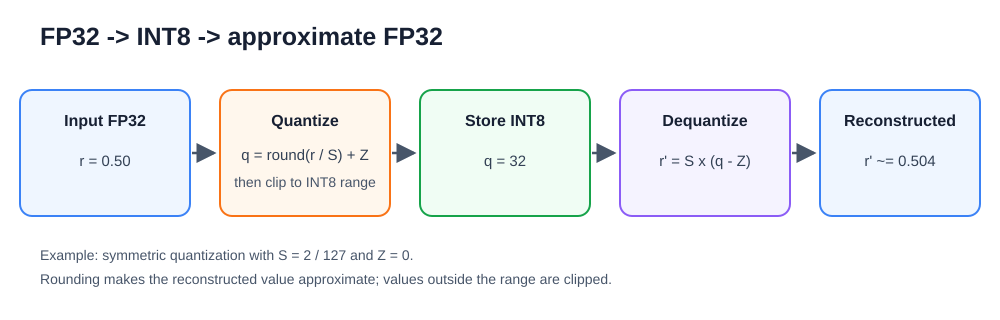

대칭 양자화는 양수와 음수 범위를 0을 기준으로 같은 폭으로 둔다. 가중치처럼 양수와 음수가 비교적 고르게 나타나는 값에 자주 쓴다. 비대칭 양자화는 실수 범위의 최솟값과 최댓값을 모두 이용해 zero point를 0이 아닌 정수로 둘 수 있다. 활성화 값처럼 값의 범위가 한쪽으로 치우친 텐서에서는 비대칭 양자화가 낭비되는 정수 구간을 줄일 수 있다.

### 학습 후 양자화와 보정

학습 후 양자화(PTQ, Post-Training Quantization)는 학습을 마친 모델의 숫자 표현만 바꾸는 방법이다. 모델 구조와 가중치를 처음부터 다시 학습시키지 않으므로 적용 절차가 비교적 단순하다. 다만 값의 표현 간격이 거칠어지므로 원래 FP32 모델과 출력이 달라질 수 있다. 여기서 말하는 정확도는 모델의 예측이 정답과 맞는 비율이고, 정밀도는 숫자를 얼마나 촘촘하게 표현하는지를 뜻한다. 두 용어를 구분해 사용한다.

가중치 양자화는 Conv나 Linear 계층 안에 저장된 가중치 텐서를 INT8로 바꾸는 일이다. 가중치는 모델 파일 안에 저장되므로, FP32 가중치 하나가 4바이트이고 INT8 가중치 하나가 1바이트라는 점만 보면 가중치 저장 용량은 4분의 1(25%)이 된다. 그러나 실제 ONNX 파일에는 그래프 구조, QDQ 노드, scale, zero point 같은 추가 정보가 함께 들어간다. 그래서 파일 크기가 정확히 1/4이 된다고 단정할 수 없다.

활성화 값 양자화는 계층 사이를 흐르는 중간 텐서를 INT8 범위로 나타내는 일이다. 활성화 값의 범위는 입력 영상에 따라 달라지므로 대표 입력을 모델에 넣어 각 텐서의 값 범위를 관찰해야 한다. 이 과정을 보정(Calibration)이라고 한다. 보정 데이터는 실제 사용 환경을 어느 정도 대표해야 한다. 예를 들어 카메라 분류 모델이라면 너무 어둡거나 같은 물체만 반복되는 프레임보다, 여러 밝기와 거리의 물체가 섞인 프레임이 더 나은 보정 데이터가 된다.

정적 양자화는 실행 전에 보정 데이터로 각 텐서의 scale과 zero point를 정해 모델 파일에 반영하는 방식이다. 실습 6-1과 실습 6-2에서 쓰는 quantize_static()이 여기에 해당한다. 동적 양자화는 실행 중 입력 값의 범위를 보고 일부 텐서의 양자화 매개변수를 그때그때 정하는 방식이다. 정적 양자화는 준비 과정이 더 필요하지만 활성화 값까지 미리 계획할 수 있고, 동적 양자화는 보정 데이터 준비 부담이 작지만 실행 중 범위 계산 비용이 생길 수 있다.

### ONNX의 QDQ 형식

QDQ 형식은 QuantizeLinear 노드와 DequantizeLinear 노드를 ONNX 그래프에 넣어 어느 위치에서 양자화와 역양자화가 일어나는지 표시하는 방식이다. QuantizeLinear는 실수를 정수 표현으로 바꾸는 위치를 나타내고, DequantizeLinear는 정수 표현을 다시 실수 표현으로 되돌리는 위치를 나타낸다. 이 노드들은 3장에서 본 ONNX 그래프의 노드와 연산자 개념 위에 놓인다.

QDQ 그래프에 노드가 보인다고 해서 모든 계산이 항상 정수 명령으로 실행된다는 뜻은 아니다. 실제 정수 연산으로 바꿀지, 중간에 FP32로 되돌려 계산할지는 ONNX Runtime과 실행 제공자, CPU 커널 지원에 따라 결정된다. 따라서 Netron으로 QDQ 노드를 확인하는 일은 양자화 위치를 이해하는 데 필요하지만, 성능 판단은 파일 크기와 session.run() 지연 시간을 실제로 측정해 해야 한다.

양자화는 한쪽을 얻으면 다른 쪽을 잃는 관계를 만든다. 파일 크기와 메모리 이동량은 줄 수 있지만, 반올림 오차와 클리핑 때문에 출력이 달라질 수 있다. 이 장의 실습은 이 관계를 추측하지 않고 숫자로 확인하는 절차이다.

### 실습 6-1. 숫자 매핑을 확인하고 QDQ 정적 INT8 모델 만들기

> **풀고 싶은 문제**
> FP32 값을 제한된 INT8 범위로 바꿀 때 간격과 클리핑은 어떻게 결정되는가? 실제 카메라 입력이 아닌 보정 데이터로 만든 QDQ 모델에서는 무엇만 확인해야 하는가?

이 실습의 목표는 숫자 배열로 양자화와 역양자화 계산을 직접 확인하고, ONNX Runtime의 quantize_static()으로 QDQ 형식의 INT8 모델 파일을 만드는 것이다. 사전 학습 1단계에서는 실수 배열이 정수 배열로 바뀌고 다시 실수로 복원될 때 오차와 클리핑이 어떻게 생기는지 본다. 사전 학습 2단계에서는 보정 입력을 하나씩 돌려주는 CalibrationDataReader 구현 방식을 익힌다. 사전 학습 3단계와 최종 구현에서는 그 리더를 quantize_static()에 연결해 mobilenet_v2_int8.onnx 파일을 만든다.

이 실습에서 쓰는 보정 입력은 0으로 채운 텐서나 난수 텐서이다. 이런 입력은 실제 카메라 프레임의 밝기, 색, 물체 분포를 반영하지 못한다. 따라서 여기서 만든 INT8 모델은 변환 절차와 QDQ 그래프 구조를 익히기 위한 산출물이며, 분류 정확도 평가에 사용하지 않는다. 실제 카메라 프레임을 골라 보정하는 과정은 실습 6-2에서 다룬다.

#### 사전 학습 1단계: 실수값을 INT8로 바꾸고 복원하기

이 단계는 숫자 하나가 어떤 계산을 거쳐 INT8 값으로 저장되는지 확인한다. 앞의 개념 절에서 다룬 scale과 zero point를 코드 변수로 두고, 반올림을 거친 값이 표현 가능한 정수 범위를 벗어나면 끝값으로 제한한다.

```python
# step1_quantize_values.py
import numpy as np

values = np.array([-2.0, -0.5, 0.0, 0.5, 3.0], dtype=np.float32)
q_min, q_max = -127, 127
scale = 2.0 / q_max
zero_point = 0
quantized = np.clip(np.round(values / scale) + zero_point,
                    q_min, q_max).astype(np.int8)
restored = (quantized.astype(np.float32) - zero_point) * scale
print("INT8 값:", quantized)
print("복원 오차:", np.abs(values - restored))
```

np.array(..., dtype=np.float32)는 실수 목록을 FP32 NumPy 배열로 만든다. dtype은 배열 원소의 자료형을 뜻하며, 여기서는 모델 입력과 같은 FP32를 쓴다. q_min, q_max = -127, 127은 두 값을 한 줄에서 각각 나누어 받는 문법이다. 이 예는 대칭 양자화를 보여 주기 위해 zero_point를 0으로 둔다.

np.round(values / scale)은 각 실수를 scale로 나눈 뒤 가장 가까운 정수로 반올림한다. np.clip(배열, 최솟값, 최댓값)은 배열의 각 원소가 허용 범위를 벗어나지 않도록 작은 값은 최솟값으로, 큰 값은 최댓값으로 자른다. astype(np.int8)은 NumPy 배열의 자료형을 INT8로 바꾼다. 복원할 때는 quantized.astype(np.float32)로 다시 FP32 배열을 만든 뒤 zero point를 빼고 scale을 곱한다.

예를 들어 0.5는 0.01575 정도의 scale로 나뉘어 약 31.75가 되고, np.round()를 거쳐 32가 된다. 3.0은 반올림하면 127을 넘기 때문에 np.clip()으로 127이 된다. 그래서 복원값은 3.0이 아니라 약 2.0에 머문다. 출력의 "복원 오차"는 원래 값과 복원값의 차이를 절댓값으로 계산한 배열이다.

이 코드는 다음과 비슷한 결과를 출력한다.

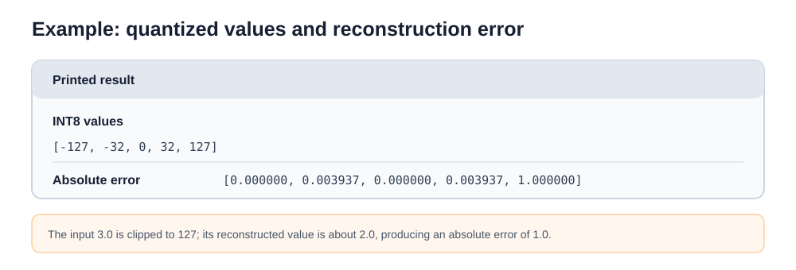

마지막 오차 1.0은 원래 3.0이던 값이 약 2.0으로 복원되었기 때문에 생긴다.

#### 사전 학습 2단계: 보정 입력 데이터를 하나씩 공급하기

이 단계는 실제 변환 전에 ONNX Runtime이 요구하는 보정 리더 구조를 따로 확인한다. CalibrationDataReader를 상속한 클래스는 get_next() 메서드로 모델 입력 딕셔너리를 하나씩 돌려주고, 더 이상 줄 입력이 없으면 None을 돌려준다. 딕셔너리의 키는 ONNX 모델 입력 노드 이름과 같아야 하며, 값의 형상도 모델 입력 형상과 맞아야 한다.

```python
# step2_calibration_reader.py
import numpy as np
from onnxruntime.quantization import CalibrationDataReader

class SyntheticReader(CalibrationDataReader):
    def __init__(self, input_name, count=3):
        self.input_name = input_name
        self.count = count
        self.current = 0

    def get_next(self):
        if self.current >= self.count:
            return None
        self.current += 1
        sample = np.zeros((1, 3, 224, 224), dtype=np.float32)
        return {self.input_name: sample}

if __name__ == "__main__":
    reader = SyntheticReader("input", count=3)
    for index in range(4):
        item = reader.get_next()
        print("데이터", index + 1, "종료" if item is None else item["input"].shape)
```

class SyntheticReader(CalibrationDataReader):는 ONNX Runtime이 정한 보정 리더 기본 클래스를 상속해 새 클래스를 만든다. __init__()은 객체가 만들어질 때 input_name, count, current를 저장한다. self.input_name처럼 self에 붙은 이름은 객체 안에 보관되는 속성이다.

get_next()는 현재까지 돌려준 개수 self.current가 목표 개수 self.count 이상이면 None을 돌려준다. 아직 남은 입력이 있으면 self.current를 1 늘리고, np.zeros((1, 3, 224, 224), dtype=np.float32)로 0으로 채운 입력 텐서를 만든다. (1, 3, 224, 224)는 배치 1개, RGB 채널 3개, 높이와 너비 224픽셀을 뜻하는 NCHW 형상이다. return {self.input_name: sample}은 입력 이름과 텐서를 짝지은 딕셔너리를 돌려준다.

마지막 반복은 count=3보다 한 번 더 많은 4회로 실행된다. 따라서 앞의 세 번은 (1, 3, 224, 224) 형상이 출력되고, 네 번째는 "종료"가 출력된다. 이 구조는 파이썬 내장 iter()와 next()로 순회하는 반복자 규약과 비슷해 보이지만, ONNX Runtime 양자화 도구는 이 클래스의 get_next()를 직접 호출한다.

#### 사전 학습 3단계: 보정 데이터로 QDQ 모델 만들기

이 단계는 2단계의 리더를 실제 quantize_static() 호출에 연결한다. 여기서는 0으로 채운 입력만 쓰므로 활성화 값 범위가 실제 카메라 입력과 다르다. 따라서 목표는 정확도 평가가 아니라 QDQ 모델 파일이 만들어지는 절차와 주요 인자의 의미를 확인하는 것이다.

```python
# step3_build_qdq_model.py
from pathlib import Path
import onnxruntime as ort
from onnxruntime.quantization import quantize_static, QuantType, QuantFormat
from step2_calibration_reader import SyntheticReader

model_path = "mobilenet_v2_opt.onnx"
output_path = "mobilenet_v2_int8.onnx"

# 이전 결과물이 남아 있을 경우 미리 제거한다.
out_file = Path(output_path)
if out_file.exists():
    out_file.unlink()

session = ort.InferenceSession(model_path, providers=["CPUExecutionProvider"])
reader = SyntheticReader(session.get_inputs()[0].name)
quantize_static(
    model_input=model_path,
    model_output=output_path,
    calibration_data_reader=reader,
    quant_format=QuantFormat.QDQ,
    activation_type=QuantType.QInt8,
    weight_type=QuantType.QInt8
)
print("QDQ 모델 저장:", output_path, out_file.stat().st_size, "bytes")
```

Path(output_path)는 문자열 경로를 파일 경로 객체로 바꾼다. out_file.exists()는 파일이 이미 있는지 확인하고, out_file.unlink()는 기존 파일을 삭제한다. 이렇게 먼저 지우면 이전 실행 결과와 이번 실행 결과를 혼동하지 않는다.

ort.InferenceSession(model_path, providers=["CPUExecutionProvider"])은 ONNX 모델을 읽어 CPU 실행 제공자로 실행할 세션을 만든다. session.get_inputs()[0].name은 모델의 첫 번째 입력 노드 이름을 가져온다. 이 이름을 SyntheticReader에 넘겨야 get_next()가 돌려주는 딕셔너리 키가 모델 입력과 맞는다.

quantize_static()은 정적 양자화를 실행하는 함수이다. model_input은 원본 FP32 ONNX 파일, model_output은 새로 저장할 INT8 ONNX 파일이다. calibration_data_reader는 보정 입력을 공급하는 객체이다. quant_format=QuantFormat.QDQ는 QuantizeLinear와 DequantizeLinear 노드를 삽입하는 형식을 뜻한다. activation_type=QuantType.QInt8과 weight_type=QuantType.QInt8은 활성화 값과 가중치를 부호 있는 INT8 기준으로 양자화하겠다는 설정이다.

#### 최종 구현

최종 구현은 두 가지 작업을 한 파일에 모은다. 먼저 demonstrate_mapping()으로 숫자 매핑을 출력하고, 이어서 난수 보정 입력을 쓰는 SyntheticCalibrationReader로 mobilenet_v2_opt.onnx를 mobilenet_v2_int8.onnx로 변환한다. 이 난수 보정은 실제 카메라 입력 분포를 대표하지 못하므로, 변환 절차를 익히는 용도로만 사용한다.

```python
# quantize_onnx_model.py
import os
import sys
from contextlib import contextmanager
from pathlib import Path
import numpy as np
import onnxruntime as ort
from onnxruntime.quantization import (
    quantize_static,
    CalibrationDataReader,
    QuantType,
    QuantFormat
)


@contextmanager
def suppress_stderr():
    """도구 내부에서 stderr로 직접 출력되는 경고 및 안내 문구를 임시로 차단한다."""
    try:
        stderr_fd = sys.stderr.fileno()
        saved_stderr_fd = os.dup(stderr_fd)
        devnull_fd = os.open(os.devnull, os.O_WRONLY)
        os.dup2(devnull_fd, stderr_fd)
        os.close(devnull_fd)
        yield
    finally:
        os.dup2(saved_stderr_fd, stderr_fd)
        os.close(saved_stderr_fd)


class SyntheticCalibrationReader(CalibrationDataReader):
    def __init__(self, input_name, count=20):
        self.input_name = input_name
        self.count = count
        self.current = 0
        self.rng = np.random.default_rng(42)

    def get_next(self):
        if self.current >= self.count:
            return None
        self.current += 1
        data = self.rng.standard_normal((1, 3, 224, 224)).astype(np.float32)
        return {self.input_name: data}


def demonstrate_mapping():
    print("1. 부동소수점(FP32) -> 정수(INT8) 수치 매핑 원리 시뮬레이션:")
    sample_floats = np.array([-2.0, -0.5, 0.0, 0.5, 1.8, 3.0], dtype=np.float32)
    r_min, r_max = -2.0, 2.0
    q_min, q_max = -127, 127

    # 대칭 양자화: Z=0, 양수/음수에 동일한 정수 범위를 대칭으로 할당한다.
    scale = max(abs(r_min), abs(r_max)) / q_max
    zero_point = 0

    quantized = np.clip(np.round(sample_floats / scale) + zero_point, q_min, q_max).astype(np.int8)
    dequantized = (quantized.astype(np.float32) - zero_point) * scale
    error = np.abs(sample_floats - dequantized)

    print(f"  Scale={scale:.6f}, Zero-Point={zero_point}")
    print(f"  원본 실수 : {sample_floats}")
    print(f"  INT8 정수 : {quantized}")
    print(f"  복원 실수 : {np.round(dequantized, 3)}")
    print(f"  복원 오차 : {np.round(error, 4)}")
    print("  -> 3.0 값은 최대 범위(2.0)를 초과하여 127로 클리핑(포화) 발생")


def main():
    print("=" * 70)
    print("      ONNX 정적 INT8 양자화 모델 빌드 및 수치 매핑 실험")
    print("=" * 70)

    demonstrate_mapping()

    model_fp32 = Path("mobilenet_v2_opt.onnx")
    model_int8 = Path("mobilenet_v2_int8.onnx")

    if not model_fp32.is_file():
        raise FileNotFoundError(f"기준 모델이 없습니다: {model_fp32}. 실습 3-2를 먼저 실행하세요.")

    # 이전에 실행하여 생성된 결과 파일이 남아 있다면 경고 없이 안전하게 갱신되도록 미리 제거한다.
    if model_int8.exists():
        model_int8.unlink()

    sess = ort.InferenceSession(str(model_fp32), providers=["CPUExecutionProvider"])
    input_name = sess.get_inputs()[0].name

    print("\n2. ONNX Runtime 정적 INT8 QDQ 양자화 진행 중...")
    reader = SyntheticCalibrationReader(input_name, count=25)

    with suppress_stderr():
        quantize_static(
            model_input=str(model_fp32),
            model_output=str(model_int8),
            calibration_data_reader=reader,
            quant_format=QuantFormat.QDQ,
            activation_type=QuantType.QInt8,
            weight_type=QuantType.QInt8,
            per_channel=True
        )

    size_fp32 = model_fp32.stat().st_size / (1024 * 1024)
    size_int8 = model_int8.stat().st_size / (1024 * 1024)
    reduction = (1.0 - size_int8 / size_fp32) * 100.0

    print("3. 양자화 파일 생성 완료:")
    print(f"  - 원본 FP32 모델 용량 : {size_fp32:.2f} MB")
    print(f"  - 정적 INT8 모델 용량 : {size_int8:.2f} MB")
    print(f"  - 디스크 공간 절감율  : {reduction:.1f}%")
    print("=" * 70)


if __name__ == "__main__":
    main()
```

**코드 해설**

quantize_onnx_model.py는 숫자 매핑 실험과 ONNX 모델 변환을 차례로 실행한다. main()은 먼저 demonstrate_mapping()을 호출해 원본 실수, INT8 정수, 복원 실수, 복원 오차를 출력한다. 그 다음 mobilenet_v2_opt.onnx 파일이 있는지 확인하고, 이전에 만든 mobilenet_v2_int8.onnx가 있으면 삭제한다. 마지막으로 ONNX Runtime 세션에서 입력 이름을 읽고, SyntheticCalibrationReader를 quantize_static()에 넘겨 QDQ 모델을 저장한다.

demonstrate_mapping()은 실수 구간 [-2.0, 2.0]을 정수 구간 [-127, 127]로 바꾸는 과정을 보여 준다. sample_floats에는 범위 안의 값과 함께 3.0이 들어 있다. r_min과 r_max는 양자화가 표현하려는 실수 범위이고, q_min과 q_max는 저장할 정수 범위이다. scale = max(abs(r_min), abs(r_max)) / q_max는 양수와 음수 가운데 더 큰 절댓값을 기준으로 정수 한 칸의 실수 간격을 계산한다. zero_point는 0이므로 대칭 양자화이다.

이 함수의 핵심 계산은 사전 학습 1단계와 같다. np.round()가 정수 격자에 맞추고, np.clip()이 q_min과 q_max 밖의 값을 자른다. astype(np.int8)은 저장 자료형을 INT8로 바꾼다. 그 뒤 INT8 값을 다시 FP32로 바꾸어 scale을 곱하면 복원 실수가 된다. 출력에서 3.0은 127로 클리핑되고 복원 실수는 약 2.0으로 표시된다. 한 걸음 더 과제에서 r_max를 3.0으로 바꾸면 scale이 커지고, sample_floats 안의 3.0이 더 이상 같은 방식으로 잘리지 않는지 비교할 수 있다.

SyntheticCalibrationReader 클래스는 CalibrationDataReader를 상속한다. get_next()가 호출될 때마다 np.random.default_rng(42)로 만든 난수 생성기에서 [1, 3, 224, 224] 형상의 표준 정규분포 난수 텐서를 만들고, astype(np.float32)로 모델 입력 자료형에 맞춘다. 총 25개의 텐서를 순서대로 돌려준 뒤 None을 반환해 보정 입력 공급이 끝났음을 알린다. 2단계의 SyntheticReader는 0으로 채운 텐서로 리더 규격을 보여 주고, 최종 구현의 SyntheticCalibrationReader는 난수 텐서로 변환 파이프라인을 조금 더 넓은 값 범위에서 실행해 보는 역할이다. 두 입력 모두 실제 카메라 프레임 분포를 대표하지 못한다.

suppress_stderr()는 contextlib.contextmanager 데코레이터로 만든 문맥 관리자이다. with suppress_stderr(): 블록에 들어갈 때 표준 에러 파일 디스크립터를 os.devnull로 임시 연결하고, 블록을 나올 때 원래 표준 에러로 되돌린다. 이 구조는 quantize_static() 내부 C++ 모듈이 표준 에러로 내는 경고를 화면에 보이지 않게 정리한다. os.dup(), os.dup2(), os.close(), os.devnull은 3장에서 살펴본 파일 디스크립터 제어 함수이다.

quantize_static()은 보정 입력을 모델에 순전파해 활성화 값 범위를 모으고, 모델 안에 QuantizeLinear와 DequantizeLinear 노드를 삽입한 QDQ 그래프를 만든다. model_input은 원본 모델 경로이고, model_output은 저장할 QDQ 모델 경로이다. calibration_data_reader는 get_next()로 입력 딕셔너리를 공급하는 객체이다. quant_format=QuantFormat.QDQ는 QDQ 형식을 선택한다. activation_type=QuantType.QInt8과 weight_type=QuantType.QInt8은 활성화 값과 가중치 모두 부호 있는 INT8 범위를 쓰겠다는 뜻이다. ONNX Runtime은 부호 없는 QUInt8 설정도 제공하지만, 이 코드에서는 두 값을 모두 QInt8로 둔다. per_channel=True는 가중치 텐서 전체에 하나의 scale을 쓰지 않고 출력 채널별 scale을 따로 계산한다.

결과를 해석할 때는 두 가지를 구분한다. 첫째, mobilenet_v2_int8.onnx 파일과 Netron의 QuantizeLinear, DequantizeLinear 노드는 변환이 QDQ 형식으로 이루어졌음을 보여 준다. 둘째, QDQ 노드가 있다는 사실만으로 모든 Conv가 실제 정수 연산 커널로 실행된다고 단정할 수 없다. 실제 실행 경로는 ONNX Runtime 버전, CPUExecutionProvider의 커널 지원, 그래프 최적화 결과에 따라 달라진다. 또한 난수 보정으로 정한 활성화 범위는 실제 카메라 입력과 맞지 않으므로, 이 모델의 분류 정확도나 출력 품질을 평가하지 않는다.

**실행 결과와 확인할 점**

quantize_onnx_model.py를 터미널에서 실행한다.

```sh
python quantize_onnx_model.py
```

실행 후 콘솔 화면에서 다음 항목들을 차례로 확인한다.

- 수치 변환 원리: 원본 실수값과 이에 대응하는 INT8 정수값, 그리고 복원 오차가 명확히 출력되는지 확인한다.
- 변환 파이프라인 완료: mobilenet_v2_int8.onnx 파일이 정상적으로 생성되고 변환 과정에서 오류가 발생하지 않는지 확인한다.
- 파일 크기 변화: 원본 FP32 모델과 생성된 INT8 모델의 크기를 비교하고 디스크 공간 절감률을 기록한다. 실제 감축 비율은 사용한 런타임 및 모델 버전에 따라 달라질 수 있다.

> **한 걸음 더**
> 1. Netron으로 mobilenet_v2_int8.onnx를 열어보고, 합성곱(Conv) 노드 앞뒤에 QuantizeLinear 및 DequantizeLinear 노드가 어떻게 배치되어 연결되는지 관찰한다.
> 2. demonstrate_mapping()에서 실수 범위의 최댓값(r_max)을 3.0으로 변경했을 때, 비례 계수와 정수 변환값, 그리고 복원 오차가 각각 어떻게 바뀌는지 계산한다. sample_floats에 이미 3.0이 들어 있으므로 이 값의 클리핑 여부를 함께 확인한다.

### 실습 6-2. 카메라 프레임으로 보정하는 정적 INT8 양자화

> **풀고 싶은 문제**
> 실제 카메라 화면을 보며 고른 프레임을 보정 데이터로 넣으면, 난수나 0으로 채운 입력을 쓸 때보다 무엇을 더 잘 반영할 수 있는가? 보정에 사용한 프레임을 정확도 평가에 다시 쓰면 왜 안 되는가?

이 실습의 목표는 실습 6-1에서 익힌 CalibrationDataReader와 quantize_static() 구조를 실제 카메라 프레임에 연결하는 것이다. 사전 학습 단계에서는 스페이스바를 누른 순간의 프레임을 고르는 방법, get_next() 안에서 카메라 화면을 보여 주고 텐서를 돌려주는 방법, 대화형 리더를 quantize_static()에 연결하는 방법을 차례로 확인한다. 최종 구현에서는 사용자가 직접 고른 20개의 카메라 프레임으로 mobilenet_v2_calibrated_int8.onnx 파일을 만든다.

보정 데이터는 실제 사용할 환경의 장면을 대표해야 한다. 조명, 배경, 물체의 종류와 거리, 카메라 각도가 한쪽으로 치우치면 활성화 값 범위도 그 장면에 맞게 치우칠 수 있다. 따라서 같은 물체를 같은 위치에서 반복해서 넣기보다 여러 조건의 프레임을 골라야 한다. 또한 보정에 쓴 프레임은 양자화 매개변수를 정하는 데 이미 사용되었으므로, FP32 모델과 INT8 모델의 정확도를 비교하는 평가 자료로 다시 쓰지 않는다.

이 실습의 사전 학습 코드는 절차 확인을 위해 목표 프레임 수를 3개 또는 5개로 작게 둔다. 최종 구현은 보정 범위를 조금 더 넓게 잡기 위해 target_calibration_steps = 20을 사용한다. 표본 수가 많을수록 다양한 장면을 담을 가능성이 커지지만, 변환 시간이 늘고 정확도 향상을 보장하지는 않는다. 실제 제품에서는 별도의 검증 자료로 표본 수와 정확도 변화를 확인해야 한다.

#### 사전 학습 1단계: 스페이스바 입력 시점의 카메라 프레임 고르기

일정 시간 간격으로 프레임을 자동 수집하면 같은 배경이나 비슷한 밝기의 장면이 반복될 수 있다. 이 단계에서는 OpenCV 창으로 현재 화면을 보면서 스페이스바를 누른 순간의 프레임만 보정 후보로 센다. target_count는 목표로 모을 프레임 수이고, q 키는 목표 수를 채우기 전에 반복을 끝내는 중단 입력이다.

```python
# step1_interactive_frame_capture.py
import cv2
from async_camera_engine import HighPerformanceAsyncCamera

camera = HighPerformanceAsyncCamera()
captured_count = 0
target_count = 3

print("스페이스바: 현재 프레임 캡처 | q: 종료")
try:
    while captured_count < target_count:
        success, frame, _ = camera.read_latest(block=True, timeout=0.1)
        if not success:
            continue

        display_frame = frame.copy()
        text = f"Sample: {captured_count}/{target_count} (Press SPACE)"
        cv2.putText(display_frame, text, (20, 40),
                    cv2.FONT_HERSHEY_SIMPLEX, 0.6, (0, 255, 0), 2)
        cv2.imshow("Capture Preview", display_frame)

        key = cv2.waitKey(1) & 0xFF
        if key == 32:  # 스페이스바 키코드
            captured_count += 1
            print(f"[{captured_count}/{target_count}] 프레임 캡처 성공: 형상 {frame.shape}")
        elif key == ord('q'):
            break
finally:
    camera.release()
    cv2.destroyAllWindows()

print(f"캡처 완료 수량: {captured_count}개")
```

camera.read_latest(block=True, timeout=0.1)는 최신 프레임을 기다렸다가 성공 여부와 프레임을 돌려준다. success가 거짓이면 이번 반복에서는 쓸 프레임이 없으므로 continue로 다음 반복으로 넘어간다. display_frame = frame.copy()는 화면에 글자를 그릴 사본을 만든다. 원본 frame은 나중에 보정 입력으로 쓸 수 있으므로, 화면 표시용 사본과 구분한다.

cv2.putText()는 표시용 프레임 위에 현재 수집 개수와 목표 개수를 그린다. cv2.imshow()는 이 프레임을 창에 보여 주고, cv2.waitKey(1) & 0xFF는 1ms 동안 키 입력을 확인해 하위 8비트 키 코드만 남긴다. 스페이스바의 키 코드는 32이므로 key == 32일 때 captured_count를 1 늘린다. ord('q')는 문자 q의 키 코드를 돌려주며, q 키가 눌리면 break로 while 반복을 끝낸다. finally 블록은 정상 종료와 중단 모두에서 카메라와 OpenCV 창을 정리한다.

#### 사전 학습 2단계: 카메라 프레임을 즉시 텐서로 바꾸는 대화형 리더 만들기

이 단계에서는 get_next() 안에 카메라 프리뷰 루프를 넣는다. quantize_static()은 보정 입력이 필요할 때마다 get_next()를 반복 호출한다. 따라서 호출될 때마다 화면이 갱신되고, 사용자가 스페이스바를 누르면 그 프레임 하나가 전처리되어 입력 딕셔너리로 반환된다.

```python
# step2_interactive_reader.py
import cv2
from onnxruntime.quantization import CalibrationDataReader
from async_camera_engine import HighPerformanceAsyncCamera
from vision_preprocessor_suite import VisionPreprocessor

class InteractiveCameraCalibrationReader(CalibrationDataReader):
    def __init__(self, input_name, camera, target_count=3):
        self.input_name = input_name
        self.camera = camera
        self.target_count = target_count
        self.current_count = 0
        self.preprocessor = VisionPreprocessor(target_size=(224, 224))

    def get_next(self):
        if self.current_count >= self.target_count:
            return None

        while True:
            success, frame, _ = self.camera.read_latest(block=True, timeout=0.1)
            if not success:
                continue

            display = frame.copy()
            cv2.putText(display, f"Feed: {self.current_count}/{self.target_count} (SPACE to Feed)",
                        (20, 40), cv2.FONT_HERSHEY_SIMPLEX, 0.6, (0, 255, 0), 2)
            cv2.imshow("Interactive Feeder", display)

            key = cv2.waitKey(1) & 0xFF
            if key == 32:
                self.current_count += 1
                letterboxed, _ = self.preprocessor.letterbox(frame)
                tensor = self.preprocessor.transform_to_tensor(letterboxed)
                return {self.input_name: tensor}
            if key == ord('q'):
                return None

if __name__ == "__main__":
    cam = HighPerformanceAsyncCamera()
    reader = InteractiveCameraCalibrationReader("input", cam, target_count=2)
    try:
        sample = reader.get_next()
        if sample is not None:
            print("주입된 보정 텐서 규격:", sample["input"].shape, sample["input"].dtype)
    finally:
        cam.release()
        cv2.destroyAllWindows()
```

InteractiveCameraCalibrationReader는 실습 6-1의 보정 리더 구조를 카메라 입력에 맞게 바꾼 클래스이다. __init__()은 모델 입력 이름, 카메라 객체, 목표 프레임 수와 현재 개수를 저장하고, VisionPreprocessor(target_size=(224, 224))로 전처리 객체를 만든다. 이 전처리 객체는 앞 장에서 다룬 레터박스와 NCHW 텐서 변환을 수행한다.

get_next()는 먼저 current_count가 target_count에 도달했는지 확인한다. 목표 수에 도달하면 None을 반환해 더 이상 보정 입력이 없음을 알린다. 아직 남은 입력이 있으면 카메라 화면을 계속 표시하다가 key == 32가 되는 순간 current_count를 늘리고, letterbox(frame)과 transform_to_tensor(letterboxed)로 모델 입력 형상의 FP32 텐서를 만든다. 반환값 {self.input_name: tensor}는 ONNX 모델 입력 이름과 텐서를 짝지은 딕셔너리이다. q 키를 누르면 None을 반환하므로, 보정 입력 공급이 조기에 끝난다.

#### 사전 학습 3단계: 대화형 리더로 QDQ 모델 빌드하기

이 단계는 대화형 리더를 quantize_static()에 연결한다. 기존 생성 파일이 있으면 먼저 지워 이번 실행으로 새 파일이 만들어졌는지 확인할 수 있게 한다. 여기서는 절차 확인을 위해 target_count=5만 사용한다. 최종 구현의 20개보다 적지만, 키 입력과 파일 생성 흐름을 빠르게 확인하기 위한 값이다.

```python
# step3_interactive_quantize.py
import os
import sys
from contextlib import contextmanager
from pathlib import Path
import cv2
import onnxruntime as ort
from onnxruntime.quantization import quantize_static, QuantType, QuantFormat
from async_camera_engine import HighPerformanceAsyncCamera
from step2_interactive_reader import InteractiveCameraCalibrationReader

@contextmanager
def suppress_stderr():
    """도구 내부에서 stderr로 직접 출력되는 경고 및 안내 문구를 임시 차단한다."""
    try:
        stderr_fd = sys.stderr.fileno()
        saved_stderr_fd = os.dup(stderr_fd)
        devnull_fd = os.open(os.devnull, os.O_WRONLY)
        os.dup2(devnull_fd, stderr_fd)
        os.close(devnull_fd)
        yield
    finally:
        os.dup2(saved_stderr_fd, stderr_fd)
        os.close(saved_stderr_fd)

model_path = Path("mobilenet_v2_opt.onnx")
output_path = Path("mobilenet_v2_calibrated_int8.onnx")

if output_path.exists():
    output_path.unlink()

cam = HighPerformanceAsyncCamera()
sess = ort.InferenceSession(str(model_path), providers=["CPUExecutionProvider"])
reader = InteractiveCameraCalibrationReader(sess.get_inputs()[0].name, cam, target_count=5)

try:
    with suppress_stderr():
        quantize_static(
            model_input=str(model_path),
            model_output=str(output_path),
            calibration_data_reader=reader,
            quant_format=QuantFormat.QDQ,
            activation_type=QuantType.QInt8,
            weight_type=QuantType.QInt8,
            per_channel=True
        )
finally:
    cam.release()
    cv2.destroyAllWindows()

if output_path.is_file():
    print("QDQ 모델 빌드 완료:", output_path, f"({output_path.stat().st_size} bytes)")
```

Path("mobilenet_v2_calibrated_int8.onnx")는 출력 파일 경로를 객체로 다루게 한다. output_path.exists()가 참이면 unlink()로 이전 파일을 지운다. 이렇게 하면 나중에 output_path.is_file()로 이번 변환에서 새 파일이 만들어졌는지 확인할 수 있다.

sess = ort.InferenceSession(...)은 FP32 모델을 읽어 입력 이름을 확인하는 데 쓴다. reader는 그 입력 이름과 카메라 객체를 받아 get_next()가 올바른 입력 딕셔너리를 만들게 한다. quantize_static()은 reader.get_next()를 반복 호출하면서 프레임 텐서를 모델에 넣고 활성화 값 범위를 모은다. 사용자가 q 키를 눌러 get_next()가 None을 일찍 반환하면 보정 입력 공급이 끝난 것으로 처리된다. 이 예제는 출력 파일이 있을 때만 완료 문구를 출력하므로, 조기 중단 뒤 파일이 생기지 않았는지 확인할 수 있다.

#### 최종 구현

최종 구현은 카메라 프리뷰를 보며 20개의 보정 프레임을 직접 고르고, 그 프레임으로 정적 QDQ INT8 모델을 만드는 전체 코드이다. 이전 출력 파일을 먼저 지우고, 변환이 끝난 뒤 파일이 실제로 만들어졌는지 검사한다. q 키로 중단해 목표 개수를 채우지 못하면 출력 파일 검사에서 오류를 내어 불완전한 결과를 다음 실습에 쓰지 않게 한다.

```python
# calibrate_with_camera.py
from contextlib import contextmanager
import os
from pathlib import Path
import sys

import cv2
import numpy as np
import onnxruntime as ort
from onnxruntime.quantization import (
    CalibrationDataReader,
    QuantFormat,
    QuantType,
    quantize_static,
)

from async_camera_engine import HighPerformanceAsyncCamera
from vision_preprocessor_suite import VisionPreprocessor


@contextmanager
def suppress_stderr():
    """도구 내부에서 stderr로 직접 출력되는 경고 및 안내 문구를 임시 차단한다."""
    try:
        stderr_fd = sys.stderr.fileno()
        saved_stderr_fd = os.dup(stderr_fd)
        devnull_fd = os.open(os.devnull, os.O_WRONLY)
        os.dup2(devnull_fd, stderr_fd)
        os.close(devnull_fd)
        yield
    finally:
        os.dup2(saved_stderr_fd, stderr_fd)
        os.close(saved_stderr_fd)


class InteractiveCameraCalibrationReader(CalibrationDataReader):
    """스페이스바 입력을 감지할 때마다 카메라 프레임을 즉시 텐서로 변환하여 공급하는 보정 리더."""

    def __init__(self, input_name, camera, target_count=20):
        self.input_name = input_name
        self.camera = camera
        self.target_count = target_count
        self.current_count = 0
        self.preprocessor = VisionPreprocessor(target_size=(224, 224))

        print("=" * 70)
        print(f"   대화형 카메라 보정 시작 (목표: {self.target_count}회 수동 입력)")
        print("   화면을 보며 사물을 비춘 상태에서 [SPACE] 키를 눌러 보정 데이터를 주입하십시오.")
        print("   (조작: [SPACE] 현재 프레임으로 보정 | [q] 조기 중단)")
        print("=" * 70)

    def get_next(self):
        # 목표 보정 횟수에 도달하면 None을 반환하여 양자화 절차를 마무리한다.
        if self.current_count >= self.target_count:
            return None

        # 스페이스바가 눌릴 때까지 실시간 프리뷰를 유지하며 대기한다.
        while True:
            success, frame, _ = self.camera.read_latest(block=True, timeout=0.1)
            if not success:
                continue

            display_frame = frame.copy()
            status_text = f"Calibration: {self.current_count}/{self.target_count} (Press SPACE to Feed)"
            cv2.putText(
                display_frame,
                status_text,
                (20, 40),
                cv2.FONT_HERSHEY_SIMPLEX,
                0.6,
                (0, 255, 0),
                2,
            )
            cv2.imshow("Interactive Calibration Feed", display_frame)

            key = cv2.waitKey(1) & 0xFF

            if key == 32:  # [SPACE] 키: 현재 프레임을 보정 데이터로 채택
                self.current_count += 1
                letterboxed, _ = self.preprocessor.letterbox(frame)
                tensor = self.preprocessor.transform_to_tensor(letterboxed)
                print(
                    f" -> [{self.current_count}/{self.target_count}] 프레임 보정 텐서 주입 완료"
                )
                return {self.input_name: tensor}

            if key == ord("q"):  # [q] 키: 작업 중단
                print("\n보정 입력이 사용자에 의해 중단되었습니다.")
                return None


def main():
    target_calibration_steps = 20
    model_fp32 = Path("mobilenet_v2_opt.onnx")
    model_output = Path("mobilenet_v2_calibrated_int8.onnx")

    if not model_fp32.is_file():
        raise FileNotFoundError(
            f"기준 모델이 존재하지 않습니다: {model_fp32}. 이전 최적화 실습을 먼저 완료해야 합니다."
        )

    # 이전 실행으로 생성된 결과 파일이 남아 있다면 사전에 제거한다.
    if model_output.exists():
        model_output.unlink()

    # 카메라 및 모델 세션 초기화
    cam = HighPerformanceAsyncCamera()
    sess = ort.InferenceSession(str(model_fp32), providers=["CPUExecutionProvider"])
    input_name = sess.get_inputs()[0].name

    reader = InteractiveCameraCalibrationReader(
        input_name=input_name, camera=cam, target_count=target_calibration_steps
    )

    try:
        with suppress_stderr():
            quantize_static(
                model_input=str(model_fp32),
                model_output=str(model_output),
                calibration_data_reader=reader,
                quant_format=QuantFormat.QDQ,
                activation_type=QuantType.QInt8,
                weight_type=QuantType.QInt8,
                per_channel=True,
            )
    finally:
        cam.release()
        cv2.destroyAllWindows()

    # 정상적으로 목표 수치만큼 주입되어 파일이 생성되었는지 검증한다.
    if not model_output.is_file():
        raise RuntimeError(
            "목표 보정 횟수를 채우지 못해 양자화 파일이 정상 생성되지 않았습니다."
        )

    size_mb = model_output.stat().st_size / (1024 * 1024)
    print("=" * 70)
    print(f"정밀 대화형 보정 완료: {model_output} ({size_mb:.2f} MB)")
    print("=" * 70)


if __name__ == "__main__":
    main()
```

**코드 해설**

calibrate_with_camera.py는 세 단계로 실행된다. 먼저 main()이 mobilenet_v2_opt.onnx 파일이 있는지 확인하고, 이전에 남은 mobilenet_v2_calibrated_int8.onnx 파일을 삭제한다. 그 다음 HighPerformanceAsyncCamera와 ONNX Runtime 세션을 만들고, 세션의 첫 번째 입력 이름을 InteractiveCameraCalibrationReader에 넘긴다. 마지막으로 suppress_stderr() 블록 안에서 quantize_static()을 호출해 QDQ 모델을 저장한다.

InteractiveCameraCalibrationReader는 quantize_static()이 입력을 요구할 때마다 get_next()로 호출된다. get_next()는 카메라에서 최신 프레임을 읽고, 프레임 사본에 현재 보정 횟수를 그려 OpenCV 창에 표시한다. 스페이스바를 누르면 현재 프레임을 letterbox()로 224×224 입력에 맞게 배치하고, transform_to_tensor()로 [1, 3, 224, 224] 형상의 FP32 텐서로 바꾼다. 이 텐서는 {입력 이름: 텐서} 딕셔너리로 반환되어 보정 순전파에 쓰인다.

target_calibration_steps = 20은 최종 구현의 목표 보정 프레임 수이다. 사전 학습 단계의 3개와 5개는 키 입력과 변환 절차를 빠르게 확인하기 위한 값이고, 20개는 실제 장면의 변화를 조금 더 담기 위한 값이다. 수를 늘리면 조명과 물체 변화를 더 많이 넣을 수 있지만, 표본이 대표적이지 않으면 효과가 제한된다. 보정 데이터와 정확도 평가 데이터는 분리해야 하며, 보정에 쓴 장면으로 정확도 회복률을 판단하지 않는다.

suppress_stderr()는 운영체제의 표준 에러 파일 디스크립터를 os.devnull로 잠시 연결했다가 되돌리는 문맥 관리자이다. quantize_static() 내부 C++ 코드가 표준 에러로 내는 경고를 화면에서 숨기는 목적이며, 변환 결과 자체를 바꾸지는 않는다. finally 블록은 변환 성공, 오류, q 키 중단과 관계없이 camera.release()와 cv2.destroyAllWindows()를 실행한다.

목표 횟수만큼 스페이스바를 누르면 다음 get_next() 호출에서 current_count >= target_count 조건이 참이 되고 None이 반환된다. 이 None은 보정 입력이 끝났다는 신호이다. q 키를 누를 때도 None이 반환되므로 quantize_static()은 더 받을 입력이 없다고 보고 종료를 시도한다. main()은 그 뒤 model_output.is_file()로 출력 파일 존재를 검사한다. 파일이 없으면 RuntimeError를 내어 조기 중단이나 변환 실패를 명확히 알린다.

**실행 결과와 확인할 점**

calibrate_with_camera.py를 터미널에서 실행한다.

```sh
python calibrate_with_camera.py
```

화면 출력과 OpenCV 창을 확인하며 다음 항목을 순서대로 점검한다.

- 대화형 입력 동작: 실시간 프리뷰를 보며 스페이스바를 누를 때마다 콘솔에 주입 완료 로그가 출력되고 화면의 카운트가 1씩 증가하는지 확인한다.
- 보정 장면의 대표성: 어두운 장면, 밝은 장면, 가까운 물체와 먼 물체처럼 실제 사용할 조건을 나누어 고른다. 같은 장면만 반복하지 않는다.
- 조기 종료 처리: 목표 횟수인 20회를 채우기 전에 q 키를 누르면 get_next()가 None을 반환해 입력 공급을 끝낸다. 출력 파일이 만들어지지 않으면 RuntimeError가 발생하는지 확인한다.
- 파일 생성 확인: 20개의 프레임을 모두 주입한 뒤 mobilenet_v2_calibrated_int8.onnx 파일 이름과 크기가 출력되는지 확인한다.

> **한 걸음 더**
> 1. 단일 사물만 계속 비추며 20회를 주입했을 때와, 서로 다른 밝기와 거리의 다양한 사물을 골고루 비추며 20회를 주입했을 때 생성된 두 QDQ 모델의 가중치 및 활성화 scale 분포 차이를 Netron으로 대조한다.
> 2. 보정 목표 횟수를 10회, 20회, 50회로 조정해 보면서 변환 시간과 최종 양자화 모델의 분류 정확도 회복률 사이에 어떤 상관관계가 있는지 분석한다.

### 실습 6-3. 카메라에서 FP32와 INT8 추론 비교

> **풀고 싶은 문제**
> 동일한 하드웨어 환경에서 FP32 모델과 INT8 모델의 순수 추론 시간은 어떻게 달라지는가? 카메라 화면에 표시되는 Top-1 결과만으로 양자화 모델의 정확도와 전력 및 발열 특성을 평가할 수 있는가?

이 실습의 목표는 최적화된 FP32 ONNX 모델과 실습 6-2에서 만든 INT8 모델을 같은 카메라 파이프라인에서 번갈아 실행하고, session.run() 구간의 지연 시간과 화면 표시 결과를 구분해 해석하는 것이다. 사전 학습 단계에서는 같은 SessionOptions로 두 세션을 만드는 방법, 같은 입력 텐서로 두 모델의 출력을 비교하는 방법, 순수 모델 호출 구간만 측정하는 방법을 확인한다. 최종 구현에서는 F 키와 I 키로 실행 모드를 바꾸며 Infer Latency, Loop FPS, Camera Stream, CPU 사용률, Top-1 표시를 한 화면에서 관찰한다.

FP32와 INT8을 공정하게 비교하려면 모델 파일만 바꾸고 입력, 전처리, 실행 제공자, 스레드 수, 측정 구간을 같게 맞춘다. 카메라 모드 전환 중에는 서로 다른 시점의 프레임이 들어갈 수 있으므로 화면에 표시되는 Top-1 차이를 정확도 차이로 판단하지 않는다. 정확도 평가는 보정에 쓰지 않은 라벨 검증 자료에서 Top-1과 Top-5를 계산해야 한다. 전력과 발열도 이 스크립트가 직접 측정하지 않으므로, 시작 온도와 냉각 조건을 맞추고 별도 센서나 전력 측정값으로 판단한다.

#### 사전 학습 1단계: 같은 설정으로 두 정밀도 세션 만들기

두 모델 세션에 같은 SessionOptions 객체를 넘기면 그래프 최적화 수준과 연산 내부 스레드 수가 같은 조건으로 맞춰진다. 여기서는 CPUExecutionProvider를 두 세션에 모두 지정하고, 각 모델의 입력 이름을 미리 읽어 둔다.

```python
# step1_open_precision_sessions.py
import onnxruntime as ort

options = ort.SessionOptions()
options.intra_op_num_threads = 4
options.graph_optimization_level = ort.GraphOptimizationLevel.ORT_ENABLE_ALL

fp32_session = ort.InferenceSession(
    "mobilenet_v2_opt.onnx",
    sess_options=options,
    providers=["CPUExecutionProvider"]
)
int8_session = ort.InferenceSession(
    "mobilenet_v2_calibrated_int8.onnx",
    sess_options=options,
    providers=["CPUExecutionProvider"]
)

fp32_input = fp32_session.get_inputs()[0].name
int8_input = int8_session.get_inputs()[0].name
print("FP32 입력 노드 이름:", fp32_input)
print("INT8 입력 노드 이름:", int8_input)
```

options = ort.SessionOptions()는 ONNX Runtime 세션을 만들 때 쓸 설정 객체를 만든다. options.intra_op_num_threads = 4는 연산자 하나를 계산할 때 사용할 스레드 수를 4로 요청한다. options.graph_optimization_level은 그래프 최적화 수준을 정하며, ORT_ENABLE_ALL은 런타임이 지원하는 최적화를 가능한 범위에서 적용한다.

ort.InferenceSession()은 모델 파일을 읽어 실행 준비가 끝난 세션을 만든다. sess_options=options는 위에서 만든 설정을 세션에 전달하고, providers=["CPUExecutionProvider"]는 CPU 실행 제공자를 사용하겠다는 뜻이다. get_inputs()[0].name은 첫 번째 입력 노드의 이름을 읽는다. ONNX Runtime의 run()은 입력 이름을 키로 쓰는 딕셔너리를 받으므로, FP32 모델과 INT8 모델의 입력 이름을 각각 저장해 둔다.

#### 사전 학습 2단계: 같은 입력 텐서로 두 모델 출력 비교하기

정밀도에 따른 출력 차이를 보려면 같은 입력 텐서를 두 세션에 넣어야 한다. 서로 다른 시점의 카메라 프레임을 넣으면 피사체 움직임, 조명 변화, 양자화 오차가 섞인다. 이 단계에서는 0으로 채운 고정 텐서를 써서 출력 형상, 최대 절대 오차, 코사인 유사도, Top-1 일치 여부를 계산한다.

```python
# step2_run_both_precisions.py
import numpy as np
from step1_open_precision_sessions import (
    fp32_session, int8_session, fp32_input, int8_input
)

sample_tensor = np.zeros((1, 3, 224, 224), dtype=np.float32)
fp32_output = fp32_session.run(None, {fp32_input: sample_tensor})[0]
int8_output = int8_session.run(None, {int8_input: sample_tensor})[0]

fp32_logits = fp32_output.reshape(-1)
int8_logits = int8_output.reshape(-1)
max_abs_error = np.max(np.abs(fp32_logits - int8_logits))
cosine_similarity = np.dot(fp32_logits, int8_logits) / (
    np.linalg.norm(fp32_logits) * np.linalg.norm(int8_logits)
)
top1_match = int(np.argmax(fp32_logits)) == int(np.argmax(int8_logits))

print("FP32 출력 형상:", fp32_output.shape)
print("INT8 출력 형상:", int8_output.shape)
print(f"최대 절대 오차: {max_abs_error:.6f}")
print(f"코사인 유사도: {cosine_similarity:.6f}")
print("Top-1 일치:", top1_match)
```

np.zeros((1, 3, 224, 224), dtype=np.float32)는 배치 1개, RGB 3채널, 224×224 크기의 입력 텐서를 0으로 채운다. 세션의 run(None, {입력 이름: 텐서})은 모든 출력 노드를 계산하고, 그 가운데 첫 번째 출력을 [0]으로 꺼낸다. 두 출력은 같은 ImageNet 1,000개 클래스 로짓 배열이어야 하므로 형상을 먼저 확인한다.

reshape(-1)는 출력 배열을 1차원으로 펴서 지표 계산을 단순하게 만든다. np.max(np.abs(fp32_logits - int8_logits))는 두 출력에서 가장 크게 벌어진 값 하나를 찾는다. np.dot()과 np.linalg.norm()으로 계산한 코사인 유사도는 두 출력 벡터의 방향이 얼마나 비슷한지 나타내며, 1에 가까울수록 비슷하다. np.argmax()는 가장 큰 로짓의 위치를 찾으므로, 두 위치가 같으면 Top-1 예측 인덱스가 일치한다.

#### 사전 학습 3단계: 순수 모델 연산 구간의 지연 시간 분리 측정하기

time.perf_counter()를 session.run() 호출 직전과 직후에 배치하면 카메라 프레임 수신, 이미지 전처리, 소프트맥스 계산, 화면 표시를 제외한 모델 호출 지연 시간만 측정할 수 있다. 이 값은 최종 구현의 Infer Latency와 같은 범위이다.

```python
# step3_time_model_call.py
import time
from step2_run_both_precisions import (
    fp32_session, int8_session, fp32_input, int8_input, sample_tensor
)

start_time = time.perf_counter()
fp32_session.run(None, {fp32_input: sample_tensor})
fp32_latency_ms = (time.perf_counter() - start_time) * 1000.0

start_time = time.perf_counter()
int8_session.run(None, {int8_input: sample_tensor})
int8_latency_ms = (time.perf_counter() - start_time) * 1000.0

print(f"FP32 순수 추론 지연 시간: {fp32_latency_ms:.2f} ms")
print(f"INT8 순수 추론 지연 시간: {int8_latency_ms:.2f} ms")
```

time.perf_counter()는 짧은 시간 차이를 재는 데 적합한 고해상도 타이머 값을 초 단위로 돌려준다. 두 시점의 차이에 1000.0을 곱하면 밀리초 단위가 된다. 같은 sample_tensor를 반복해서 넣으면 입력 내용이 매번 같아지므로, 모델 정밀도와 런타임 실행 경로가 지연 시간에 주는 영향을 더 분리해서 볼 수 있다. 실제 비교에서는 워밍업을 몇 차례 실행한 뒤 여러 번 측정하고, 평균뿐 아니라 P50과 P95도 함께 기록한다.

#### 최종 구현

다음 전체 스크립트는 실시간 카메라 영상을 입력받고, 사용자가 키보드로 정밀도를 전환하며 성능 지표를 관찰하도록 구성한다. ONNX Runtime 세션 생성 시 표준 에러로 나오는 내부 안내를 잠시 숨기고, 선택한 정밀도와 측정값을 OpenCV 화면에 나란히 표시한다.

```python
# realtime_quantization_comparator.py
import os
import sys
import time
import urllib.request
from contextlib import contextmanager
from pathlib import Path

import cv2
import numpy as np
import onnxruntime as ort
import psutil

from async_camera_engine import HighPerformanceAsyncCamera
from vision_preprocessor_suite import VisionPreprocessor


@contextmanager
def suppress_stderr():
    """도구 내부에서 stderr로 직접 출력되는 경고 및 안내 문구를 임시 차단한다."""
    try:
        stderr_fd = sys.stderr.fileno()
        saved_stderr_fd = os.dup(stderr_fd)
        devnull_fd = os.open(os.devnull, os.O_WRONLY)
        os.dup2(devnull_fd, stderr_fd)
        os.close(devnull_fd)
        yield
    finally:
        os.dup2(saved_stderr_fd, stderr_fd)
        os.close(saved_stderr_fd)


def download_labels_if_needed(label_path="imagenet_classes.txt"):
    path = Path(label_path)
    if not path.is_file():
        url = "https://raw.githubusercontent.com/pytorch/hub/master/imagenet_classes.txt"
        print("ImageNet 라벨 파일을 내려받는 중입니다...")
        urllib.request.urlretrieve(url, str(path))
    return [line.strip() for line in path.read_text(encoding="utf-8").splitlines() if line.strip()]


def softmax(x):
    exp_x = np.exp(x - np.max(x))
    return exp_x / exp_x.sum(axis=-1, keepdims=True)


def draw_hud(frame, precision_name, infer_ms, loop_fps, cam_fps, cpu_pct, top_label, top_prob):
    x1, y1, x2, y2 = 10, 10, 440, 165
    roi = frame[y1:y2, x1:x2]
    panel = np.full(roi.shape, (15, 23, 42), dtype=np.uint8)
    cv2.addWeighted(panel, 0.75, roi, 0.25, 0, dst=roi)
    cv2.rectangle(frame, (x1, y1), (x2, y2), (6, 182, 212), 1)

    precision_color = (0, 165, 255) if "FP32" in precision_name else (0, 255, 120)
    cv2.putText(frame, f"PRECISION : {precision_name}", (20, 32),
                cv2.FONT_HERSHEY_SIMPLEX, 0.52, precision_color, 2, cv2.LINE_AA)

    cv2.putText(frame, f"Infer Latency : {infer_ms:4.1f} ms | Loop FPS : {loop_fps:4.1f}", (20, 58),
                cv2.FONT_HERSHEY_SIMPLEX, 0.42, (240, 240, 240), 1, cv2.LINE_AA)
    cv2.putText(frame, f"Camera Stream : {cam_fps:4.1f} FPS", (20, 80),
                cv2.FONT_HERSHEY_SIMPLEX, 0.42, (200, 200, 200), 1, cv2.LINE_AA)
    cv2.putText(frame, f"CPU Usage     : {cpu_pct:4.1f} %", (20, 102),
                cv2.FONT_HERSHEY_SIMPLEX, 0.42, (255, 200, 0), 1, cv2.LINE_AA)
    cv2.putText(frame, f"Top-1 Predict : {top_label} ({top_prob * 100:.1f}%)", (20, 126),
                cv2.FONT_HERSHEY_SIMPLEX, 0.44, (0, 255, 255), 1, cv2.LINE_AA)
    cv2.putText(frame, "[F] FP32 Baseline  [I] INT8 Quantized  [Q] Exit", (20, 150),
                cv2.FONT_HERSHEY_SIMPLEX, 0.36, (160, 160, 160), 1, cv2.LINE_AA)


def main():
    labels = download_labels_if_needed()
    fp32_path = Path("mobilenet_v2_opt.onnx")
    int8_path = Path("mobilenet_v2_calibrated_int8.onnx")
    if not int8_path.is_file():
        int8_path = Path("mobilenet_v2_int8.onnx")

    if not fp32_path.is_file() or not int8_path.is_file():
        raise FileNotFoundError("필요한 모델 파일이 존재하지 않습니다. 실습 6-1 또는 6-2를 먼저 완료해야 합니다.")

    print("=" * 70)
    print("      FP32 vs 정적 INT8 실시간 카메라 듀얼 벤치마크 뷰어")
    print("=" * 70)

    session_options = ort.SessionOptions()
    session_options.intra_op_num_threads = 4
    session_options.graph_optimization_level = ort.GraphOptimizationLevel.ORT_ENABLE_ALL

    with suppress_stderr():
        session_fp32 = ort.InferenceSession(
            str(fp32_path), sess_options=session_options, providers=["CPUExecutionProvider"]
        )
        session_int8 = ort.InferenceSession(
            str(int8_path), sess_options=session_options, providers=["CPUExecutionProvider"]
        )

    input_name_fp32 = session_fp32.get_inputs()[0].name
    input_name_int8 = session_int8.get_inputs()[0].name

    camera = HighPerformanceAsyncCamera()
    preprocessor = VisionPreprocessor(target_size=(224, 224))
    process = psutil.Process()
    process.cpu_percent(None)

    current_mode = "FP32 Standard (Baseline)"
    loop_count = 0
    loop_fps = 0.0
    loop_timer = time.perf_counter()
    last_infer_ms = 0.0
    last_cpu = 0.0
    last_top_label = "Ready"
    last_top_prob = 0.0
    last_telemetry_time = 0.0

    try:
        while True:
            success, frame, _ = camera.read_latest(block=True, timeout=0.1)
            if not success:
                continue

            display_frame = frame.copy()
            letterboxed, _ = preprocessor.letterbox(frame)
            input_tensor = preprocessor.transform_to_tensor(letterboxed)

            inference_start = time.perf_counter()
            if "FP32" in current_mode:
                logits = session_fp32.run(None, {input_name_fp32: input_tensor})[0][0]
            else:
                logits = session_int8.run(None, {input_name_int8: input_tensor})[0][0]
            last_infer_ms = (time.perf_counter() - inference_start) * 1000.0

            probabilities = softmax(logits)
            top_index = int(np.argmax(probabilities))
            last_top_label = labels[top_index] if top_index < len(labels) else f"Class {top_index}"
            last_top_prob = float(probabilities[top_index])

            loop_count += 1
            now = time.perf_counter()
            if now - loop_timer >= 1.0:
                loop_fps = loop_count / (now - loop_timer)
                loop_count = 0
                loop_timer = now

            if now - last_telemetry_time >= 0.5:
                last_cpu = process.cpu_percent(None)
                last_telemetry_time = now

            camera_stats = camera.get_stats()
            draw_hud(
                display_frame,
                current_mode,
                last_infer_ms,
                loop_fps,
                camera_stats.get("capture_fps", 0.0),
                last_cpu,
                last_top_label,
                last_top_prob
            )

            cv2.imshow("Quantization Realtime Benchmark", display_frame)
            key = cv2.waitKey(1) & 0xFF
            if key == ord('q'):
                break
            elif key in (ord('f'), ord('F')):
                current_mode = "FP32 Standard (Baseline)"
            elif key in (ord('i'), ord('I')):
                current_mode = "INT8 Quantized"
    finally:
        camera.release()
        cv2.destroyAllWindows()


if __name__ == "__main__":
    main()
```

**코드 해설**

realtime_quantization_comparator.py는 먼저 ImageNet 라벨 파일을 준비하고, mobilenet_v2_opt.onnx와 INT8 모델 파일의 존재를 확인한다. INT8 모델은 실습 6-2의 mobilenet_v2_calibrated_int8.onnx를 우선 사용하고, 없으면 실습 6-1의 mobilenet_v2_int8.onnx를 사용한다. 그 뒤 같은 SessionOptions로 FP32 세션과 INT8 세션을 만들고, 카메라 클래스와 전처리 클래스를 초기화한다. 반복문은 최신 프레임 수신, 레터박스와 텐서 변환, 선택된 세션 실행, 소프트맥스와 Top-1 선택, HUD 표시, 키 입력 처리를 차례로 실행한다.

suppress_stderr()는 표준 에러 파일 디스크립터를 os.devnull로 잠시 돌렸다가 finally에서 되돌리는 문맥 관리자이다. download_labels_if_needed()는 라벨 파일이 없을 때만 urllib.request.urlretrieve()로 파일을 내려받고, read_text().splitlines()로 한 줄씩 읽어 리스트를 만든다. softmax()는 로짓에서 최댓값을 뺀 뒤 지수 함수를 적용해 수치적으로 안정적인 확률 분포를 만든다. draw_hud()는 frame의 왼쪽 위 영역을 관심 영역으로 잡고, np.full()과 cv2.addWeighted()로 어두운 패널을 만든 뒤 cv2.putText()로 두 모델의 결과를 같은 위치에 표시한다.

current_mode 문자열에 "FP32"가 들어 있으면 session_fp32.run()을 실행하고, 그렇지 않으면 session_int8.run()을 실행한다. 두 세션을 미리 만들기 때문에 F 키와 I 키를 눌러도 모델 파일을 다시 읽는 시간은 포함되지 않는다. time.perf_counter()는 session.run() 직전과 직후만 감싸므로 화면의 Infer Latency는 순수 모델 호출 지연 시간이다. 반면 Loop FPS는 카메라 수신, 전처리, 추론, 후처리, 화면 표시, 키 입력 처리까지 포함한 반복 속도이므로 Infer Latency의 역수와 같지 않다.

last_top_label과 last_top_prob는 현재 세션이 방금 출력한 Top-1 결과를 화면에 보이기 위한 값이다. 정밀도 전환은 다음 반복에서 반영되고, 카메라 입력도 그 순간의 새 프레임이므로 FP32와 INT8이 항상 같은 이미지를 처리하는 구조는 아니다. 따라서 화면에서 Top-1이 같거나 다르다는 관찰은 동작 확인용이며, 정확도 평가가 아니다. 정확도는 같은 라벨 검증 자료의 같은 입력 텐서를 두 모델에 넣고 Top-1과 Top-5를 집계해야 한다.

INT8 모델이 FP32보다 항상 빠른 것은 아니다. QDQ 그래프에서는 QuantizeLinear와 DequantizeLinear 노드가 자료형을 바꾸는 비용을 만들 수 있고, 어떤 연산자는 정수 연산 커널로 실행되지 않아 FP32 경로로 되돌아갈 수 있다. 또한 ONNX Runtime 버전, CPU의 정수 벡터 명령 지원, 메모리 대역폭, 스레드 수에 따라 실제 지연 시간이 달라진다. 기준 실습 환경의 예에서 INT8이 더 빠르게 보일 수는 있지만, 특정 배속이나 4배 향상을 일반적인 결과로 쓰지 않고 같은 장비에서 측정한 P50과 P95로 비교한다.

> **알아두기 - INT8 연산 가속과 하드웨어 지원**
> INT8 양자화 모델이 FP32 모델보다 빠르려면 런타임이 많은 연산을 정수 커널로 실행하고, CPU가 그 정수 연산을 효율적으로 처리해야 한다. QDQ 노드가 많아 변환 비용이 커지거나 정수 커널이 적용되지 않는 연산자가 많으면 INT8 모델이 FP32와 비슷하거나 더 느릴 수 있다. 전력 효율과 발열은 추론 지연 시간만으로 판단하지 않고, 같은 실행 시간과 냉각 조건에서 별도 센서나 전력 측정값으로 확인한다.

**실행 결과와 확인할 점**

realtime_quantization_comparator.py를 실행한다.

```sh
python realtime_quantization_comparator.py
```

화면을 관찰하며 다음 항목을 확인한다.

- 실시간 모드 전환: F 키와 I 키를 눌렀을 때 정보창의 모드 표시가 변경되고 지연 시간이 갱신되는지 확인한다.
- 순수 추론 시간: 고정된 피사체를 비춘 상태에서 FP32 모드와 INT8 모드의 Infer Latency 차이를 비교한다. 이 값은 session.run() 구간만 나타낸다.
- 전체 반복 속도: Loop FPS와 Camera Stream이 Infer Latency와 다른 범위의 지표임을 구분한다.
- 출력 관찰: 정밀도를 전환했을 때 Top-1 클래스와 확률이 어떻게 표시되는지 확인한다. 이 관찰은 정확도 평가가 아니며, 정확도 평가는 라벨이 있는 검증 자료로 따로 수행한다.
- 측정 조건 기록: 모델 파일 이름, ONNX Runtime 실행 제공자, 스레드 수, 시작 온도, 냉각 상태를 함께 기록한다. 기준 실습 환경의 예와 다른 장비의 결과가 다를 수 있음을 명시한다.

> **한 걸음 더**
> 1. 보정 과정에 쓰이지 않은 라벨 검증 자료를 사용해 FP32 모델과 INT8 모델의 Top-1 및 Top-5 정확도를 측정하고, 모델 크기 감소율과 정확도 유지율을 표로 정리한다.
> 2. 고정된 정적 입력 텐서를 대상으로 각 모드를 1,000회씩 반복 실행하여 지연 시간의 P50과 P95를 비교하고 편차를 분석한다.

6장에서는 FP32 값을 INT8 정수로 바꾸는 scale과 zero point의 의미, QDQ 그래프가 양자화 위치를 표시하는 방식, 보정 데이터가 활성화 범위를 정하는 과정을 확인했다. 실습 6-1과 실습 6-2에서는 난수나 카메라 프레임으로 QDQ 정적 INT8 모델을 만들었고, 실습 6-3에서는 같은 런타임 조건에서 FP32와 INT8의 출력과 지연 시간을 비교했다. 양자화는 파일 크기를 줄일 수 있지만, 실제 속도와 출력 품질은 런타임과 CPU 지원 여부, 보정 데이터의 대표성, 검증 자료의 결과를 함께 보아야 한다.

이 교재는 카메라 입력과 전처리에서 출발해 ONNX 변환과 검증, ONNX Runtime 추론과 측정, 가지치기와 폭 배율 축소, 양자화까지 이어지는 흐름을 다루었다. 각 장의 실습은 모델을 작게 만드는 방법 자체보다, 바뀐 모델이 같은 입력에서 어떤 출력을 내고 실제 장비에서 어느 구간의 시간이 달라지는지 확인하는 절차에 초점을 두었다. 화면에 보이는 라벨이나 파일 크기 하나만으로 성능을 판단하지 않고, 입력 조건과 측정 구간을 분리해 기록해야 한다. 경량화의 효과는 파일 크기가 아니라 실제 장비에서 측정한 지연 시간, 자원 사용량, 출력 품질로 판단한다.

---

<div style="page-break-before: always;"></div>

## 부록. 사전 지식

임베디드 AI 모델의 구조 최적화와 실시간 엣지 추론 실습을 진행하는 데 필요한 핵심 사전 지식을 정리한다. 이 부록은 본문 실습을 보조하는 참고 자료이다. 파이썬 실행 환경과 가상 환경, 터미널 사용법, 그리고 파이썬, NumPy, PyTorch, ONNX Runtime의 핵심 문법과 사용법을 차례로 다룬다.

### 파이썬 실행 환경과 가상 환경 관리

파이썬 코드는 인터프리터가 읽고 실행한다. 인터프리터는 소스 코드를 해석해 운영체제가 실행할 수 있는 명령으로 바꾸는 프로그램이다. 실행 파일(바이너리)은 운영체제가 바로 실행할 수 있는 형태로 저장된 파일이며, 파이썬 인터프리터도 실행 파일이다.

tOS-Lite AI는 uv로 관리하는 Python 3.12 실행 환경을 제공한다. uv는 파이썬 버전과 패키지 설치를 관리하는 도구이고, pip는 파이썬 패키지를 설치하는 표준 도구이다. uv의 uv pip 명령은 pip와 같은 방식으로 패키지를 설치하되 uv의 내려받기와 캐시 기능을 사용한다. 환경과 패키지 종류에 따라 차이는 있지만, uv는 pip만 사용할 때보다 설치가 빠른 경우가 많다.

#### 파이썬 실행 파일과 심볼릭 링크
tOS-Lite AI에서 미리 준비된 Python 3.12 인터프리터의 실제 실행 파일은 /var/lib/tos/uv/python/cpython-3.12-linux-aarch64-gnu/bin/python3 경로에 있다.

사용자가 긴 경로를 매번 입력하지 않도록 /usr/local/bin에는 다음 심볼릭 링크가 준비되어 있다. 심볼릭 링크는 다른 파일을 가리키는 바로 가기 파일이다.

- /usr/local/bin/python3
- /usr/local/bin/python
- /usr/local/bin/pip

python을 실행하면 /usr/local/bin/python 링크를 거쳐 실제 파이썬 실행 파일이 실행된다. 터미널에서 명령 이름만 입력하면 셸은 PATH 환경 변수를 참고해 실행 파일을 찾는다. PATH는 실행 파일을 찾을 디렉터리 목록이며, 콜론(:)으로 구분된 순서대로 검색된다. 예를 들어 /usr/local/bin이 /usr/bin보다 앞에 있으면 같은 이름의 명령이 두 위치에 있을 때 /usr/local/bin의 명령이 먼저 실행된다. 1장 실습 1-1의 "파이썬과 pip의 실행 경로"에서 확인한 것처럼, which python과 sys.executable의 결과를 함께 보아야 실제로 어떤 파이썬이 실행되는지 알 수 있다.

#### 시스템 파이썬과 실습용 파이썬

리눅스에는 운영체제 관리에 쓰는 시스템 파이썬이 있을 수 있다. 시스템 파이썬에 임의로 패키지를 설치하거나 버전을 바꾸면 운영체제 도구가 영향을 받을 수 있다. 이 교재에서는 tOS-Lite AI가 준비한 실습용 파이썬과 프로젝트별 가상 환경을 사용한다. 실습 코드는 작업 공간인 /home/tos/Workspace 아래에서 실행하며, 필요한 패키지는 프로젝트 가상 환경에 설치한다.

#### 다중 사용자 권한과 읽기 전용 공유
tOS-Lite AI는 여러 사용자가 같은 장비를 쓰는 상황을 고려해 시스템 공용 영역과 사용자 홈 디렉터리를 구분한다.

**시스템 공용 디렉터리 보호**

기본 런타임이 위치한 /var/lib/tos 디렉터리는 root 사용자가 소유하며 일반 사용자는 쓸 수 없다. root는 시스템 전체를 관리할 수 있는 관리자 계정이다. 일반 사용자가 관리자 권한이 필요한 명령을 실행할 때는 sudo를 사용한다. sudo는 허용된 사용자에게 한 명령만 관리자 권한으로 실행하게 해 주는 도구이다. 기본 런타임을 읽기 전용으로 공유하면 여러 사용자가 같은 파이썬을 안정적으로 참조할 수 있고, 일반 사용자가 실수로 시스템 공용 라이브러리를 바꾸는 일을 줄일 수 있다.

**신규 파이썬 버전의 격리 다운로드**

특정 프로젝트에서 시스템 기본 버전(3.12)이 아닌 다른 파이썬 버전(예: Python 3.14)을 요구할 경우, uv는 설정과 명령에 따라 사용자 홈 디렉터리의 ~/.local/share/uv/python 같은 위치에 별도로 내려받아 사용할 수 있다. 이 경우 시스템 공용 디렉터리를 직접 수정하지 않아도 된다.

#### 프로젝트별 가상 환경

가상 환경은 프로젝트마다 패키지를 따로 설치하는 독립된 파이썬 환경이다. 한 프로젝트에서 paho-mqtt를 설치해도 다른 프로젝트의 패키지 목록에는 영향을 주지 않는다. 실습 장비에서는 OpenCV와 PyTorch처럼 미리 준비된 큰 패키지를 함께 참조하기 위해 --system-site-packages 옵션을 사용할 수 있다. 이 옵션을 쓰면 시스템에 설치된 패키지를 가상 환경에서도 볼 수 있으므로 저장 공간과 설치 시간을 줄일 수 있지만, 빈 환경은 아니라는 점을 구분해야 한다.

**프로젝트 생성 및 가상 환경 초기화**

작업할 디렉터리를 만들고 이동한 뒤, uv로 가상 환경을 만들고 활성화한다. mkdir -p는 디렉터리가 없으면 만들고, 이미 있으면 오류 없이 넘어간다. cd는 현재 작업 디렉터리를 바꾼다. uv venv는 .venv 디렉터리에 가상 환경을 만들고, source .venv/bin/activate는 현재 셸에서 그 가상 환경을 사용하도록 PATH와 관련 설정을 바꾼다.

```sh
# 프로젝트 디렉터리 이동
mkdir -p ~/Workspace
cd ~/Workspace
# uv 기반 가상 환경 생성 및 활성화
uv venv --system-site-packages .venv
source .venv/bin/activate
```

**패키지 설치**

가상 환경이 활성화된 상태에서는 uv pip install로 프로젝트에 필요한 패키지를 설치한다. 다음 명령은 MQTT 통신에 쓰는 paho-mqtt 패키지를 현재 프로젝트의 .venv 아래에 설치한다. --system-site-packages를 사용한 경우에도 새로 설치한 패키지는 기본적으로 현재 가상 환경에 기록된다.

```sh
uv pip install paho-mqtt
```

**가상 환경 종료**

작업을 마친 뒤에는 deactivate로 가상 환경을 비활성화한다. 이 명령은 현재 셸의 PATH 설정을 되돌려 python 명령이 다시 기본 실행 경로를 따르게 한다.

```sh
deactivate
```

### 터미널 사용법: Zsh와 CLI 도구

셸은 사용자가 입력한 명령을 해석해 실행하는 프로그램이다. tOS-Lite AI는 대화형 셸로 Zsh(Z Shell)를 사용한다. Zsh는 명령 자동 완성, 명령 기록 검색, 프롬프트 표시 같은 기능을 제공한다. Oh-My-Zsh는 Zsh 설정과 플러그인을 관리하는 도구이고, Powerlevel10k는 현재 디렉터리와 Git 상태 같은 정보를 프롬프트에 표시하는 테마이다.

CLI(Command-Line Interface)는 마우스가 아니라 명령줄로 프로그램을 실행하는 방식이다. 헤드리스 환경에서는 SSH로 접속해 CLI를 주로 사용하므로, 명령 완성, 검색, 파일 목록 도구를 익혀 두면 반복 작업 시간을 줄일 수 있다. tOS-Lite AI에는 eza, bat, ripgrep, fd-find, duf, btop, dua 같은 도구가 ls, cat, grep, df, top, du와 연결되어 있을 수 있다. 다음은 환경에 등록된 별칭 예이다.

```sh
alias ls="eza --icons --color=always --group-directories-first"
alias ll="eza -la -g -H --icons --color=always --header --git --group-directories-first"
alias lt="eza --tree --level=2 --icons --color=always"
alias la="eza -a --icons --color=always --group-directories-first"

alias cat="bat --paging=never"      # batcat 또는 bat 래핑
alias catt="bat"                    # 스크롤 뷰어 모드
alias grep="rg"                     # ripgrep 래핑
alias fd="fdfind"                   # fd-find 래핑
alias df="duf"                      # duf 래핑
alias top="btop"                    # btop 래핑
alias htop="btop"
alias du="dua i"                    # dua 대화형 모드 래핑
```

별칭은 긴 명령을 짧은 이름으로 실행하게 하는 셸 설정이다. 예를 들어 alias ls="eza ..."가 있으면 ls를 입력했을 때 실제로는 eza가 실행된다. 별칭 설정은 환경마다 다를 수 있으므로 동작이 예상과 다르면 alias ls처럼 확인한다.

#### 탭 완성

탭 완성은 명령, 옵션, 파일 경로의 일부만 입력한 뒤 Tab 키로 나머지를 채우는 기능이다. 후보가 여러 개이면 Tab을 한 번 더 눌러 목록을 보고, 방향키나 Tab/Shift+Tab으로 후보를 고를 수 있다.

**약어 경로 자동 확장**

디렉터리 경로의 첫 글자만 입력한 뒤 Tab을 누르면 중간 경로가 한 번에 완성된다.

```sh
cd /u/l/b [Tab 누름]  ->  cd /usr/local/bin/
```

**명령어 옵션 힌트**

git, systemctl 같은 명령 뒤에서 -를 입력하고 Tab을 누르면 사용할 수 있는 옵션 목록이 표시될 수 있다. 이 기능은 설치된 완성 스크립트에 따라 달라진다.

#### 자동 디렉터리 이동과 디렉터리 스택

Zsh의 자동 디렉터리 이동(Auto-cd)을 사용하면 cd를 쓰지 않고 디렉터리 이름만 입력해 이동할 수 있다.

**cd 생략 (Auto-cd)**

cd 입력 없이 디렉터리 이름만 입력하고 Enter를 눌러도 해당 경로로 즉시 이동한다.

```sh
Workspace    # cd Workspace 와 동일하게 동작
```

**상위 경로 단축 이동**

점(.)의 개수로 상위 디렉터리 이동을 짧게 표현할 수도 있다.

- ..  : 상위 디렉터리 1단계 이동 (cd ..)
- ... : 상위 디렉터리 2단계 이동 (cd ../..)
- ....: 상위 디렉터리 3단계 이동 (cd ../../..)

**직전 작업 디렉터리 복귀 (-)**

직전에 머물던 디렉터리로 되돌아가려면 cd - 또는 -만 입력한다.

디렉터리 스택은 최근에 이동한 디렉터리 목록을 쌓아 두는 기능이다. pushd와 popd를 쓰면 작업 디렉터리를 스택에 넣고 꺼내며 오갈 수 있고, Zsh 설정에 따라 이동 기록을 메뉴로 고를 수도 있다.

#### 명령 기록 검색과 fzf

명령 기록은 이전에 실행한 명령의 목록이다. 명령 앞부분을 입력한 상태에서 ↑ 또는 ↓ 방향키를 누르면 그 글자로 시작하는 과거 명령을 차례로 찾을 수 있다. fzf는 파일, 명령 기록, 프로세스 목록을 대화형으로 좁혀 찾는 퍼지 검색 도구이다. 퍼지 검색은 글자가 정확히 이어지지 않아도 입력한 일부 글자와 비슷한 항목을 찾아 주는 방식이다.

**접두어 기반 검색**

python으로 시작하는 명령만 기록에서 찾아 실행하려면 다음처럼 입력한다. 같은 글자로 시작하는 과거 실행 명령만 차례로 표시된다.

```sh
python [↑ 누름]   # 과거 실행한 'python onnx_export_validator.py' 등만 순차 탐색
```

**대화형 퍼지 검색 (fzf 연동)**

다음 단축키는 fzf와 연결된 경우에 사용할 수 있다.

- 키보드 단축키 통합
  - Ctrl + R: 명령 기록을 검색해 선택한 명령을 복원한다.
  - Ctrl + T: 작업 디렉터리 아래의 파일을 검색해 선택한 경로를 커서 위치에 삽입한다.
  - Alt + C: 디렉터리 이름 일부로 이동할 디렉터리를 고른다.
- 명령어 조합(파이프라인) 활용
  ```sh
  vi $(fzf --preview 'cat {}')   # bat과 결합하여 파일을 미리 보며 선택 후 편집
  ```

#### 구문 강조와 자동 제안

구문 강조 플러그인은 입력 중인 명령의 상태를 색으로 보여 준다. 자동 제안 플러그인은 과거 명령 기록을 바탕으로 이어질 가능성이 있는 명령을 회색 글씨로 제안한다.

- 회색 글씨 제안: →(오른쪽 방향키) 또는 End 키를 누르면 제안된 나머지 명령이 입력된다.
- 구문 강조: 실행 가능한 명령은 보통 초록색, 찾을 수 없는 명령은 빨간색처럼 표시된다. 색과 기준은 설정에 따라 다를 수 있다.

#### 와일드카드와 글로빙

와일드카드는 여러 파일 이름을 한 번에 가리키는 기호이다. 셸이 와일드카드를 실제 파일 목록으로 바꾸는 과정을 글로빙(Globbing)이라고 한다. *는 한 디렉터리 안의 여러 글자를 뜻하고, Zsh의 **는 하위 디렉터리를 재귀적으로 포함할 때 쓴다.

```sh
ls **/*.py        # 현재 및 모든 하위 디렉터리의 파이썬 스크립트 출력
rm -f **/*.pyc    # 하위 디렉터리에 분산된 컴파일 캐시 일괄 삭제
```

첫 번째 명령은 현재 디렉터리와 모든 하위 디렉터리에서 .py 파일을 찾아 출력한다. 두 번째 명령은 하위 디렉터리에 흩어진 .pyc 캐시 파일을 삭제한다.

#### 연결된 CLI 도구

**eza (ls, ll, lt)**

eza는 파일 목록을 보여 주는 도구이다. ls 별칭으로 연결되어 있으면 디렉터리를 먼저 정렬하고, 파일 종류와 Git 추적 상태를 색과 아이콘으로 표시한다.

- ls: 디렉터리를 먼저 정렬하고 파일 종류별 아이콘을 표시한다.
- ll: 파일 크기, 소유자, 권한, Git 추적 상태를 표 형태로 출력한다.
- lt: 하위 디렉터리 구조를 2단계 깊이의 트리 형태로 출력한다.

**bat (cat, catt)**

bat은 텍스트 파일을 터미널에 표시하는 도구이다. 소스 코드의 언어를 인식하면 구문 강조와 줄 번호를 함께 보여 준다.

- cat <파일명>: 내용을 페이징 없이 터미널에 출력한다.
- catt <파일명>: 긴 파일을 스크롤할 수 있는 뷰어로 연다. q로 종료한다.

**ripgrep (grep)**

ripgrep은 텍스트 검색 도구이다. 일반적으로 .gitignore에 적힌 경로와 바이너리 파일을 건너뛰므로 프로젝트 소스 검색에 알맞다.

```sh
grep "InferenceSession"          # 프로젝트 내 모든 파일에서 해당 문자열 검색
rg "width_mult" -t py            # .py 파일만 한정하여 검색
```

**fd-find (fd)**

fd-find는 파일 이름으로 경로를 찾는 도구이다. 기본 설정에서는 숨김 파일과 일부 캐시 디렉터리를 건너뛰며, 입력 패턴으로 파일 이름을 검색한다.

```sh
fd onnx                          # 파일명에 onnx가 포함된 모든 경로 탐색
fd -e pth                        # 확장자가 .pth인 파일만 필터링
```

**btop (top, htop)**

btop은 CPU, 메모리, 스왑, 프로세스, 네트워크 사용량을 한 화면에서 보여 주는 자원 모니터이다. q 또는 Esc로 종료한다.

**duf (df)**

duf는 microSD 카드와 USB 저장 장치의 용량, 마운트 지점, 사용률을 표로 보여 주는 도구이다.

**dua (du)**

dua는 디스크 용량을 대화형으로 살펴보는 도구이다. 어떤 디렉터리나 모델 파일이 공간을 많이 쓰는지 방향키로 확인할 수 있고, 설정에 따라 d 키로 항목을 삭제할 수 있다.

#### 프로젝트 압축 및 해제

프로젝트를 백업하거나 옮길 때는 여러 파일을 하나로 묶고 압축하는 도구가 필요하다. tar(Tape Archive)는 여러 파일과 디렉터리를 하나의 아카이브 파일로 묶는 도구이다. 파일 권한과 심볼릭 링크 정보도 함께 저장할 수 있다. gzip은 널리 쓰이는 압축 방식이고, zstd는 환경에 따라 gzip보다 빠르게 압축하거나 해제할 수 있는 압축 도구이다.

압축 및 해제 과정에서 사용하는 주요 옵션은 다음과 같다.

- 생성
  - -c(Create): 새 아카이브(.tar) 파일을 만든다.
  - --exclude 패턴: .venv, \__pycache__, Git 이력 폴더처럼 백업에서 제외할 경로를 지정한다.
- 해제
  - -x(eXtract): 아카이브 파일을 해제한다.
  - -t(List): 아카이브를 해제하지 않고 내부 파일 목록, 파일 크기, 권한을 출력한다.
  - -C <경로>: 아카이브를 해제할 대상 디렉터리를 지정한다.
- 공통
  - -z(gZip): gzip 압축이나 압축 해제를 사용한다. .tar.gz 파일에 쓴다.
  - -v(Verbose): 처리 중인 파일 목록을 출력한다.
  - -f(File): 다룰 아카이브 파일 이름을 지정한다. 보통 옵션 묶음의 끝에 둔다.
  - -I: 외부 압축 도구를 사용한다.
- $(date +%Y%m%d): 명령 실행 시점의 날짜(예: 20260930)를 파일 이름에 넣는다.

현재 디렉터리(.)에서 가상 환경과 캐시를 제외하고 압축한다.

```sh
tar --exclude='.venv' \
   --exclude='__pycache__' \
   --exclude='*.pyc' \
   --exclude='.git' \
   -czvf edge_ai_backup_$(date +%Y%m%d).tar.gz .
```

위 명령은 현재 디렉터리 전체를 대상으로 하되 .venv, __pycache__, .pyc 파일, .git 디렉터리를 제외한다. 이어서 gzip 형식의 edge_ai_backup_날짜.tar.gz 파일을 만든다.

최적화된 ONNX 모델과 파이썬 스크립트만 골라 압축할 때는 파일 패턴을 직접 지정한다.

```sh
tar -czvf mobilenetv2_deployment.tar.gz *.onnx *.py
```

압축을 해제하지 않고 내용만 확인한다.

```sh
tar -tzvf edge_ai_backup_20260930.tar.gz
```

위 명령에서 -t는 목록 확인을 뜻하므로 파일을 실제로 풀지 않는다.

현재 디렉터리에 압축을 해제한다.

```sh
tar -xzvf edge_ai_backup_20260930.tar.gz
```

특정 대상 디렉터리를 지정해 압축을 해제할 때는 먼저 디렉터리를 만들고 -C 옵션을 붙인다.

```sh
mkdir -p restored_workspace
tar -xzvf edge_ai_backup_20260930.tar.gz -C restored_workspace
```

zstd를 사용할 때는 tar의 -I 옵션으로 외부 압축 도구를 지정한다.

- -3: 속도와 압축률의 균형을 잡는 압축 레벨이다. 더 빠른 압축이 필요하면 -1, 더 높은 압축률이 필요하면 더 큰 값을 사용할 수 있다.
- -T0: 사용할 스레드 수를 zstd가 자동으로 정하게 한다.

zstd로 압축한다.

```sh
tar --exclude='.venv' --exclude='__pycache__' -I 'zstd -T0 -3' -cvf backup_$(date +%Y%m%d).tar.zst .
```

이 명령은 .venv와 __pycache__를 제외하고 현재 디렉터리를 backup_날짜.tar.zst 파일로 묶는다. 다음 명령은 zstd로 압축한 tar.zst 파일을 해제한다.

```sh
tar -I zstd -xvf backup_20260930.tar.zst
```

### 파이썬 핵심 문법

실습 코드를 읽을 때 자주 다시 보게 되는 파이썬 문법을 정리한다. 각 항목은 문법이 무엇인지, 짧은 예제 코드, 예제 설명, 본문에서 쓰인 곳의 순서로 설명한다.

#### 들여쓰기와 블록

들여쓰기는 if, for, def, class처럼 콜론(:)으로 끝나는 줄 아래에 어느 코드가 속하는지 나타내는 문법이다. 중괄호를 쓰는 언어와 달리 파이썬은 들여쓰기 자체가 실행 범위를 정한다.

```python
ready = True
if ready:
    message = "실행 가능"
    print(message)
print("검사 완료")
```

if ready: 아래 두 줄은 들여쓰기되어 있으므로 조건이 참일 때만 실행된다. 마지막 print()는 들여쓰기가 끝났으므로 조건과 관계없이 실행된다.

본문에서 쓰인 곳: 실습 1-1, 실습 2-2.

#### 기본 자료형: 정수, 실수, 문자열, 불리언, None

파이썬의 기본 값에는 정수 int, 실수 float, 문자열 str, 참과 거짓을 나타내는 bool, 값이 없음을 나타내는 None이 있다. 장치 열기 실패나 아직 프레임이 없는 상태를 표시할 때 None을 자주 쓴다.

```python
frame_count = 30
elapsed_seconds = 1.2
camera_name = "USB Camera"
success = elapsed_seconds > 0
frame = None
print(camera_name, frame_count / elapsed_seconds, success, frame is None)
```

frame_count / elapsed_seconds는 실수 결과를 만든다. frame is None은 변수가 None인지 확인하는 비교이다. == None보다 is None을 쓰는 편이 명확하다.

본문에서 쓰인 곳: 실습 1-1, 실습 2-2.

#### 리스트, 튜플, 딕셔너리와 인덱싱·슬라이싱

리스트는 값을 순서대로 담고, 튜플은 보통 바꾸지 않을 값 묶음에 쓴다. 딕셔너리는 키와 값을 짝지어 저장한다. 인덱스는 0부터 시작하고, 슬라이싱은 시작 위치부터 끝 위치 직전까지 잘라 낸다.

```python
modes = [(640, 480, "MJPG"), (1280, 720, "YUYV")]
width, height, codec = modes[0]
recent = modes[-1]
top_two = modes[:2]
metrics = {"capture_fps": 28.5, "infer_ms": 42.0}
print(width, height, codec, recent, top_two, metrics["infer_ms"])
```

modes[0]은 첫 번째 튜플을 꺼내고, width, height, codec = modes[0]은 그 튜플의 값을 변수 세 개로 나누어 받는다. modes[-1]은 마지막 원소이고, modes[:2]는 앞의 두 원소이다. metrics["infer_ms"]는 딕셔너리에서 키에 해당하는 값을 읽는다.

본문에서 쓰인 곳: 실습 1-2, 실습 4-1.

#### f-문자열과 형식 지정자

f-문자열은 문자열 앞에 f를 붙이고 중괄호 안에 변수나 식을 넣어 값을 문자열에 삽입한다. 콜론 뒤의 형식 지정자는 소수점 자리수나 폭을 정한다.

```python
fps = 28.456
latency_ms = 35.2
print(f"FPS: {fps:.1f}, 지연 시간: {latency_ms:5.1f} ms")
```

{fps:.1f}는 소수점 첫째 자리까지 표시한다. {latency_ms:5.1f}는 전체 폭을 5칸으로 맞추고 소수점 첫째 자리까지 표시한다.

본문에서 쓰인 곳: 실습 1-1, 실습 4-3.

#### if, for, while, break

if는 조건에 따라 실행할 코드를 고르고, for는 정해진 값들을 순서대로 반복한다. while은 조건이 참인 동안 반복하며, break는 반복을 끝낸다.

```python
values = [10, 20, 30]
for value in values:
    if value >= 20:
        print("큰 값:", value)

index = 0
while True:
    index += 1
    if index == 3:
        break
print("반복 종료:", index)
```

for는 values의 값을 하나씩 value에 넣는다. while True는 무한 반복을 만들고, index가 3이 되는 순간 break로 반복을 빠져나온다. 카메라 루프에서 q 키를 누르면 반복을 끝내는 구조가 이와 같다.

본문에서 쓰인 곳: 실습 1-3, 실습 6-2.

#### 리스트 컴프리헨션과 제너레이터 표현식

리스트 컴프리헨션은 반복문으로 새 리스트를 만드는 짧은 문법이다. 제너레이터 표현식은 리스트를 만들지 않고 값을 차례로 만들어 sum() 같은 함수에 넘길 때 쓴다.

```python
latencies = [12.0, 15.5, 18.0]
slow = [value for value in latencies if value >= 15.0]
total = sum(value for value in latencies)
print(slow, total)
```

첫 줄의 컴프리헨션은 15.0 이상인 값만 모아 새 리스트를 만든다. sum(value for value in latencies)는 값을 하나씩 더하므로 중간 리스트가 필요 없다.

본문에서 쓰인 곳: 실습 1-2, 실습 3-1.

#### 함수 정의, 기본값, 키워드 인자와 여러 값 반환

def는 함수를 정의한다. 매개변수에 기본값을 줄 수 있고, 호출할 때 이름을 붙여 키워드 인자로 전달할 수 있다. return에 여러 값을 쓰면 튜플로 반환되고, 호출한 쪽에서 나누어 받을 수 있다.

```python
def calculate_fps(frame_count, elapsed_seconds, default=0.0):
    if elapsed_seconds <= 0:
        return False, default
    return True, frame_count / elapsed_seconds

success, fps = calculate_fps(frame_count=30, elapsed_seconds=1.2)
print(f"성공: {success}, FPS: {fps:.1f}")
```

default=0.0은 호출자가 값을 주지 않으면 사용할 기본값이다. frame_count=30처럼 이름을 붙여 호출하면 인자의 뜻이 분명해진다. success, fps는 반환된 튜플을 두 변수로 나누어 받는다.

본문에서 쓰인 곳: 실습 2-1, 실습 2-2.

#### *로 풀어 넣기와 lambda

*는 리스트나 튜플의 원소를 함수 인자로 풀어 넣는다. lambda는 짧은 함수를 한 줄로 만들 때 쓴다.

```python
def make_shape(batch, channels, height, width):
    return (batch, channels, height, width)

input_shape = (1, 3, 224, 224)
shape = make_shape(*input_shape)
double = lambda value: value * 2
print(shape, double(21))
```

make_shape(*input_shape)는 튜플 네 값을 각각 batch, channels, height, width 인자로 전달한다. lambda value: value * 2는 이름 없는 함수를 만들어 double 변수에 저장한다.

본문에서 쓰인 곳: 실습 1-2, 실습 3-2.

#### 모듈 import와 별칭

import 문은 다른 파일이나 라이브러리의 기능을 현재 코드에서 쓰게 한다. as 뒤에는 별칭을 붙일 수 있고, from ... import ...는 필요한 이름만 가져온다.

```python
import numpy as np
from pathlib import Path

array = np.zeros((2, 3), dtype=np.float32)
output_path = Path("result.txt")
print(array.shape, output_path.name)
```

np는 NumPy에 널리 쓰는 별칭이다. Path는 문자열 경로보다 파일 존재 확인과 크기 읽기 같은 작업을 명확하게 표현한다.

본문에서 쓰인 곳: 실습 1-1, 실습 3-2.

#### 예외 처리: try-except-finally와 raise

예외는 실행 중 발생한 오류를 알리는 신호이다. try-except는 예외를 처리하고, finally는 성공과 실패에 관계없이 정리 코드를 실행한다. raise는 직접 예외를 발생시킨다.

```python
path = "model.onnx"
try:
    if not path.endswith(".onnx"):
        raise ValueError("ONNX 파일이 아닙니다.")
    print("파일 이름 확인:", path)
except ValueError as error:
    print("오류:", error)
finally:
    print("검사 종료")
```

raise ValueError(...)는 조건이 맞지 않을 때 즉시 오류를 낸다. except ValueError as error는 그 오류 객체를 error 변수에 담아 처리한다. finally 블록은 항상 실행된다.

본문에서 쓰인 곳: 실습 1-2, 실습 4-3.

#### with 문과 문맥 관리자

with 문은 파일처럼 시작과 종료가 짝을 이루는 자원을 한 블록에서 다룬다. contextlib.contextmanager와 yield를 사용하면 직접 문맥 관리자를 만들 수 있다.

```python
from contextlib import contextmanager

@contextmanager
def opened_text(path):
    file = open(path, "w", encoding="utf-8")
    try:
        yield file
    finally:
        file.close()

with opened_text("sample.txt") as f:
    f.write("hello\n")
```

yield 앞은 with 블록에 들어갈 때 실행되고, yield 뒤의 finally는 블록을 나갈 때 실행된다. 파일처럼 닫아야 하는 자원을 빠뜨리지 않게 해 준다. 모든 객체가 with를 지원하지는 않으므로, 카메라처럼 release()가 필요한 객체는 API 문서를 확인한다.

본문에서 쓰인 곳: 실습 3-2, 실습 6-1.

#### 클래스, 메서드, 상속과 super()

클래스는 관련된 데이터와 함수를 묶는 설계도이다. __init__은 객체를 만들 때 실행되고, self는 현재 객체를 가리킨다. 상속은 기존 클래스의 기능을 물려받아 확장하는 방식이며, super()는 부모 클래스의 메서드를 호출한다.

```python
class BaseCamera:
    def __init__(self, name):
        self.name = name

    def label(self):
        return f"Camera: {self.name}"

class TimedCamera(BaseCamera):
    def __init__(self, name, fps):
        super().__init__(name)
        self.fps = fps

camera = TimedCamera("USB", 30)
print(camera.label(), camera.fps)
```

TimedCamera는 BaseCamera를 상속한다. super().__init__(name)은 부모 클래스의 초기화 코드를 먼저 실행해 name 속성을 준비한다. label()처럼 클래스 안에 정의한 함수는 메서드라고 한다.

본문에서 쓰인 곳: 실습 2-2, 실습 4-2.

#### 데코레이터, dataclass와 타입 힌트

데코레이터는 @로 시작하며 바로 아래 함수나 클래스에 기능을 덧붙인다. dataclass는 값을 담는 클래스의 __init__을 자동으로 만들고, 타입 힌트는 값의 종류를 코드에 표시한다. Optional[T]는 T 또는 None을 뜻한다.

```python
from dataclasses import dataclass
from typing import Optional

@dataclass
class FramePacket:
    frame_id: int
    label: Optional[str] = None

packet = FramePacket(3)
print(packet.frame_id, packet.label)
```

@dataclass는 frame_id와 label을 받는 초기화 함수를 자동으로 만든다. label: Optional[str] = None은 문자열이 들어올 수도 있고 아직 값이 없어 None일 수도 있음을 나타낸다. 타입 힌트는 실행 중 강제로 검사되지는 않지만 코드의 의도를 분명하게 한다.

본문에서 쓰인 곳: 실습 4-3, 실습 6-1.

#### collections: deque, defaultdict, Counter

collections 모듈은 자주 쓰는 자료 구조를 제공한다. deque는 양쪽 끝에서 빠르게 넣고 뺄 수 있는 큐이고, defaultdict는 없는 키를 자동으로 초기화하며, Counter는 값의 개수를 센다.

```python
from collections import Counter, defaultdict, deque

recent = deque(maxlen=3)
counts = Counter(["Conv", "Relu", "Conv"])
groups = defaultdict(list)
for value in [10, 20, 30, 40]:
    recent.append(value)
    groups["latency"].append(value)
print(list(recent), counts["Conv"], groups["latency"])
```

deque(maxlen=3)은 최근 값 3개만 보관한다. Counter는 "Conv"가 몇 번 나왔는지 세고, defaultdict(list)는 처음 보는 키에도 빈 리스트를 만들어 append()할 수 있게 한다.

본문에서 쓰인 곳: 실습 3-1, 실습 4-2.

#### threading: Thread, Lock, Condition, Event

threading 모듈은 한 프로세스 안에서 여러 작업 흐름을 만든다. Thread는 실행할 작업이고, Lock은 공유 데이터 접근을 한 번에 하나로 제한한다. Condition은 조건이 만족될 때까지 기다리게 하며, Event는 스레드 사이의 신호로 쓴다.

```python
import threading

condition = threading.Condition()
ready = threading.Event()
state = {"frame": None}

def worker():
    with condition:
        ready.set()
        while state["frame"] is None:
            condition.wait()
        print("수신:", state["frame"])

thread = threading.Thread(target=worker)
thread.start()
ready.wait()
with condition:
    state["frame"] = "frame-1"
    condition.notify()
thread.join()
```

worker는 condition.wait()로 기다린다. 메인 스레드는 같은 condition을 잠근 상태에서 값을 넣고 notify()로 깨운다. ready Event는 작업 스레드가 대기 상태에 들어갔음을 알려 주는 신호이다.

본문에서 쓰인 곳: 실습 2-2, 실습 4-1.

#### multiprocessing: Process, Event, start(), join()

multiprocessing은 별도의 프로세스에서 함수를 실행한다. Process는 실행할 함수를 담고, Event는 종료 신호 같은 단순한 상태를 공유한다. start()는 프로세스를 시작하고, join()은 끝날 때까지 기다린다.

```python
import multiprocessing
import time

def worker(stop_event):
    while not stop_event.wait(0.05):
        print("작업 중")

if __name__ == "__main__":
    stop_event = multiprocessing.Event()
    process = multiprocessing.Process(target=worker, args=(stop_event,))
    process.start()
    time.sleep(0.15)
    stop_event.set()
    process.join()
```

args=(stop_event,)는 인자가 하나인 튜플이다. 쉼표가 없으면 튜플이 되지 않는다. Windows와 spawn 시작 방식에서는 자식 프로세스가 파일을 다시 읽으므로 시작 코드를 if __name__ == "__main__": 아래에 둔다.

본문에서 쓰인 곳: 실습 1-4.

#### argparse, time.perf_counter()와 global

argparse는 실행할 때 전달한 옵션을 읽는다. time.perf_counter()는 짧은 시간 차이를 재는 고해상도 타이머이다. global은 함수 안에서 모듈 전역 변수를 바꾸겠다고 알리는 문법이다.

```python
import argparse
import time

count = 0

def tick():
    global count
    count += 1

parser = argparse.ArgumentParser()
parser.add_argument("--repeat", type=int, default=3)
args = parser.parse_args([])
start = time.perf_counter()
for _ in range(args.repeat):
    tick()
elapsed_ms = (time.perf_counter() - start) * 1000.0
print(count, f"{elapsed_ms:.3f} ms")
```

parse_args([])는 예제를 바로 실행할 수 있게 빈 인자 목록을 넣은 것이다. 실제 파일에서는 parse_args()로 명령행 옵션을 읽는다. global count가 없으면 tick() 안의 count += 1은 지역 변수 변경으로 해석되어 오류가 난다.

본문에서 쓰인 곳: 실습 2-2, 실습 3-1, 실습 6-3.

### NumPy 핵심 문법

NumPy는 영상 프레임, 모델 입력 텐서, 측정값 배열을 다룰 때 쓰인다. 파이썬 리스트와 달리 같은 자료형의 값을 연속된 메모리 블록에 저장하고, 배열 전체에 같은 계산을 한 번에 적용할 수 있다.

#### 배열 만들기와 자료형 변환

np.zeros(), np.full(), np.array()는 배열을 만든다. astype()은 배열 원소의 자료형을 바꾼다.

```python
import numpy as np

image = np.zeros((2, 3, 3), dtype=np.uint8)
tensor = image.astype(np.float32) / 255.0
filled = np.full((2, 2), 7, dtype=np.int32)
print(image.shape, tensor.dtype, filled)
```

shape는 배열 형상이고 dtype은 원소 자료형이다. 영상은 보통 uint8이고, 모델 입력은 정규화를 거쳐 float32로 바꾼다.

본문에서 쓰인 곳: 실습 1-3, 실습 2-3.

#### 인덱싱, 슬라이싱과 역순 슬라이싱

NumPy 배열도 대괄호로 일부 영역을 선택한다. [::-1]은 순서를 거꾸로 뒤집는 슬라이싱이다.

```python
import numpy as np

scores = np.array([0.1, 0.7, 0.2], dtype=np.float32)
top_order = np.argsort(scores)[::-1]
patch = np.zeros((4, 4), dtype=np.uint8)
patch[1:3, 1:3] = 255
print(top_order, patch)
```

np.argsort(scores)는 값이 작은 순서의 인덱스를 돌려준다. [::-1]을 붙이면 큰 값부터의 인덱스가 된다. patch[1:3, 1:3]은 가운데 2×2 영역만 선택한다.

본문에서 쓰인 곳: 실습 2-3, 실습 3-3.

#### 브로드캐스팅과 형상 변경

브로드캐스팅은 형상이 다른 배열끼리 계산할 때 크기가 1인 축을 자동으로 늘려 맞추는 규칙이다. reshape()는 원소 수를 유지한 채 형상을 바꾼다.

```python
import numpy as np

pixel = np.array([10, 20, 30], dtype=np.float32)
mean = np.array([1, 2, 3], dtype=np.float32)
batch = pixel.reshape(1, 1, 3) - mean.reshape(1, 1, 3)
print(batch.shape, batch[0, 0])
```

두 배열은 (1, 1, 3) 형상으로 맞춰져 채널별 뺄셈이 된다. ImageNet 평균과 표준편차 정규화도 같은 원리로 채널마다 다른 값을 적용한다.

본문에서 쓰인 곳: 실습 2-3, 실습 6-1.

#### transpose와 연속 메모리

transpose()는 배열 축의 순서를 바꾼다. 축 순서를 바꾸면 메모리에서 원소를 읽는 간격인 스트라이드가 달라질 수 있으므로, 런타임에 넘기기 전 np.ascontiguousarray()로 연속 메모리 배열을 만들 때가 있다.

```python
import numpy as np

hwc = np.zeros((224, 224, 3), dtype=np.float32)
nchw = np.transpose(hwc, (2, 0, 1))[None, ...]
contiguous = np.ascontiguousarray(nchw)
print(nchw.shape, contiguous.flags["C_CONTIGUOUS"])
```

HWC는 높이, 너비, 채널 순서이고 NCHW는 배치, 채널, 높이, 너비 순서이다. [None, ...]은 맨 앞에 배치 축을 하나 추가한다.

본문에서 쓰인 곳: 실습 2-3.

#### 행렬 곱과 통계 함수

np.dot()과 @는 벡터 내적이나 행렬 곱을 계산한다. np.mean(), np.percentile(), np.argsort()는 측정값의 평균, 백분위, 정렬 인덱스를 구할 때 쓴다.

```python
import numpy as np

a = np.array([1.0, 2.0, 3.0])
b = np.array([4.0, 5.0, 6.0])
latencies = np.array([10.0, 20.0, 30.0, 100.0])
print(np.dot(a, b), a @ b)
print(np.mean(latencies), np.percentile(latencies, 95))
```

벡터 a와 b의 내적은 같은 위치의 값을 곱해 모두 더한 값이다. 백분위는 꼬리 지연을 볼 때 평균보다 더 나은 정보를 줄 수 있다.

본문에서 쓰인 곳: 실습 4-3, 실습 6-3.

### PyTorch 핵심 문법

실습 코드에서 PyTorch는 모델을 만들거나 불러오고, 입력 텐서를 전달해 추론하며, 구조를 분석하거나 배포 형식으로 내보내는 데 사용한다. 이 교재의 예제에는 모델을 처음부터 학습하는 optimizer, loss.backward() 반복 과정은 없다.

#### Tensor와 NumPy 배열 변환

torch.Tensor는 PyTorch가 쓰는 다차원 숫자 배열이다. torch.from_numpy()는 NumPy 배열을 Tensor로 연결하고, .numpy()는 CPU Tensor를 NumPy 배열로 바꾼다.

```python
import numpy as np
import torch
input_array = np.zeros((1, 3, 224, 224), dtype=np.float32)
input_tensor = torch.from_numpy(input_array)
back_to_numpy = input_tensor.numpy()
print(input_tensor.shape, input_tensor.dtype, back_to_numpy.shape)
```

from_numpy()로 만든 Tensor와 원래 배열은 메모리를 공유한다. 둘 중 하나의 값을 바꾸면 다른 쪽에도 보일 수 있으므로, 입력을 보존해야 할 때는 copy()나 clone()을 함께 검토한다.

본문에서 쓰인 곳: 실습 3-3, 실습 4-1.

#### 모델, 가중치와 추론 모드

torchvision.models에서 만든 모델은 계층 구조와 가중치를 가진 PyTorch 모듈(nn.Module)이다. weights=None은 무작위 초기 가중치로 구조를 확인할 때 쓰고, 사전 학습 가중치를 쓰려면 해당 모델의 가중치 열거형(예: models.MobileNet_V2_Weights.DEFAULT)을 지정한다. eval()은 추론 모드로 바꾸고, torch.inference_mode()는 추론 중 기울기 추적을 끈다.

```python
import torch
import torchvision.models as models
model = models.mobilenet_v2(weights=None)
model.eval()
input_tensor = torch.zeros((1, 3, 224, 224), dtype=torch.float32)
with torch.inference_mode():
    logits = model(input_tensor)
    probabilities = torch.softmax(logits, dim=1)
    top_probabilities, top_indices = torch.topk(probabilities, k=5, dim=1)
print("로짓/확률 형상:", logits.shape, probabilities.shape)
print("Top-5 인덱스:", top_indices)
```

모델 호출의 결과인 logits는 클래스별 점수이며, softmax()를 적용한 뒤에야 합이 1인 확률 분포를 얻는다. weights=None 모델의 Top-5는 문법 확인용일 뿐 의미 있는 분류 결과가 아니다.

본문에서 쓰인 곳: 실습 3-1, 실습 3-3.

#### parameters(), numel(), modules()와 state_dict()

parameters()는 학습 가능한 파라미터를, modules()는 모델을 구성하는 계층을 순회한다. numel()은 텐서의 원소 수를 세고, state_dict()는 가중치와 버퍼를 이름별 딕셔너리로 돌려준다.

```python
import torch.nn as nn
import torchvision.models as models
model = models.mobilenet_v2(weights=None)
parameter_count = sum(parameter.numel() for parameter in model.parameters())
state = model.state_dict()
depthwise_layers = [
    layer for layer in model.modules()
    if isinstance(layer, nn.Conv2d)
    and layer.groups == layer.in_channels
    and layer.in_channels > 1
]
print("파라미터 수:", parameter_count)
print("state_dict 항목 수:", len(state))
print("깊이별 합성곱 수:", len(depthwise_layers))
```

파라미터 수와 계층 수는 모델 구조를 설명하지만, 파일 크기나 실행 속도를 직접 나타내지는 않는다. state_dict()는 실습 5-2처럼 폭이 다른 모델로 일부 가중치를 복사할 때 기준 자료로 쓴다.

본문에서 쓰인 곳: 실습 3-1, 실습 5-2.

#### nn.Conv2d, nn.Linear와 groups

nn.Conv2d는 합성곱 계층이고, nn.Linear는 완전 연결 계층이다. Conv2d의 groups가 입력 채널 수와 같으면 채널별로 따로 계산하는 깊이별 합성곱이 된다.

```python
import torch
import torch.nn as nn

depthwise = nn.Conv2d(3, 3, kernel_size=3, padding=1, groups=3)
pointwise = nn.Conv2d(3, 8, kernel_size=1)
classifier = nn.Linear(8, 2)
x = torch.zeros((1, 3, 16, 16))
y = pointwise(depthwise(x)).mean(dim=(2, 3))
print(classifier(y).shape)
```

depthwise는 채널별 공간 특징을 계산하고, pointwise는 1×1 합성곱으로 채널을 섞는다. Linear는 마지막 특징 벡터를 클래스 점수로 바꿀 때 쓴다.

본문에서 쓰인 곳: 실습 3-1, 실습 5-2.

#### PyTorch 모델의 가지치기

torch.nn.utils.prune은 가중치에 마스크를 적용해 가지치기를 수행한다. 아래 예제는 한 계층의 가중치 중 절댓값이 작은 일부를 0으로 만든 뒤 마스크를 제거해 변경을 확정한다.

```python
import torch.nn as nn
import torch.nn.utils.prune as prune
layer = nn.Linear(4, 2)
prune.l1_unstructured(layer, name="weight", amount=0.5)
prune.remove(layer, "weight")
zero_ratio = (layer.weight == 0).float().mean().item()
print(f"가중치 희소율: {zero_ratio:.0%}")
```

prune.remove()는 weight_orig와 weight_mask로 나뉘어 있던 표현을 다시 weight 파라미터로 정리한다. 그러나 0이 된 가중치는 텐서 안에 그대로 남는다. 밀집 CPU 커널은 0도 같은 위치의 값으로 읽고 계산할 수 있으므로, 이 작업만으로 속도가 빨라진다고 단정하지 않는다.

본문에서 쓰인 곳: 실습 5-1.

#### PyTorch 모델 내보내기

torch.onnx.export()는 ONNX Runtime에서 실행할 ONNX 파일을 만들고, torch.export는 PyTorch가 불러 실행하는 ExportedProgram을 만든다. 두 내보내기 모두 모델을 학습시키는 과정은 아니다.

```python
import torch
import torchvision.models as models
model = models.mobilenet_v2(weights=None).eval()
input_tensor = torch.zeros((1, 3, 224, 224), dtype=torch.float32)
torch.onnx.export(
    model, input_tensor, "mobilenet_v2.onnx",
    opset_version=18,
    input_names=["input"], output_names=["output"]
)
exported_program = torch.export.export(model, (input_tensor,))
torch.export.save(exported_program, "mobilenet_v2_exported.pt2")
```

ONNX 파일은 ONNX Runtime에서, .pt2 파일은 PyTorch에서 실행한다. torch.export로 저장했다고 독립 실행용 C++ 프로그램이 만들어지는 것은 아니다.

본문에서 쓰인 곳: 실습 3-2, 실습 3-3.

### ONNX Runtime 핵심 사용법

ONNX Runtime은 ONNX 모델 파일을 읽어 실제 추론을 실행하는 런타임이다. 본문에서는 세션을 한 번 만들고 반복해서 run()을 호출하며, 같은 조건에서 지연 시간을 측정한다.

#### InferenceSession, providers와 get_inputs()

InferenceSession은 ONNX 모델을 실행 가능한 상태로 준비한 객체이다. providers는 어떤 실행 제공자를 쓸지 정한다. 이 교재의 실습 장비에서는 주로 CPUExecutionProvider를 사용한다.

```python
import numpy as np
import onnxruntime as ort

session = ort.InferenceSession(
    "mobilenet_v2_opt.onnx",
    providers=["CPUExecutionProvider"]
)
input_name = session.get_inputs()[0].name
dummy = np.zeros((1, 3, 224, 224), dtype=np.float32)
outputs = session.run(None, {input_name: dummy})
print(len(outputs), outputs[0].shape)
```

get_inputs()[0].name은 첫 번째 입력 노드 이름을 읽는다. run(None, {input_name: dummy})는 모든 출력 노드를 계산한다. 입력 딕셔너리의 키는 모델 입력 이름과 같아야 한다.

본문에서 쓰인 곳: 실습 3-3, 실습 4-1.

#### SessionOptions와 실행 조건 고정

SessionOptions는 세션 생성 시 적용할 설정 객체이다. intra_op_num_threads는 연산자 하나 내부에서 사용할 스레드 수를 정하고, graph_optimization_level은 그래프 최적화 수준을 정한다.

```python
import onnxruntime as ort

options = ort.SessionOptions()
options.intra_op_num_threads = 4
options.graph_optimization_level = ort.GraphOptimizationLevel.ORT_ENABLE_ALL
session = ort.InferenceSession(
    "mobilenet_v2_opt.onnx",
    sess_options=options,
    providers=["CPUExecutionProvider"]
)
print(session.get_providers())
```

같은 모델이라도 스레드 수와 그래프 최적화 수준이 다르면 지연 시간이 달라질 수 있다. 비교 실습에서는 두 세션에 같은 설정을 적용해 모델 파일이나 정밀도 차이만 보이도록 맞춘다.

본문에서 쓰인 곳: 실습 4-1, 실습 6-3.

#### quantize_static()과 CalibrationDataReader

onnxruntime.quantization의 quantize_static()은 보정 데이터를 이용해 정적 양자화 모델을 만든다. CalibrationDataReader는 get_next()로 입력 딕셔너리를 하나씩 돌려주고, 더 줄 입력이 없으면 None을 반환한다.

```python
import numpy as np
from onnxruntime.quantization import CalibrationDataReader

class OneSampleReader(CalibrationDataReader):
    def __init__(self, input_name):
        self.input_name = input_name
        self.used = False

    def get_next(self):
        if self.used:
            return None
        self.used = True
        data = np.zeros((1, 3, 224, 224), dtype=np.float32)
        return {self.input_name: data}
```

실제 변환은 quantize_static(model_input=..., model_output=..., calibration_data_reader=reader, ...) 형태로 호출한다. 보정 데이터가 실제 입력 분포를 대표해야 활성화 값 범위를 더 알맞게 잡을 수 있다. 자세한 절차와 주의점은 실습 6-1과 실습 6-2에서 다룬다.

본문에서 쓰인 곳: 실습 6-1, 실습 6-2.

### 부록 맺음말

이 부록은 본문 코드를 읽다가 문법과 API를 빠르게 다시 확인하기 위한 참고 자료이다. 실제 성능은 본문 실습처럼 입력 조건, 실행 제공자, 스레드 수, 측정 구간을 맞춘 뒤 지연 시간과 출력 품질을 함께 기록해 판단한다.

---